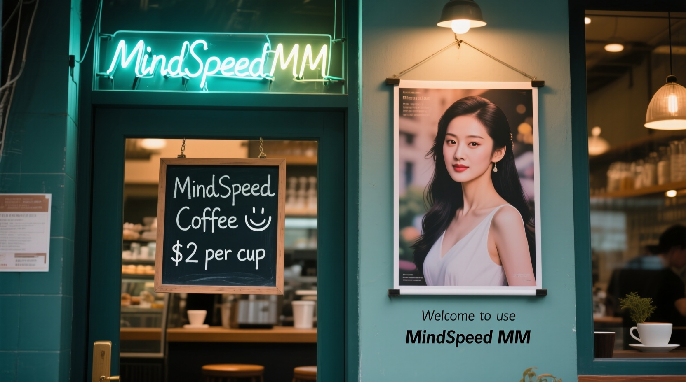
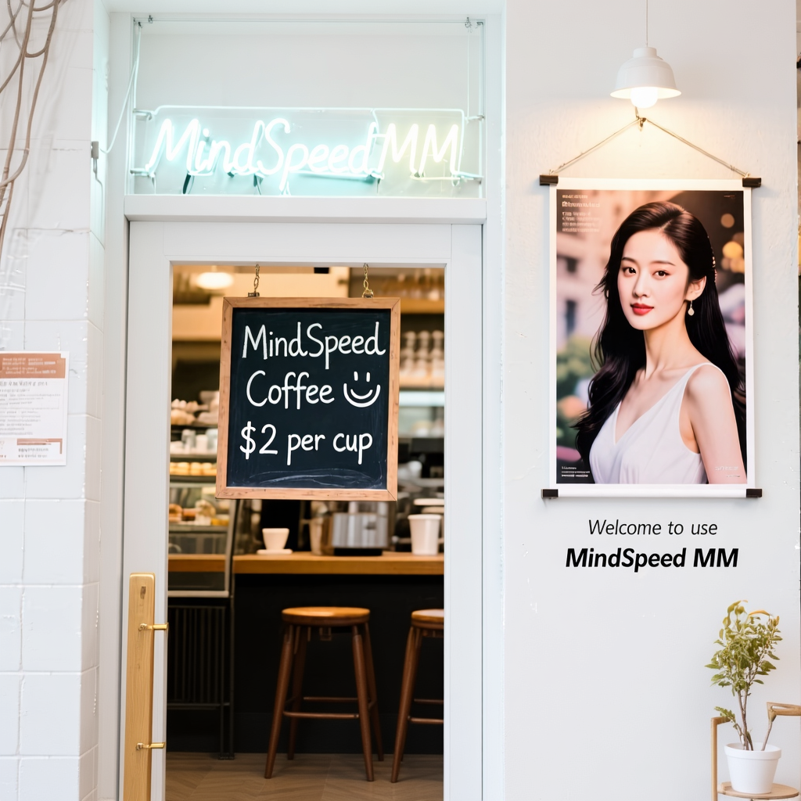

  
  

    <a href="https://gitcode.com/Ascend/MindSpeed-MM/blob/master/LICENSE">
    
    
    

# 简介

---

MindSpeed MM：面向大规模分布式训练的昇腾多模态大模型套件，支持业界主流多模态大模型训练，旨在为华为 [昇腾芯片](https://www.hiAscend.com/) 提供端到端的多模态训练解决方案, 包含预置业界主流模型，数据工程，分布式训练及加速，预训练、微调、后训练、在线推理任务等特性。

# 未来规划

---

📅未来规划会动态刷新在[MindSpeed MM RoadMap](https://gitcode.com/Ascend/MindSpeed-MM/issues/176)中，欢迎大家通过此链接进行互动并提出诉求

# 加入我们

---

为了交流开发经验、分享使用心得、及时获取项目更新，我们创建了MindSpeed MM官方微信群。

无论你是正在使用这个项目，还是有奇思妙想，都欢迎加入👋

  

# 最新消息

---

* [Dec. 03, 2025]: 🚀 MindSpeed MM基于FSDP2支持Glm4.5v模型训练demo【Prototype】
* [Dec. 02, 2025]: 🚀 MindSpeed MM支持Self-Forcing基于Wan2.1-1.3B的DMD蒸馏 【Prototype】
* [Nov. 27, 2025]: 🚀 MindSpeed MM基于fully shard支持Qwen3VL-235B模型
* [Nov. 20, 2025]: 🚀 MindSpeed MM基于FSDP2支持Qwen3-Omni模型 
* [Nov. 19, 2025]: 🚀 MindSpeed MM支持Qwen Image、Qwen Image Edit模型 【Prototype】
* [Nov. 13, 2025]: 🚀 MindSpeed MM基于FSDP2支持InternVL3.5-30B模型
* [Nov. 06, 2025]: 🚀 MindSpeed MM基于FSDP2支持DeepseekOCR模型训练demo【Prototype】
* [Oct. 31, 2025]: 🚀 MindSpeed MM基于fully shard支持Qwen3VL-8B/30B模型
* [Oct. 22, 2025]: 🚀 MindSpeed MM基于fully shard支持Wan2.2系列模型
* [Sep. 08, 2025]: 🚀 MindSpeed MM支持FLUX.1-Kontext模型
* [Aug. 15, 2025]: 🤝 MindSpeed MM**原生支持**Lumina-mGPT 2.0模型
* [Jul. 29, 2025]: 🌴 MindSpeed MM支持core 0.12.1版本
* [Jul. 10, 2025]: 🚀 MindSpeed MM支持InternVL3-8B/78B模型
* **[Jul. 03, 2025]: 🎉 强化学习上线！ MindSpeed MM支持Qwen2.5VL 7B/32B [GRPO训练](https://gitcode.com/Ascend/MindSpeed-MM/blob/master/examples/verl_examples/qwen2.5vl/README.md)**
* [Jul. 02, 2025]: ⚡ MindSpeed MM **0Day**支持GLM-4.1V模型
* [Jun. 30, 2025]: 🌴 MindSpeed MM版本2.1.0发布
* [Jun. 25, 2025]: 🚀 MindSpeed MM支持HiDream-I1模型
* [Jun. 05, 2025]: 🚀 MindSpeed MM支持Qwen2.5Omni-7B模型
* [Jun. 05, 2025]: 🤝 MindSpeed MM**原生支持**OpenSoraPlan 1.5模型
* [Apr. 03, 2025]: 🚀 MindSpeed MM支持Qwen2.5VL-32B模型
* [Mar. 27, 2025]: 🚀 MindSpeed MM支持Wan2.1-1.3B/14B模型
* [Mar. 26, 2025]: 🚀 MindSpeed MM支持Qwen2.5VL-3B/7B/72B模型
* [Feb. 20, 2025]: 🚀 MindSpeed MM支持InternVL2.5-78B模型
* [Feb. 18, 2025]: 🚀 MindSpeed MM支持HunyuanVideo模型
* [Feb. 17, 2025]: 🔥 MindSpeed MM支持Mindspeed-Core & Megatron 0.8.0版本
* [Feb. 15, 2025]: 🚀 MindSpeed MM支持Sana模型
* [Jan. 24, 2025]: 🚀 MindSpeed MM支持CogVideoX 1.5模型
* [Dec. 30, 2024]: 🌴 MindSpeed MM版本1.0.0发布
* [Dec. 16, 2024]: 🤝 MindSpeed MM**原生支持**Qihoo-T2X模型
* [Dec. 03, 2024]: 🚀 MindSpeed MM支持SD3.5模型
* [Nov. 30, 2024]: 🎉 MindSpeed MM支持多模态理解测评
* [Nov. 22, 2024]: 🚀 MindSpeed MM支持CogVideoX模型
* [Nov. 06, 2024]: 🚀 MindSpeed MM支持FLUX模型
* [Oct. 30, 2024]: 🤝 MindSpeed MM**原生支持**OpenSoraPlan 1.3模型
* [Oct. 21, 2024]: 🚀 MindSpeed MM支持InternVL2、以及Qwen2VL模型
* [Oct. 16, 2024]: 🌱 MindSpeed MM首版本1.0.RC3发布

> 注意： **Prototype**特性未经过充分验证，可能存在不稳定和bug问题，**beta**表示非商用特性。

# 效果展示

---

## 文生视频： Wan 2.2 T2V

<table border="0" style="width: 100%; text-align: left; margin-top: 20px;">
  <tr>
      <td>
          </video>
          
Prompt: Ultra HD, 4K, cinematic composition, low contrast ratio, low saturation, cool tone; The queen wears an iron crown and rides on the dragon over the city. She holds a big flag that shows:" MindSpeed MM".

      </td>
  </tr>
</table>

## 文生视频： OpensoraPlan 1.5 T2V

<table border="0" style="width: 100%; text-align: left; margin-top: 20px;">
  <tr>
      <td>
          </video>
          
Prompt: A fluffy white rabbit with soft, velvety fur and twitching pink nose sits curiously near a rustic wooden fence, surrounded by a lush garden of vibrant wildflowers and tall grasses swaying gently in the breeze. The rabbit's large, expressive eyes scan the environment, reflecting the golden hues of the setting sun. As it nibbles on a patch of clover, its ears perk up at the distant sound of chirping birds. The fence, weathered and covered in patches of moss, adds a charming, pastoral backdrop to this serene scene, capturing the essence of a peaceful countryside moment.

      </td>
      <td>
          </video>
          
Prompt: A majestic Berlin tower stands tall against the night sky, its structure bathed in a mesmerizing array of vibrant lights, casting a kaleidoscope of colors across the cityscape. The tower's intricate architectural details are highlighted by the illumination, creating a stunning contrast against the deep indigo sky. As the camera pans upward, the lights shift, revealing a dynamic play of shadows and hues that dance across the tower's surface. The surrounding city lights twinkle in harmony, enhancing the tower's grandeur and creating a breathtaking visual symphony that captures the essence of Berlin's vibrant nightlife.

      </td>
  </tr>
</table>

## 文生图：Qwen-Image -> 图片编辑 Flux.1-Kontext

<table border="0" style="width: 100%; text-align: left; margin-top: 20px;">
  <tr>
      <td>
          </img>
          
Prompt for generation: A coffee shop entrance features a chalkboard sign reading "MindSpeed Coffee 😊 $2 per cup," with a neon light displaying "MindSpeed MM". Next to it hangs a poster showing a beautiful Chinese woman, and beneath the poster is written "Welcome to use MindSpeed MM". Ultra HD, 4K, cinematic composition. (Qwen-Image)

      </td>
      <td>
          </img>
          
Prompt for edition: Change the decoration of the coffee shop to a modern style with white painting. (Flux.1-Kontext)

      </td>
  </tr>
</table>

## 理解模型：Qwen2VL

<table border="0" style="width: 100%; text-align: left; margin-top: 20px;">
  <tr>
      <td>
          
Input image for both models:

          </img>
          
Input text for both models: Please describe the image shortly

          
Qwen2VL推理结果: The image depicts a serene lakeside scene with a wooden dock extending into the calm waters. The dock is made of weathered wooden planks and leads to a small platform with a ladder, suggesting it is used for swimming or diving. The lake is surrounded by lush green forests and mountains in the background, creating a picturesque and tranquil setting. The sky is overcast, adding to the calm and peaceful atmosphere of the scene.

          
Input text for Qwen2VL: 请用中文简短描述这张照片

          
Qwen2VL推理结果: 这张图片展示了一座木制码头延伸到平静的湖面上，背景是连绵的山脉和茂密的森林。天空多云，整体色调偏冷，给人一种宁静和自然的感觉。

      </td>
  </tr>
</table>

# 版本说明

---

MindSpeed MM支持Atlas 800T A2等昇腾训练硬件形态，软件版本配套表如下：

| MindSpeed MM版本 | MindSpeed版本      | Megatron版本 | PyTorch版本  | torch_npu版本 | CANN版本 | Python版本            |
| ---------------- | ------------------ | ------------ | ------------ | ------------- | -------- | --------------------- |
| master（主线）   | master             | Core 0.12.1  | 2.6.0, 2.7.1 | 在研版本       | 在研版本  | Python3.10            |
| 2.2.0（商用）    | 2.2.0_core_r0.12.1 | Core 0.12.1  | 2.6.0, 2.7.1 | 7.2.0         | 8.3.RC1  | Python3.10            |
| 2.1.0（商用）    | 2.1.0_core_r0.8.0  | Core 0.8.0   | 2.1.0, 2.6.0 | 7.1.0         | 8.2.RC1  | Python3.8, Python3.10 |
| 2.0.0（商用）    | 2.0.0_core_r0.8.0  | Core 0.8.0   | 2.1.0        | 7.0.0         | 8.1.RC1  | Python3.8, Python3.10 |
| 1.0.0（商用）    | 1.0.0_core_r0.6.0  | Core 0.6.0   | 2.1.0        | 6.0.0         | 8.0.0    | Python3.8, Python3.10 |

更多详情请参考[版本配套表](https://gitcode.com/Ascend/MindSpeed-MM/blob/master/docs/user-guide/installation.md#%E7%89%88%E6%9C%AC%E9%85%8D%E5%A5%97%E8%A1%A8)。

# 安装

---

MindSpeed MM具体的安装请参考[安装指南](https://gitcode.com/Ascend/MindSpeed-MM/blob/master/docs/user-guide/installation.md#%E5%AE%89%E8%A3%85%E6%8C%87%E5%8D%97)。

# 快速上手

---

MindSpeed MM将以Qwen2.5-VL-3B和Wan2.1-T2V-1.3B模型为例，引导开发者快速上手预置模型在昇腾NPU上的高效运行。具体的操作请参考[快速上手](https://gitcode.com/Ascend/MindSpeed-MM/blob/master/docs/user-guide/getting_start.md#%E5%BF%AB%E9%80%9F%E4%B8%8A%E6%89%8B)。

# 特性/模型介绍

---

## 已支持特性概览

|       模型 \ 特性       | [TP](https://gitcode.com/Ascend/MindSpeed/blob/master/docs/features/tensor-parallel.md) | [TP-SP](https://gitcode.com/Ascend/MindSpeed/blob/master/docs/features/sequence-parallel.md) | [VPP](docs/features/virtual_pipeline_parallel.md) | [PP](https://gitcode.com/Ascend/MindSpeed/blob/master/docs/features/pipeline-parallel.md) | CP | [Distributed Optimizer](https://gitcode.com/Ascend/MindSpeed/blob/master/docs/features/distributed-optimizer.md) | [Recomputation](https://gitcode.com/Ascend/MindSpeed/blob/master/docs/features/recomputation.md) | [LoRA](./docs/features/lora_finetune.md) | RL | [FSDP2](https://gitcode.com/Ascend/MindSpeed/blob/master/docs/features/fsdp2.md) |
|:-------------------:|:------:|:------:|:------:|:---------------------------------------------------------------------------------------:|:------:|:------:|:------:|:------:|:------:|:------:|
|   InternVL3.5-30B   |  |  |  |  |  |  | ✔ |  |  | ✔ |
|       Qwen3-VL-8B        |  |  |  |  |  |  | ✔ |  |  | ✔ |
|       Qwen3-VL-30B        |  |  |  |  |  |  | ✔ |  |  | ✔ |
|       Wan2.2        |  |  |  |  | CP (Ulysses) |  | ✔ |  |  | ✔ |
| OpenSoraPlan1.5-T2V | ✔ | ✔ |  |  |  |  | ✔ |  |  |  |
|       Wan2.1        |  |  |  |  | CP (Ulysses) | ✔ | ✔ | ✔ |  | ✔ |
|    HunyuanVideo     | ✔ | ✔ |  |  | CP (Ulysses) | ✔ | ✔ | ✔ |  |  |
|   CogVideoX系列-T2V   | ✔ | ✔ |  |  | CP (Ulysses) | ✔ | ✔ | ✔ |  |  |
|   CogVideoX系列-I2V   | ✔ | ✔ |  |  | CP (Ulysses) | ✔ | ✔ | ✔ |  |  |
| OpensoraPlan1.3-T2V | ✔ | ✔ | ✔ | ✔ | CP (Ulysses) | ✔ | ✔ |  |  |  |
| OpensoraPlan1.3-I2V | ✔ | ✔ | ✔ | ✔ | CP (Ulysses) | ✔ | ✔ |  |  |  |
|      GLM-4.1V       |  |  |  | ✔ |  | ✔ | ✔ |  |  |  |
|     Qwen2VL-2B      | ✔ | ✔ |  | ✔ | CP (Ulysses) | ✔ | ✔ | ✔ |  |  |
|     Qwen2VL-7B      | ✔ | ✔ |  | ✔ | CP (Ulysses) | ✔ | ✔ | ✔ |  |  |
|     Qwen2VL-72B     | ✔ | ✔ |  | ✔ | CP (Ulysses) | ✔ | ✔ | ✔ | DPO |  |
|    Qwen2.5VL-3B     | ✔ | ✔ |  | ✔ |  | ✔ | ✔ |  | GRPO |  |
|    Qwen2.5VL-7B     | ✔ | ✔ |  | ✔ |  | ✔ | ✔ |  | GRPO |  |
|    Qwen2.5VL-32B    | ✔ | ✔ |  | ✔ |  | ✔ | ✔ |  | GRPO |  |
|    Qwen2.5VL-72B    | ✔ | ✔ |  | ✔ |  | ✔ | ✔ | ✔ |  |  |
|   Qwen2.5Omni-7B    | ✔ |  |  | ✔ |  | ✔ |  | ✔ |  |  |
|     Qwen3-Omni      |  |  |  |  |  |  | ✔ |  |  | ✔ |
|    InternVL3-8B     | ✔ | ✔ | ✔ | ✔ | CP (Ring) | ✔ | ✔ |  |  |
|    InternVL3-78B    | ✔ | ✔ | ✔ | ✔ | CP (Ring) | ✔ | ✔ |  |  |

备注：

* TP: [Tensor Parallel](https://arxiv.org/abs/1909.08053)
* TP-SP: [Tensor Parallel with Sequence Parallel](https://arxiv.org/abs/2205.05198)
* VPP: [Virtual Pipeline Parallel](https://arxiv.org/abs/2104.04473)
* PP: [Pipeline Parallel](https://arxiv.org/abs/2104.04473)
* DSP: [Dynamic Sequence Parallel](https://arxiv.org/abs/2403.10266)
* CP (Ulysses): [Context Parallel](https://docs.nvidia.com/megatron-core/developer-guide/latest/api-guide/context_parallel.html) by leveraging [Deepspeed Ulysses](https://arxiv.org/abs/2309.14509) with Sequence Parallel
* CP (Ring Attention): Context Parallel with [Ring Attention](https://arxiv.org/abs/2310.01889)
* Distributed Optimizer: [Zero Redundancy Optimizer](https://arxiv.org/abs/1910.02054) (ZeRO)
* Recomputation: Reducing Activation [Recomputation](https://arxiv.org/abs/2205.05198)
* LoRA: [Low-Rank Adaptation](https://arxiv.org/abs/2106.09685)
* RL: Reinforcement Learning
* FSDP2: [Fully Sharded Data Parallelism](https://arxiv.org/abs/2304.11277)

---

## 配套版本与支持模型

【现版本实测性能（硬件信息：Atlas 900 A2 PODc）】

下述列表中支持的模型，我们在各模型的**README**文件中提供了相应的使用说明，里面有详细的模型训练、推理、微调等流程

**模型**列中的超链接指向各模型的文件夹地址， **参数量**列中的超链接指向模型的社区资源地址

**认证**【Pass】表示已经通过测试的模型，【Test】表示测试中的模型

Samples per Second 为 (SPS); Frames per Second 为 (FPS); Tokens per Second 为 (TPS)

(注：此处SPS、FPS展示集群吞吐；TPS展示单卡吞吐)

**平均序列长度**是指在性能测试过程中所使用数据集的平均序列长度，通过统计各个序列长度的出现频率进行加权平均计算得出

**亲和场景**为调整少量结构或参数，使得模型更加亲和昇腾，性能更优

**A3** 为硬件 Atlas A3 训练系列产品

<table>
  
  <caption>MindSpeed MM模型列表</caption>
  <thead>
    <tr>
      <th>模型任务</th>
      <th>模型</th>
      <th>参数量</th>
      <th>任务</th>
      <th>集群</th>
      <th>精度格式</th>
      <th>NPU性能</th>
      <th>参考性能</th>
      <th>平均序列长度</th>
      <th>认证</th>
    </tr>
  </thead>
  <tbody>
    <tr>
      <td rowspan="43"> 多模态生成 </td>
      </tr>
      <tr>
      <td><a href="https://gitcode.com/Ascend/MindSpeed-MM/blob/master/examples/lumina">Lumina-mGPT 2.0</a></td>
      <td><a href="https://huggingface.co/Alpha-VLLM/Lumina-mGPT-2.0">7B</a></td>
      <td> 微调 </td>
      <td> 1x8</td>
      <td> BF16 </td>
      <td> 8.24 (SPS)</td>
      <td> 8.79 (SPS)</td>
      <td> 1024 </td>
      <td>【Pass】</td>
    </tr>
      <tr>
      <td><a href="https://gitcode.com/Ascend/MindSpeed-MM/blob/master/examples/opensoraplan1.5/">OpenSoraPlan1.5</a></td>
      <td><a href="https://huggingface.co/LanguageBind/Open-Sora-Plan-v1.5.0">8.5B</a></td>
      <td> 预训练 </td>
      <td> 1x8</td>
      <td> BF16 </td>
      <td> 0.83 (SPS) </td>
      <td> / </td>
      <td> / </td>
      <td>【北大贡献】</td>
    </tr>
      <tr>
      <td rowspan="2"><a href="https://gitcode.com/Ascend/MindSpeed-MM/tree/master/examples/wan2.2">Wan2.2-T2V</a></td>
      <td><a href="https://huggingface.co/Wan-AI/Wan2.2-TI2V-5B-Diffusers">5B</a></td>
      <td> 预训练 </td>
      <td> 1x4 (A3) </td>
      <td> BF16 </td>
      <td> 3.18 (SPS) </td>
      <td> 2.93 (SPS) </td>
      <td> / </td>
      <td>【Test】</td>
    </tr>
    <tr>
      <td><a href="https://huggingface.co/Wan-AI/Wan2.2-T2V-A14B-Diffusers">A14B</a></td>
      <td> 预训练 </td>
      <td> 1x8 (A3) </td>
      <td> BF16 </td>
      <td> 0.710 (SPS) </td>
      <td> 0.292 (SPS) </td>
      <td> / </td>
      <td>【Test】</td>
    </tr>
      <tr>
      <td rowspan="1"><a href="https://gitcode.com/Ascend/MindSpeed-MM/tree/master/examples/wan2.2">Wan2.2-TI2V</a></td>
      <td><a href="https://huggingface.co/Wan-AI/Wan2.2-TI2V-5B-Diffusers">5B</a></td>
      <td> 预训练 </td>
      <td> 1x4 (A3) </td>
      <td> BF16 </td>
      <td> 3.18 (SPS) </td>
      <td> 2.93 (SPS) </td>
      <td> / </td>
      <td>【Test】</td>
    </tr>
    <tr>
      <td rowspan="1"><a href="https://gitcode.com/Ascend/MindSpeed-MM/tree/master/examples/wan2.2">Wan2.2-I2V</a></td>
      <td><a href="https://huggingface.co/Wan-AI/Wan2.2-I2V-A14B-Diffusers">A14B</a></td>
      <td> 预训练 </td>
      <td> 1x8 (A3) </td>
      <td> BF16 </td>
      <td> 0.671 (SPS) </td>
      <td> 0.294 (SPS) </td>
      <td> / </td>
      <td>【Test】</td>
    </tr>
      <td rowspan="4"><a href="https://gitcode.com/Ascend/MindSpeed-MM/tree/master/examples/wan2.1">Wan2.1-T2V</a></td>
      <td><a href="https://huggingface.co/Wan-AI/Wan2.1-T2V-1.3B-Diffusers">1.3B</a></td>
      <td> 预训练 </td>
      <td> 1x8</td>
      <td> BF16 </td>
      <td> 0.918 (SPS) </td>
      <td> 1.04 (SPS) </td>
      <td> / </td>
      <td>【Pass】</td>
    </tr>
    <tr>
      <td><a href="https://huggingface.co/Wan-AI/Wan2.1-T2V-1.3B-Diffusers">1.3B</a></td>
      <td> Lora微调 </td>
      <td> 1x8</td>
      <td> BF16 </td>
      <td> 0.954 (SPS) </td>
      <td> 1.042 (SPS) </td>
      <td> / </td>
      <td>【Pass】</td>
    </tr>
    <tr>
      <td><a href="https://huggingface.co/Wan-AI/Wan2.1-T2V-14B-Diffusers">14B</a></td>
      <td> 预训练 </td>
      <td> 1x8</td>
      <td> BF16 </td>
      <td> 0.160 (SPS) </td>
      <td> 0.160 (SPS) </td>
      <td> / </td>
      <td>【Pass】</td>
    </tr>
    <tr>
      <td><a href="https://huggingface.co/Wan-AI/Wan2.1-T2V-14B-Diffusers">14B</a></td>
      <td> Lora微调 </td>
      <td> 1x8</td>
      <td> BF16 </td>
      <td> 0.179 (SPS) </td>
      <td> 0.174 (SPS) </td>
      <td> / </td>
      <td>【Pass】</td>
    </tr>
    </tr>
      <td rowspan="3"><a href="https://gitcode.com/Ascend/MindSpeed-MM/tree/master/examples/wan2.1">Wan2.1-I2V</a></td>
      <td>1.3B</td>
      <td> 预训练 </td>
      <td> 1x8</td>
      <td> BF16 </td>
      <td> 0.76 (SPS) </td>
      <td>  / </td>
      <td> / </td>
      <td>【Pass】</td>
    </tr>
    <tr>
      <td><a href="https://huggingface.co/Wan-AI/Wan2.1-I2V-14B-720P-Diffusers">14B</a></td>
      <td> 预训练 </td>
      <td> 1x8</td>
      <td> BF16 </td>
      <td> 0.130 (SPS) </td>
      <td> / </td>
      <td> / </td>
      <td>【Pass】</td>
    </tr>
    <tr>
      <td><a href="https://huggingface.co/Wan-AI/Wan2.1-I2V-14B-720P-Diffusers">14B</a></td>
      <td> Lora微调 </td>
      <td> 1x8</td>
      <td> BF16 </td>
      <td> 0.179 (SPS) </td>
      <td> 0.173 (SPS) </td>
      <td> / </td>
      <td>【Pass】</td>
    </tr>
    </tr>
      <td><a href="https://gitcode.com/Ascend/MindSpeed-MM/tree/master/examples/self_forcing">Self-Forcing</a></td>
      <td><a href="https://huggingface.co/gdhe17/Self-Forcing">1.3B</a></td>
      <td> DMD蒸馏 </td>
      <td> 1x8</td>
      <td> BF16 </td>
      <td> 0.225 (FPS) </td>
      <td> 0.282 (FPS) </td>
      <td> / </td>
      <td>【Test】</td>
    </tr>
    </tr>
      <td><a href="https://gitcode.com/Ascend/MindSpeed-MM/tree/master/examples/hunyuanvideo">HunyuanVideo-T2V</a></td>
      <td><a href="https://huggingface.co/tencent/HunyuanVideo">13B</a></td>
      <td> 预训练 </td>
      <td> 1x8</td>
      <td> BF16 </td>
      <td> 0.171 (SPS) </td>
      <td> 0.181 (SPS) </td>
      <td> / </td>
      <td>【Pass】</td>
    </tr>
 </tr>
      <td><a href="https://gitcode.com/Ascend/MindSpeed-MM/tree/master/examples/hunyuanvideo">HunyuanVideo-I2V</a></td>
      <td><a href="https://huggingface.co/tencent/HunyuanVideo-I2V">13B</a></td>
      <td> 预训练 </td>
      <td> 1x8</td>
      <td> BF16 </td>
      <td> 0.164 (SPS) </td>
      <td> 0.202 (SPS) </td>
      <td> / </td>
      <td>【Pass】</td>
    </tr>
    <tr>
      <td><a href="https://gitcode.com/Ascend/MindSpeed-MM/tree/2.2.0/examples/opensora1.0">OpenSora 1.0</a></td>
      <td><a href="https://huggingface.co/hpcai-tech/Open-Sora/tree/main">5.5B</a></td>
      <td> 预训练 </td>
      <td> 1x8 </td>
      <td> BF16 </td>
      <td> 3.18 (SPS)</td>
      <td> 2.04 (SPS)</td>
      <td> / </td>
      <td>【Pass】</td>
    </tr>
    <tr>
      <td><a href="https://gitcode.com/Ascend/MindSpeed-MM/tree/2.2.0/examples/opensora1.2">OpenSora 1.2</a></td>
      <td><a href="https://huggingface.co/hpcai-tech/OpenSora-STDiT-v3">5.2B</a></td>
      <td> 预训练 </td>
      <td> 1x8</td>
      <td> BF16 </td>
      <td> 7.31 (SPS) </td>
      <td> 8.15 (SPS) </td>
      <td> / </td>
      <td>【Test】</td>
    </tr>
    <tr>
      <td><a href="https://gitcode.com/Ascend/MindSpeed-MM/tree/master/examples/opensora2.0">OpenSora 2.0-T2V</a></td>
      <td><a href="https://huggingface.co/hpcai-tech/Open-Sora-v2">11B</a></td>
      <td> 预训练 </td>
      <td> 1x8</td>
      <td> BF16 </td>
      <td> 1.33 (SPS) </td>
      <td> 1.46 (SPS) </td>
      <td> / </td>
      <td>【Pass】</td>
    </tr>
    <tr>
      <td><a href="https://gitcode.com/Ascend/MindSpeed-MM/tree/2.2.0/examples/opensoraplan1.2">OpenSoraPlan 1.2</a></td>
      <td><a href="https://huggingface.co/LanguageBind/Open-Sora-Plan-v1.2.0">8.7B</a></td>
      <td> 预训练 </td>
      <td> 1x8</td>
      <td> BF16 </td>
      <td> 0.42 (SPS) </td>
      <td> 0.37 (SPS) </td>
      <td> / </td>
      <td>【Pass】</td>
    </tr>
    <tr>
      <td><a href="https://gitcode.com/Ascend/MindSpeed-MM/tree/master/examples/opensoraplan1.3">OpenSoraPlan 1.3-T2V</a></td>
      <td><a href="https://huggingface.co/LanguageBind/Open-Sora-Plan-v1.3.0"> 8.6B </a></td>
      <td> 预训练 </td>
      <td> 1x8 </td>
      <td> BF16 </td>
      <td> 1.29 (SPS) </td>
      <td> 1.27 (SPS) </td>
      <td> / </td>
      <td>【Pass】</td>
    </tr>
    <tr>
      <td><a href="https://gitcode.com/Ascend/MindSpeed-MM/tree/master/examples/opensoraplan1.3">OpenSoraPlan 1.3-I2V</a></td>
      <td><a href="https://huggingface.co/LanguageBind/Open-Sora-Plan-v1.3.0"> 8.6B </a></td>
      <td> 预训练 </td>
      <td> 1x8 </td>
      <td> BF16 </td>
      <td> 1.17 (SPS) </td>
      <td> 1.15 (SPS) </td>
      <td> / </td>
      <td>【Pass】</td>
    </tr>
    <tr>
      <td><a href="https://gitcode.com/Ascend/MindSpeed-MM/tree/master/examples/vae">WFVAE</a></td>
      <td><a href="https://huggingface.co/LanguageBind/Open-Sora-Plan-v1.3.0/tree/main/vae"> 0.18B </a></td>
      <td> 预训练 </td>
      <td> 1x8 </td>
      <td> BF16 </td>
      <td> 23.860 (SPS) </td>
      <td> 26.091 (SPS) </td>
      <td> / </td>
      <td>【Pass】</td>
    </tr>
    <tr>
      <td rowspan="1"><a href="https://gitcode.com/Ascend/MindSpeed-MM/tree/master/examples/cogvideox">CogVideoX-T2V</a></td>
      <td><a href="https://huggingface.co/THUDM/CogVideoX-5b"> 5B </a></td>
      <td> 预训练 </td>
      <td> 1x8 </td>
      <td> BF16 </td>
      <td> 1.14 (SPS) </td>
      <td> 1.00 (SPS) </td>
      <td> 6976 </td>
      <td>【Pass】</td>
    </tr>
    <tr>
      <td rowspan="1"><a href="https://gitcode.com/Ascend/MindSpeed-MM/tree/master/examples/cogvideox">CogVideoX-I2V</a></td>
      <td><a href="https://huggingface.co/THUDM/CogVideoX-5b"> 5B </a></td>
      <td> 预训练 </td>
      <td> 1x8 </td>
      <td> BF16 </td>
      <td> 1.13 (SPS) </td>
      <td> 0.84 (SPS) </td>
      <td> 6976 </td>
      <td>【Pass】</td>
    </tr>
  <tr>
      <td rowspan="2"><a href="https://gitcode.com/Ascend/MindSpeed-MM/tree/master/examples/cogvideox">CogVideoX 1.5-T2V</a></td>
      <td><a href="https://huggingface.co/THUDM/CogVideoX1.5-5B-SAT"> 5B </a></td>
      <td> 预训练 </td>
      <td> 1x8 </td>
      <td> BF16 </td>
      <td> 1.44 (SPS) </td>
      <td> 1.75 (SPS) </td>
      <td> 6976 </td>
      <td>【Pass】</td>
    </tr>
    <tr>
      <td><a href="https://huggingface.co/THUDM/CogVideoX1.5-5B-SAT"> 5B </a></td>
      <td> Lora微调 </td>
      <td> 1x8 </td>
      <td> BF16 </td>
      <td> 2.76 (SPS) </td>
      <td> 2.64 (SPS) </td>
      <td> / </td>
      <td>【Pass】</td>
    </tr>
    <tr>
      <td rowspan="2"><a href="https://gitcode.com/Ascend/MindSpeed-MM/tree/master/examples/cogvideox">CogVideoX 1.5-I2V</a></td>
      <td><a href="https://huggingface.co/THUDM/CogVideoX1.5-5B-SAT"> 5B </a></td>
      <td> 预训练 </td>
      <td> 1x8 </td>
      <td> BF16 </td>
      <td> 1.43 (SPS) </td>
      <td> 1.44 (SPS) </td>
      <td> 6976 </td>
      <td>【Pass】</td>
    </tr>
    <tr>
      <td><a href="https://huggingface.co/THUDM/CogVideoX1.5-5B-SAT"> 5B </a></td>
      <td> Lora微调 </td>
      <td> 1x8 </td>
      <td> BF16 </td>
      <td> 2.33 (SPS) </td>
      <td> 2.04 (SPS) </td>
      <td> / </td>
      <td>【Pass】</td>
    </tr>
    <tr>
      <td><a href="https://gitcode.com/Ascend/MindSpeed-MM/tree/master/examples/qihoo_t2x">Qihoo-T2X</a></td>
      <td><a href="https://huggingface.co/qihoo360/Qihoo-T2X">1.1B</a></td>
      <td> 推理 </td>
      <td> 1x1 </td>
      <td> BF16 </td>
      <td> / </td>
      <td> / </td>
      <td> / </td>
      <td>【奇虎360贡献】</td>
    </tr>
    <tr>
      <td rowspan="2"><a href="https://gitcode.com/Ascend/MindSpeed-MM/tree/master/examples/diffusers/sdxl">SDXL</a></td>
      <td><a href="https://github.com/huggingface/diffusers/tree/5956b68a6927126daffc2c5a6d1a9a189defe288">3.5B</a></td>
      <td> 预训练 </td>
      <td> 1x8</td>
      <td> BF16 </td>
      <td> 29.92  (FPS)</td>
      <td> 30.65 (FPS)</td>
      <td> / </td>
      <td>【Pass】</td>
    </tr>
    <tr>
      <td><a href="https://github.com/huggingface/diffusers/tree/5956b68a6927126daffc2c5a6d1a9a189defe288">3.5B</a></td>
      <td> 预训练 </td>
      <td> 1x8</td>
      <td> FP16 </td>
      <td> 28.51 (FPS)</td>
      <td> 30.23 (FPS)</td>
      <td> / </td>
      <td>【Pass】</td>
    </tr>
    <tr>
      <td><a href="https://gitcode.com/Ascend/MindSpeed-MM/tree/master/examples/diffusers/sd3">SD3</a></td>
      <td><a href="https://github.com/huggingface/diffusers/tree/5f724735437d91ed05304da478f3b2022fe3f6fb">2B</a></td>
      <td> 全参微调 </td>
      <td> 1x8</td>
      <td> BF16 </td>
      <td> 16.09 (FPS)</td>
      <td> 16.01 (FPS)</td>
      <td> / </td>
      <td>【Pass】</td>
    </tr>
    <tr>
      <td rowspan="2"><a href="https://gitcode.com/Ascend/MindSpeed-MM/tree/master/examples/diffusers/sd3">SD3.5</a></td>
      <td><a href="https://github.com/huggingface/diffusers/tree/5f724735437d91ed05304da478f3b2022fe3f6fb"> 8.1B </a></td>
      <td> 全参微调 </td>
      <td> 1x8 </td>
      <td> BF16 </td>
      <td> 26.20 (FPS)</td>
      <td> 28.33 (FPS)</td>
      <td> / </td>
      <td>【Pass】</td>
    </tr>
    <tr>
      <td><a href="https://github.com/huggingface/diffusers/tree/94643fac8a27345f695500085d78cc8fa01f5fa9"> 8.1B </a></td>
      <td> Lora微调 </td>
      <td> 1x8 </td>
      <td> FP16 </td>
      <td> 47.93 (FPS)</td>
      <td> 47.95 (FPS)</td>
      <td> / </td>
      <td>【Pass】</td>
    </tr>
    <tr>
      <td><a href="https://gitcode.com/Ascend/MindSpeed-MM/tree/master/examples/diffusers/flux">Flux</a></td>
      <td><a href="https://github.com/huggingface/diffusers/blob/main/examples/dreambooth">12B</a></td>
      <td> 全参微调 </td>
      <td> 1x8 </td>
      <td> BF16 </td>
      <td> 55.23 (FPS) </td>
      <td> 53.65 (FPS) </td>
      <td> / </td>
      <td>【Pass】</td>
    </tr>
    <tr>
      <td><a href="https://gitcode.com/Ascend/MindSpeed-MM/tree/master/examples/diffusers/flux-kontext">Flux-Kontext</a></td>
      <td><a href="https://github.com/huggingface/diffusers/blob/main/examples/dreambooth">12B</a></td>
      <td> 全参微调 </td>
      <td> 1x8 </td>
      <td> BF16 </td>
      <td> 1.97 (FPS) </td>
      <td> 2.00 (FPS) </td>
      <td> / </td>
      <td>【Pass】</td>
    </tr>
    <tr>
      <td><a href="https://gitcode.com/Ascend/MindSpeed-MM/tree/master/examples/diffusers/sana">Sana</a></td>
      <td><a href="https://github.com/huggingface/diffusers/blob/main/examples/dreambooth">1.6B</a></td>
      <td> Lora微调 </td>
      <td> 1x8 </td>
      <td> BF16 </td>
      <td> 28.7 (FPS) </td>
      <td> 32.8 (FPS) </td>
      <td> / </td>
      <td>【Pass】</td>
    </tr>
    <tr>
      <td><a href="https://gitcode.com/Ascend/MindSpeed-MM/tree/master/examples/diffusers/hidream">HiDream</a></td>
      <td><a href="https://github.com/huggingface/diffusers/blob/main/examples/dreambooth">17B</a></td>
      <td> Lora微调 </td>
      <td> 1x8 </td>
      <td> BF16 </td>
      <td> 18.37 (FPS) </td>
      <td> 19.61 (FPS) </td>
      <td> / </td>
      <td>【Pass】</td>
    </tr>
    <tr>
      <td><a href="https://gitcode.com/Ascend/MindSpeed-MM/tree/master/examples/diffusers/kolors">Kolors</a></td>
      <td><a href="https://github.com/Kwai-Kolors/Kolors">2.6B</a></td>
      <td> 推理 </td>
      <td> 1x1 </td>
      <td> FP16 </td>
      <td> / </td>
      <td> / </td>
      <td> / </td>
      <td>【Test】</td>
    </tr>
    <tr>
      <td><a href="https://gitcode.com/Ascend/MindSpeed-MM/tree/master/examples/diffusers/qwen_image">Qwen-Image</a></td>
      <td><a href="https://github.com/huggingface/diffusers/blob/main/examples/dreambooth">27B</a></td>
      <td> Lora微调 </td>
      <td> 1x8 </td>
      <td> BF16 </td>
      <td> 23.02 (FPS) </td>
      <td> 21.54 (FPS) </td>
      <td> / </td>
      <td>【Pass】</td>
    </tr>
    <tr>
      <td><a href="https://gitcode.com/Ascend/MindSpeed-MM/tree/master/examples/diffsynth/qwen_image_edit">Qwen-Image-Edit</a></td>
      <td><a href="https://github.com/modelscope/Diffsynth-Studio/tree/main/examples/qwen_image">27B</a></td>
      <td> Lora微调 </td>
      <td> 1x8 </td>
      <td> BF16 </td>
      <td> 20.59 (FPS) </td>
      <td> 17.47 (FPS) </td>
      <td> / </td>
      <td>【Test】</td>
    </tr>
    <tr>
      <td rowspan="23"> 多模态理解 </td>
    </tr>
      <td><a href="https://gitcode.com/Ascend/MindSpeed-MM/tree/master/examples/glm4.1v">GLM-4.1V</a></td>
      <td><a href="https://github.com/THUDM/GLM-4.1V-Thinking">9B</a></td>
      <td> 微调 </td>
      <td> 1x8 </td>
      <td> BF16 </td>
      <td> 1074.64(TPS) </td>
      <td> 908.49(TPS) </td>
      <td> 707 </td>
      <td>【Pass】</td>
    </tr>
    <tr>
      <td><a href="https://gitcode.com/Ascend/MindSpeed-MM/tree/2.2.0/examples/llava1.5">LLaVA 1.5</a></td>
      <td><a href="https://github.com/haotian-liu/LLaVA">7B</a></td>
      <td> 全参微调 </td>
      <td> 1x8 </td>
      <td> BF16 </td>
      <td> 3632.31 (TPS) </td>
      <td> 3757.98 (TPS) </td>
      <td> 602 </td>
      <td>【Test】</td>
    </tr>
   <tr>
      <td rowspan="4"><a href="https://gitcode.com/Ascend/MindSpeed-MM/tree/2.2.0/examples/internvl2">InternVL 2.0</a></td>
      <td><a href="https://huggingface.co/OpenGVLab/InternVL2-2B">2B</a></td>
      <td> 微调 </td>
      <td> 1x8 </td>
      <td> BF16 </td>
      <td> 7653.12 (TPS) </td>
      <td> 5089.99 (TPS) </td>
      <td> 1813 </td>
      <td>【Pass】</td>
    </tr>
    <tr>
      <td><a href="https://huggingface.co/OpenGVLab/InternVL2-8B">8B</a></td>
      <td> 微调 </td>
      <td> 1x8 </td>
      <td> BF16 </td>
      <td> 2914.39 (TPS) </td>
      <td> 2492.87 (TPS) </td>
      <td> 1813 </td>
      <td>【Pass】</td>
    </tr>
    <tr>
      <td><a href="https://huggingface.co/OpenGVLab/InternVL2-26B">26B</a></td>
      <td> 微调 </td>
      <td> 1x8 </td>
      <td> BF16 </td>
      <td> 750.12 (TPS) </td>
      <td> 738.79 (TPS) </td>
      <td> 1813 </td>
      <td>【Pass】</td>
    </tr>
    <tr>
      <td><a href="https://huggingface.co/OpenGVLab/InternVL2-Llama3-76B">76B</a></td>
      <td> 全参微调 </td>
      <td> 8x16 </td>
      <td> BF16 </td>
      <td> 214 (TPS) </td>
      <td> 191 (TPS) </td>
      <td> 1813 </td>
      <td>【Pass】</td>
    </tr>
    <tr>
      <td><a href="https://gitcode.com/Ascend/MindSpeed-MM/tree/master/examples/internvl2.5">InternVL 2.5</a></td>
      <td><a href="https://huggingface.co/OpenGVLab/InternVL2_5-78B">78B</a></td>
      <td> 微调 </td>
      <td> 8x8 </td>
      <td> BF16 </td>
      <td> 228.33 </td>
      <td> / </td>
      <td> 1896 </td>
      <td>【Test】</td>
    </tr>
    <tr>
      <td rowspan="2"><a href="https://gitcode.com/Ascend/MindSpeed-MM/tree/master/examples/internvl3">InternVL 3.0</a></td>
      <td><a href="https://huggingface.co/OpenGVLab/InternVL3-8B">8B</a></td>
      <td> 微调 </td>
      <td> 1x8 </td>
      <td> BF16 </td>
      <td> 2344.58 (TPS) </td>
      <td> 2211.93 (TPS) </td>
      <td> 2653 </td>
      <td>【Pass】</td>
    </tr>
    <tr>
      <td><a href="https://huggingface.co/OpenGVLab/InternVL3-78B">78B</a></td>
      <td> 微调 </td>
      <td> 4x8 (A3) </td>
      <td> BF16 </td>
      <td> 228.82 (TPS) </td>
      <td> 283.15 (TPS) </td>
      <td> 1932 </td>
      <td>【Pass】</td>
    </tr>
    <tr>
      <td><a href="https://gitcode.com/Ascend/MindSpeed-MM/tree/master/examples/internvl3.5">InternVL 3.5</a></td>
      <td><a href="https://huggingface.co/OpenGVLab/InternVL3_5-30B-A3B-Instruct">30B</a></td>
      <td> 微调 </td>
      <td> 1x8 (A3)  </td>
      <td> BF16 </td>
      <td> 52.76 (TPS) </td>
      <td> 47.73 (TPS) </td>
      <td> 201 </td>
      <td>【Test】</td>
    </tr>
    <tr>
      <td rowspan="3"><a href="https://gitcode.com/Ascend/MindSpeed-MM/tree/master/examples/qwen2vl">Qwen2-VL</a></td>
      <td><a href="https://huggingface.co/Qwen/Qwen2-VL-2B-Instruct">2B</a></td>
      <td> 微调 </td>
      <td> 1x8 </td>
      <td> BF16 </td>
      <td> 2941.17 (TPS) </td>
      <td> 3004.04 (TPS) </td>
      <td> 689 </td>
      <td>【Pass】</td>
    </tr>
    <tr>
      <td><a href="https://huggingface.co/Qwen/Qwen2-VL-7B-Instruct">7B</a></td>
      <td> 微调 </td>
      <td> 1x8 </td>
      <td> BF16 </td>
      <td> 1143.74 (TPS) </td>
      <td> 1004.22 (TPS) </td>
      <td> 689 </td>
      <td>【Pass】</td>
    </tr>
    <tr>
      <td><a href="https://huggingface.co/Qwen/Qwen2-VL-72B-Instruct">72B</a></td>
      <td> 微调 </td>
      <td> 4x8 (A3) </td>
      <td> BF16 </td>
      <td> 261.25 (TPS) </td>
      <td> 257.63 (TPS) </td>
      <td> 689 </td>
      <td>【Pass】</td>
    </tr>
    <tr>
      <td rowspan="4"><a href="https://gitcode.com/Ascend/MindSpeed-MM/tree/master/examples/qwen2.5vl">Qwen2.5-VL</a></td>
      <td><a href="https://huggingface.co/Qwen/Qwen2.5-VL-3B-Instruct">3B</a></td>
      <td> 微调 </td>
      <td> 1x8 </td>
      <td> BF16 </td>
      <td> 2047.19 (TPS) </td>
      <td> 1876.66 (TPS) </td>
      <td> 689 </td>
      <td>【Pass】</td>
    </tr>
    <tr>
      <td><a href="https://huggingface.co/Qwen/Qwen2.5-VL-7B-Instruct">7B</a></td>
      <td> 微调 </td>
      <td> 1x8 </td>
      <td> BF16 </td>
      <td> 1620.87 (TPS) </td>
      <td> 1091.20 (TPS) </td>
      <td> 689 </td>
      <td>【Pass】</td>
    </tr>
    <tr>
      <td><a href="https://huggingface.co/Qwen/Qwen2.5-VL-32B-Instruct">32B</a></td>
      <td> 微调 </td>
      <td> 2x8 </td>
      <td> BF16 </td>
      <td> 257.50 (TPS) </td>
      <td> / </td>
      <td> 689 </td>
      <td>【Pass】</td>
    </tr>
    <tr>
      <td><a href="https://huggingface.co/Qwen/Qwen2.5-VL-72B-Instruct">72B</a></td>
      <td> 微调 </td>
      <td> 4x8 (A3) </td>
      <td> BF16 </td>
      <td> 322.96 (TPS) </td>
      <td> 256.28 (TPS) </td>
      <td> 689 </td>
      <td>【Pass】</td>
    </tr>
    <tr>
      <td rowspan="3"><a href="https://gitcode.com/Ascend/MindSpeed-MM/tree/master/examples/qwen3vl">Qwen3-VL</a></td>
      <td><a href="https://huggingface.co/collections/Qwen/qwen3-vl-68d2a7c1b8a8afce4ebd2dbe"> 8B </a></td>
      <td> 微调 </td>
      <td> 1x8 </td>
      <td> BF16 </td>
      <td> 146.54 (TPS)</td>
      <td> 129.71 (TPS)</td>
      <td> 179 </td>
      <td>【Test】</td>
    </tr>
    <tr>
      <td><a href="https://huggingface.co/collections/Qwen/qwen3-vl-68d2a7c1b8a8afce4ebd2dbe"> 30B </a></td>
      <td> 微调 </td>
      <td> 1x8 (A3) </td>
      <td> BF16 </td>
      <td> 179.57 (TPS) </td>
      <td> / </td>
      <td> 185 </td>
      <td>【Test】</td>
    </tr>
    <tr>
      <td><a href="https://huggingface.co/collections/Qwen/qwen3-vl-68d2a7c1b8a8afce4ebd2dbe"> 235B </a></td>
      <td> 微调 </td>
      <td> 16x8 (A3) </td>
      <td> BF16 </td>
      <td> 598.05 (TPS) </td>
      <td> / </td>
      <td> 16116 </td>
      <td>【Test】</td>
    </tr>
    <tr>
      <td><a href="https://gitcode.com/Ascend/MindSpeed-MM/tree/master/examples/qwen2.5omni">Qwen2.5-Omni</a></td>
      <td><a href="https://huggingface.co/Qwen/Qwen2.5-Omni-7B">7B</a></td>
      <td> 微调 </td>
      <td> 1x8 </td>
      <td> BF16 </td>
      <td> 575.01 (TPS) </td>
      <td> 534.28 (TPS) </td>
      <td> 296 </td>
      <td>【Pass】</td>
    </tr>
    <tr>
      <td><a href="https://gitcode.com/Ascend/MindSpeed-MM/tree/master/examples/qwen3omni">Qwen3-Omni</a></td>
      <td><a href="https://huggingface.co/Qwen/Qwen3-Omni-30B-A3B-Instruct">30B</a></td>
      <td> 微调 </td>
      <td> 2x4 (A3) </td>
      <td> BF16 </td>
      <td> 131.3 (TPS) </td>
      <td> 16.4 (TPS) </td>
      <td> 288 </td>
      <td>【Test】</td>
    </tr>
    <tr>
      <td> 语音识别 </td>
      <td><a href="https://gitcode.com/Ascend/MindSpeed-MM/tree/master/examples/whisper">Whisper</a></td>
      <td><a href="https://github.com/openai/whisper">1.5B</a></td>
      <td> 预训练 </td>
      <td> 1x8</td>
      <td> BF16 </td>
      <td> 93.38 (SPS) </td>
      <td> 109.23 (SPS) </td>
      <td> / </td>
      <td>【Test】</td>
    </tr>
    </tbody>
</table>

---

# 常用参数解释说明

针对MindSpeed MM套件中运行所使用的参数做解释说明，具体见[README](https://gitcode.com/Ascend/MindSpeed-MM/blob/master/docs/user-guide/args_readme.md)

# 特性规划

---

* 【新模型】  JanusPro
* 【模型特性】 CogVideoX: PP
* 【模型特性】 OpensoraPlan1.3: CP (Ring Attention)
* 【模型特性】 Qwen2VL: VPP, CP (Ulysses & Ring Attention)
* 【模型特性】 InternVL2: TP, CP (Ulysses & Ring Attention)
* 【基础特性】 Hetero-parallel

# 工具使用

---

## 昇腾Profiling采集工具

MindSpeed MM集成了昇腾profiling采集工具，以提供对模型运行情况的分析。该工具能够依照配置采集模型的算子、显存等关键信息，同时支持动静态两种采集方式，协助开发者分析模型瓶颈，并可根据实际场景需求选择使用。

  具体方法见 [README](./mindspeed_mm/tools/README.md) 的profiling章节

## MindStudio Insight性能分析工具

针对大模型集群场景的性能调优，这里推荐一款优秀的可视化调优工具MindStudio Insight。
MindStudio Insight提供了包括Timeline视图、通信分析、计算耗时等的可视化呈现，以便用户分析潜在的性能瓶颈，并指导如何采取措施消除或减少这些瓶颈。

  具体使用方法见[《MindStudio Insight操作指南》](https://www.hiAscend.com/document/detail/zh/mindstudio/82RC1/GUI_baseddevelopmenttool/msAscendinsightug/Insight_userguide_0002.html)，下载地址[《MindStudio Insight》](https://support.huawei.com/enterprise/zh/Ascend-computing/mindstudio-pid-251913966/software/264465341?idAbsPath=fixnode01|23710424|251366513|254884019|261408772|251913966)

## Sora类模型特征提取

MindSpeed MM支持提取视频和文本特征并保存

  具体方法见 [README](./mindspeed_mm/tools/README.md) 的Sora类模型特征提取章节

## 内存快照提取

MindSpeed MM集成了昇腾内存快照采集工具，以提供对模型运行情况的分析。

  具体方法见 [README](./mindspeed_mm/tools/README.md) 的内存快照提取章节

## Tensorboard使用

MindSpeed MM支持Tensorboard的使用

  具体方法见 [README](./mindspeed_mm/tools/README.md) 的Tensorboard使用章节

# 版本维护

---

MindSpeed MM版本有以下五个维护阶段：

| **状态**            | **时间** | **说明**                                                               |
| ------------------- | -------- |----------------------------------------------------------------------|
| 计划                | 1—3 个月 | 计划特性                                                                 |
| 开发                | 3 个月   | 开发特性                                                                 |
| 维护                | 6-12 个月| 合入所有已解决的问题并发布版本，针对不同的MindSpeed MM版本采取不同的维护策略，常规版本和长期支持版本维护周期分别为6个月和12个月 |
| 无维护              | 0—3 个月 | 合入所有已解决的问题，无专职维护人员，无版本发布                                             |
| 生命周期终止（EOL） | N/A      | 分支不再接受任何修改                                                           |

MindSpeed MM已发布版本维护策略：

| **MindSpeed MM版本** | **维护策略** | **当前状态** | **发布时间**   | **后续状态**         | **EOL日期** |
|-----------------|-----------|--------|------------|-----------------------|-----------|
| 2.2.0             |  常规版本  | 维护   | 2025/09/30 | 预计2026/03/30起无维护  |           |
| 2.1.0             |  常规版本  | 维护   | 2025/06/30 | 预计2025/12/30起无维护  |           |
| 2.0.0             |  常规版本  | 无维护  | 2025/03/30 | 预计2025/09/30起无维护  |           |
| 1.0.0             |  常规版本  | 无维护  | 2024/12/30 | 预计2025/06/30起无维护  |           |
| 1.0.RC3           |  常规版本  | 无维护  | 2024/09/30 | 预计2025/03/30起无维护  |           |

# 常见问题

---

相关FAQ请参考链接：[FAQ](./docs/FAQ.md)

# 相关资源

---

1. [面向大规模分布式训练的多模态套件](https://mp.weixin.qq.com/s/Qiw_qThKA72T0lLOSpjkKw)
2. [凭借昇腾澎湃算力，Open-Sora Plan实现电影级视频生成](https://mp.weixin.qq.com/s/KY2tLthhre-SRbuWka3c2w)
3. [MindSpeed MM支持主流多模态理解大模型，性能实现大幅提升！](https://mp.weixin.qq.com/s/3pZRy24ITyKl3nGc33Sq7w)
4. [基于昇腾原生训练！中大和360联合打造多模态任务新范式Qihoo-T2X](https://mp.weixin.qq.com/s/zQAy_hbL9cR3c8-NO6lKnA)
5. [基于昇腾MindSpeed MM玩转Wan2.1视频生成SOTA模型](https://mp.weixin.qq.com/s/g2ShV2F6YpoVAniw6CBN_w)
6. [多模态理解SOTA模型开箱即用，MindSpeed MM支持Qwen2.5-VL最佳实践](https://mp.weixin.qq.com/s/ac7RUWw79stunwQIyC-ykQ)
7. [联创首发-基于昇腾MindSpeed MM玩转Open-Sora Plan V1.5模型](https://mp.weixin.qq.com/s/3cgO8yqrOIEHYqW69VQQcQ)
8. [开源即支持！基于昇腾MindSpeed MM玩转GLM-4.1V-Thinking多模态理解最新模型](https://mp.weixin.qq.com/s/FLgCfBVG7pOzNHji2uwcDg)

# 安全声明

---

[MindSpeed MM 安全声明](https://gitcode.com/Ascend/MindSpeed-MM/blob/master/docs/SECURITYNOTE.md)

# 免责声明

---

## 致MindSpeed MM使用者

1. MindSpeed MM提供的模型仅供您用于非商业目的。
2. 对于各模型，MindSpeed MM平台仅提示性地向您建议可用于训练的数据集，华为不提供任何数据集，如您使用这些数据集进行训练，请您特别注意应遵守对应数据集的License，如您因使用数据集而产生侵权纠纷，华为不承担任何责任。
3. 如您在使用MindSpeed MM模型过程中，发现任何问题（包括但不限于功能问题、合规问题），请在Gitcode提交issue，我们将及时审视并解决。
4. MindSpeed MM功能依赖的Megatron等第三方开源软件，均由第三方社区提供和维护，因第三方开源软件导致的问题的修复依赖相关社区的贡献和反馈。您应理解，MindSpeed MM仓库不保证第三方开源软件本身的问题进行修复，也不保证会测试，纠正所有第三方开源软件的漏洞和错误。

## 致数据集所有者

如果您不希望您的数据集在MindSpeed MM中的模型被提及，或希望更新MindSpeed MM中的模型关于您的数据集的描述，请在Gitcode提交issue，我们将根据您的issue要求删除或更新您的数据集描述。衷心感谢您对MindSpeed MM的理解和贡献。

## License声明

Ascend MindSpeed MM提供的模型，如模型目录下存在License的，以该License为准。如模型目录下不存在License的，以Apache 2.0许可证许可，对应许可证文本可查阅Ascend MindSpeed MM根目录。

# 致谢

---

MindSpeed MM 由华为公司的下列部门及昇腾生态合作伙伴联合贡献：

华为公司：

* 计算产品线
* 公共开发部
* 2012实验室
* 华为云

生态合作伙伴：

* 360 AI Research
* 北大OpenSoraPlan团队
* 微信技术架构部基础架构中心

感谢来自社区的每一个PR，欢迎贡献 MindSpeed MM。
