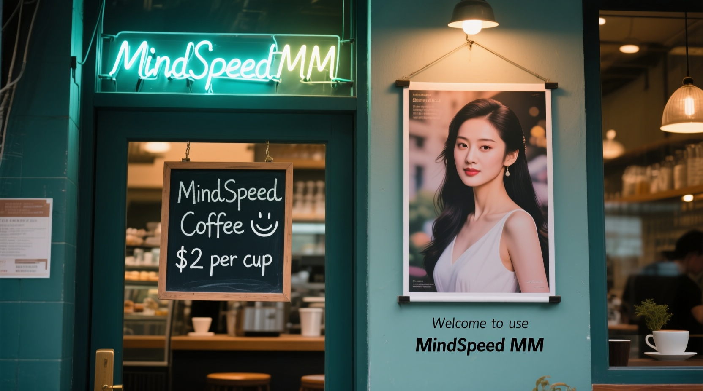

# <p align="center">  </p>

<p align="center">
    <a href="./LICENSE">
        
    </a>
    <a href="https://gitcode.com/Ascend/MindSpeed-MM">
        
    </a>
    <a>
        
    </a>
</p>

# Introduction

MindSpeed MM, an Ascend-powered multimodal large model suite for large-scale distributed training, supports mainstream industry multimodal large model training. It aims to provide an end-to-end multimodal training solution for Huawei [Ascend chips](https://www.hiAscend.com/), encompassing features such as pre-integrated mainstream models, data engineering, distributed training and acceleration, pre-training, fine-tuning, post-training, and online inference tasks.

# Future Plans

📅 The future roadmap will be dynamically updated in [MindSpeed MM RoadMap](https://gitcode.com/Ascend/MindSpeed-MM/issues/176). You are welcome to interact and raise requests through this link.

# Community Meetings

- For the schedule of MindSpeed TC and SIG meetings, please check the [Ascend Meeting Center](https://meeting.ascend.osinfra.cn/).

# Join Us

To exchange development experience, share usage insights, and receive timely project updates, we have created the official MindSpeed MM WeChat group.

Whether you are using this project or have creative ideas, you are welcome to join! 👋

How to join:

1. Scan the QR code to join the WeChat community group directly (the QR code is valid for 7 days and updated regularly. Currently, Group 1 has reached the maximum number of members for QR code joining; you can join Group 2).
2. Add the Ascend open-source assistant to get the group link and join the MindSpeed MM community communication group

<div style="display: flex; justify-content: flex-start; gap: 30px; align-items: flex-start; padding-left: 60px;">
  <div style="text-align: center;">
    <div>MindSpeed MM community communication group</div>
    
  </div>
  <div style="text-align: center;">
    <div>Ascend open-source assistant</div>
    
  </div>
</div>

# Directory Structure

Key directories are as follows. For a detailed directory introduction, see [Directory Introduction](docs/en/dir_structure.md)

```bash
├─bridge          # mbridge online weight conversion
├─checkpoint      # Offline weight conversion tool
├─ci              # Continuous integration
├─docs            # Project documentation
│  └─en           # English documentation
├─examples        # Preset models, including model configuration, dataset configuration, training scripts, inference scripts, and other files
├─mindspeed_mm    # Core code
├─scripts         # Scripts
├─sources         # Images and videos
├─tests           # Test code
│  ├─st           # System test cases
│  └─ut           # Unit test cases
├─UserGuide       # User guide
└─verl_plugin     # verl plugin module
```

# Latest News

- [Mar. 24, 2026]: 🚀 MindSpeed MM supports [LTX2](./examples/ltx2) model based on FSDP2 [Prototype]
- [Mar. 09, 2026]: 🚀 MindSpeed MM supports [FunASR](./examples/funasr) model based on FSDP2
- [Feb. 16, 2026]: 🚀 MindSpeed MM supports [Qwen3.5](./examples/qwen3_5) model based on FSDP2 [Prototype]
- [Feb. 14, 2026]: 🚀 MindSpeed MM supports [CosyVoice3](./examples/cosyvoice3) model training based on FSDP2
- [Feb. 13, 2026]: 🚀 MindSpeed MM supports [Kimi-K2.5](./examples/kimik2_5) model based on FSDP2 [Prototype]
- [Feb. 12, 2026]: 🚀 MindSpeed MM supports [HunyuanVideo1.5](./examples/hunyuanvideo_1.5) model training demo based on FSDP2 [Prototype]
- [Feb. 03, 2026]: 🚀 MindSpeed MM supports [DeepSeekOCR2](./examples/deepseekocr2/README.md) model training demo based on FSDP2 [Prototype]
- [Jan. 29, 2026]: 🎉 The Ascend image repository has launched the [MindSpeed MM image](https://www.hiascend.com/developer/ascendhub/detail/6857f6fc2cfa4a678710a7075426ee5e)
- [Jan. 29, 2026]: 🚀 MindSpeed MM supports [Qwen3-TTS](./examples/qwen3tts) model based on FSDP2 [Prototype]
- [Jan. 28, 2026]: 🚀 MindSpeed MM supports Magistral-Small-2509 model based on FSDP2 [Prototype]
- [Jan. 08, 2026]: 🚀 MindSpeed MM supports FLUX.2 model [Prototype]
- [Dec. 25, 2025]: 🎉 User manual is now online! Access link: <https://mindspeed-mm.readthedocs.io/zh-cn/latest/>
- [Dec. 03, 2025]: 🚀 MindSpeed MM supports Glm4.5v model training demo based on FSDP2 [Prototype]
- [Dec. 02, 2025]: 🚀 MindSpeed MM supports Self-Forcing DMD distillation based on Wan2.1-1.3B [Prototype]
- [Nov. 27, 2025]: 🚀 MindSpeed MM supports Qwen3VL-235B model based on fully shard
- [Nov. 20, 2025]: 🚀 MindSpeed MM supports Qwen3-Omni model based on FSDP2
- [Nov. 19, 2025]: 🚀 MindSpeed MM supports Qwen Image and Qwen Image Edit models [Prototype]
- [Nov. 13, 2025]: 🚀 MindSpeed MM supports InternVL3.5-30B model based on FSDP2
- [Nov. 06, 2025]: 🚀 MindSpeed MM supports DeepseekOCR model training demo based on FSDP2 [Prototype]
- [Oct. 31, 2025]: 🚀 MindSpeed MM supports Qwen3VL-8B/30B models based on fully shard
- [Oct. 22, 2025]: 🚀 MindSpeed MM supports Wan2.2 series models based on fully shard
- [Sep. 08, 2025]: 🚀 MindSpeed MM supports FLUX.1-Kontext model
- [Sep. 8, 2025]: 🚀 MindSpeed MM supports FLUX **reinforcement learning** DanceGRPO training
- **[Sep. 03, 2025]: 🎉 Reinforcement learning is live! MindSpeed MM supports Qwen2.5VL 7B/32B [GRPO training](./examples/verl_examples/qwen2.5vl/README.md)**
- [Aug. 15, 2025]: 🤝 MindSpeed MM **native support** for Lumina-mGPT 2.0 model
- [Jul. 29, 2025]: 🌴 MindSpeed MM supports core version 0.12.1
- [Jul. 10, 2025]: 🚀 MindSpeed MM supports InternVL3-8B/78B model
- [Jul. 02, 2025]: ⚡ MindSpeed MM **0-day** support for GLM-4.1V model
- [Jun. 30, 2025]: 🌴 MindSpeed MM version 2.1.0 released
- [Jun. 25, 2025]: 🚀 MindSpeed MM supports HiDream-I1 model
- [Jun. 05, 2025]: 🚀 MindSpeed MM supports Qwen2.5Omni-7B model
- [Jun. 05, 2025]: 🤝 MindSpeed MM **native support** for OpenSoraPlan 1.5 model
- [Apr. 03, 2025]: 🚀 MindSpeed MM supports Qwen2.5VL-32B model
- [Mar. 27, 2025]: 🚀 MindSpeed MM supports Wan2.1-1.3B/14B models
- [Mar. 26, 2025]: 🚀 MindSpeed MM supports Qwen2.5VL-3B/7B/72B models
- [Feb. 20, 2025]: 🚀 MindSpeed MM supports InternVL2.5-78B model
- [Feb. 18, 2025]: 🚀 MindSpeed MM supports HunyuanVideo model
- [Feb. 17, 2025]: 🔥 MindSpeed MM supports MindSpeed-Core & Megatron 0.8.0 version
- [Feb. 15, 2025]: 🚀 MindSpeed MM supports the Sana model
- [Jan. 24, 2025]: 🚀 MindSpeed MM supports the CogVideoX 1.5 model
- [Dec. 30, 2024]: 🌴 MindSpeed MM version 1.0.0 released
- [Dec. 16, 2024]: 🤝 MindSpeed MM **native support** for the Qihoo-T2X model
- [Dec. 03, 2024]: 🚀 MindSpeed MM supports the SD3.5 model
- [Nov. 30, 2024]: 🎉 MindSpeed MM supports multimodal understanding evaluation
- [Nov. 22, 2024]: 🚀 MindSpeed MM supports the CogVideoX model
- [Nov. 06, 2024]: 🚀 MindSpeed MM supports the FLUX model
- [Oct. 30, 2024]: 🤝 MindSpeed MM **natively supports** the OpenSoraPlan 1.3 model
- [Oct. 21, 2024]: 🚀 MindSpeed MM supports InternVL2 and Qwen2VL models
- [Oct. 16, 2024]: 🌱 MindSpeed MM first version 1.0.RC3 released

> NOTE: **Prototype** indicates that features have not been fully verified and may be unstable or contain bugs. **beta** indicates non-commercial use features.

# Showcase

## Text-to-Video: Wan 2.2 T2V

<table border="0" style="width: 100%; text-align: left; margin-top: 20px;">
  <tr>
      <td>
          
          <p>Prompt: Ultra HD, 4K, cinematic composition, low contrast ratio, low saturation, cool tone; The queen wears an iron crown and rides on the dragon over the city. She holds a big flag that shows:" MindSpeed MM".</p>
      </td>
  </tr>
</table>

## Text-to-Video: OpensoraPlan 1.5 T2V

<table border="0" style="width: 100%; text-align: left; margin-top: 20px;">
  <tr>
      <td>
          
          <p>Prompt: A fluffy white rabbit with soft, velvety fur and twitching pink nose sits curiously near a rustic wooden fence, surrounded by a lush garden of vibrant wildflowers and tall grasses swaying gently in the breeze. The rabbit's large, expressive eyes scan the environment, reflecting the golden hues of the setting sun. As it nibbles on a patch of clover, its ears perk up at the distant sound of chirping birds. The fence, weathered and covered in patches of moss, adds a charming, pastoral backdrop to this serene scene, capturing the essence of a peaceful countryside moment.</p>
      </td>
      <td>
          
          <p>Prompt: A majestic Berlin tower stands tall against the night sky, its structure bathed in a mesmerizing array of vibrant lights, casting a kaleidoscope of colors across the cityscape. The tower's intricate architectural details are highlighted by the illumination, creating a stunning contrast against the deep indigo sky. As the camera pans upward, the lights shift, revealing a dynamic play of shadows and hues that dance across the tower's surface. The surrounding city lights twinkle in harmony, enhancing the tower's grandeur and creating a breathtaking visual symphony that captures the essence of Berlin's vibrant nightlife.</p>
      </td>
  </tr>
</table>

## Text-to-Image: Qwen-Image -> Image Editing Flux.1-Kontext

<table border="0" style="width: 100%; text-align: left; margin-top: 20px;">
  <tr>
      <td>
          
          <p>Prompt for generation: A coffee shop entrance features a chalkboard sign reading "MindSpeed Coffee 😊 $2 per cup," with a neon light displaying "MindSpeed MM". Next to it hangs a poster showing a beautiful Chinese woman, and beneath the poster is written "Welcome to use MindSpeed MM". Ultra HD, 4K, cinematic composition. (Qwen-Image)</p>
      </td>
      <td>
          
          <p>Prompt for edition: Change the decoration of the coffee shop to a modern style with white painting. (Flux.1-Kontext)</p>
      </td>
  </tr>
</table>

## Understanding Model: Qwen2VL

<table border="0" style="width: 100%; text-align: left; margin-top: 20px;">
  <tr>
      <td>
          <p>Input image for both models:</p>
          
          <p>Input text for both models: Please describe the image shortly</p>
          <p>Qwen2VL inference result: The image depicts a serene lakeside scene with a wooden dock extending into the calm waters. The dock is made of weathered wooden planks and leads to a small platform with a ladder, suggesting it is used for swimming or diving. The lake is surrounded by lush green forests and mountains in the background, creating a picturesque and tranquil setting. The sky is overcast, adding to the calm and peaceful atmosphere of the scene.</p>
          <p>Input text for Qwen2VL: 请用中文简短描述这张照片</p>
          <p>Qwen2VL inference result: 这张图片展示了一座木制码头延伸到平静的湖面上，背景是连绵的山脉和茂密的森林。天空多云，整体色调偏冷，给人一种宁静和自然的感觉。</p>
      </td>
  </tr>
</table>

# Version Notes

MindSpeed MM supports Ascend training hardware form factors such as Atlas 800T A2. The software version compatibility table is as follows:

| MindSpeed MM Version | MindSpeed Version      | Megatron Version | PyTorch Version  | torch_npu Version | CANN Version | Python Version            |
| ---------------- | ------------------ | ------------ | ------------ | ------------- | -------- | --------------------- |
| master (in‑development version) | master (in‑development version)       | Core 0.12.1  | 2.7.1 | in‑development version       | in‑development version  | Python3.10            |
| 26.0.0 (commercial use)   | 26.0.0_core_r0.12.1 | Core 0.12.1  | 2.7.1       | 26.0.0         | 9.0.0    | Python3.10            |
| 2.3.0 (commercial use)    | 2.3.0_core_r0.12.1 | Core 0.12.1  | 2.6.0, 2.7.1 | 7.3.0         | 8.5.0    | Python3.10            |
| 2.2.0 (commercial use)    | 2.2.0_core_r0.12.1 | Core 0.12.1  | 2.6.0, 2.7.1 | 7.2.0         | 8.3.RC1  | Python3.10            |
| 2.1.0 (commercial use)    | 2.1.0_core_r0.8.0  | Core 0.8.0   | 2.1.0, 2.6.0 | 7.1.0         | 8.2.RC1  | Python3.8, Python3.10 |
| 2.0.0 (commercial use)    | 2.0.0_core_r0.8.0  | Core 0.8.0   | 2.1.0        | 7.0.0         | 8.1.RC1  | Python3.8, Python3.10 |
| 1.0.0 (commercial use)    | 1.0.0_core_r0.6.0  | Core 0.6.0   | 2.1.0        | 6.0.0         | 8.0.0    | Python3.8, Python3.10 |

>[!Note]
>
> "in‑development version" refers to a release that is currently under active development and iteration. Since its features are still being refined and optimized, its dependencies—even if they are commercially released versions—may present compatibility risks or operational instability. For stable use, it is recommended to prioritize the officially released commercial versions.

For details, see the [Version Compatibility Table](docs/en/release_notes_mm.md#version-compatibility-notes).

# Installation

For specific installation of MindSpeed MM, refer to the [Installation Guide](docs/en/pytorch/installation.md).
Currently, the Qwen3vl and Wan2.2 models support one-click installation. For details, see [One-Click Installation Usage Instructions](docs/en/pytorch/install_guide.md).

# Quick Start

MindSpeed MM uses the Qwen2.5-VL-3B and Wan2.1-T2V-1.3B models as examples to guide developers in quickly getting started with the efficient operation of preset models on Ascend NPUs. For specific operations, refer to [Quick Start](./docs/en/pytorch/quickstart.md).

# Feature/Model Introduction

## Overview of Supported Features

|       Model \ Feature        | [TP](https://gitcode.com/Ascend/MindSpeed/blob/26.0.0_core_r0.12.1/docs/en/features/tensor-parallel.md) | [TP-SP](https://gitcode.com/Ascend/MindSpeed/blob/26.0.0_core_r0.12.1/docs/en/features/sequence-parallel.md) | [VPP](docs/en/features/virtual_pipeline_parallel.md) | [PP](https://gitcode.com/Ascend/MindSpeed/blob/26.0.0_core_r0.12.1/docs/en/features/pipeline-parallel.md) | CP | [Distributed Optimizer](https://gitcode.com/Ascend/MindSpeed/blob/26.0.0_core_r0.12.1/docs/en/features/distributed-optimizer.md) | [Recomputation](https://gitcode.com/Ascend/MindSpeed/blob/26.0.0_core_r0.12.1/docs/en/features/recomputation.md) | [LoRA](./docs/en/features/lora_finetune.md) | RL | [FSDP2](https://gitcode.com/Ascend/MindSpeed/blob/26.0.0_core_r0.12.1/docs/en/features/fsdp2.md) |
|:--------------------:|:------:|:------:|:------:|:---------------------------------------------------------------------------------------:|:------:|:------:|:------:|:------:|:------:|:------:|
| Magistral-Small-2509 |  |  |  |  |  |  | ✔ | ✔ |  | ✔ |
|   InternVL3.5-30B    |  |  |  |  |  |  | ✔ |  |  | ✔ |
|     Qwen3-VL-8B      |  |  |  |  |  |  | ✔ |  |  | ✔ |
|     Qwen3-VL-30B     |  |  |  |  |  |  | ✔ |  |  | ✔ |
|        Wan2.2        |  |  |  |  | CP (Ulysses) |  | ✔ |  |  | ✔ |
| OpenSoraPlan1.5-T2V  | ✔ | ✔ |  |  |  |  | ✔ |  |  |  |
|        Wan2.1        |  |  |  |  | CP (Ulysses) | ✔ | ✔ | ✔ |  | ✔ |
|     HunyuanVideo     | ✔ | ✔ |  |  | CP (Ulysses) | ✔ | ✔ | ✔ |  |  |
|   HunyuanVideo1.5    |  |  |  |  |  | ✔ | ✔ |  |  | ✔ |
|   CogVideoX Series-T2V    | ✔ | ✔ |  |  | CP (Ulysses) | ✔ | ✔ | ✔ |  |  |
|   CogVideoX Series-I2V    | ✔ | ✔ |  |  | CP (Ulysses) | ✔ | ✔ | ✔ |  |  |
| OpensoraPlan1.3-T2V  | ✔ | ✔ | ✔ | ✔ | CP (Ulysses) | ✔ | ✔ |  |  |  |
| OpensoraPlan1.3-I2V  | ✔ | ✔ | ✔ | ✔ | CP (Ulysses) | ✔ | ✔ |  |  |  |
|       GLM-4.1V       |  |  |  | ✔ |  | ✔ | ✔ |  |  |  |
|      Qwen2VL-2B      | ✔ | ✔ |  | ✔ | CP (Ulysses) | ✔ | ✔ | ✔ |  |  |
|      Qwen2VL-7B      | ✔ | ✔ |  | ✔ | CP (Ulysses) | ✔ | ✔ | ✔ |  |  |
|     Qwen2VL-72B      | ✔ | ✔ |  | ✔ | CP (Ulysses) | ✔ | ✔ | ✔ | DPO |  |
|     Qwen2.5VL-3B     | ✔ | ✔ |  | ✔ |  | ✔ | ✔ |  | GRPO |  |
|     Qwen2.5VL-7B     | ✔ | ✔ |  | ✔ |  | ✔ | ✔ |  | GRPO |  |
|    Qwen2.5VL-32B     | ✔ | ✔ |  | ✔ |  | ✔ | ✔ |  | GRPO |  |
|    Qwen2.5VL-72B     | ✔ | ✔ |  | ✔ |  | ✔ | ✔ | ✔ |  |  |
|    Qwen2.5Omni-7B    | ✔ |  |  | ✔ |  | ✔ |  | ✔ |  |  |
|      Qwen3-Omni      |  |  |  |  |  |  | ✔ |  |  | ✔ |
|     InternVL3-8B     | ✔ | ✔ | ✔ | ✔ | CP (Ring) | ✔ | ✔ |  |  |  |
|    InternVL3-78B     | ✔ | ✔ | ✔ | ✔ | CP (Ring) | ✔ | ✔ |  |  |  |

Note:

- TP: [Tensor Parallelism](https://arxiv.org/abs/1909.08053)
- TP-SP: [Tensor Parallelism with Sequence Parallelism](https://arxiv.org/abs/2205.05198)
- VPP: [Virtual Pipeline Parallelism](https://arxiv.org/abs/2104.04473)
- PP: [Pipeline Parallelism](https://arxiv.org/abs/2104.04473)
- DSP: [Dynamic Sequence Parallelism](https://arxiv.org/abs/2403.10266)
- CP (Ulysses): [Context Parallelism](https://docs.nvidia.com/megatron-core/developer-guide/latest/user-guide/features/context_parallel.html) by leveraging [Deepspeed Ulysses](https://arxiv.org/abs/2309.14509) with Sequence Parallel
- CP (Ring Attention): Context Parallel with [Ring Attention](https://arxiv.org/abs/2310.01889)
- Distributed Optimizer: [Zero Redundancy Optimizer](https://arxiv.org/abs/1910.02054) (ZeRO)
- Recomputation: Reducing Activation [Recomputation](https://arxiv.org/abs/2205.05198)
- LoRA: [Low-Rank Adaptation](https://arxiv.org/abs/2106.09685)
- RL: Reinforcement Learning
- FSDP2: [Fully Sharded Data Parallelism](https://arxiv.org/abs/2304.11277)

## Compatible Versions and Supported Models

MindSpeed MM comes with a rich set of preset models covering tasks such as multimodal generation and multimodal understanding. For details on the parameter scale, training tasks, recommended clusters, measured performance, and certification status of each model, see the [MindSpeed MM Supported Models List](https://gitcode.com/Ascend/MindSpeed-MM/blob/master/docs/zh/pytorch/supported_models.md).

Large language models (dense models, sparse models, and state space models) are maintained exclusively by MindSpeed-LLM. If you need to perform LLM training, please visit [MindSpeed-LLM](https://gitcode.com/Ascend/MindSpeed-LLM/blob/master/docs/en/pytorch/models/supported_models.md) for detailed usage instructions.

# Explanation of Common Parameters

For details about common parameters included by the MindSpeed MM suite, see [README](./docs/en/pytorch/args_readme.md)

# Feature Planning

- [Model Features] CogVideoX: PP
- [Model Features] OpensoraPlan1.3: CP (Ring Attention)
- [Model Features] Qwen2VL: VPP, CP (Ulysses & Ring Attention)
- [Model Features] InternVL2: TP, CP (Ulysses & Ring Attention)
- [Basic Features] Hetero-parallel

<a id="jump2"></a>

# Tool Usage

<a id="jump2.1"></a>

## Ascend Profiling Tool

MindSpeed MM integrates the Ascend profiling tool to provide analysis of model execution. This tool can collect key information such as model operators and memory usage according to the configuration, and supports both dynamic and static profiling modes, helping developers analyze model bottlenecks and choose the appropriate method based on actual scenario requirements.

  For specific methods, see the profiling section in [README](./docs/en/tools.md).

## MindStudio Insight

For performance tuning in large-scale model cluster scenarios, we recommend an excellent visualization tuning tool, MindStudio Insight. MindStudio Insight provides visual presentations including timeline view, communication analysis, and computation time consumption, enabling users to analyze potential performance bottlenecks and guide them on how to take measures to eliminate or reduce these bottlenecks.

For specific installation and usage instructions, see [MindStudio Insight User Guide](https://www.hiascend.com/document/detail/en/mindstudio/830/GUI_baseddevelopmenttool/msascendinsightug/Insight_userguide_0002.html).

## Sora-class Model Feature Extraction

MindSpeed MM supports extracting and saving video and text features

For the specific method, see the "Sora-class Model Feature Extraction" section in [README](./docs/en/tools.md).

## Memory Snapshot Extraction

MindSpeed MM integrates the Ascend memory snapshot collection tool to provide analysis of model runtime conditions.

  For the specific method, see the "Memory Snapshot Extraction" section in [README](./docs/en/tools.md).

## TensorBoard Usage

MindSpeed MM supports the use of TensorBoard.

  For the specific method, see the "TensorBoard Usage" section in [README](./docs/en/tools.md).

# Version Maintenance

MindSpeed MM versions have the following five maintenance phases:

| Status           | Time | Description                                                               |
| ------------------- | -------- |----------------------------------------------------------------------|
| Planned                | 1–3 months | Planned features                                                                 |
| Development                | 3 months   | Feature development                                                                 |
| Maintenance                | 6–12 months| Merge all resolved issues and release versions. Different maintenance strategies are adopted for different MindSpeed MM versions. The maintenance cycles for regular versions and long-term support versions are 6 months and 12 months respectively. |
| No maintenance              | 0–3 months | All resolved issues merged, no dedicated maintenance personnel, no version release                                             |
| End of Life (EOL) | N/A      | The branch no longer accepts any modifications.                                                           |

MindSpeed MM released version maintenance strategy:

| MindSpeed MM Version | Maintenance Strategy | Current Status | Release Date   | Subsequent Status         | EOL Date |
|--------------------|-----------|-------|------------|------------------|-----------|
| 26.0.0             |  Regular version  | Maintenance   | 2026/03/30 | Maintenance is expected to end on 2026/09/30 |           |
| 2.3.0              |  Regular version  | Maintenance   | 2025/12/30 |Maintenance is expected to end on 2026/06/30 |           |
| 2.2.0              |  Regular version  | No maintenance  | 2025/09/30 | Maintenance is expected to end on 2026/03/30 |           |
| 2.1.0              |  Regular version  | No maintenance  | 2025/06/30 | Maintenance is expected to end on 2025/12/30 |           |
| 2.0.0              |  Regular version  | No maintenance  | 2025/03/30 | Maintenance is expected to on 2025/09/30 |           |
| 1.0.0              |  Regular version  | No maintenance  | 2024/12/30 | Maintenance is expected to end on 2025/06/30 |           |
| 1.0.RC3            |  Regular version  | No maintenance  | 2024/09/30 | Maintenance is expected to end on 2025/03/30 |           |

# FAQs

For related FAQs, please refer to [FAQs](./docs/en/FAQ.md)

# Related Resources

1. [A Multimodal Suite for Large-Scale Distributed Training](https://mp.weixin.qq.com/s/Qiw_qThKA72T0lLOSpjkKw)
2. [With the Surging Computing Power of Ascend, Open-Sora Plan Achieves Cinematic-Quality Video Generation](https://mp.weixin.qq.com/s/KY2tLthhre-SRbuWka3c2w)
3. [MindSpeed MM Supports Mainstream Multimodal Understanding Models, Achieving Significant Performance Improvements](https://mp.weixin.qq.com/s/3pZRy24ITyKl3nGc33Sq7w)
4. [Native Training on Ascend! Sun Yat-sen University and 360 Group Create Qihoo-T2X for Multimodal Tasks](https://mp.weixin.qq.com/s/zQAy_hbL9cR3c8-NO6lKnA)
5. [Explore Wan2.1 Text-to-Video SOTA on Ascend MindSpeed MM](https://mp.weixin.qq.com/s/g2ShV2F6YpoVAniw6CBN_w)
6. [Qwen2.5-VL Ready-to-Use on MindSpeed MM](https://mp.weixin.qq.com/s/ac7RUWw79stunwQIyC-ykQ)
7. [Explore Open-Sora Plan V1.5 on Ascend MindSpeed MM](https://mp.weixin.qq.com/s/3cgO8yqrOIEHYqW69VQQcQ)
8. [Explore GLM-4.1V-Thinking on Ascend MindSpeed MM](https://mp.weixin.qq.com/s/FLgCfBVG7pOzNHji2uwcDg)

# Security Statement

For details, see [MindSpeed MM Security Statement](docs/en/SECURITYNOTE.md)

# Disclaimer

## To MindSpeed MM Users

1. The models provided by MindSpeed MM are for your non-commercial use only.
2. For each model, the MindSpeed MM platform only suggestively recommends datasets that can be used for training. Huawei does not provide any datasets. If you use these datasets for training, please pay special attention to complying with the corresponding dataset licenses. Huawei assumes no responsibility for any infringement disputes arising from your use of the datasets.
3. If you discover any issues (including but not limited to functional issues or compliance issues) while using MindSpeed MM models, please submit an issue on GitCode, and we will promptly review and resolve it.
4. Third-party open-source software such as Megatron, on which MindSpeed MM functions depend, is provided and maintained by their respective third-party communities. The resolution of third-party open-source software issues relies on the contributions and feedback of the relevant communities. You should understand that the MindSpeed MM repository does not guarantee the fixing of issues inherent to the third-party open-source software itself, nor does it guarantee testing or correcting all vulnerabilities and errors in third-party open-source software.

## To Dataset Owners

If you do not want your model or dataset to be mentioned in MindSpeed MM, or if you wish to update its description, please submit an issue on GitCode. We will delete or update your description according to your request. Thank you for your understanding and contribution to MindSpeed MM.

# License Statement

For models provided by Ascend MindSpeed MM, if a License exists in the model directory, that License shall prevail. If no License exists in the model directory, the model is licensed under the `Apache 2.0 License`. The corresponding license text can be found in [LICENSE](./LICENSE) file in the root directory of Ascend MindSpeed MM. Documentation under the `docs` directory is licensed under the `CC-BY 4.0 License`. For details, please refer to [LICENSE](./docs/LICENSE).

# Contribution Statement

## 1. Report Issues

- If you find any issues, please first check the repository's [issues list](https://gitcode.com/Ascend/MindSpeed-MM/issues) to look for similar problems or solutions.

- If the [issues list](https://gitcode.com/Ascend/MindSpeed-MM/issues) does not contain the problem you encountered, you can [submit a new issue](https://gitcode.com/Ascend/MindSpeed-MM/issues/create/choose) and provide a clear description of the problem, reproduction steps, and environment information as much as possible.

## 2. Code Contribution Process

If you wish to submit code changes, please follow these brief steps:

- Develop and commit on your personal branch, then initiate a PR to this project repository;

- Register for PR review in our [SIG Regular Meeting PR Review Registration](https://gitcode.com/Ascend/MindSpeed-MM/issues/256) by following the established format, and attend the corresponding review meeting on time;

- Revise the PR based on the review comments and update it;

- After the PR passes review, enter `compile` in the comment section to trigger CI;

- Once the PR's CI passes and sufficient labels are obtained, the repository committer will conduct the final review and merge it into the in‑development version branch.

Thank you for your participation and contribution! We look forward to advancing the project together with you.

# Acknowledgments

MindSpeed MM is jointly contributed by the following departments of Huawei and Ascend ecosystem partners:

Huawei:

- Computing Product Line
- Public Development Department
- 2012 Laboratories
- Huawei Cloud

Ecosystem Partners:

- 360 AI Research
- Peking University OpenSoraPlan Team
- WeChat Technology Architecture Department, Infrastructure Center
- JD Retail Jiushu R&D Department

Thank you for every PR from the community and your contributions to MindSpeed MM.
