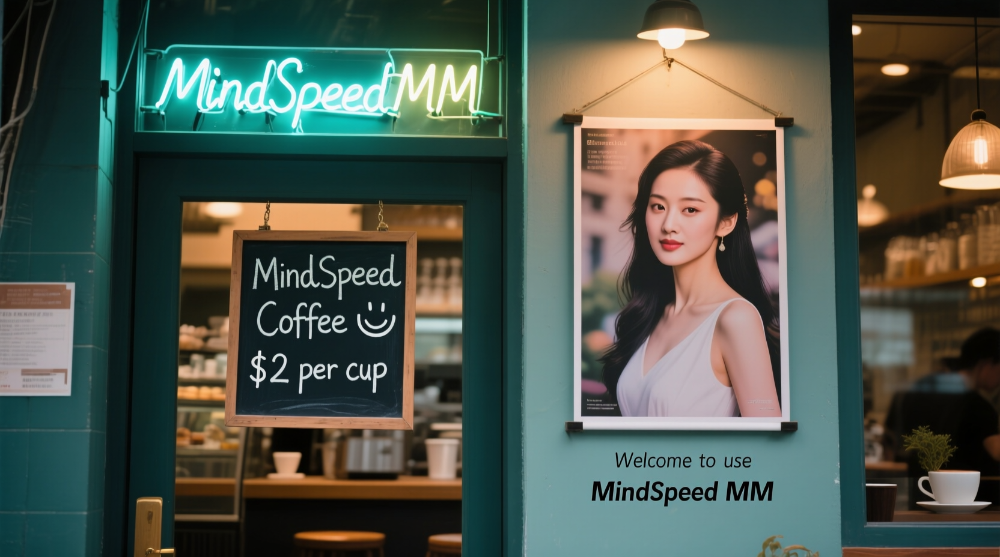

# <p align="center">  </p>

<p align="center">
    English | <a href="./README.md">简体中文</a>
</p>

<p align="center">
    <a href="./LICENSE">
        
    </a>
    <a href="https://gitcode.com/Ascend/MindSpeed-MM">
        
    </a>
    <a>
        
    </a>
</p>

# Introduction

---

MindSpeed MM: an Ascend-based multimodal large model suite for large-scale distributed training, supporting mainstream multimodal large model training in the industry. It aims to provide an end-to-end multimodal training solution for Huawei [Ascend chips](https://www.hiAscend.com/en), including features such as pre-integrated mainstream industry models, data engineering, distributed training and acceleration, pretraining, fine-tuning, post-training, and online inference tasks.

# Future Plans

---

📅 Future plans are dynamically updated in the [MindSpeed MM RoadMap](https://gitcode.com/Ascend/MindSpeed-MM/issues/176). You are welcome to interact and raise your requests through this link.

# Community Meeting

---

- For the MindSpeed series TC and SIG meeting schedules, see [Ascend Meeting Center](https://meeting.ascend.osinfra.cn/).

# Join Us

---

To exchange development experience, share usage insights, and receive project updates in a timely manner, we have created the official MindSpeed MM WeChat group.

Whether you are currently using this project or have creative ideas, you are all welcome to join 👋

How to join:

1. Scan the QR code to join the WeChat discussion group directly (the QR code is valid for 7 days and updated regularly; Group 1 has currently reached the maximum number of members who can join by scanning, so you may join Group 2).
2. Add the Ascend Open-Source Assistant to obtain the group link and join the MindSpeed MM community discussion group.

<div style="display: flex; justify-content: flex-start; gap: 30px; align-items: flex-start; padding-left: 60px;">
  <div style="text-align: center;">
    <div>MindSpeed MM Community Discussion Group</div>
    
  </div>
  <div style="text-align: center;">
    <div>Ascend Open Source Assistant</div>
    
  </div>
</div>

# Directory Structure

The key directories are as follows. For a detailed directory introduction, see [Directory Structure](docs/en/dir_structure.md).

```bash
├─bridge          # mbridge online weight conversion
├─checkpoint      # Offline weight conversion tool
├─ci              # Continuous Integration
├─docs            # project documentation directory
│  └─zh           # Chinese documentation directory
|  └─en           # English documentation directory
├─examples        # Preset models, including model configuration, dataset configuration, training scripts, inference scripts, and other files
├─mindspeed_mm    # Core code directory
├─scripts         # Scripts directory
├─sources         # Images and videos directory
├─tests           # Test code directory
│  ├─st           # System test cases
│  └─ut           # Unit test cases
├─UserGuide       # User guide directory
└─verl_plugin     # verl plugin module
```

# Latest News

---

- [Apr. 17, 2026]: 🚀 MindSpeed MM supports [Qwen3.6](./examples/qwen3_6) model training based on FSDP2 [Prototype]
- [Mar. 24, 2026]: 🚀 MindSpeed MM supports [LTX2](./examples/ltx2) model training based on FSDP2 [Prototype]
- [Mar. 09, 2026]: 🚀 MindSpeed MM supports [FunASR](./examples/funasr) model training based on FSDP2
- [Feb. 16, 2026]: 🚀 MindSpeed MM supports [Qwen3.5](./examples/qwen3_5) model training based on FSDP2 [Prototype]
- [Feb. 14, 2026]: 🚀 MindSpeed MM supports [CosyVoice3](./examples/cosyvoice3) model training based on FSDP2
- [Feb. 13, 2026]: 🚀 MindSpeed MM supports the [Kimi-K2.5](./examples/kimik2_5) model based on FSDP2 [Prototype]
- [Feb. 12, 2026]: 🚀 MindSpeed MM supports the [HunyuanVideo1.5](./examples/hunyuanvideo_1.5) model training demo based on FSDP2 [Prototype]
- [Feb. 03, 2026]: 🚀 MindSpeed MM supports the [DeepseekOCR2](./examples/deepseekocr2/README.md) model training demo based on FSDP2 [Prototype]
- [Jan. 29, 2026]: 🎉 The Ascend image repository has launched the [MindSpeed MM image](https://www.hiascend.com/developer/ascendhub/detail/6857f6fc2cfa4a678710a7075426ee5e)
- [Jan. 29, 2026]: 🚀 MindSpeed MM supports the [Qwen3-TTS](./examples/qwen3tts) model based on FSDP2 [Prototype]
- [Jan. 28, 2026]: 🚀 MindSpeed MM supports the Magistral-Small-2509 model based on FSDP2 [Prototype]
- [Jan. 08, 2026]: 🚀 MindSpeed MM supports the FLUX.2 model [Prototype]
- [Dec. 25, 2025]: 🎉 The user manual is now available! Experience it at: <https://mindspeed-mm.readthedocs.io/zh-cn/latest/>
- [Dec. 03, 2025]: 🚀 MindSpeed MM supports the Glm4.5v model training demo based on FSDP2 [Prototype]
- [Dec. 02, 2025]: 🚀 MindSpeed MM supports Self-Forcing DMD distillation based on Wan2.1-1.3B [Prototype]
- [Nov. 27, 2025]: 🚀 MindSpeed MM supports the Qwen3VL-235B model based on fully shard
- [Nov. 20, 2025]: 🚀 MindSpeed MM supports the Qwen3-Omni model based on FSDP2
- [Nov. 19, 2025]: 🚀 MindSpeed MM supports the Qwen Image and Qwen Image Edit models [Prototype]
- [Nov. 13, 2025]: 🚀 MindSpeed MM supports the InternVL3.5-30B model based on FSDP2
- [Nov. 06, 2025]: 🚀 MindSpeed MM supports the DeepseekOCR model training demo based on FSDP2 [Prototype]
- [Oct. 31, 2025]: 🚀 MindSpeed MM supports the Qwen3VL-8B/30B models based on fully shard
- [Oct. 22, 2025]: 🚀 MindSpeed MM supports the Wan2.2 series models based on fully shard
- [Sep. 08, 2025]: 🚀 MindSpeed MM supports the FLUX.1-Kontext model
- [Sep. 8, 2025]: 🚀 MindSpeed MM supports FLUX **reinforcement learning** DanceGRPO training
- **[Sep. 03, 2025]: 🎉 Reinforcement learning is now available! MindSpeed MM supports Qwen2.5VL 7B/32B [GRPO training](./examples/verl_examples/qwen2.5vl/README.md)**
- [Aug. 15, 2025]: 🤝 MindSpeed MM **natively supports** the Lumina-mGPT 2.0 model
- [Jul. 29, 2025]: 🌴 MindSpeed MM supports core version 0.12.1
- [Jul. 10, 2025]: 🚀 MindSpeed MM supports the InternVL3-8B/78B model
- [Jul. 02, 2025]: ⚡ MindSpeed MM provides **0Day** support for the GLM-4.1V model
- [Jun. 30, 2025]: 🌴 MindSpeed MM version 2.1.0 released
- [Jun. 25, 2025]: 🚀 MindSpeed MM supports the HiDream-I1 model
- [Jun. 05, 2025]: 🚀 MindSpeed MM supports the Qwen2.5Omni-7B model
- [Jun. 05, 2025]: 🤝 MindSpeed MM provides **native support** for the OpenSoraPlan 1.5 model
- [Apr. 03, 2025]: 🚀 MindSpeed MM supports the Qwen2.5VL-32B model
- [Mar. 27, 2025]: 🚀 MindSpeed MM supports the Wan2.1-1.3B/14B model
- [Mar. 26, 2025]: 🚀 MindSpeed MM supports the Qwen2.5VL-3B/7B/72B model
- [Feb. 20, 2025]: 🚀 MindSpeed MM supports the InternVL2.5-78B model
- [Feb. 18, 2025]: 🚀 MindSpeed MM supports the HunyuanVideo model
- [Feb. 17, 2025]: 🔥 MindSpeed MM supports Mindspeed-Core & Megatron 0.8.0
- [Feb. 15, 2025]: 🚀 MindSpeed MM supports the Sana model
- [Jan. 24, 2025]: 🚀 MindSpeed MM supports the CogVideoX 1.5 model
- [Dec. 30, 2024]: 🌴 MindSpeed MM version 1.0.0 released
- [Dec. 16, 2024]: 🤝 MindSpeed MM provides **native support** for the Qihoo-T2X model
- [Dec. 03, 2024]: 🚀 MindSpeed MM supports the SD3.5 model
- [Nov. 30, 2024]: 🎉 MindSpeed MM supports multimodal understanding evaluation
- [Nov. 22, 2024]: 🚀 MindSpeed MM supports the CogVideoX model
- [Nov. 06, 2024]: 🚀 MindSpeed MM supports the FLUX model
- [Oct. 30, 2024]: 🤝 MindSpeed MM provides native support for the OpenSoraPlan 1.3 model
- [Oct. 21, 2024]: 🚀 MindSpeed MM supports the InternVL2 and Qwen2VL models
- [Oct. 16, 2024]: 🌱 MindSpeed MM first version 1.0.RC3 released

> Note: The **Prototype** feature has not been fully verified and may be unstable or contain bugs. **beta** indicates a non-commercial feature.

# Demonstrations

---

## Text-to-Video: Wan 2.2 T2V

<table border="0" style="width: 100%; text-align: left; margin-top: 20px;">
  <tr>
      <td>          
          
          <p>Prompt: Ultra HD, 4K, cinematic composition, low contrast ratio, low saturation, cool tone; The queen wears an iron crown and rides on the dragon over the city. She holds a big flag that shows:" MindSpeed MM".</p>
      </td>
  </tr>
</table>

## Text-to-Video: Open-Sora Plan 1.5 T2V

<table border="0" style="width: 100%; text-align: left; margin-top: 20px;">
  <tr>
      <td>          
          
          <p>Prompt: A fluffy white rabbit with soft, velvety fur and twitching pink nose sits curiously near a rustic wooden fence, surrounded by a lush garden of vibrant wildflowers and tall grasses swaying gently in the breeze. The rabbit's large, expressive eyes scan the environment, reflecting the golden hues of the setting sun. As it nibbles on a patch of clover, its ears perk up at the distant sound of chirping birds. The fence, weathered and covered in patches of moss, adds a charming, pastoral backdrop to this serene scene, capturing the essence of a peaceful countryside moment.</p>
      </td>
      <td>          
          
          <p>Prompt: A majestic Berlin tower stands tall against the night sky, its structure bathed in a mesmerizing array of vibrant lights, casting a kaleidoscope of colors across the cityscape. The tower's intricate architectural details are highlighted by the illumination, creating a stunning contrast against the deep indigo sky. As the camera pans upward, the lights shift, revealing a dynamic play of shadows and hues that dance across the tower's surface. The surrounding city lights twinkle in harmony, enhancing the tower's grandeur and creating a breathtaking visual symphony that captures the essence of Berlin's vibrant nightlife.</p>
      </td>
  </tr>
</table>

## Text-to-Image: Qwen-Image -> Image Editing Flux.1-Kontext

<table border="0" style="width: 100%; text-align: left; margin-top: 20px;">
  <tr>
      <td>          
          
          <p>Prompt for generation: A coffee shop entrance features a chalkboard sign reading "MindSpeed Coffee 😊 $2 per cup," with a neon light displaying "MindSpeed MM". Next to it hangs a poster showing a beautiful Chinese woman, and beneath the poster is written "Welcome to use MindSpeed MM". Ultra HD, 4K, cinematic composition. (Qwen-Image)</p>
      </td>
      <td>          
          
          <p>Prompt for edition: Change the decoration of the coffee shop to a modern style with white painting. (Flux.1-Kontext)</p>
      </td>
  </tr>
</table>

## Understanding Model: Qwen2VL

<table border="0" style="width: 100%; text-align: left; margin-top: 20px;">
  <tr>
      <td>          
          <p>Input image for both models:</p>
          
          <p>Input text for both models: Please describe the image shortly</p>
          <p>Qwen2VL inference result: The image depicts a serene lakeside scene with a wooden dock extending into the calm waters. The dock is made of weathered wooden planks and leads to a small platform with a ladder, suggesting it is used for swimming or diving. The lake is surrounded by lush green forests and mountains in the background, creating a picturesque and tranquil setting. The sky is overcast, adding to the calm and peaceful atmosphere of the scene.</p>
          <p>Input text for Qwen2VL: 请用中文简短描述这张照片</p>
          <p>Qwen2VL推理结果: 这张图片展示了一座木制码头延伸到平静的湖面上，背景是连绵的山脉和茂密的森林。天空多云，整体色调偏冷，给人一种宁静和自然的感觉。</p>
      </td>
  </tr>
</table>

# Version Notes

---

MindSpeed MM supports Ascend training hardware such as Atlas 800T A2. The software version matching table is as follows:

| MindSpeed MM Version | MindSpeed Version      | Megatron Version | PyTorch Version  | TorchNPU Version | CANN Version | Python Version            |
| ---------------- | ------------------ | ------------ | ------------ | ------------- | -------- | --------------------- |
| master (version under development) | master (version under development)       | Core 0.12.1  | 2.7.1 | version under development       | version under development  | Python3.10            |
| 26.0.0 (commercial use)   | 26.0.0_core_r0.12.1 | Core 0.12.1  | 2.7.1       | 26.0.0         | 9.0.0    | Python3.10            |
| 2.3.0 (commercial use)    | 2.3.0_core_r0.12.1 | Core 0.12.1  | 2.6.0, 2.7.1 | 7.3.0         | 8.5.0    | Python3.10            |
| 2.2.0 (commercial use)    | 2.2.0_core_r0.12.1 | Core 0.12.1  | 2.6.0, 2.7.1 | 7.2.0         | 8.3.RC1  | Python3.10            |
| 2.1.0 (commercial use)    | 2.1.0_core_r0.8.0  | Core 0.8.0   | 2.1.0, 2.6.0 | 7.1.0         | 8.2.RC1  | Python3.8, Python3.10 |
| 2.0.0 (commercial use)    | 2.0.0_core_r0.8.0  | Core 0.8.0   | 2.1.0        | 7.0.0         | 8.1.RC1  | Python3.8, Python3.10 |
| 1.0.0 (commercial use)    | 1.0.0_core_r0.6.0  | Core 0.6.0   | 2.1.0        | 6.0.0         | 8.0.0    | Python3.8, Python3.10 |

>[!Note]
>
> "Version under development" refers to a version currently in the development and iteration phase. Since its features are still under continuous iteration and optimization, its supporting dependencies may still pose compatibility risks or runtime instability even when released commercial versions are adopted. For stable use, it is recommended to prioritize officially released commercial versions.

For more details, refer to [Version Matching Table](docs/en/release_notes_mm.md#new-features).

# Installation

---

For details about installing MindSpeed MM, see the [Installation Guide](docs/en/pytorch/install_guide.md).
The Qwen3vl and Wan2.2 models currently support one-click installation. For usage instructions on one-click installation, see [One-Click Installation Usage Instructions](docs/en/pytorch/install_guide.md).

# Quick Start

---

MindSpeed MM uses the Qwen2.5-VL-3B and Wan2.1-T2V-1.3B models as examples to guide developers in quickly getting started with the efficient execution of preset models on Ascend NPUs. For specific operations, see [Quick Start](./docs/en/pytorch/quickstart.md).

# Features/Model Introduction

---

## Supported Features Overview

|       Model/Feature        | [TP](https://gitcode.com/Ascend/MindSpeed/blob/26.1.0_core_r0.12.1/docs/en/features/tensor-parallel.md) | [TP-SP](https://gitcode.com/Ascend/MindSpeed/blob/26.1.0_core_r0.12.1/docs/en/features/sequence-parallel.md) | [VPP](docs/en/features/virtual_pipeline_parallel.md) | [PP](https://gitcode.com/Ascend/MindSpeed/blob/26.1.0_core_r0.12.1/docs/en/features/pipeline-parallel.md) | CP | [Distributed Optimizer](https://gitcode.com/Ascend/MindSpeed/blob/26.1.0_core_r0.12.1/docs/en/features/distributed-optimizer.md) | [Recomputation](https://gitcode.com/Ascend/MindSpeed/blob/26.1.0_core_r0.12.1/docs/en/features/recomputation.md) | [LoRA](./docs/en/features/lora_finetune.md) | RL | [FSDP2](https://gitcode.com/Ascend/MindSpeed/blob/26.1.0_core_r0.12.1/docs/en/features/fsdp2.md) |
|:--------------------:|:------:|:------:|:------:|:---------------------------------------------------------------------------------------:|:------:|:------:|:------:|:------:|:------:|:------:|
| Magistral-Small-2509 |  |  |  |  |  |  | ✔ | ✔ |  | ✔ |
|   InternVL3.5-30B    |  |  |  |  |  |  | ✔ |  |  | ✔ |
|     Qwen3-VL-8B      |  |  |  |  |  |  | ✔ |  |  | ✔ |
|     Qwen3-VL-30B     |  |  |  |  |  |  | ✔ |  |  | ✔ |
|        Wan2.2        |  |  |  |  | CP (Ulysses) |  | ✔ |  |  | ✔ |
| OpenSoraPlan1.5-T2V  | ✔ | ✔ |  |  |  |  | ✔ |  |  |  |
|        Wan2.1        |  |  |  |  | CP (Ulysses) | ✔ | ✔ | ✔ |  | ✔ |
|     HunyuanVideo     | ✔ | ✔ |  |  | CP (Ulysses) | ✔ | ✔ | ✔ |  |  |
|   HunyuanVideo1.5    |  |  |  |  |  | ✔ | ✔ |  |  | ✔ |
|   CogVideoX Series-T2V    | ✔ | ✔ |  |  | CP (Ulysses) | ✔ | ✔ | ✔ |  |  |
|   CogVideoX Series-I2V    | ✔ | ✔ |  |  | CP (Ulysses) | ✔ | ✔ | ✔ |  |  |
| OpensoraPlan1.3-T2V  | ✔ | ✔ | ✔ | ✔ | CP (Ulysses) | ✔ | ✔ |  |  |  |
| OpensoraPlan1.3-I2V  | ✔ | ✔ | ✔ | ✔ | CP (Ulysses) | ✔ | ✔ |  |  |  |
|       GLM-4.1V       |  |  |  | ✔ |  | ✔ | ✔ |  |  |  |
|      Qwen2VL-2B      | ✔ | ✔ |  | ✔ | CP (Ulysses) | ✔ | ✔ | ✔ |  |  |
|      Qwen2VL-7B      | ✔ | ✔ |  | ✔ | CP (Ulysses) | ✔ | ✔ | ✔ |  |  |
|     Qwen2VL-72B      | ✔ | ✔ |  | ✔ | CP (Ulysses) | ✔ | ✔ | ✔ | DPO |  |
|     Qwen2.5VL-3B     | ✔ | ✔ |  | ✔ |  | ✔ | ✔ |  | GRPO |  |
|     Qwen2.5VL-7B     | ✔ | ✔ |  | ✔ |  | ✔ | ✔ |  | GRPO |  |
|    Qwen2.5VL-32B     | ✔ | ✔ |  | ✔ |  | ✔ | ✔ |  | GRPO |  |
|    Qwen2.5VL-72B     | ✔ | ✔ |  | ✔ |  | ✔ | ✔ | ✔ |  |  |
|    Qwen2.5Omni-7B    | ✔ |  |  | ✔ |  | ✔ |  | ✔ |  |  |
|      Qwen3-Omni      |  |  |  |  |  |  | ✔ |  |  | ✔ |
|     InternVL3-8B     | ✔ | ✔ | ✔ | ✔ | CP (Ring) | ✔ | ✔ |  |  |  |
|    InternVL3-78B     | ✔ | ✔ | ✔ | ✔ | CP (Ring) | ✔ | ✔ |  |  |  |

Notes:

- TP: [Tensor Parallelism](https://arxiv.org/abs/1909.08053)
- TP-SP: [Tensor Parallel with Sequence Parallelism](https://arxiv.org/abs/2205.05198)
- VPP: [Virtual Pipeline Parallelism](https://arxiv.org/abs/2104.04473)
- PP: [Pipeline Parallelism](https://arxiv.org/abs/2104.04473)
- DSP: [Dynamic Sequence Parallelism](https://arxiv.org/abs/2403.10266)
- CP (Ulysses): [Context Parallelism](https://docs.nvidia.com/megatron-core/developer-guide/latest/user-guide/features/context_parallel.html) by leveraging [Deepspeed Ulysses](https://arxiv.org/abs/2309.14509) with SP
- CP (Ring Attention): Context Parallelism with [Ring Attention](https://arxiv.org/abs/2310.01889)
- Distributed Optimizer: [ZeRO Redundancy Optimizer](https://arxiv.org/abs/1910.02054) (ZeRO)
- Recomputation: Reducing Activation [Recomputation](https://arxiv.org/abs/2205.05198)
- LoRA: [Low-Rank Adaptation](https://arxiv.org/abs/2106.09685)
- RL: Reinforcement Learning
- FSDP2: [Fully Sharded Data Parallelism](https://arxiv.org/abs/2304.11277)

---

## Supported Versions and Models

MindSpeed MM provides a rich set of preset models covering tasks such as multimodal generation and multimodal understanding. For details on the parameter scale, training tasks, recommended clusters, measured performance, and certification status of each model, see **[MindSpeed MM Supported Model List](docs/en/pytorch/supported_models.md)**.

Large language models (dense models, sparse models, and state space models) are maintained specifically by MindSpeed-LLM. To perform large language model training, visit [MindSpeed-LLM](https://gitcode.com/Ascend/MindSpeed-LLM/blob/master/docs/en/pytorch/models/supported_models.md) for detailed usage instructions.

# Explanation of Common Parameters

This section explains the parameters used when running the MindSpeed MM suite. For details, see [README](./docs/en/pytorch/args_readme.md).

# Feature Planning

---

- [Model Features] CogVideoX: PP
- [Model Features] OpenSoraPlan1.3: CP (Ring Attention)
- [Model Features] Qwen2VL: VPP, CP (Ulysses & Ring Attention)
- [Model Features] InternVL2: TP, CP (Ulysses & Ring Attention)
- [Basic Features] Hetero-parallel

<a id="jump2"></a>

# Tool Usage

---

<a id="jump2.1"></a>

## Ascend Profiling Tool

MindSpeed MM integrates the Ascend profiling tool to provide analysis of model execution. The tool can collect key information such as operators and memory usage of a model according to the configuration, and supports both dynamic and static collection methods, helping developers analyze model bottlenecks and select the appropriate approach based on actual scenario requirements.

For details, see the profiling section in [README](./docs/en/tools.md).

## MindStudio Insight Performance Analysis Tool

For performance tuning in large-model cluster scenarios, MindStudio Insight is recommended as an excellent visualization tuning tool. 
MindStudio Insight provides visualizations including the Timeline view, communication analysis, and computation time, helping users analyze potential performance bottlenecks and guiding them on how to eliminate or reduce these bottlenecks.

For installation and usage details, see [*MindStudio Insight Operation Guide*](https://msinsight.readthedocs.io/zh-cn/latest/zh/user_guide/basic_operations.html)

## Sora-class Model Feature Extraction

MindSpeed MM supports extracting video and text features and saving them.

For details, see the Sora-class model feature extraction section in [README](./docs/en/tools.md).

## Memory Snapshot Extraction

MindSpeed MM integrates the Ascend memory snapshot collection tool to provide analysis of model execution status.

For details, see the memory snapshot extraction section in [README](./docs/en/tools.md#memory-snapshot-extraction).

## Tensorboard Usage

MindSpeed MM supports the use of Tensorboard.

For details, see the Tensorboard Usage section in [README](./docs/en/tools.md).

# Version Maintenance

---

MindSpeed MM versions go through the following five maintenance phases:

| **Status**            | **Duration** | **Description**                                                               |
| ------------------- | -------- |----------------------------------------------------------------------|
| Planned                | 1–3 months | Planned features                                                                 |
| Development                | 3 months   | Feature development                                                                 |
| Maintenance                | 6–12 months| Merge all resolved issues and release versions. Different maintenance policies are adopted for different MindSpeed MM versions; the maintenance cycles for regular versions and long-term support versions are 6 months and 12 months, respectively. |
| No maintenance              | 0–3 months | Merge all resolved issues, with no dedicated maintainers and no version releases.                                             |
| End of Life (EOL) | N/A      | The branch no longer accepts any modifications.                                                           |

Maintenance policy for released MindSpeed MM versions:

| **MindSpeed MM Version** | **Maintenance Policy** | **Current Status** | **Release Date**   | **Subsequent Status**         | **EOL Date** |
|--------------------|-----------|-------|------------|------------------|-----------|
| 26.0.0             |  Regular version  | Maintenance   | 2026/03/30 | Estimated no maintenance from 2026/09/30 |           |
| 2.3.0              |  Regular version  | No maintenance  | 2025/12/30 | Estimated no maintenance from 2026/06/30 |           |
| 2.2.0              |  Regular version  | No maintenance  | 2025/09/30 | Estimated no maintenance from 2026/03/30 |           |
| 2.1.0              |  Regular version  | No maintenance  | 2025/06/30 | Estimated no maintenance from 2025/12/30 |           |
| 2.0.0              |  Regular version  | No maintenance  | 2025/03/30 | Estimated no maintenance from 2025/09/30 |           |
| 1.0.0              |  Regular version  | No maintenance  | 2024/12/30 | Estimated no maintenance from 2025/06/30 |           |
| 1.0.RC3            |  Regular version  | No maintenance  | 2024/09/30 | Estimated no maintenance from 2025/03/30 |           |

# FAQs

---

For related FAQs, please refer to [FAQs](./docs/en/FAQ.md).

# Related Resources

---

1. [A Multimodal Suite for Large-Scale Distributed Training](https://mp.weixin.qq.com/s/Qiw_qThKA72T0lLOSpjkKw)
2. [Leveraging Ascend's Immense Computing Power, Open-Sora Plan Achieves Cinematic Video Generation](https://mp.weixin.qq.com/s/KY2tLthhre-SRbuWka3c2w)
3. [MindSpeed MM Supports Mainstream Multimodal Understanding Large Models with Significantly Improved Performance!](https://mp.weixin.qq.com/s/3pZRy24ITyKl3nGc33Sq7w)
4. [Based on Ascend Native Training! Sun Yat-sen University and 360 Jointly Build Qihoo-T2X, a New Paradigm for Multimodal Tasks](https://mp.weixin.qq.com/s/zQAy_hbL9cR3c8-NO6lKnA)
5. [Get started with the Wan2.1 text-to-video SOTA model based on Ascend MindSpeed MM](https://mp.weixin.qq.com/s/g2ShV2F6YpoVAniw6CBN_w)
6. [Multimodal understanding SOTA model ready to use out of the box, MindSpeed MM supports Qwen2.5-VL best practices](https://mp.weixin.qq.com/s/ac7RUWw79stunwQIyC-ykQ)
7. [Joint innovation first release - get started with the Open-Sora Plan V1.5 model based on Ascend MindSpeed MM](https://mp.weixin.qq.com/s/3cgO8yqrOIEHYqW69VQQcQ)
8. [Open source means support! Get started with the latest GLM-4.1V-Thinking multimodal understanding model based on Ascend MindSpeed MM](https://mp.weixin.qq.com/s/FLgCfBVG7pOzNHji2uwcDg)

# Security Statement

---

[MindSpeed MM Security Statement](./SECURITYNOTE.md)

# Disclaimer

---

## To MindSpeed MM Users

1. The models provided by MindSpeed MM are intended solely for your non-commercial purposes.
2. For each model, the MindSpeed MM platform only provides indicative suggestions on datasets that may be used for training. Huawei does not provide any datasets. If you use these datasets for training, please pay special attention to complying with the corresponding dataset licenses. Huawei assumes no liability for any infringement disputes arising from your use of the datasets.
3. If you discover any issues (including but not limited to functional issues and compliance issues) while using MindSpeed MM models, please submit an issue on GitCode, and we will review and resolve it in a timely manner.
4. Third-party open-source software such as Megatron on which MindSpeed MM functions depend is provided and maintained by their respective third-party communities. Fixes for issues caused by third-party open source software depend on the contributions and feedback of the relevant communities. You should understand that the MindSpeed MM repository does not guarantee fixes for issues in the third-party open source software itself, nor does it guarantee testing and correcting all vulnerabilities and errors in third-party open source software.

## To Dataset Owners

If you do not wish your dataset to be mentioned in the models of MindSpeed MM, or if you wish to update the description of your dataset in the models of MindSpeed MM, please submit an issue on Gitcode. We will delete or update the description of your dataset according to your issue request. We sincerely appreciate your understanding of and contribution to MindSpeed MM.

# License Statement

For models provided by Ascend MindSpeed MM, if a License exists in the model directory, that License prevails. If no License exists in the model directory, the model is licensed under the Apache 2.0 license, and the corresponding license text can be found in the [LICENSE](./LICENSE) file in the root directory of Ascend MindSpeed MM. Documents in the `docs` directory are subject to the CC-BY 4.0 license. For details, see the document [LICENSE](./docs/LICENSE).

# Contribution Statement

---

## 1. Report an Issue

- If you find any issue, first check the repository's [issues list](https://gitcode.com/Ascend/MindSpeed-MM/issues) to look for similar issues or solutions.

- If the existing [issues list](https://gitcode.com/Ascend/MindSpeed-MM/issues) does not contain the issue you encountered, you can [submit a new issue](https://gitcode.com/Ascend/MindSpeed-MM/issues/create/choose), and provide a clear description of the issue, reproduction steps, and environment information as much as possible.

## 2. Code Contribution Process

If you wish to submit code changes, please follow these brief steps:

- Develop and commit on your personal branch, then submit a PR to this project repository.

- In our [SIG Meeting PR Review Application Registration](https://gitcode.com/Ascend/MindSpeed-MM/issues/256), apply for PR review according to the established format, and attend the corresponding review meeting on time.

- Revise according to the review comments and update the PR.

- After the PR passes review, enter `compile` in the comment section to trigger the gated pipeline (CI).

- Once the PR's CI passes and sufficient labels are obtained, the repository Committer will conduct the final review and merge it into the branch under development.

Thank you for your participation and contribution! We look forward to advancing the project together with you.

# Acknowledgments

---

MindSpeed MM is jointly contributed by the following departments of Huawei and Ascend ecosystem partners:

Huawei:

- Computing Product Line
- Public Development Department
- 2012 Laboratories
- Huawei Cloud

Ecosystem partners:

- 360 AI Research
- Peking University OpenSoraPlan team
- WeChat Technical Architecture Department, Infrastructure Center
- JD Retail Jiushu R&D Technology Department

Thanks to every PR from the community. Contributions to MindSpeed MM are welcome.
