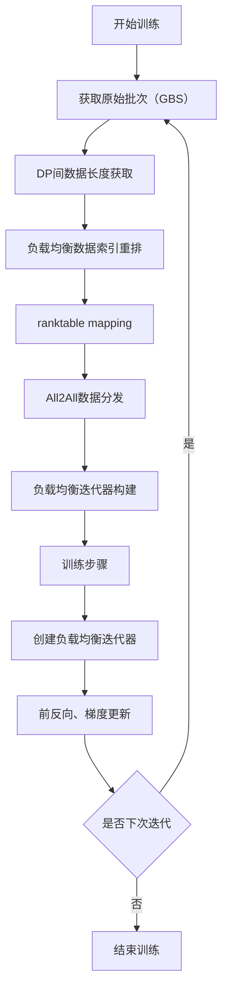

# Data balance

## 1. 背景

多模态模型由于原生分辨率等因素，在分布式训练中，数据负载不均，集群资源利用率下降。

Data Balance 模块旨在解决数据负载不均问题，通过在线数据重排布，实现DP间负载均衡，提升资源利用率。

## 2. 解决方案

注：当前支持ViT数据负载均衡，LLM部分未使用packing策略，后续将支持LLM部分packing，结合当前ViT部分在线负载均衡方案，提升整网资源利用率。

### 2.1 关键组件

| 组件 | 说明 |
|------|------|
| **DataBalance 类** | 协调数据平衡流程的主类 |
| **排序算法** | 如 `post_global_balancing_greedy_without_pad`（后续将支持更多排序算法） |
| **PrefetchMicroBatchIterator** | 异步预取数据，隐藏延迟 |
| **辅助函数** | 数据分割、映射、重组和通信等功能 |

### 2.2 执行流程



### 2.2.1 数据分发样例

紫色为初始状态，蓝色为目标状态。通过数据映射路径与All2All通信，实现数据的重排布。


## 3. 使用指南

### 3.1 启用配置

在Qwen 2.5 Omni模型训练命令中添加：
```bash
--use-data-balance
```

### 3.2 核心 API

#### 3.2.1 DataBalance 初始化
```python
from mindspeed_mm.utils.data_balance.data_balance import DataBalance

data_balancer = DataBalance(
    virtual_pipeline_model_parallel_size=args.virtual_pipeline_model_parallel_size,
    model_config_path=args.model_config_path,
    sorting_algo_name=args.sorting_algo_name,
    len_model=len_model,
    train_data_iterator=train_data_iterator
)
```

#### 3.2.2 创建负载均衡数据迭代器
```python
batch_generator = data_balancer.build_balanced_train_data_iterator(
    is_vit_last_stage=is_vit_last_stage,
    max_batch_capacity=max_batch_capacity,
    micro_batch_size=micro_batch_size,
    num_microbatches=num_microbatches,
    data_type='image'
)

# 在训练循环中使用
for batch in batch_generator:
    # 训练步骤
    ...
```

## 5. 最佳实践

- **算法选择**：默认使用 `post_global_balancing_greedy_without_pad`（后续将支持更多算法）
- **并行配置**：确保图像编码器 DP 度 > 1

## 6. 性能收益

- **训练速度**：计算负载均衡，缩短训练时间，典型场景收益5%+。