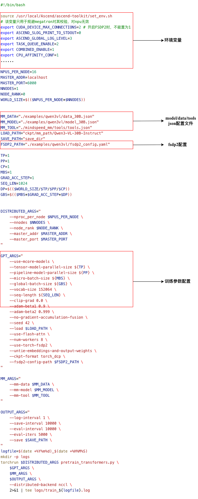

配置概览
===========================

MindSpeed-MM的配置参数主要有 ``模型配置 model.json``、 ``数据配置 data.json``、 ``fsdp2配置 fsdp2.yaml``、 ``训练参数 shell args`` 、 ``工具配置 tools.json`` 、 ``环境变量``

* `模型配置 <https://mindspeed-mm.readthedocs.io/zh-cn/latest/config/模型配置.html>`_ 
* `数据配置 <https://mindspeed-mm.readthedocs.io/zh-cn/latest/config/数据配置.html>`_ 
* `训练参数 <https://mindspeed-mm.readthedocs.io/zh-cn/latest/config/训练参数.html>`_ 
* `fsdp2配置 <https://mindspeed-mm.readthedocs.io/zh-cn/latest/config/fsdp2配置.html>`_ 
* `工具配置 <https://mindspeed-mm.readthedocs.io/zh-cn/latest/config/工具配置.html>`_ 
* `环境变量 <https://mindspeed-mm.readthedocs.io/zh-cn/latest/config/环境变量.html>`_ 

配置入口
----------

所有的配置入口在训练或推理脚本的bash文件，以 ``examples/qwen3vl/finetune_qwen3vl_30B.sh`` 为例：

..  # 这是一个注释，用于保持空行
.. raw:: html

   

配置解析
-----------
JSON 解析
^^^^^^^^^^^^^^
``model.json, data.json, tools.json`` 的配置解析入口在 ``mindspeed_mm/configs/config.py`` 。
主要的类和函数功能为：

* ``ConfigReader`` : 将字典转换为易于访问的对象属性，将json配置自动递归转换为ConfigReader对象，提供了 ``to_dict()`` 接口用于将对象转回为 ``dict`` 
* ``MMConfig`` : 统一加载和管理多个JSON配置文件
* ``merge_mm_args`` : 将model、data、tools的配置合并到Megatron的 ``global_args`` 

.. note::
    在代码中如何获取这些配置？可以使用Megatron的global args获取
    
    from megatron.training import get_args
    args = get_args()

    mm_model, mm_data = args.mm.model, args.mm.data

fsdp2 配置解析
^^^^^^^^^^^^

fsdp2 初始化的入口函数在 `torch_fully_sharded_data_parallel_init <https://gitcode.com/Ascend/MindSpeed/blob/master/mindspeed/core/distributed/torch_fully_sharded_data_parallel/torch_fully_sharded_data_parallel_adaptor.py#L209>`_ , 

.. code:: python

    def torch_fully_sharded_data_parallel_init(
        self,
        config: TransformerConfig,
        ddp_config: DistributedDataParallelConfig,
        module: torch.nn.Module,
        disable_bucketing: bool = False,
        sub_modules_to_wrap: Set[torch.nn.Module] = {
            TransformerLayer,
            LanguageModelEmbedding,
            RotaryEmbedding,
        },
        process_group: Optional[ProcessGroup] = None,
    ):
    ......
    # If the module has its own 'fully_shard' method, use it directly
    unwrapped_model = unwrap_model(self.module)
    if hasattr(unwrapped_model, 'fully_shard') and callable(getattr(unwrapped_model, 'fully_shard')):
        execute_result = unwrapped_model.fully_shard(
            process_group=self.process_group,
            fsdp2_config_path=ddp_config.fsdp2_config_path,
        )
        if execute_result:
            return 
    ......

.. note::
    当模型已自行实现 ``fully_shard`` 接口, 该函数直接将fsdp2的初始化动作交给模型自己处理
    强烈建议通过继承 ``FSDP2Mixin`` 来实现对fsdp2的配置初始化

``FSDP2Mixin`` (mindspeed_mm/models/transformers/base_model.py) 是MM仓上fsdp2配置解析和策略实现的Mixin类，主要逻辑在 ``fully_shared`` 接口，包含 ``_pre_fully_shared`` ``_fully_shared`` ``_post_fully_shared``;

* _pre_fully_shared: 读取fsdp2_config.yaml， 并解析为FSDPConfig，创建device_mash
* _fully_shared： 应用fsdp2相关的wrappers
* _post_fully_shared：包括init_weight, meta_init等

