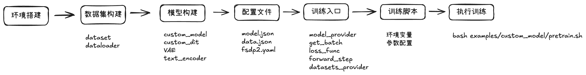
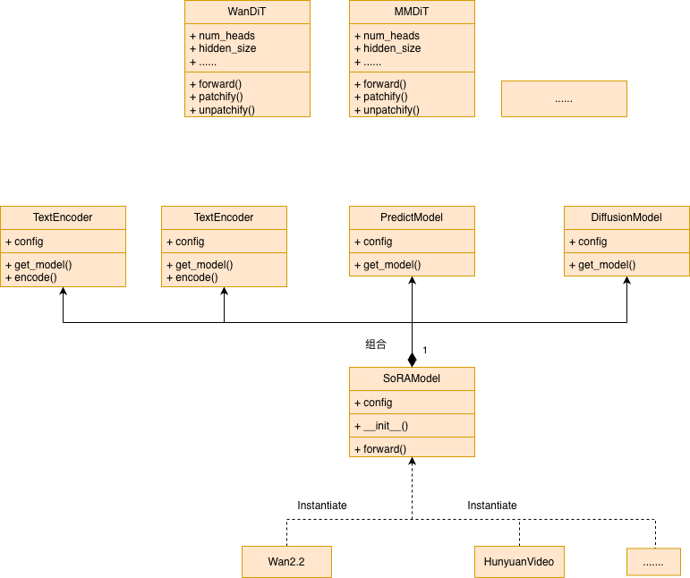

新模型开发
===========================

Last updated: 12/08/2025. Author: cxiaolong

本文档介绍了如何利用 MindSpeed-MM FSDP2后端开发一个基于DiT结构的视频生成模型训练demo。整体代码可以参考 `develop a new model in MM <https://gitcode.com/cxiaolong/MindSpeed-MM_demo/commit/9adc91fe4430a68a30fb310ab2402ff309f3a745>`_ 

开发流程
------------

该流程主要包含环境搭建、数据集构建、模型构建、配置文件、训练入口、训练脚本、启动训练。

Step1: 环境搭建
-------------------

1. 硬件准备

昇腾A3或A2加速卡，建议8卡或以上

2. 参考 `环境搭建 <https://mindspeed-mm.readthedocs.io/zh-cn/latest/quick_start/%E7%8E%AF%E5%A2%83%E6%90%AD%E5%BB%BA.html>`_ 章节，完成HDK、CANN、PyTorch和TorchNPU基础环境搭建；

3. 创建并激活Python虚拟环境；

.. code:: bash

    conda create -n [env_name] python=3.10
    conda activate [env_name]
    # 安装CANN latest下的te包，这会自动安装sympy,decorator等必装包
    pip install [CANN_HOME_PATH]/ascend-toolkit/latest/lib64/te-*-py3-none-any.whl

4. 按照下面的步骤安装MindSpeed-MM及其依赖包：

.. code:: bash

    git clone https://gitcode.com/Ascend/MindSpeed-MM.git
    git clone https://github.com/NVIDIA/Megatron-LM.git
    cd Megatron-LM
    git checkout core_v0.12.1
    cp -r megatron ../MindSpeed-MM/
    cd ..
    cd MindSpeed-MM
    mkdir logs data ckpt

    # 安装加速库
    git clone https://gitcode.com/Ascend/MindSpeed.git
    cd MindSpeed
    # checkout commit from MindSpeed core_r0.12.1
    git checkout 93c45456c7044bacddebc5072316c01006c938f9
    # 安装mindspeed及依赖
    pip install -e .
    cd ..

    # 安装mindspeed mm及依赖
    pip install -e .

Step2: 数据集构建
--------------------

准备demo数据
^^^^^^^^^^^^^^

请准备训练的demo数据，并组织成如下格式：

.. code:: text

    ├── data
        ├── data.json
        ├── videos
            ├── video000001.mp4
            ├── video000002.mp4
            ├── ...

videos/下存放视频文件，data.json中包含该数据集中所有的视频-文本对信息，具体示例如下：

.. code:: json

    [
        {
            "path": "./videos/video000001.mp4",
            "cap": "A scenic view of mountains during sunrise.",
            "num_frames": 81,
            "fps": 24,
            "resolution": {480, 832}
        },
        {
            "path": "./videos/video000002.mp4",
            "cap": "A bustling city street with people walking and cars passing by.",
            "num_frames": 81,
            "fps": 24,
            "resolution": {480, 832}
        },
        ...
    ]

Dataset 构建
^^^^^^^^^^^^^^^^^^^

可以使用MM仓上已有的T2V相关DataSet，也可以自行定义数据集，本教程使用自定义的CustomT2VDataset。

新建 ``data/datasets/custom_t2v_dataset.py``

.. code:: python

    import os
    import pandas as pd
    import torch
    from torch.utils.data import Dataset
    import torchvision
    from torchvision import transforms
    from transformers import AutoTokenizer

    from mindspeed_mm.data.data_utils.data_transform import ResizeVideo, ToTensorVideo, CenterCropResizeVideo
    from mindspeed_mm.data.data_utils.utils import TextProcesser

    class CustomT2VDataset(Dataset):
        def __init__(
            self,
            data_folder,
            json_path,
            tokenizer_config,
            num_frames=49,
            max_height=480,
            max_width=832,
            **kwargs
        ):
            super().__init__(**kwargs)

            self.data_samples = pd.read_json(json_path)
            self.data_folder = data_folder
            self.num_frames = num_frames

            # Initialize tokenizer and text processor
            tokenizer = AutoTokenizer.from_pretrained(**tokenizer_config)
            self.text_processer = TextProcesser(
                tokenizer=tokenizer,
                text_preprocess_methods=[{"method": "basic_clean"},{"method": "whitespace_clean"}],
            )

            # Initialize video transforms
            self.video_transforms = transforms.Compose([
                ResizeVideo(
                    transform_size={"max_height": max_height, "max_width": max_width},
                    interpolation_mode="bilinear",
                    antialias=True,
                    mode="shortside"
                ),
                ToTensorVideo(),
                transforms.Normalize(mean=0.5, std=0.5),
                CenterCropResizeVideo(transform_size={"max_height": max_height, "max_width": max_width}, antialias=True)
            ])

        def __getitem__(self, index):
            sample = self.data_samples.iloc[index]

            file_name = sample["path"]
            captions = sample["cap"]
            video_path = os.path.join(self.data_folder, file_name)

            prompt_ids, prompt_mask = self.text_processer(captions)

            video_tensor = torchvision.io.read_video(video_path, pts_unit="sec", output_format="TCHW")[0][:self.num_frames]
            video_tensor = self.video_transforms(video_tensor)
            video_tensor = video_tensor.permute(1, 0, 2, 3)  # TCHW -> CTHW

            return {
                "video": video_tensor,
                "prompt_ids": prompt_ids,
                "prompt_mask": prompt_mask
            }

        def __len__(self):
            return len(self.data_samples)

DataLoader 构建
^^^^^^^^^^^^^^^^^^^

MindSpeed-MM 提供了丰富的DataLoader组件，调用入口为 ``mindspeed_mm/data/build_mm_dataloader`` ，当前实现了三种类型可供选择：

* ``base`` ： 封装了原生的 ``torch.utils.data.DataLoader`` 
* ``sampler`` ： 通过构建自定义分布式训练Sampler封装的DataLoader
* ``variable`` ： 支持动态分辨率的DataLoader

本教程选择使用 ``sampler`` 类型的DataLoader

Step3: 模型构建
------------------

MindSpeed-MM 中提供了一个SoRAModel作为所有扩散视频生成模型的组合类，模型继承关系如下。SoRAModel是一个组合类，可以实例化成Wan、HunyuanVideo等具体的模型，由TextEncoder、PredictModel、DiffusionModel、AEModel多个部件组成。

本教程将新构建一个 ``CustomModel`` 用于表示自定义的视频生成模型的组合类，它由 ``PrediciModel(CustomDiT)``, ``TextEncoder(UMT5)``, ``AEModel(WanVideoVAE)``, ``DiffusionModel(WanFlowMatchScheduler)`` 四部分组成。

CustomModel构建
^^^^^^^^^^^^^^^^^^^^^

.. code:: python

    import torch
    from torch import nn

    from megatron.training import get_args
    from megatron.training.arguments import core_transformer_config_from_args
    from mindspeed_mm.models.ae import AEModel
    from mindspeed_mm.models.diffusion import DiffusionModel
    from mindspeed_mm.models.text_encoder import TextEncoder
    from mindspeed_mm.models.predictor import PredictModel
    from mindspeed_mm.models.transformers.base_model import FSDP2Mixin, WeightInitMixin

    class CustomModel(nn.Module, FSDP2Mixin, WeightInitMixin):
        def __init__(self, config):
            super().__init__()
            args = get_args()
            self.config = core_transformer_config_from_args(args)
            self.ae = AEModel(config.ae).eval()
            self.ae.requires_grad_(False)
            self.text_encoder = TextEncoder(config.text_encoder).eval()
            self.text_encoder.requires_grad_(False)
            self.diffusion = DiffusionModel(config.diffusion).get_model()
            self.predictor = PredictModel(config.predictor).get_model()

        def forward(self, video, prompt_ids, prompt_mask=None):
            # encode vision and text
            with torch.no_grad():
                latents, _ = self.ae.encode(video)
                prompt_embeds, prompt_mask = self.text_encoder.encode(prompt_ids, prompt_mask)

            # q sample to add noise
            noised_latents, noise, timesteps = self.diffusion.q_sample(latents)

            # Diffusion Transformer forward to predict
            output = self.predictor(noised_latents, timesteps, prompt_embeds)

            loss = self._compute_loss(
                output,
                latents,
                noised_latents,
                timesteps,
                noise
            )
            return loss

        def _compute_loss(self, model_output, latents, noised_latents, timesteps, noise):
            """compute diffusion loss"""
            loss_dict = self.diffusion.training_losses(
                model_output=model_output,
                x_start=latents,
                x_t=noised_latents,
                noise=noise,
                t=timesteps
            )
            return loss_dict

        def train(self, mode=True):
            self.predictor.train()

        def state_dict(self):
            """Customized state_dict for fsdp2"""
            return self.predictor.state_dict()

        def set_input_tensor(self, input_tensor):
            self.input_tensor = input_tensor
            self.predictor.set_input_tensor(input_tensor)

.. note:: 
    CustomModel需要继承 ``FSDP2Mixin`` ``WeightInitMixin`` 以提供FSDP2和权重初始化能力。

    * FSDP2Mixin: 提供了 ``fully_shared`` 的基础能力；
    * WeightInitMixin: 提供了权重初始化能力，当使用FSDP2 ``meta-device`` 初始化后，需要重初始化权重。

CustomDiT构建
^^^^^^^^^^^^^^^^^^^^^

参考WanVideo的模型结构，自行实现一个自定义的DiT结构如下：

新建 ``mindspeed_mm/models/predictor/dits/custom_dit.py``

.. code:: python

    from typing import Tuple, Dict, Union
    import math

    from einops import rearrange
    import torch
    from torch import nn
    from diffusers.models.attention import FeedForward
    from diffusers.models.transformers.transformer_wan import (
        WanRotaryPosEmbed,
        WanTimeTextImageEmbedding,
        WanAttention,
        WanAttnProcessor
    )
    from mindspeed_mm.models.common.module import MultiModalModule

    class CustomDiT(MultiModalModule):
        def __init__(
            self,
            num_layers: int = 40,
            num_heads: int = 40,
            head_dim: int = 128,
            patch_size: Tuple[int, ...] = (1, 2, 2),
            in_channels: int = 16,
            out_channels: int = 16,
            text_dim: int = 4096,
            freq_dim: int = 256,
            ffn_dim: int = 13824,
            rope_max_seq_len: int = 1024,
            **kwargs
        ) -> None:
            super().__init__(config=None)
            self.patch_size = patch_size
            self.hidden_size = num_heads * head_dim
            out_channels = out_channels or in_channels

            # 1. Patch & position embedding
            self.rope = WanRotaryPosEmbed(head_dim, patch_size, rope_max_seq_len)
            self.patch_embedding = nn.Conv3d(in_channels, self.hidden_size, kernel_size=patch_size, stride=patch_size)

            # 2. Condition embeddings
            self.condition_embedder = WanTimeTextImageEmbedding(
                dim=self.hidden_size,
                time_freq_dim=freq_dim,
                time_proj_dim=self.hidden_size * 6,
                text_embed_dim=text_dim,
            )

            # 3. DiT blocks
            self.blocks = nn.ModuleList(
                [
                    CustomDiTBlock(
                        hidden_size=self.hidden_size,
                        num_heads=num_heads,
                        head_dim=head_dim,
                        ffn_dim=ffn_dim,
                        
                    )
                    for _ in range(num_layers)
                ]
            )

            # 4. Output norm & projection
            self.norm_out = nn.LayerNorm(self.hidden_size, elementwise_affine=False)
            self.proj_out = nn.Linear(self.hidden_size, out_channels * math.prod(patch_size))
            self.scale_shift_table = nn.Parameter(torch.randn(1, 2, self.hidden_size) / self.hidden_size ** 0.5)

        def forward(
            self,
            hidden_states: torch.Tensor,
            timestep: torch.LongTensor,
            encoder_hidden_states: torch.Tensor,
        ) -> Union[torch.Tensor, Dict[str, torch.Tensor]]:
            # 1. Get conditioning embeddings
            temb, timestep_proj, encoder_hidden_states, _ = self.condition_embedder(
                timestep=timestep,
                encoder_hidden_states=encoder_hidden_states.squeeze(1)
            )
            timestep_proj = timestep_proj.unflatten(1, (6, -1))  # [batch_size, 6, inner_dim]

            rotary_emb = self.rope(hidden_states)

            # 2. Patch embedding
            hidden_states = self.patch_embedding(hidden_states.to(temb.dtype))
            batch_size, _, frames, height, width = hidden_states.shape

            # 3. Patchify
            hidden_states = self.patchify(hidden_states)

            # 4. Transformer blocks
            for block in self.blocks:
                hidden_states = block(
                    hidden_states=hidden_states,
                    encoder_hidden_states=encoder_hidden_states,
                    temb=timestep_proj,
                    rotary_emb=rotary_emb
                )

            # 5. Output norm, projection & unpatchify
            shift, scale = (self.scale_shift_table.to(temb.device) + temb.unsqueeze(1)).chunk(2, dim=1)
            hidden_states = (self.norm_out(hidden_states) * (1 + scale) + shift)
            hidden_states = self.proj_out(hidden_states)

            # Unpatchify
            return self.unpatchify(hidden_states, frames, height, width)

        def patchify(self, embs: torch.Tensor):
            # b c f h w -> b (f h w) c
            patch_out = rearrange(embs, "b c f h w -> b (f h w) c").contiguous()
            return patch_out

        def unpatchify(self, embs: torch.Tensor, frames: int, height: int, width: int):
            # b (f h w) (p0 p1 p2 c) -> b c (f*p0) (h*p1) (w*p2)
            return rearrange(
                embs,
                "b (f h w) (x y z c) -> b c (f x) (h y) (w z)",
                f=frames,
                h=height,
                w=width,
                x=self.patch_size[0],
                y=self.patch_size[1],
                z=self.patch_size[2],
            )

    class CustomDiTBlock(nn.Module):
        def __init__(
            self,
            hidden_size: int,
            num_heads: int,
            head_dim: int,
            ffn_dim: int
        ):
            super().__init__()
            # 1. Self-attention
            self.norm1 = nn.LayerNorm(hidden_size)
            self.attn1 = WanAttention(hidden_size, num_heads, head_dim, cross_attention_dim_head=None, processor=WanAttnProcessor())

            # 2. Cross-attention
            self.attn2 =  WanAttention(hidden_size, num_heads, head_dim, cross_attention_dim_head=hidden_size // num_heads, processor=WanAttnProcessor())

            # 3. Feed-forward
            self.ffn = FeedForward(hidden_size, inner_dim=ffn_dim, activation_fn="gelu-approximate")
            self.norm3 = nn.LayerNorm(hidden_size)

            self.scale_shift_table = nn.Parameter(torch.randn(1, 6, hidden_size) / hidden_size**0.5)

        def forward(
            self,
            hidden_states: torch.Tensor,
            encoder_hidden_states: torch.Tensor,
            temb: torch.Tensor,
            rotary_emb: torch.Tensor,
        ) -> torch.Tensor:
            # Split scale-shift table into components
            shift_msa, scale_msa, gate_msa, c_shift_msa, c_scale_msa, c_gate_msa = (
                self.scale_shift_table.to(temb.device) + temb
            ).chunk(6, dim=1)

            # 1. Self-attention
            
            norm_hidden_states = (self.norm1(hidden_states) * (1 + scale_msa) + shift_msa)
            attn_output = self.attn1(norm_hidden_states, rotary_emb=rotary_emb)
            hidden_states = (hidden_states + attn_output * gate_msa)

            # 2. Cross-attention
            attn_output = self.attn2(norm_hidden_states, encoder_hidden_states=encoder_hidden_states)
            hidden_states = hidden_states + attn_output

            # 3. Feed-forward
            norm_hidden_states = (self.norm3(hidden_states) * (1 + c_scale_msa) + c_shift_msa)
            ff_output = self.ffn(norm_hidden_states)
            hidden_states = (hidden_states + ff_output * c_gate_msa)

            return hidden_states

.. note::

    构建好CustomDiT后，需要将模型注册到PredictModel的 ``PREDICTOR_MODEL_MAPPINGS`` 中。

Step4: 配置文件
-----------------

配置文件主要包括模型配置(model.json)，数据配置(data.json)，FSDP2配置(fsdp2.yaml)，配置文件内容可以参考 `配置说明 <https://mindspeed-mm.readthedocs.io/zh-cn/latest/config/基础配置.html>`_ , 这里Diffusion、AE和text_encoder使用Wan2.2的模型。

新建 ``examples/custom_model/model.json`` ``examples/custom_model/data.json`` ``examples/custom_model/fsdp2.yaml``

model.json
^^^^^^^^^^^^^

.. code:: json

    {
        "diffusion": {
            "model_id": "wan_flow_match_scheduler",
            "num_train_timesteps": 1000,
            "shift": 5,
            "sigma_min": 0.0,
            "extra_one_step": true
        },
        "predictor": {
            "model_id": "custom_dit",
            "num_layers": 30,
            "num_heads": 12,
            "head_dim": 128,
            "patch_size": [1, 2, 2],
            "in_channels": 16,
            "out_channels": 16,
            "text_dim": 4096,
            "freq_dim":256,
            "ffn_dim": 8960,
            "rope_max_seq_len": 1024
        },
        "text_encoder": {
            "model_id": "UMT5",
            "hub_backend": "hf",
            "from_pretrained": "./ckpt/Wan-AI/Wan2.2-T2V-A14B-Diffusers/text_encoder/",
            "dtype": "bf16"
        },
        "ae": {
            "model_id": "wan_video_vae",
            "from_pretrained": "./ckpt/Wan-AI/Wan2.2-T2V-A14B-Diffusers/vae/",
            "dtype": "bf16",
            "enable_tiling": false,
            "tiling_param": {
                "tile_sample_min_height": 256,
                "tile_sample_min_width": 256,
                "tile_sample_stride_height": 192,
                "tile_sample_stride_width": 192
            },
            "norm_latents": true,
            "norm_mode": "channel_specified_shift_scale",
            "do_sample": false
        }
    }

data.json
^^^^^^^^^^^^^

.. code:: json

    {
        "dataset_param": {
            "data_folder": "./data/video_demo_dataset/",
            "json_path": "./data/video_demo_dataset/annotation.json",
            "num_frames": 49,
            "max_height": 480,
            "max_width": 832,
            "tokenizer_config": {
                "pretrained_model_name_or_path": "./ckpt/Wan-AI/Wan2.2-T2V-A14B-Diffusers/tokenizer/",
                "model_max_length": 512
            }
        },
        "dataloader_param": {
            "dataloader_mode": "sampler",
            "sampler_type": "SequentialSampler",
            "drop_last": true,
            "pin_memory": true,
            "group_frame": false,
            "group_resolution": false
        }
    }

fsdp2.yaml
^^^^^^^^^^^^^

.. code:: yaml

    sharding_size: 8
    sub_modules_to_wrap:
    - predictor.blocks.{*}
    - predictor.head
    reshard_after_forward: True
    param_dtype: "bf16"
    reduce_dtype: "fp32"
    ignored_modules:
    - ae
    - text_encoder
    cast_forward_inputs: True
    recompute_modules:
    - predictor.blocks.{*}
    offload_to_cpu: False

Step5: 训练入口
--------------------

新建 ``mindspeed_mm/pretrain_custom.py`` ， 训练入口采用Megatron范式，主要需要实现以下函数：

==================================   ===== 
func                                 描述
==================================   ===== 
model_provider                       模型构建函数，返回模型实例
get_batch                            获取batch输入数据，forward_step中使用
loss_func                            计算模型report损失用于打印，并把真实loss往下传递，用于Megatron后续处理
forward_step                         模型前向，返回tuple类型，值为（模型前向输出，loss_func）
train_valid_test_datasets_provider   构建数据加载器
==================================   ===== 

.. code:: python

    import torch

    import mindspeed.megatron_adaptor
    from megatron.core import mpu
    from megatron.core.enums import ModelType
    from megatron.training import get_args, print_rank_0
    from megatron.training.utils import average_losses_across_data_parallel_group
    from mindspeed_mm.configs.config import mm_extra_args_provider
    from mindspeed_mm.training import pretrain
    from mindspeed_mm.data import build_mm_dataloader
    from mindspeed_mm.data.datasets.custom_t2v_dataset import CustomT2VDataset
    from mindspeed_mm.data.data_utils.utils import build_iterations
    from mindspeed_mm.models.custom_model import CustomModel

    def model_provider(pre_process=True, post_process=True):
        """Builds custom model."""
        args = get_args()
        print_rank_0("building Custom model ...")
        model = CustomModel(args.mm.model)
        return model

    def get_batch(data_iterator):
        """Generate a batch."""
        if data_iterator is not None:
            batch = next(data_iterator, None)
            for k, v in batch.items():
                if isinstance(v, torch.Tensor):
                    batch[k] = v.to(torch.cuda.current_device())
            return batch
        else:
            return None

    def loss_func(output_tensor):
        """Loss function."""
        loss = output_tensor.mean()
        reporting_loss = average_losses_across_data_parallel_group([loss])
        loss = loss.unsqueeze(0)
        return loss, {"loss": reporting_loss[0]}

    def forward_step(data_iterator, model):
        """Forward step."""
        batch = get_batch(data_iterator)
        output_tensor = model(**batch)
        return output_tensor, loss_func

    def train_valid_test_datasets_provider(train_val_test_num_samples):
        """Build train, valid, and test datasets."""
        args = get_args()
        data_config = args.mm.data
        train_dataset = CustomT2VDataset(**data_config.dataset_param.to_dict())

        train_dataloader = build_mm_dataloader(
            train_dataset,
            data_config.dataloader_param,
            process_group=mpu.get_data_parallel_group(),
            consumed_samples=args.consumed_train_samples,
            dataset_param=data_config.dataset_param,
        )
        data_iterator, _, _ = build_iterations(train_dl=train_dataloader)
        return data_iterator, None, None

    if __name__ == "__main__":
        train_valid_test_datasets_provider.is_distributed = True
        pretrain(
            train_valid_test_datasets_provider,
            model_provider,
            ModelType.encoder_or_decoder,
            forward_step,
            extra_args_provider=mm_extra_args_provider,
            args_defaults={"dataloader_type": "external", "vision_pretraining": False, "curr_forward_iteration": 0},
        )

Step6: 训练脚本
-----------------

新建 ``examples/custom_model/pretrain.sh``

.. code:: bash

    #!/bin/bash
    source /usr/local/Ascend/cann/set_env.sh

    export CUDA_DEVICE_MAX_CONNECTIONS=2  # 开启FSDP2时，不能置为1

    NPUS_PER_NODE=8
    MASTER_ADDR=localhost
    MASTER_PORT=6007
    NNODES=1
    NODE_RANK=0
    WORLD_SIZE=$(($NPUS_PER_NODE*$NNODES))

    MBS=1
    GRAD_ACC_STEP=1
    DP=$(($WORLD_SIZE))
    GBS=$(($MBS*$GRAD_ACC_STEP*$DP))

    MM_DATA="./examples/custom_model/data.json"
    MM_MODEL="./examples/custom_model/model.json"
    MM_TOOL="./mindspeed_mm/tools/tools.json"
    fsdp2_config="./examples/custom_model/fsdp2_config.yaml"

    DISTRIBUTED_ARGS="
        --nproc_per_node $NPUS_PER_NODE \
        --nnodes $NNODES \
        --node_rank $NODE_RANK \
        --master_addr $MASTER_ADDR \
        --master_port $MASTER_PORT
    "

    GPT_ARGS="
        --micro-batch-size ${MBS} \
        --global-batch-size ${GBS} \
        --num-workers 8 \
        --lr 1e-5 \
        --min-lr 1e-5 \
        --adam-beta1 0.9 \
        --adam-beta2 0.999 \
        --adam-eps 1e-8 \
        --lr-decay-style constant \
        --weight-decay 1e-2 \
        --lr-warmup-init 0 \
        --lr-warmup-iters 0 \
        --clip-grad 1.0 \
        --train-iters 5000 \
        --no-gradient-accumulation-fusion \
        --use-torch-fsdp2 \
        --fsdp2-config-path ${fsdp2_config} \
        --untie-embeddings-and-output-weights \
    "

    MM_ARGS="
        --mm-data $MM_DATA \
        --mm-model $MM_MODEL \
        --mm-tool $MM_TOOL
    "

    OUTPUT_ARGS="
        --log-interval 1 \
        --save-interval 10000 \
        --eval-interval 10000 \
        --eval-iters 10 \
        --ckpt-format torch_dcp \
    "

    logfile=$(date +%Y%m%d)_$(date +%H%M%S)
    mkdir -p logs
    torchrun $DISTRIBUTED_ARGS pretrain_custom.py \
        $GPT_ARGS \
        $MM_ARGS \
        $OUTPUT_ARGS \
        --distributed-backend nccl \
        2>&1 | tee logs/train_${logfile}.log

Step7: 启动训练
------------------

执行下面脚本进行模型训练

.. code:: bash

    bash examples/custom_model/pretrain.sh
