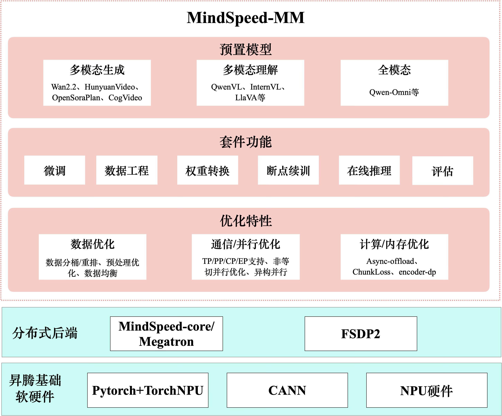

框架结构介绍
===========================

Last updated: 12/08/2025. Author: cxiaolong

整体架构
--------------------

MindSpeed MM 昇腾多模态训练解决方案整体架构如下图，整体分为三个层次：

* 第一层：昇腾基础软硬件。包括昇腾AI处理器、昇腾服务器等硬件，为海量多模态数据计算与模型训练提供强大的并行算力；CANN（Compute Architecture for Neural Networks），作为昇腾AI处理器的软件引擎，提供了高度优化的基础算子和通信库（HCCL）；PyTorch + TorchNPU 支持业界主流的PyTorch深度学习框架，并通过TorchNPU插件将PyTorch的运算无缝对接到昇腾硬件，使得开发者能够使用熟悉的编程范式与API，发挥昇腾的算力优势

* 第二层：分布式后端。包括分布式训练框架MindSpeed-Core/Megatron和FSDP2双后端支持，提供了高效的分布式训练能力，包括数据并行、模型并行、混合并行等多种并行策略，支持大规模模型的训练与优化。

* 第三层：MindSpeed-MM。提供了多模态数据处理、模型构建、分布式训练等全流程能力，充分发挥昇腾硬件的优势，支持大规模多模态模型的高效训练与部署。

模块介绍
--------------------

MindSpeed-MM 组件组成有预置模型、套件功能、多模态优化特性

* 主流开源多模态模型开箱即用：支持 20+， 如 Wan、HunyuanVideo等生成模型、QwenVL、InternVL等理解模型、Qwen-Omni等全模态模型。提供了多模态生成、理解、全模态的预训练/微调/评估/在线推理启动脚本，用户可以一键拉起训练任务

* 丰富的功能组件：分为高阶的抽象类（组装类）、原子模型类和公共组件，SoRAModel、VLModel、TransformersModel分别为多模态生成、理解、Transformers模型的高阶封装类，除此之外，还有text_decoder、audio、dit等基础的原子类；公共组件common包括了norm、rope、embeeding、spec等通用组件；提供覆盖模型生命周期的完整工具链，包括：数据预处理与工程、大规模预训练、指令微调与领域适配、模型权重转换、高性能在线推理以及全面的自动化评估。

* 多模态加速特性：包括多维高效并行算法（DP/PP/TP/CP/EP/FSDP2）、通算掩盖、多模态负载均衡、动态显存管理（重计算、分级存储） 、长序列优化等，确保训练效率最大化。

双后端支持
------------------------

MindSpeed-MM 的分布式后端由 MindSpeed-Core/Megatron 和 FSDP2 两个主要组件组成，提供高效的分布式训练能力。

MindSpeed-MM 框架在构建之初，即以打造一个具备极致训练与推理性能的多模态模型套件为核心目标，因此在早期阶段便集成并深度优化了 Megatron 提供的 PTD（Pipeline, Tensor, Data）混合并行能力，以充分发挥其在超大规模模型训练中的高效扩展性与系统稳定性。

随着近年来计算硬件的快速迭代与高速互联网络技术的普及，训练任务的通信瓶颈逐步缓解，同时多模态模型结构日趋多样化和复杂化，对训练框架的灵活性与适配效率提出了更高要求。在这一背景下，FSDP2 作为新一代分布式训练策略，因其具备并行策略与模型结构高度解耦、实现简洁且易于扩展等优势，逐渐成为快速适配各类新兴架构的理想选择。为更好地支持不断涌现的多模态模型并降低用户的使用与迁移成本，MindSpeed-MM 在已有 Megatron 后端的基础上，进一步增强了对 FSDP2 的兼容与优化。目前，采用 FSDP2 作为并行后端已成功应用于包括 Wan2.2、Qwen3VL 在内的多个开源多模态模型训练任务中，有效兼顾了训练效率与代码可维护性。

使用方式上，当前FSDP2后端的训练流程仍然嵌入在Megatron training里，因此训练脚本文件需要编写 GPT_ARGS、 MM_ARGS、OUTPUT_ARGS 等参数以通过Megatron的参数校验。当使用 FSDP2 训练时，需要传入--use-torch-fsdp2来标识使用FSDP2训练，FSDP2配置具体可参考FSDP2使用文档。

目录结构
------------------------

.. code-block:: bash

    MindSpeed-MM
    ├── checkpoint                                     权重转换模块
    │   ├── __init__.py
    │   ├── common                                     权重公共模块
    │   │   ├── ......
    │   ├── convert_cli.py                             权重转换命令行入口
    │   ├── sora_model                                 SoRA类模型权重转换模块
    │   │   ├── ......
    │   └── vlm_model                                  VLM类模型权重转换模块
    │       ├── ......
    ├── ci                                             持续集成模块
    │   ├── .......
    ├── docs                                           文档模块    
    │   ├── FAQ.md
    │   ├── features
    │   │   ├── ......
    │   ├── mindspore
    │   │   ├── ......
    │   ├── public_address_statement.md
    │   ├── SECURITYNOTE.md
    │   └── user-guide
    │       ├── ......
    ├── evaluate_gen.py                                生成模型评估入口
    ├── evaluate_vlm.py                                VLM模型评估入口
    ├── examples                                       预置模型，包括模型配置、数据集配置、训练脚本、推理脚本等文件
    │   ├── cogvideox
    │   ├── dancegrpo
    │   ├── deepseekocr
    │   ├── diffsynth                                  DiffSynth相关模型支持
    │   ├── diffusers                                  Diffusers相关模型支持
    │   ├── glm4.5v
    │   ├── hunyuanvideo
    │   ├── internvl3.5
    │   ├── mindspore                                  MindSpore相关模型支持
    │   ├── opensora2.0
    │   ├── opensoraplan1.5
    │   ├── qwen3omni
    │   ├── qwen3vl
    │   ├── rl                                         多模态强化学习相关模型支持
    │   ├── wan2.2
    │   └── whisper
    ├── inference_sora.py                              SoRA类模型推理脚本
    ├── inference_vlm.py                               VLM类模型推理脚本
    ├── LICENSE                                        许可证
    ├── mindspeed_mm                                   MindSpeed-MM核心模块
    │   ├── arguments.py                               bash脚本参数解析模块
    │   ├── configs                                    配置模块
    │   │   ├── config.py                              model.json/data.json/tools.json配置读取和解析模块
    │   │   └── validate_params.json
    │   ├── data                                       数据处理模块
    │   │   ├── __init__.py
    │   │   ├── data_utils                             数据读取、预处理、分桶策略等工具模块
    │   │   ├── dataloader                             数据collactor、dataloader、sampler等模块
    │   │   └── datasets                               多模态数据集模块
    │   ├── mindspore                                  MindSpore适配模块
    │   ├── models                                     模型代码
    │   │   ├── __init__.py
    │   │   ├── ae                                     VAE模型
    │   │   ├── audio                                  音频处理相关模型
    │   │   ├── common                                 公共组件，包括norm、rope、embeeding、spec等通用组件
    │   │   ├── diffusion                              扩散模型相关组件
    │   │   ├── omni_model.py                          全模态模型工厂类
    │   │   ├── predictor                              DiT相关模型
    │   │   ├── sora_model.py                          SoRA多模态生成模型工厂类
    │   │   ├── text_decoder                           文本解码器相关模型
    │   │   ├── text_encoder                           文本编码器相关模型
    │   │   ├── transformers                           Transformers相关模型
    │   │   ├── transformers_model.py                  Transformers模型工厂类
    │   │   ├── vlm_model.py
    │   │   ├── ......
    │   ├── patchs                                     各类patchs模块
    │   │   ├── __init__.py
    │   │   ├── adaptive_clip_grad_patch.py            自适应梯度裁剪patch
    │   │   ├── canonical_layer_patch.py
    │   │   ├── dummy_optimizer_patch.py
    │   │   ├── fsdp1_patches.py
    │   │   ├── fsdp2_patches.py
    │   │   ├── hetero_patches.py
    │   │   ├── hetero_pipeline_patches.py
    │   │   ├── infer_fa_patch.py
    │   │   ├── models_patches.py
    │   │   ├── patch_manager.py
    │   │   ├── ring_attn_patch.py
    │   │   ├── torch_dcp_patch.py
    │   │   ├── training_patches.py
    │   │   ├── ulysses_patches.py
    │   │   └── validate_args_patch.py
    │   ├── tasks                                       各类任务模块
    │   │   ├── __init__.py
    │   │   ├── evaluation
    │   │   ├── finetune
    │   │   ├── inference
    │   │   └── rl
    │   ├── tools                                       工具模块，包括pofiler、内存分析、特征提取等工具
    │   │   ├── feature_extraction
    │   │   ├── mem_analysis.py
    │   │   ├── mem_profiler.py
    │   │   ├── profiler.py
    │   │   ├── README.md
    │   │   └── tools.json
    │   ├── training.py                                 训练统一入口模块
    │   └── utils                                       通用工具模块
    │       ├── async_offload.py
    │       ├── auto_setting.py
    │       ├── data_balance
    │       ├── dpcp_utils.py
    │       ├── ema.py
    │       ├── extra_processor
    │       ├── hetero_parallel.py
    │       ├── mask_utils.py
    │       ├── random.py
    │       ├── security_utils
    │       ├── transformer_model_config.py
    │       └── utils.py
    ├── pretrain_omni.py                                全模态模型训练入口
    ├── pretrain_sora.py                                SoRA类模型训练入口
    ├── pretrain_transformers.py                        Transformers类模型训练入口
    ├── pretrain_vlm.py                                 VLM类模型训练入口
    ├── pretrain_xxx.py                                 各类模型训练入口
    ├── pyproject.toml                                  项目配置和构建文件
    ├── README.md                                       首页文档
    ├── source                                          资源文件夹，包括图片、视频等
    ├── tests                                           测试模块
    │   ├── conftest.py
    │   ├── st                                          系统测试（模型级别测试）
    │   └── ut                                          单元测试（模块/API级别测试）
    ├── Third-Party Open Source Software Notice.txt     第三方开源软件声明
    └── verl_plugin                                     Verl插件模块

训练流程
------------------------

MindSpeed-MM 执行训练的大致流程如图所示，分为训练的bash脚本、训练入口、MindSpeed-MM接口、MindSpeed-core接口、Megatron接口。

* 训练bash脚本：代码位置examples/xxx_model/pretrain_xxx.sh，用户执行脚本需要按照README配DISTRIBUTED_ARGS、model.json和data.json
* 训练入口：mindspeed_mm/pretrain_xxx.py，例如pretrain_vlm.py、pretrain_sora.py、pretrain_transformers.py等分别是多模态理解模型、生成模型、transformers模型的训练入口，在训练入口中主要实现了model_provider、data_provider、forward_step方法来提供模型初始化、数据、模型前向等能力
* MM训练统一入口：mindspeed_mm/training.py。主要提供了pretrain、train、train_step最通用基础的方法
* Megatron接口：主要依赖MindSpeed-Core的Megatron-adapter、patch能力，Megatron的通信组构建、优化器、PTD并行、日志，权重加载保存能力

.. .. image:: ../_static/dev_guide/mm_introduction/train_flow.png
..     :width: 800px
..     :align: center

.. raw:: html
   :file: ../_static/dev_guide/mm_introduction/train_flow.html
