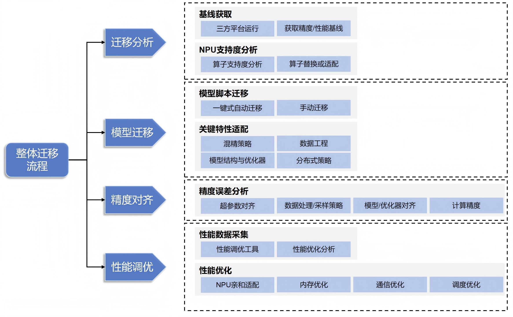
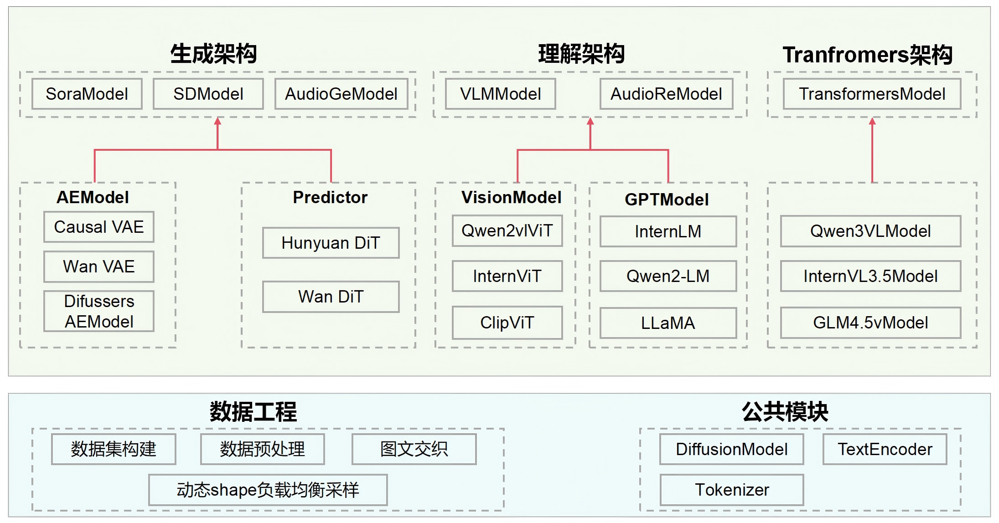
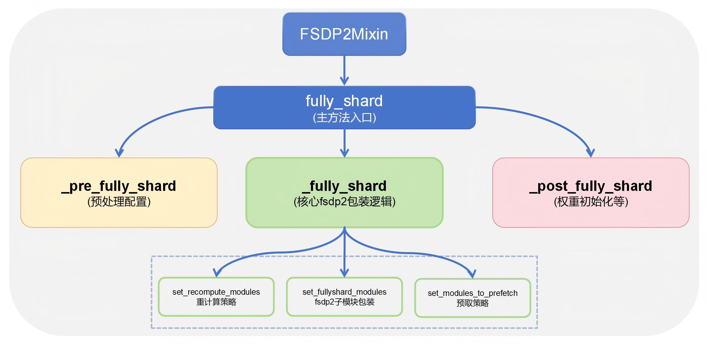

模型迁移
===========================

Last updated: 12/08/2025. Author: zs-derrick

背景介绍
------------

本文档介绍了如何将一个多模态模型从其它硬件设备和软件框架迁移至NPU硬件、MindSpeed-MM框架的FSDP2后端。

整体迁移流程
-------------

在将模型从其他硬件设备和软件框架迁移至MindSpeed MM时，需要完成一系列从底层硬件到上层框架的适配工作。 以GPU为例，**这些适配工作主要源于三大核心差异：**

* **硬件特性和性能特点差异**：由于NPU和GPU的硬件特性和性能特点不同， 模型在NPU上可能需要进一步的性能调试和优化，以充分发挥NPU的潜力。
* **计算架构差异**：NVIDIA GPU采用CUDA（Compute Unified Device Architecture）的并行计算架构， 而华为NPU采用CANN（Compute Architecture for Neural Networks）的异构计算架构。
* **深度学习框架差异**：不同框架中，自动微分机制、混合精度实现、梯度累加策略、优化器更新方式，分布式策略等训练细节上存在微妙的实现差异，这些差异直接影响模型的收敛行为，需要进行精细化的验证与适配。

下图是模型迁移的总体流程图介绍：

为系统性地完成上述适配工作，我们将模型迁移过程分解为四个关键流程：

1. **迁移准备** ：基于业务需求选取合适模型，确保其在第三方平台（如GPU）可成功运行并建立性能/精度基线；准备NPU环境，使用 `迁移分析工具 <https://www.hiascend.com/document/detail/zh/Pytorch/720/ptmoddevg/trainingmigrguide/PT_LMTMOG_0007.html#ZH-CN_TOPIC_0000002503407585__section56695751919>`__ 采集模型算子清单，分析NPU算子支持度，针对未支持算子制定替换或开发适配方案。
2. **模型迁移** ​：通过 `模型脚本迁移 <https://www.hiascend.com/document/detail/zh/Pytorch/720/ptmoddevg/trainingmigrguide/PT_LMTMOG_0012.html>`__ ，针对模型结构、数据工程、分布式训练策略等关键模块进行迁移分析。
3. **精度对齐** ​：系统性分析精度误差来源，从超参数、数据处理、模型/优化器、计算精度等维度确保迁移前后精度一致性
4. **性能调优** ​：借助 `性能调优工具 <https://www.hiascend.com/document/detail/zh/CANNCommunityEdition/850alpha001/devaids/Profiling/atlasprofiling_16_0001.html>`__ 对模型进行系统性性能分析，定位瓶颈模块；基于 `性能调优方法 <https://www.hiascend.com/document/detail/zh/Pytorch/720/ptmoddevg/trainingmigrguide/performance_tuning_0024.html>`__ 从NPU亲和适配、内存优化、通信优化、调度优化等多个维度实施针对性优化。

MM架构迁移指南
-----------------

MindSpeed-MM采用模块化架构设计，以训练入口脚本为核心，通过配置驱动实现多模态模型的统一训练，其核心特点是 **训练逻辑与模型实现解耦** ​——主训练流程在 ``pretrain_xxx.py`` 中固定，而模型结构、数据处理和损失计算等关键组件通过回调函数注入，使得框架具备高度可扩展性。

🎯 快速开始
:::::::::::::

MindSpeed-MM训练逻辑整体沿用Megatron风格，各类模型统一使用 ``pretrain_xxx.py`` 文件启动，通过 ``examples`` 目录下的配置文件对训练过程进行调控，在进行迁移时需关注以下几个核心模块：

1. **选择入口脚本** ：根目录下的 ``pretrain_xxx.py`` (如 ``pretrain_vlm.py`` )
2. **配置训练参数** ​：修改 ``examples/模型名/`` 下的配置文件
3. **实现回调函数** ​：在入口脚本中实现核心函数

📁结构概览
:::::::::::::

.. raw:: html

    <!DOCTYPE html>
    <html lang="zh-CN">
    <head>
        <meta charset="UTF-8">
        <meta name="viewport" content="width=device-width, initial-scale=1.0">
        
    </head>
    <body>
        <table>
            <thead>
                <tr>
                    <th>模块类型</th>
                    <th>子模块/文件</th>
                    <th>路径</th>
                    <th>功能描述</th>
                </tr>
            </thead>

            <tbody>
                <!-- 训练入口文件 -->
                <tr>
                    <td rowspan="1"><strong>训练入口文件</strong></td>
                    <td>主训练脚本</td>
                    <td><code>pretrain_xxx.py</code> (根目录)</td>
                    <td>如 pretrain_sora.py, pretrain_vlm.py 等</td>
                </tr>

                <!-- 示例配置目录 -->
                <tr>
                    <td rowspan="4"><strong>示例配置目录</strong></td>
                    <td>模型配置目录</td>
                    <td><code>examples/</code>(根目录)</td>
                    <td>特定模型的训练配置目录，如 examples/qwen3vl/</td>
                </tr>
                <tr>
                    <td>数据配置文件</td>
                    <td><code>examples/model_name/data.json</code></td>
                    <td>定义数据集路径、预处理方式、数据增强策略等</td>
                </tr>
                <tr>
                    <td>模型配置文件</td>
                    <td><code>examples/model_name/model.json</code></td>
                    <td>定义模型架构、参数等</td>
                </tr>
                <tr>
                    <td>启动脚本</td>
                    <td><code>examples/model_name/pretrain.sh</code></td>
                    <td>训练启动脚本，包含执行命令和参数设置</td>
                </tr>

                <!-- 核心源码目录 -->
                <tr>
                    <td rowspan="5"><strong>核心源码目录</strong></td>
                    <td>数据处理模块</td>
                    <td><code>mindspeed_mm/data/</code></td>
                    <td>数据加载、预处理、增强、采样等功能实现</td>
                </tr>
                <tr>
                    <td>模型结构模块</td>
                    <td><code>mindspeed_mm/model/</code></td>
                    <td>各种模型组件的实现，包括编码器、解码器、视觉模块等</td>
                </tr>
                <!-- 注意：此处示例中“核心源码目录”只列出了2个子模块，但rowspan为5。 -->
                <!-- 如需完整，应在此处补充另外3个空的或实际内容的 <tr> -->
            </tbody>
        </table>

        
    </body>
    </html>

🚀核心接口适配
::::::::::::::::::

``pretrain_xxx.py`` 中提供了模型训练过程中涉及的主要（回调）函数，用户需要根据具体任务需求，在这些函数中实现相应的业务逻辑。这些函数将在训练过程中被自动调用：

==================================   ===== 
func                                 描述
==================================   ===== 
model_provider                       构建模型
get_batch                            构建模型的前向输入数据
loss_func                            计算模型前向损失
forward_step                         模型前向，并计算损失
train_valid_test_datasets_provider   构建数据加载器
==================================   ===== 

🔄核心接口调用流程
::::::::::::::::::

.. mermaid::
    :align: left

    sequenceDiagram
        participant M as pretrain_xxx
        participant E as Training
        participant D as Data
        participant MP as ModelProvider
        participant LC as LossCalculator
        participant Model

        M->>E: 初始化训练
        activate E

        E->>MP: 调用model_provider构建模型
        activate MP
        MP->>Model: 创建模型实例
        MP-->>E: 返回模型
        deactivate MP

        E->>D: 调用train_valid_test_datasets_provider
        activate D
        D-->>E: 返回DataLoader
        deactivate D

        loop 每个训练步骤
            E->>D: 调用get_batch获取数据
            activate D
            D-->>E: 返回batch数据
            deactivate D

            E->>Model: 调用forward_step前向计算
            activate Model
            Model->>LC: 调用loss_func计算损失
            activate LC
            LC-->>E: 返回损失值
            deactivate LC
            deactivate Model

            E->>E: 反向传播与参数更新
            Note over E: 梯度计算、优化器步进 学习率调整
        end

        E-->>M: 训练完成

模型迁移
----------

整体迁移的要点围绕2.3的核心接口展开。

⚙️环境搭建
:::::::::::::

【模型开发时推荐使用配套的环境版本】

请参考 `环境搭建 <https://mindspeed-mm.readthedocs.io/zh-cn/latest/quick_start/%E7%8E%AF%E5%A2%83%E6%90%AD%E5%BB%BA.html>`_ 章节，完成HDK、CANN、PyTorch和TorchNPU基础环境搭建；

> Python版本推荐3.10，torch和torch_npu版本推荐2.7.1版本

.. code:: bash

    git clone https://github.com/NVIDIA/Megatron-LM.git
    cd Megatron-LM
    git checkout core_v0.12.1
    cp -r megatron ../MindSpeed-MM/
    cd ..
    cd MindSpeed-MM
    mkdir logs data ckpt

    # 安装加速库
    git clone https://gitcode.com/Ascend/MindSpeed.git
    cd MindSpeed
    # checkout commit from MindSpeed core_r0.12.1
    git checkout xxxxxxx

    # 安装mindspeed及依赖
    pip install -e .
    cd ..
    # 安装mindspeed mm及依赖
    pip install -e .

📊数据模块迁移
:::::::::::::::::

迁移基本原则
^^^^^^^^^^^^^^^^^

MindSpeed-MM 框架对数据模块提供了高度兼容性，用户现有的 `DataSet` 和 `DataLoader` 实现可以无缝迁移。
**快速迁移步骤：**

1. **保持现有实现** ​：用户自定义的 ``DataSet``、 ``DataLoader`` 等数据模块无需修改
2. **注册数据提供函数** ​：通过入口脚本的  ``train_valid_test_datasets_provider`` 函数返回 ``DataLoader`` 数据对象
3. **获取训练批次** ​：在 ``get_batch`` 函数中处理当前训练批次数据

**迁移示例：**

.. code:: python

    def train_valid_test_datasets_provider():
        """Build train, valid, and test datasets."""
        # 返回您现有的数据集实例
        train_dataloader= build_dataloader(CustomDataset(...))
        valid_dataloader= build_dataloader(CustomDataset(...))
        test_dataloader= build_dataloader(CustomDataset(...))
        
        return train_dataloader, valid_dataloader, test_dataloader

    def get_batch(data_iterator, args):
        """Generate a batch."""
        if data_iterator is not None:
            batch = next(data_iterator)
        else:
            raise ValueError("Data iterator is None. Unable to retrieve batch.")
        move_to_device(batch, get_args().params_dtype)

        return batch

原生数据组件使用
^^^^^^^^^^^^^^^^^

MindSpeed-MM 同时提供了一套优化的多模态数据集处理模块，包括 ``build_mm_dataset``、 ``build_mm_dataloader`` 等，用户可通过 ``data.json`` 配置文件灵活定义数据源、预处理流程及加载策略。

🧩模型结构迁移
:::::::::::::::

在 MindSpeed-MM 框架中，所有训练模型都通过标准化的入口函数进行构建和执行: ``model_provider`` 构造模型， ``forward_step`` 执行前向结果， ``loss_func`` 计算训练损失。

.. code:: python

    def model_provider(*args, **kwargs):
        model = CustomModel(config)
        return model

    def loss_func(output_tensor):
    # 基于模型输出计算损失
    loss = compute_loss(output_tensor)
    return loss

    def forward_step(data_iterator, model):
        """Forward step."""
        batch_data = get_batch(data_iterator)
        output_tensor = model(**batch_data)
        return output_tensor, loss_func

⚖️权重转换
:::::::::::

MindSpeed-MM仓中采用FSDP2训练的模型，加载和保存模型格式均是DCP格式，因此在训练之前首先需要对模型权重文件进行转换。

📜启动命令配置
::::::::::::::

MindSpeed-MM 训练的启动方式与 Megatron 保持一致。以下是训练启动脚本示例，包含分布式参数、模型参数、多模态参数和输出配置。

配置详情
^^^^^^^^^^^^^^^^^

**1. 分布式参数**

.. code:: bash

    DISTRIBUTED_ARGS="
        --nproc_per_node $NPUS_PER_NODE     # 每个节点的GPU数量
        --nnodes $NNODES                    # 节点总数
        --node_rank $NODE_RANK              # 当前节点排名
        --master_addr $MASTER_ADDR          # 主节点地址
        --master_port $MASTER_PORT          # 主节点端口
    "

**2. 模型训练参数**

.. code:: bash

    GPT_ARGS="
        --tensor-model-parallel-size 1             # 张量并行大小
        --pipeline-model-parallel-size 1           # 流水线并行大小
        --context-parallel-size 1                  # 序列并行大小
        --context-parallel-algo ulysses_cp_algo    # 序列并行算法

        --micro-batch-size ${MBS}                  # 微批次大小
        --global-batch-size ${GBS}                 # 全局批次大小
        --seq-length ${SEQ_LEN}                    # 序列长度

        --vocab-size 1024                          # 词表大小
        --normalization RMSNorm                    # 归一化方式

        --lr 1.0e-5                                # 学习率
        --optimizer-selection fused_torch_adamw    # 优化器选择

        --train-iters 10000                        # 训练迭代次数

        --load $LOAD_PATH                          # 加载检查点路径
        --ckpt-format torch_dcp                    # 检查点格式
    "

**3. 多模态参数**

.. code:: bash

    MM_ARGS="
        --mm-data $MM_DATA     # 数据配置路径
        --mm-model $MM_MODEL   # 模型配置路径
    "

**4. 输出配置**

.. code:: bash

    OUTPUT_ARGS="
        --log-interval 1        # 日志记录间隔
        --save-interval 10000   # 模型保存间隔
        --eval-interval 10000   # 评估间隔
        --eval-iters 5000       # 评估的迭代次数
        --save $SAVE_PATH       # 模型保存路径
    "

启动命令
^^^^^^^^^^^^^^^^^

.. code:: bash

    # 创建日志目录
    logfile=$(date +%Y%m%d)_$(date +%H%M%S)
    mkdir -p logs

    # 执行训练命令
    torchrun $DISTRIBUTED_ARGS pretrain_xxx.py \
        $GPT_ARGS \
        $MM_ARGS \
        $OUTPUT_ARGS \
        --distributed-backend nccl \
        >> logs/train_${logfile}.log 2>&1  # 可选：重定向日志

FSDP2 训练
---------------

**为实现模型的快速迁移**，MindSpeed-MM 深度集成了 **PyTorch FSDP2** ，提供统一的分布式训练解决方案：用户自定义模型只需简单继承即可获得分布式能力，第三方模型通过标准化适配流程无缝接入，同时支持灵活的配置文件驱动和高级自定义切分策略，满足从快速上手到深度定制的全场景需求。

📋必备条件
:::::::::::::

用户自定义模型
^^^^^^^^^^^^^^^^^

对于用户自行开发的模型，使用 FSDP2 进行分布式训练只需简单继承指定的 Mixin 类， **模型本体的实现无需任何修改** ：

.. code:: python

    from mindspeed_mm.models.common.module import MultiModalModule
    from mindspeed_mm.models.transformers.base_model import FSDP2Mixin, WeightInitMixin

    class CustomModel(MultiModalModule, FSDP2Mixin, WeightInitMixin):
        """自定义模型类"""
        ...

三方库模型适配
^^^^^^^^^^^^^^^^^

对于从第三方库（如 Transformers）导入的模型，MindSpeed-MM 提供了统一的适配方案：

1. **创建适配类** ​：将第三方模型继承 ``FSDP2 Mixin`` 类
2. **注册到模型库** ​：将适配后的类添加到 ``ModelHub``
3. **通过标准接口使用** ：使用 ``TransformersModel`` 加载适配后的模型

下面以Internvl-3.5为例

**步骤1：创建适配类**

.. code:: python

    # mindspeed_mm/models/hf_src/internvl3_5.py
    from internvl.modeling_internvl_chat import InternVLChatModel
    from mindspeed_mm.models.transformers.base_model import FSDP2Mixin, WeightInitMixin

    class InternVLChatModelGeneration(InternVLChatModel, FSDP2Mixin, WeightInitMixin):
        """InternVL 模型的 FSDP2 适配版本"""
        def __init__(self, config, vision_model=None, language_model=None, use_flash_attn=True):
            super().__init__(config)

**步骤 2：注册到模型库**

.. code:: python

    # mindspeed_mm/models/common/modelzoo.py

    from mindspeed_mm.models.transformers.internvl3_5 import InternVLChatModelGeneration

    class ModelHub:
        MODEL_MAPPINGS = {
            'internvl': InternVLChatModelGeneration,
        }

**步骤 3：通过标准接口使用**

.. code:: python

    # pretrain_transformers.py
    from mindspeed_mm.models.transformers_model import TransformersModel

    def model_provider(*args, **kwargs):
        """Builds the model."""
        args = get_args()
        vlm_config = deepcopy(args.mm.model)
        model = TransformersModel(vlm_config)

        return model

启动命令配置
^^^^^^^^^^^^^^^^^

启动 FSDP2 训练时， **需要在标准Megatron训练命令的基础上** 添加以下参数

.. code:: bash

    export CUDA_DEVICE_MAX_CONNECTIONS=2

    --use-torch-fsdp2 \
    --fsdp2-config-path ./fsdp2_config.yaml \
    --ckpt-format torch_dcp \
    --untie-embeddings-and-output-weights \

关键参数说明：

- ``--use-torch-fsdp2``：启用FSDP2训练模式
- ``--fsdp2-config-path``：指定FSDP2配置文件路径

📄FSDP2配置文件驱动训练
:::::::::::::::::::::::

MindSpeed-MM 支持通过 YAML 配置文件灵活管理 FSDP2 训练策略，实现训练配置与模型代码的完全解耦。配置参数说明见：:ref:`FSDP2参数介绍<fsdp2-config>`

配置示例如下， ``fsdp2_config.yaml``

.. code:: yaml

    sharding_size: auto	
    sub_modules_to_wrap:	
    - "text_decoder.output_layer"	
    - "text_decoder.embedding"	
    - "text_decoder.rotary_pos_emb"	
    - "text_decoder.decoder.layers.{*}"	
    param_dtype: "bf16"	
    reduce_dtype: "fp32"	
    cast_forward_inputs: True	
    ignored_modules:	
    - "image_encoder"	
    recompute_modules:	
    - "text_decoder.decoder.layers.{*}"	
    num_to_forward_prefetch: 2	
    num_to_backward_prefetch: 2
    offload_to_cpu: False

🔧自定义切分策略
::::::::::::::::::::

针对模型结构复杂或特殊场景的定制化需求，我们提供了灵活的自定义切分方案。用户可以通过调用`FSDP2Mixin`提供的`fully_shard`接口，实现完全按需设计的切分和优化策略，获得对模型分布式训练的精细化控制能力，从而有效应对各类复杂架构与高性能训练场景。下图显示了FSDP2Mixin类的核心组成，用户可以根据各自需求对其方法进行重写：

**自定义fully_shard实现示例**

.. code:: python

    from mindspeed_mm.models.common.module import MultiModalModule
    from mindspeed_mm.models.transformers.base_model import FSDP2Mixin, WeightInitMixin

    class YourModel(MultiModalModule, FSDP2Mixin, WeightInitMixin):
        def fully_shard(self):
            """
            自定义fully_shard实现
            """
            # 自定义重计算模块（可选）
            set_recompute_modules_to_wrap()

            # 自定义fully_shard包装模块
            set_fullyshard_modules_to_wrap()

            # 自定义预取策略（可选）
            num_to_forward_prefetch = getattr(self.fsdp2_config, "num_to_forward_prefetch", 0)
            num_to_backward_prefetch = getattr(self.fsdp2_config, "num_to_backward_prefetch", 0)
            set_modules_to_prefetch(num_to_forward_prefetch, num_to_backward_prefetch)

如需更深入的定制，请参考 ``FSDP2Mixin`` 类的完整实现，了解各个方法的详细用法和扩展点。

精度对齐
-------------

概述
:::::::::::::

精度对齐是模型迁移的核心验证环节，旨在确保从GPU平台、其他框架的模型迁移至MindSpeed-MM后在 **功能正确性、数值精度和训练收敛性** 三个维度上与原始模型保持一致。

对齐流程
:::::::::::::

必查项清单
^^^^^^^^^^^^^^^^^

.. raw:: html

    

    <table>
    <thead>
        <tr>
        <th>项目</th>
        <th>说明</th>
        <th>检查方法</th>
        </tr>
    </thead>
    <tbody>
        <tr>
        <td><strong>版本对齐</strong></td>
        <td>确保第三方库版本一致</td>
        <td>
            执行 <code>pip list</code> 检查 transformers、diffusers 等版本
        </td>
        </tr>
        <tr>
        <td><strong>关闭私有格式</strong></td>
        <td>统一计算格式</td>
        <td>
            对比原仓和MM精度时，在运行开始处添加 <code>torch.npu.config.allow_internal_format = False</code> MM仓库已默认添加
        </td>
        </tr>
        <tr>
        <td><strong>开启确定性计算</strong></td>
        <td>确保结果可复现</td>
        <td>
            安装<code> pip install mindstudio-probe</code>，
    <pre># 使用
    from msprobe.pytorch import seed_all
    seed_all(is_gpu=False, mode=True)</pre>
        </td>
        </tr>
        <tr>
        <td><strong>开启HCCL确定性</strong></td>
        <td>确保分布式通信可复现</td>
        <td>
            在启动脚本中添加 <code>export HCCL_DETERMINISTIC=TRUE</code>
        </td>
        </tr>
        <tr>
        <td><strong>优化器对齐</strong></td>
        <td>使用相同优化器配置</td>
        <td>
            MindSpeed-MM默认使用AdamW，建议原仓和MM使用相同的优化器
        </td>
        </tr>
        <tr>
        <td><strong>通信dtype对齐</strong></td>
        <td>统一梯度通信精度</td>
        <td>
        MM中梯度的all reduce操作在多卡进行通信时，使用fp32数据类型， 在deepspeed中，默认情况下是以原始参数类型通信，需在其配置中添加<code>"communication_data_type": "fp32"</code>
        </td>
        </tr>
        <tr>
        <td><strong>初始权重对齐</strong></td>
        <td>确保权重初始化一致</td>
        <td>
            验证原仓和MM的权重加载逻辑，尤其当<strong>部分模块随机初始化，部分模块参数冻结</strong>的场景
        </td>
        </tr>
    </tbody>
    </table>

配置对齐
^^^^^^^^^^^^^^^^^
.. raw:: html

    
    <table>
    <thead>
        <tr>
        <th>参数分类</th>
        <th>项目</th>
        <th>MM框架配置</th>
        <th>说明</th>
        </tr>
    </thead>
    <tbody>
        <tr>
        <td rowspan="10"><strong>超参数配置</strong></td>
        <td><strong>学习率</strong></td>
        <td><code>--lr</code></td>
        <td>设置初始学习率</td>
        </tr>
        <tr>
        <td><strong>学习率调度器类型</strong></td>
        <td><code>--lr-decay-style</code></td>
        <td>指定学习率衰减策略</td>
        </tr>
        <tr>
        <td><strong>学习率预热比例</strong></td>
        <td><code>--lr-warmup-fraction</code></td>
        <td>学习率预热阶段占比</td>
        </tr>
        <tr>
        <td><strong>训练步长</strong></td>
        <td><code>--train-iters</code></td>
        <td>训练的总迭代步数</td>
        </tr>
        <tr>
        <td><strong>GBS（全局批次大小）</strong></td>
        <td><code>$MBS*$GRAD_ACC_STEP*$DP</code></td>
        <td>GBS = 微批次大小 × 梯度累积步数 × 数据并行度</td>
        </tr>
        <tr>
        <td><strong>梯度裁剪</strong></td>
        <td><code>--clip-grad</code></td>
        <td>梯度裁剪阈值，防止梯度爆炸</td>
        </tr>
        <tr>
        <td><strong>优化器类型</strong></td>
        <td><code>--optimizer-selection</code></td>
        <td>选择优化器类型</td>
        </tr>
        <tr>
        <td><strong>权重衰减</strong></td>
        <td><code>--weight-decay</code></td>
        <td>权重衰减系数，默认值为0</td>
        </tr>
        <tr>
        <td><strong>Adam Beta1</strong></td>
        <td><code>--adam-beta1</code></td>
        <td>Adam优化器的一阶矩估计指数衰减率，默认0.9</td>
        </tr>
        <tr>
        <td><strong>Adam Beta2</strong></td>
        <td><code>--adam-beta2</code></td>
        <td>Adam优化器的二阶矩估计指数衰减率，默认0.999</td>
        </tr>
        <tr>
        <td rowspan="4"><strong>确定性计算配置</strong></td>
        <td><strong>随机种子</strong></td>
        <td><code>--seed</code></td>
        <td>设置随机种子以确保实验可复现</td>
        </tr>
        <tr>
        <td><strong>确定性计算配置</strong></td>
        <td><code>--use-deter-comp</code></td>
        <td>启用确定性计算，确保每次运行结果一致</td>
        </tr>
        <tr>
        <td><strong>HCCL确定性</strong></td>
        <td><code>export HCCL_DETERMINISTIC=TRUE</code></td>
        <td>确保分布式通信结果可复现</td>
        </tr>
        <tr>
        <td><strong>矩阵乘法优化</strong></td>
        <td><code>export CLOSE_MATMUL_K_SHIFT=1</code></td>
        <td></td>
        </tr>
        <tr>
        <td><strong>数据加载配置</strong></td>
        <td><strong>采样方式</strong></td>
        <td><code>examples/xxx/data.json中设置dataloader的shuffle为false</code></td>
        <td>在数据配置文件中控制是否打乱数据顺序</td>
        </tr>
    </tbody>
    </table>

精度工具使用
^^^^^^^^^^^^^^^^^

在解决模型训练中的精度问题时，可借助 `精度工具 msprobe <https://gitcode.com/Ascend/mstt/tree/master/debug/accuracy_tools/msprobe>`__\ 来对不同功能和场景分析和定位。