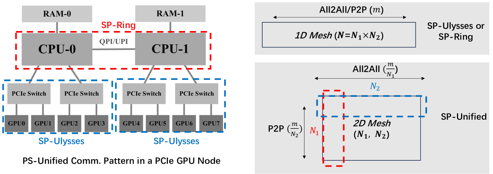

USP(混合并行, Unified SP)
=============================

| **论文标题**: A Unified Sequence Parallelism Approach for Long-Context Generative AI 
| **论文链接**: https://arxiv.org/pdf/2405.07719.pdf 
| **项目地址**: https://github.com/feifeibear/long-context-attention

* Ulysses: 当序列长度和计算设备成比例增加时，通信量保持不变。在All2All操作后，这四个张量的分割从序列维度L转移到注意力头数维度hc。这样，每个注意力头的softmax(QK^T)V计算可以完整地进行，而不会因为张量的分割而中断。
* RingAttention: 可以看作是FlashAttention的分布式版本。在计算输出张量O的各个块时，如果所需的K和V块不在本地可用，则使用点对点（P2P）通信从其他设备获取。这种方法的通信可以以环形方式组织，每个设备同时发送和接收K、V块，允许通信与计算重叠。

.. image:: 
    ../_static/features/cp/usp.png
    :width: 400px
    :align: center

Ulysses在增加计算设备和序列长度时能保持恒定的通信量，而Ring-Attention通过计算和通信的重叠隐藏了由SP引入的点对点（P2P）通信成本。然而，DeepSpeed-Ulysses的并行度受到注意力头数的限制，而Ring-Attention在分块矩阵乘法中的计算效率较低。

为了克服这些限制，提出了一种统一的序列并行方法，将DeepSpeed-Ulysses和Ring-Attention的技术结合起来。这种统一方法通过在序列维度上的混合并行策略，允许在不同的计算设备上分别运行DeepSpeed-Ulysses和Ring-Attention，从而优化了通信模式和计算效率。

具体来说，统一的SP方法在一个2D网格的进程组中运行，其中DeepSpeed-Ulysses沿着网格的行进行操作，而Ring-Attention沿着列进行。这种设置不仅提高了模型架构和网络硬件的适应性，还通过更有效的负载平衡和通信模式，提高了整体的计算性能。

使用方式
-------------

.. raw:: html

    <!DOCTYPE html>
    <html lang="zh-CN">
    <head>
        <meta charset="UTF-8">
        <meta name="viewport" content="width=device-width, initial-scale=1.0">
        <title>长序列并行参数说明</title>
        
    </head>
    <body>
        

            <table>
                <thead>
                    <tr>
                        <th width="350">配置参数</th>
                        <th>参数说明</th>
                    </tr>
                </thead>
                <tbody>
                    <tr>
                        <td>
                            --context-parallel-size [int]
                        </td>
                        <td>
                            必选，设置长序列并行大小，默认为1，根据用户需求配置。
                        </td>
                    </tr>
                    <tr>
                        <td>
                            --context-parallel-algo
                        </td>
                        <td>
                            可选，设置长序列并行算法，默认是ulysses_cp_algo  
                            ulysses_cp_algo：开启Ulysses长序列并行，缺省值。 
                            megatron_cp_algo：开启Ring Attention长序列并行。 
                            hybrid_cp_algo：开启Hybrid长序列并行。
                        </td>
                    </tr>
                    <tr>
                        <td>
                            --ulysses-degree-in-cp [int]
                        </td>
                        <td>
                            必选，开启usp后，ulysses cp的并行度大小  
                        </td>
                    </tr>
                </tbody>
            </table>
        

    </body>
    </html>

|

.. note:: 
    * 需要确保 ``--context-parallel-size`` 参数的数值可以被 ``--ulysses-degree-in-cp`` 整除，例如当设置 ``--context-parallel-size 8`` ``--ulysses-degree-in-cp 2`` 时，此时ring cp并行度为4。
    * 需要确保 ``--ulysses-degree-in-cp * --tensor-model-parallel-size`` 可以被num-attention-heads数整除
