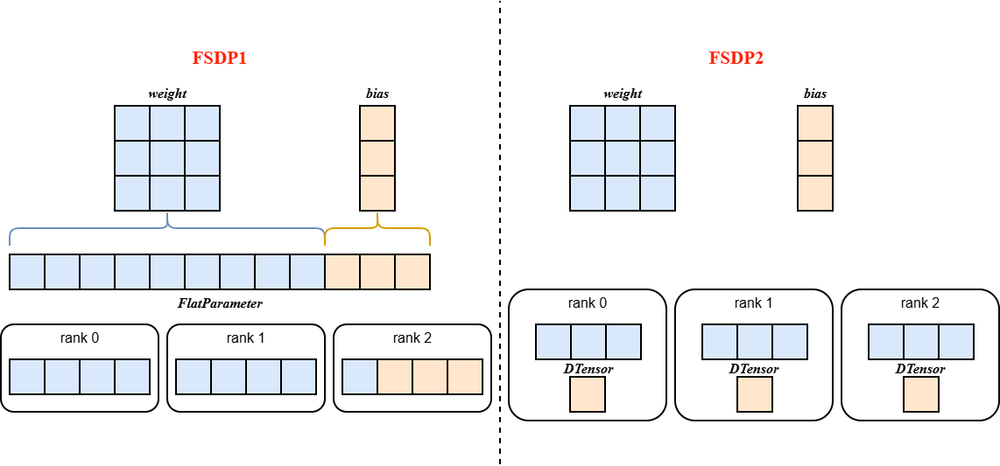

fsdp2
===========================

Last updated: 12/08/2025. Author: zs-derrick

背景与挑战
----------

PyTorch的完全分片数据并行（FSDP）旨在提供一个高性能的即时执行模式实现，包含通信分桶和通信/计算掩盖功能。该API通过将一组参数展平拼接成FlatParameter来表示通信桶。然而，这种FlatParameter设计导致难以对桶内单个参数实施差异化操作（如参数冻结、精度转换等），损害了组合灵活性，同时也使内部实现复杂化（例如状态字典逻辑长达数千行代码且需要额外通信）。

解决方案
--------

基于上述局限性，FSDP2移除了FlatParameter，采用沿0维分片的DTensor表示分片参数，支持对单个参数的便捷操作、无需通信的分片状态字典，以及更简化的初始化流程；同时FSDP2实现了一种改进的内存管理系统，通过避免使用recordStream来降低并确定Device内存使用，且无需任何Host同步。

核心工作机制
------------

1. **参数切分**：在模型初始化时， ``fully_shard`` 将 ``model.parameters()`` 从普通 ``torch.Tensor`` 按照rank号进行进行切分，并转换为 ``DTensor`` 格式，这些参数会根据设备网格（device mesh）被移动到相应的device上。
2. **前反向传播中的参数聚合与重切分**：

   * 参数聚合​： ``forward/backward`` 的 ``pre_hook`` 负责聚合所有参数，将 ``model.parameters()`` 从 ``DTensor`` 转换回普通 ``torch.Tensor``
   * 参数重切分： ``forward/backward`` 的计算完成后， ``post_hook`` 释放未分片的参数（无需通信），并重新将参数转换为 ``DTensor``
3. **自底向上的分组策略** ：在复杂模型中 ``fully_shard`` 应遵循自底向上的应用顺序，例如：应先对每个TransformerLayer层应用 ``fully_shard`` ，再应用于root模型

.. image:: ../_static/features/fsdp2/fsdp_workflow.png
    :width: 70%
    :align: center

使用方式
--------

模型继承要求
~~~~~~~~~~~~

对于需要使用FSDP2进行训练的模型，必须继承特定的Mixin类：

.. code:: python

   from mindspeed_mm.models.common.module import MultiModalModule
   from mindspeed_mm.models.transformers.base_model import FSDP2Mixin, WeightInitMixin

   class YourModel(MultiModalModule, FSDP2Mixin, WeightInitMixin):
       ...

启动命令配置
~~~~~~~~~~~~

使用FSDP2训练时需要配置以下命令行参数：

.. code:: shell

   export CUDA_DEVICE_MAX_CONNECTIONS=2

   --use-torch-fsdp2 \
   --fsdp2-config-path ./fsdp2_config.yaml \
   --ckpt-format torch_dcp \
   --untie-embeddings-and-output-weights \

关键参数说明：

-  ``--use-torch-fsdp2``\ ：启用FSDP2训练模式
-  ``--fsdp2-config-path``\ ：指定FSDP2配置文件路径

其中，FSDP2配置文件中参数说明见：:ref:`FSDP2参数介绍<fsdp2-config>`

大模型Meta初始化
~~~~~~~~~~~~~~~~

对于参数量极大的模型训练，推荐启用Meta初始化以避免内存以及加载速度慢等问题：

.. code:: shell

   --init-model-with-meta-device 
   --no-initialization

用户自定义切分策略（可选）
~~~~~~~~~~~~~~~~~~~~~~~~~~

对于模型结构复杂或不便于通过YAML配置的场景，用户可以通过FSDP2Mixin提供的接口自定义切分策略，yaml文件中仅提供 ``基本配置``即可：

**自定义fully_shard示例**

.. code:: python

   from mindspeed_mm.models.common.module import MultiModalModule
   from mindspeed_mm.models.transformers.base_model import FSDP2Mixin, WeightInitMixin

   class YourModel(MultiModalModule, FSDP2Mixin, WeightInitMixin):
       def _fully_shard(self, fsdp2_kwargs=None, fsdp2_config=None):
           """
           自定义fully_shard实现
           """

           # 自定义重计算模块（可选）
           set_recompute_modules_to_wrap()

           # 自定义fully_shard包装模块
           set_fullyshard_modules_to_wrap()

           # 自定义预取策略（可选）
           num_to_forward_prefetch = getattr(self.fsdp2_config, "num_to_forward_prefetch", 0)
           num_to_backward_prefetch = getattr(self.fsdp2_config, "num_to_backward_prefetch", 0)
           set_modules_to_prefetch(num_to_forward_prefetch, num_to_backward_prefetch)

更为详细地，可以参考\ ``FSDP2Mixin``\ 实现

使用效果
--------

针对Llama-7B，FSDP2相比FSDP1实现了更高的MFU，峰值内存降低7%，且保持相同的损失曲线。

注意事项⚠️
----------

1、当开启fsdp2训练时，需关闭分布式优化器及其相关配置

2、当开启fsdp2训练时，模型权重的保存格式\ ``ckpt-format``\ 仅支持\ ``torch_dist``\ 或\ ``torch_dcp``

-  配置为\ ``torch_dist``\ ，模型需通过继承\ ``MegatronModule``\ 或自定义来实现\ ``sharded_state_dict()``\ 方法；同时需保证模型中所有权重的0维size均大于或等于sharding_size
-  配置为\ ``torch_dcp``\ ，模型需通过继承\ ``MegatronModule``\ 或自定义来实现\ ``state_dict_for_save_checkpoint()``\ 方法，并且其返回的权重字典需要与\ ``model.state_dict()``\ 的返回值一致

