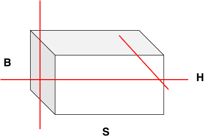

sequence-parallel
===========================

Last updated: 12/04/2025. Author: cxiaolong

背景与挑战
------------

在视觉生成与理解领域，视频数据常因帧数多、分辨率高而产生极长的Token序列（通常超过32K），导致长序列处理成为多模态模型的核心技术挑战。传统分布式训练方法数据并行（DP）、张量并行（TP）与流水线并行（PP）均针对数据的不同维度进行切分，如下图所示，分别对应批大小（batch size）、隐藏层维度（hidden_size）的划分。然而，对于Transformer类模型，其Attention的计算复杂度与序列长度呈平方增长关系，当序列极长时，上述三种并行方式既无法高效利用计算资源，也难以稳定控制显存消耗。
序列并行SP/CP（Sequence Parallelism/Context Parallelism）是一种序列切分的并行化技术，通过将长序列数据的序列维度划分到多个计算设备上。

解决方案
--------------------

.. toctree::
   :maxdepth: 2
   
   ulysses
   RingAttention
   USP(混合并行, Unified SP)
   tp-sp
