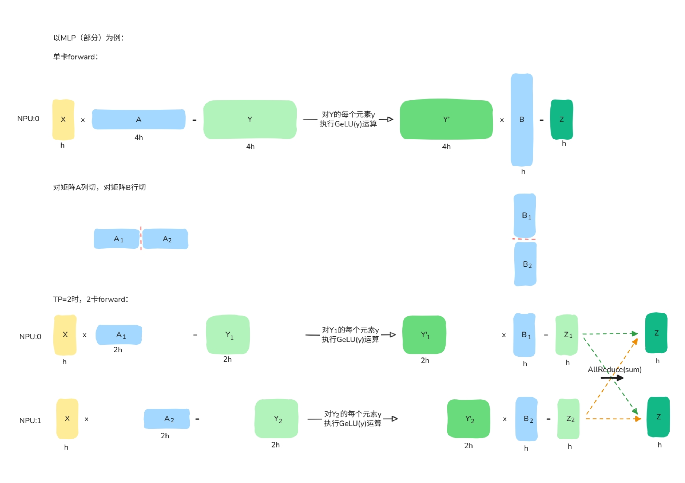

tensor-parallel
===========================

Last updated: 12/13/2025. Author: yaoyaoxu

背景与挑战
----------

为应对多模态大模型训练中的显存瓶颈，张量并行（以下简称TP）通过将层内的权重矩阵切分到多个计算设备来扩展显存，是一项关键的模型并行技术。它能与数据并行、流水线并行等策略灵活组合，形成混合并行方案，以支持超大模型训练。

但需要注意的是，TP的本质是以通信换显存，如上图所示，它会引入显著的设备间通信开销。在模型规模或网络带宽不足以掩盖此开销的场景下，启用TP需审慎评估。

核心设计
--------

| **论文标题**: Megatron-LM: Training Multi-Billion Parameter Language Models Using Model Parallelism 
| **论文链接**: https://arxiv.org/pdf/1909.08053 

TP是Megatron-LM框架早期提出的模型并行技术之一，将单个庞大的计算操作（尤其是矩阵乘法）拆分到多个计算设备上并行执行，通过“分而治之”来突破单个设备的内存和算力限制。

- **模型层内并行**：主要针对计算和内存密集型的矩阵乘法，将一个大的权重矩阵按行或列进行切分，每个设备只存储和计算其中的一个分块
- **高效的通信模式**：通过精心设计的矩阵切分方式，让本地计算量远大于通信量，最小化AllReduce通信开销

使用方法
--------

.. raw:: html

    <!DOCTYPE html>
    <html lang="zh-CN">
    <head>
        <meta charset="UTF-8">
        <meta name="viewport" content="width=device-width, initial-scale=1.0">
        <title>张量并行参数说明</title>
        
    </head>
    <body>
        

            <table>
                <thead>
                    <tr>
                        <th width="350">配置参数</th>
                        <th>参数说明</th>
                    </tr>
                </thead>
                <tbody>
                    <tr>
                        <td>
                            --tensor-model-parallel-size [int]
                        </td>
                        <td>
                            必选，设置张量并行大小，默认为1，根据用户需求配置。
                        </td>
                    </tr>
                </tbody>
            </table>
        

    </body>
    </html>

..  # 这是一个注释，用于保持空行

.. raw:: html

   

从零开始适配TP
----------

TP需要对模型定义进行侵入式修改，以VLM中的xxmodel为例，对其中的image_encoder中的vision_enocder模块(Transformer层)适配TP：

代码适配
~~~~~~~~~~~~

examples/xxmodel/model.json指定model_id：

.. code:: json

    {
        "model_id": "xxmodel",
        "image_encoder": {
            "vision_encoder": {
                "model_id": "xxmodelvit",
                ...
            }
        }
    }

mindspeed_mm/models/common/module_spec/get_layer_spec.py将model_id与重新构造的layer对应起来：

.. code:: python

    from mindspeed_mm.models.common.module_spec.xxmodel_layer_spec import get_xxmodel_vit_layer_spec

    # 注册模型层到全局映射表
    vit_layer_specs = {
        'xxmodelvit': get_xxmodel_vit_layer_spec,
        ...
    }

mindspeed_mm/models/common/module_spec/xxmodel_layer_spec.py实现模型层get_xxmodel_vit_layer_spec：

.. code:: python

    def get_xxmodel_vit_layer_spec(config=None, is_vit=True, *args, **kwargs) -> ModuleSpec:
        return ModuleSpec(
            module=TransformerLayer,
            submodules=TransformerLayerSubmodules(
                self_attention=ModuleSpec(
                    module=SelfAttention,
                    submodules=SelfAttentionSubmodules(
                        linear_qkv=ColumnParallelLinear, # 使用core提供的类，列切qkv
                        core_attention=DotProductAttention, # 使用core提供的类，切分注意力头
                        linear_proj=RowParallelLinear, # 使用core提供的类，行切proj
                    ),
                    ***其他省略
                ),
                mlp=_get_mlp_module_spec(use_te=False), # 使用core提供的接口，切分MLP
                ***其他省略
            ),
        )

权重切分
~~~~~~~~~~~~

由于TP会改变权重的shape，所以预训练的权重也需要切分，可以参考MM仓已支持TP的模型采用的权重切分方法，VLM相关模型的权重转换脚本建议放到checkpoint/vlm_model/converters/路径下。

使用案例及效果
----------
* **模型**：Qwen2.5VL-7B
* **硬件环境**：910B2（8×Ascend A2 64GB NPU）
* **显存优化效果​**：
    * TP=1（基线）：单卡显存占用 50.26 GB​
    * TP=2：单卡显存占用降至 34.20 GB，显存节省16.06 GB，约32%
* **计算吞吐损失​**：
    * TP=1（基线）：单卡吞吐 11,042 Tokens/s​
    * TP=2：单卡吞吐降至 6,088 Tokens/s，性能下降 44.86%
* **结论**：当单卡能够容纳完整模型参数及训练中间状态时，可实现最优吞吐，不建议启用TP特性，因此该模型TP的默认值为1。