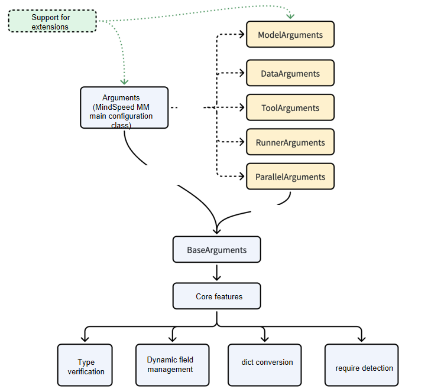
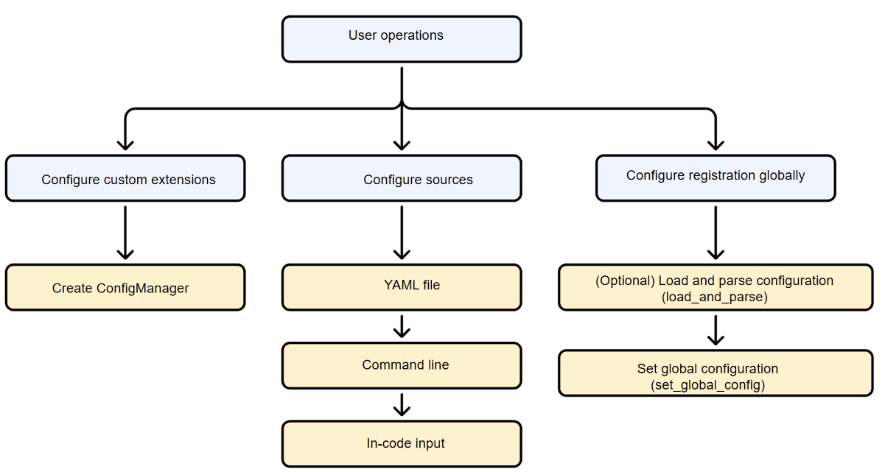

# Config Center User Manual

## Overall Design

### Design Goals

1. Independent Configuration Module: `ConfigManager` is an independent module that can be decoupled from all functional modules such as `trainer`, `model`, and `parallel`.
2. Multiple Configuration Sources: Supports command-line arguments, YAML configuration files, and in-code configuration. Priority: command-line > in-code > YAML > default values.
3. Flexible Extension: Supports dynamic extension of configuration items and inheritance from `BaseArguments` for structured configuration definition.
4. Type Safety: Implements strict type checking based on `BaseArguments` to ensure correct configuration item types.

### Rules for Configuration Items to Take Effect

1. Basic Validation: The `BaseArguments` base class provides data type validation and dynamic field registration.
2. Strict Validation: Configuration items defined in `TrainArguments` undergo strict type checking.
3. Command-line restrictions: Adding multi-level configuration items not defined in `TrainArguments` are not allowed on the command line.
4. Parameter Format: Only command-line arguments in the `key=value` format are supported; the `--xxx` format is not supported.
5. Extension Methods:
   - New `BaseArguments` subclasses can be added by inheriting from `TrainArguments`.
   - Dynamic fields can be registered in `ConfigManager`.
   - Extension fields can be added in YAML (automatic registration must be enabled).

## Core Class Description

### BaseArguments & Arguments

A Pydantic-based configuration base class providing type validation and dynamic field support.

**Main Features**:

- Class-level dynamic field registration
- Runtime type validation
- Nested configuration support
- Required field validation

**Core Methods**:

```python
@classmethod
def register_field(cls, name: str, value_type: Optional[Type] = None,  default: Any = None, description: str = "", required: bool = False)
# Register Dynamic Fields

def to_dict(self) -> Dict[str, Any]
# Convert to Dictionary

def to_str(self) -> str
# Format as a String
```

**Usage Example**:

```python
from mindspeed_mm.config.arguments.base_args import BaseArguments
from typing import List, Optional

class ModelConfig(BaseArguments):
    """Model Configuration"""
    model_name: str = "gpt2"
    hidden_size: int = 768
    num_layers: int = 12

class MyArguments(BaseArguments):
    """Custom Configuration"""
    # Static Fields
    learning_rate: float = 1e-4
    batch_size: int = 32

    # Nested Configuration
    model_config: ModelConfig = ModelConfig()

# Register Dynamic Fields
MyArguments.register_field(
    name="new_field",
    value_type=str,
    default="default_value",
    description="New Field Description",
    required=False
)
```

MindSpeed MM provides the `Arguments` class as a base configuration class. It is strongly recommended that you inherit this class when customizing extended configurations to ensure that the configurations required by the framework can be correctly initialized. The `Arguments` class is composed as follows:



### ConfigManager

Configuration manager responsible for loading and merging configuration from various sources.

Initialize the parameter manager:

```python
def __init__(self,
             config_class: Type[BaseArguments] = Arguments,
             config_file_path: Optional[str] = None,
             additional_args: Optional[Dict[str, Any]] = None,
             allow_yaml_extensions: bool = True,
             allow_cli_override: bool = True,
             strict_cli_validation: bool = True,
             allow_register_yaml_fields: bool = True)
```

**Parameter Description**:

- `config_class`: Configuration class, must be a subclass of `BaseArguments`
- `config_file_path`: YAML configuration file path
- `additional_args`: Additional configuration passed via code
- `allow_yaml_extensions`: Whether to allow YAML configuration extensions
- `allow_cli_override`: Whether to allow command-line override of configuration
- `strict_cli_validation`: Whether to strictly validate command-line arguments
- `allow_register_yaml_fields`: Whether to allow automatic registration of new fields from YAML

**Core Methods**:

```python
def load_and_parse(self) -> BaseArguments
# Load and parse all configuration sources

def get_config(self) -> Optional[BaseArguments]
# Get the current configuration object

def get_defined_fields(self) -> List[str]
# Get all defined fields (including dynamic fields)

def register_dynamic_field(self, name: str, value_type: Optional[Type] = None,
                          default: Any = None, description: str = "", required: bool = False)
# Register a dynamic field (supports nested fields)

def save_config(self, file_path: str, include_dynamic: bool = True, include_yaml: bool = True)
# Save configuration to file

def print_summary(self)
# Display the complete status of the configuration system in a structured way, including statically defined fields, dynamically registered fields, configuration sources, etc.
```

## How to Use

The basic usage is illustrated in the following diagram.



**Basic Usage**:

```python
from mindspeed_mm.config.config_manager import ConfigManager
from mindspeed_mm.fsdp.params.argument import Arguments

# Method 1: Simplest usage (automatically reads command line and YAML)
config_manager = ConfigManager()
config = config_manager.load_and_parse()

# Method 2: Specify a configuration file
config_manager = ConfigManager(
    config_file_path="config.yaml",
    additional_args={"learning_rate": 1e-4}
)
config = config_manager.load_and_parse()

# Use Configuration
print(config.learning_rate)
print(config.model.model_name)
```

**YAML Configuration File**:

```yaml
# config.yaml
model:
  xxx

data:
  xxx

# Dynamic extension fields (requires allow_register_yaml_fields to be enabled)
custom_field: "custom_value"
nested_custom:
  field1: 123
  field2: "text"
```

**Command-line Argument Override**:

```bash
# Basic format: key=value
torchrun $DISTRIBUTED_ARGS trainer.py config.yaml learning_rate=0.001 batch_size=32

# Nested field support
torchrun $DISTRIBUTED_ARGS trainer.py config.yaml model.model_name=gpt2 data.dataset.path=/path/to/data

# Boolean value support
torchrun $DISTRIBUTED_ARGS trainer.py config.yaml use_amp=true
```

**In-Code Extended Configuration**:

```python
from mindspeed_mm.config.config_manager import ConfigManager
from mindspeed_mm.config.arguments.base_args import BaseArguments
from typing import List

# Define a Custom Configuration Class
class CustomArguments(BaseArguments):
    """Custom configuration"""
    custom_field: str = "default"
    custom_list: List[int] = [1, 2, 3]

# Create a ConfigManager
config_manager = ConfigManager(
    config_class=CustomArguments,
    allow_yaml_extensions=True,
    allow_register_yaml_fields=True
)

# Register a Dynamic Field
config_manager.register_dynamic_field(
    name="dynamic_field",
    value_type=int,
    default=100,
    description="Dynamic Field Example"
)

# Register Nested Dynamic Fields
config_manager.register_dynamic_field(
    name="data.custom.nested_field",
    value_type=str,
    default="nested_default",
    description="Nested Dynamic Fields"
)

# Pass Configuration from Code
config_manager = ConfigManager(
    additional_args={
        "learning_rate": 2e-4,
        "model": {
            "model_name": "custom_model"
        }
    }
)
```

## MindSpeed MM Main Configuration Items

The main configuration items consist of the following modules:

- `parallel`: Defines the core parallelism capabilities for distributed training, including FSDP2 full sharding, expert parallelism, sequence parallelism, and more. You can configure the sharding plan, recomputation strategy, and specific parameters for each parallelism dimension here.
- `data` (data configuration): Used to configure datasets and data loading processes. The framework has a built-in generic dataloader mechanism and supports flexible integration of user-defined datasets by specifying a `dataset_type` (e.g., huggingface). This section covers data preprocessing, sampling strategies, dataloader parameters, and more.
- `model` (model configuration): Defines parameters related to model structure, loading, and optimization. This includes specifying the model ID, Hugging Face model path, attention implementation method, modules to freeze, loss function configuration, and whether to enable specific optimizations (such as chunked loss, Triton operators, etc.).
- `training` (training configuration): Covers the hyperparameters and execution settings for the training process. Examples include learning rate and scheduling strategy, batch size, optimizer selection, number of training steps, gradient clipping, and checkpoint save/load paths.
- `tools` (tool configuration): Provides a series of auxiliary tools and performance analysis options. It mainly includes features like `profile` (performance profiling) and `memory_profile` (memory snapshot), which are used to identify performance bottlenecks and memory usage during the training process.
