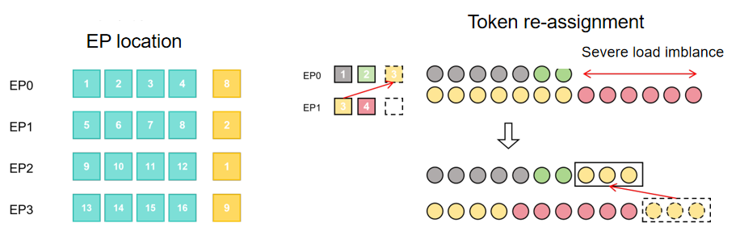

# EP Balance Strategy

## Background and Challenges

Mixture-of-Experts (MoE) models, through their sparse activation mechanism, substantially reduce the actual computational cost while maintaining a large parameter count, and have become the mainstream architecture for large model training. To support large-scale MoE training, Expert Parallelism (EP) assigns different experts to different devices and completes token routing and aggregation through AlltoAll or AllGather communication. The routing network distributes tokens to experts in real time and unevenly based on the input data, whereas EP has already statically bound experts to devices before training begins. When a hot expert receives too many tokens, the corresponding device becomes overloaded, while devices hosting cold experts remain idle and waiting, resulting in wasted computational resources.

Existing load balancing solutions in the industry each have their shortcomings:

- Auxiliary Loss: Adds a balancing loss to guide routing toward uniformity, but may interfere with the primary optimization objective and potentially degrade model quality.
- Token Dropping/Capacity Factor: Forcibly drops tokens that exceed the capacity factor. While this strictly enforces load limits, it directly causes information loss and harms model training effectiveness.
- Expert Reordering: Reassigns experts at specific steps, but cannot handle instantaneous load spikes during training. The reordering process itself introduces additional communication and state migration overhead.

## Solution

This feature proposes an efficient load balancing mechanism based on redundant experts and dynamic greedy planning. By sensing the training load in real time, the mechanism collaboratively addresses the load imbalance problem in MoE model training from both scheduling and execution optimization dimensions, with the following core technical highlights:

- **Scheduling level**: As shown in the figure below, a small number of redundant expert slots are reserved on each EP rank as an elastic buffer pool. Based on the global real-time load state, the system uses a greedy strategy to precisely identify the "hot experts" on high-load ranks and dynamically replicate them into the redundant slots of low-load ranks. This design breaks free from traditional static expert mapping, allowing tokens that were previously backlogged on high-load ranks to be migrated to low-load ranks for processing. Global load balance is rapidly achieved with minimal redundancy overhead.
- **Execution level**: To eliminate the extra overhead introduced by redundant experts, targeted optimizations are performed at the execution level. On the one hand, the backward computation processes of `permute` and `unpermute` are leveraged to mask the communication latency caused by redundant expert parameter synchronization and gradient aggregation, respectively. On the other hand, Numba JIT (Just-In-Time) compilation is used on the CPU side to accelerate the load re-planning solution process, ensuring that scheduling decisions themselves do not become a training performance bottleneck.



## How to Use

Currently, only a few models have been adapted to this load balancing solution. For models that have been adapted, the following fields can be found in the model's `.yaml` configuration file.

```yaml
# ep balance
enable_ep_balance: false
ep_balance_plan:
    max_dup_experts_num: 2
```

The description of each field is as follows:

- `enable_ep_balance`: Whether to enable this load balancing strategy. It is disabled by default. To enable it, change the value to `true`.
- `max_dup_experts_num`: The upper limit of redundant experts that can be assigned to each EP Rank. It is recommended to adjust it based on the EP size and the total number of experts.

## Use Cases

This feature is applicable to the following scenarios:

1. **Severe load imbalance after enabling EP**
   - The performance improvement margin is significantly larger when load imbalance is pronounced. If the original load distribution is already relatively balanced, enabling this feature may not yield noticeable benefits. However, the solution includes an early-stop strategy in the expert reordering and token redistribution solving process, so performance degradation is generally not significant.
2. **Scenarios with a large `mbs*seqlen`**
   - The primary overhead of this solution lies in the solving of expert reordering and token redistribution. Since the complexity of this solving process depends only on the number of experts, if `mbs * seqlen` is too small, the benefits gained from load balancing may not outweigh the solving overhead, potentially leading to performance degradation.

Not recommended for:

- Scenarios requiring strictly deterministic training: This feature involves redundant expert gradient accumulation, and binary alignment is not guaranteed.

It has compatibility issues with:

- [ChunkMBS](chunkmbs.md)

> We will fix the compatibility issue as soon as possible.

## Performance Impact

When the recommended usage scenarios are satisfied and the EP training environment is correctly configured, enabling this feature can achieve the following optimization effects:

- Computational loads across nodes become more balanced, mitigating the fast-rank/slow-rank problem caused by load imbalance.
- Reduces the risk of OOM caused by extreme load imbalance.
