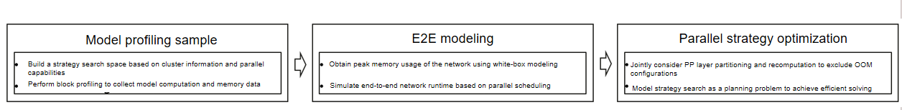
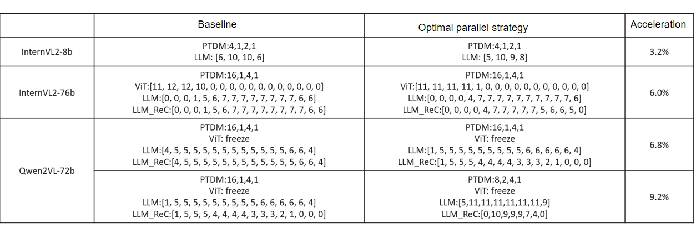

# Automatic Parallelism For Multimodal Models

## Background and Challenge

Current parallel training methods for multi-modal large language models are becoming increasingly diverse, primarily including TP, PP, DP, CP, and VPP. Each parallel method offers different advantages in computation, memory, and communication. Current practice relies on manual tuning based on expert experience, which typically takes days or even weeks. The optimal parallel configuration differs for similar models or even for different training stages of the same model. As parallel methods continue to multiply and the parallel search space expands, manual tuning becomes increasingly infeasible. Therefore, it is necessary to develop an automatic parallel configuration tuning algorithm for multi-modal large models that can automatically derive the optimal parallel method based on cluster resources and model architecture.

## Solution

Given the rich architectural diversity and varying training stages of multi-modal large models, we partition the network and perform subgraph merging, then sample multiple parallel configurations using a black-box profiling approach, and finally apply integer programming for non-uniform network layer partitioning:

- Profiling Performance:
Following the original training method and invocation logic of multimodal large models, the model is partitioned and its subgraphs are merged. Block-level performance profiling is then performed with minimal resources. This profiling approach balances the flexibility of subgraph extrapolation with the requirement for low sampling overhead.
- End-to-End Modeling:
Using the subgraph performance and memory data obtained from profiling, white-box modeling is employed to derive peak memory usage and per-iteration step time (via simulation).
- Parallel Strategy Tuning:
A complete parallel strategy search space is constructed based on cluster resources and the parallel strategies supported by the model. For each parallel strategy, the problem of non-uniform optimal PP layer partitioning is formulated as an integer programming problem, jointly considering pipeline scheduling, memory constraints, and recomputation strategies. The optimization objective is to minimize end-to-end time. All feasible parallel strategies are traversed to obtain the optimal parallel solution.



## Version Compatibility

MindSpeed-Core branch: core_r0.8.0

## How to Use

When using the multi-dimensional automatic parallelism feature, you must use `bash` as the script launcher on all nodes and configure the related parameters.

| Parameter Name                      | Parameter Description                                            |
| --------------------------- | -------------------------------------------------- |
| `--auto-parallel-mm`          | Master switch for the multi-dimensional automatic parallelism feature                               |
| `--nnodes`                    | Number of nodes in the profiling cluster                                 |
| `--nproc-per-node`            | Number of computing devices per node in the profiling cluster                     |
| `--master-addr`               | IP address of the master node in the profiling cluster                             |
| `--master-port`               | Port number used for communication in the profiling cluster; all nodes must be configured with the same port    |
| `--node-rank`                | Rank of the node in the profiling cluster, (0 for the master node; 1, 2,... for other nodes) |
| `--simulated-nnodes`          | Number of nodes in the target training cluster                                 |
| `--simulated-nproc-per-node`  | Number of devices per node in the target training cluster                           |

Below is a configuration example based on the Qwen2VL-72B model:

```shell
#!/bin/bash
export ASCEND_SLOG_PRINT_TO_STDOUT=0
export ASCEND_GLOBAL_LOG_LEVEL=3
export TASK_QUEUE_ENABLE=2
export COMBINED_ENABLE=1
export CPU_AFFINITY_CONF=2
export HCCL_CONNECT_TIMEOUT=1200
export NPU_ASD_ENABLE=0
export ASCEND_LAUNCH_BLOCKING=0
export HOST_CACHE_CAPACITY=20
export ACLNN_CACHE_LIMIT=100000
export MULTI_STREAM_MEMORY_REUSE=2
export PYTORCH_NPU_ALLOC_CONF="expandable_segments:True"
# Fill in according to the actual situation
NPUS_PER_NODE=8
MASTER_ADDR=localhost
MASTER_PORT=6010
NODE_RANK=0
NNODES=1
WORLD_SIZE=$(($NPUS_PER_NODE*$NNODES))
echo $MASTER_ADDR
echo $MASTER_PORT
echo $NODE_RANK
echo $NNODES


MM_DATA="./examples/qwen2vl/data_72b.json"
MM_MODEL="./examples/qwen2vl/model_72b.json"
MM_TOOL="./mindspeed_mm/tools/tools.json"
LOAD_PATH="ckpt/Qwen2-VL-72B-Instruct"
SAVE_PATH="save_dir"

TP=4
PP=2
CP=1
MBS=1
GRAD_ACC_STEP=32
DP=$(($WORLD_SIZE/$TP/$PP/$CP))
GBS=$(($MBS*$GRAD_ACC_STEP*$DP))

DISTRIBUTED_ARGS="
    --nproc_per_node $NPUS_PER_NODE \
    --nnodes $NNODES \
    --node_rank $NODE_RANK \
    --master_addr $MASTER_ADDR \
    --master_port $MASTER_PORT
"

GPT_ARGS="
    --use-mcore-models \
    --tensor-model-parallel-size ${TP} \
    --pipeline-model-parallel-size ${PP} \
    --micro-batch-size ${MBS} \
    --global-batch-size ${GBS} \
    --num-layers 80 \
    --hidden-size 8192 \
    --ffn-hidden-size 29568 \
    --num-attention-heads 64 \
    --tokenizer-type NullTokenizer \
    --vocab-size 152064 \
    --seq-length 8192 \
    --max-position-embeddings 32768 \
    --make-vocab-size-divisible-by 1 \
    --init-method-std 0.01 \
    --normalization RMSNorm \
    --use-fused-rmsnorm \
    --swiglu \
    --use-fused-swiglu \
    --lr 1.0e-5 \
    --lr-decay-style cosine \
    --weight-decay 0 \
    --train-iters 5 \
    --lr-warmup-fraction 0.1 \
    --clip-grad 0.0 \
    --adam-beta1 0.9 \
    --adam-beta2 0.999 \
    --no-gradient-accumulation-fusion \
    --no-load-optim \
    --no-load-rng \
    --no-save-optim \
    --no-save-rng \
    --seed 42 \
    --bf16 \
    --load $LOAD_PATH \
    --variable-seq-lengths \
    --enable-one-logger \
    --use-distributed-optimizer \
    --reuse-fp32-param
"

MM_ARGS="
    --mm-data $MM_DATA \
    --mm-model $MM_MODEL \
    --mm-tool $MM_TOOL
"

SEARCH_ARGS="
    --auto-parallel-mm \
    --nnodes $NNODES \
    --nproc-per-node $NPUS_PER_NODE \
    --master-addr $MASTER_ADDR \
    --master-port $MASTER_PORT \
    --node-rank $NODE_RANK \
    --simulated-nnodes 8 \
    --simulated-nproc-per-node 16 \
"

OUTPUT_ARGS="
    --log-interval 1 \
    --save-interval 10000 \
    --eval-interval 10000 \
    --eval-iters 5000 \
    --save $SAVE_PATH \
"
logfile=$(date +%Y%m%d)_$(date +%H%M%S)
mkdir -p logs

python pretrain_vlm.py \
    $GPT_ARGS \
    $MM_ARGS \
    $OUTPUT_ARGS \
    $SEARCH_ARGS \
    --distributed-backend nccl \
    | tee logs/train_${logfile}.log 2>&1

chmod 440 logs/train_${logfile}.log
find $SAVE_PATH -type d -exec chmod 750 {} \;
find $SAVE_PATH -type f -exec chmod 640 {} \;
```

## Tuning Effect



## Search Result Description

- Optimal search for multimodal understanding models across PP, TP, DP, MBS, and non-uniform PP partitioning dimensions is now supported.
- The tuning results of the search algorithm are stored in the `auto_parallel_search_optimal_config.json` file in the execution directory. The following table explains the search results.

| Parameter Name              | Parameter Description                              |
| --------------------------- | -------------------------------------------------- |
| `parallel_config`             | Parallel configuration, including PP/TP/DP/MBS dimensions. |
| `layer_placement`             | Layer partitioning configuration, including the PP layer partitioning strategy for ViT and the LLM. |
| `layer_recompute`             | Number of fine-grained layers for recomputation, including the ViT and LLM layers. |
| `e2e_time`                    | Simulated end-to-end time.                         |
| `throughput`                  | Simulated model throughput.                        |

- The following is an example of the optimal parallel strategy search results for the Qwen2VL-72B model:

```json
{
    "parallel_config": {
        "PP": 8,
        "TP": 2,
        "DP": 4,
        "MBS": 1
    },
    "layer_placement": {
        "vit_layer_placement": [32, 0, 0, 0, 0, 0, 0, 0],
        "llm_layer_placement": [5, 11, 11, 11, 11, 11, 11, 9]
    },
    "layer_recompute": {
        "vit_layer_recompute": [0, 0, 0, 0, 0, 0, 0],
        "llm_layer_recompute": [0, 10, 9, 9, 9, 7, 4]
    },
    "e2e_time": 8992.0,
    "throughput": 761.58192090395477
}
```
