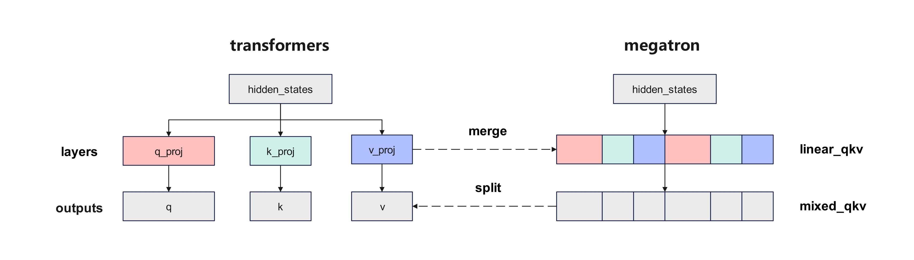
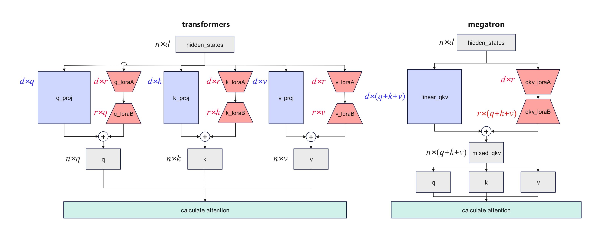

# Canonical Model

## Definition and Design Goals

**Canonical Model** is a model implementation mode provided by MindSpeed MM. Its core design goal is to make the model's computation logic, parameter structure, and weight arrangement fully equivalent to the standard implementation of Hugging Face Transformers under the Megatron distributed training framework.

**Design goals**:

- **Computational equivalence**: Given the same input, the output of the canonical model is mathematically identical to that of the native Hugging Face Transformers model (allowing for floating-point precision errors).
- **Weight compatibility**: Weights of the Canonical Model can be directly converted with those of the native Hugging Face Transformers model, without requiring additional splitting, merging, or reordering operations.
- **LoRA compatibility**: Adapter weights produced by LoRA fine-tuning can be used directly across both frameworks, with completely identical parameter scale and arrangement.

### Differences from the Native Hugging Face Models

| Dimension | Native Hugging Face Model | Canonical Model | Megatron Fused Model (Non-Canonical) |
|------|----------------------|-------------------------------|-------------------------------|
| Runtime framework | Transformers (single-card/DDP) | Megatron (TP/PP/CP/DP distributed) | Megatron (TP/PP/CP/DP distributed) |
| Parameter structure | Layer-independent (e.g., `q_proj`/`k_proj`/`v_proj`) | Layer-independent, fully consistent with Hugging Face | Fused layers (e.g., `linear_qkv`), parameters rearranged |
| Weight format | Hugging Face standard format | Hugging Face standard format | Megatron fused format, requires conversion |
| LoRA compatibility | Native support | Fully compatible with Hugging Face LoRA weights | LoRA parameter scale inconsistent, cannot be used across frameworks |
| Training performance | Limited single-card performance | Distributed training, performance close to fused model | Distributed training, fused operators slightly better performance |
| Cross-framework migration | - | Directly loads Hugging Face weights | Requires conversion via mm-convert |

In short, the Canonical Model "restores" the computation logic of the native Hugging Face model within the Megatron framework, allowing users to enjoy Megatron's distributed training acceleration while maintaining full compatibility with the Hugging Face ecosystem.

## Problem Analysis

There are significant differences between the implementation logic of the Qwen-VL series models in the Megatron framework and the mainstream standard implementation in HuggingFace Transformers. These differences not only cause substantial computational deviations in LoRA fine-tuning but also create difficulties in model migration and adaptation across frameworks.

**Core Issues**

- Megatron applies fusions and reordering to core model modules, which is inconsistent with the standard Transformers implementation.
- Weights trained in different frameworks cannot be directly converted and loaded.
- In LoRA fine-tuning, parameter sizes do not match the standard implementation, leading to algorithmic inequivalence.

## Megatron Implementation Differences

Megatron fuses and reorders core model modules. Taking the computation of the `q`, `k`, and `v` matrices in Qwen2.5-VL as an example, the key differences from the standard implementation in Transformers are as follows:

### Attention Layer QKV Computation Logic

- **Transformers standard implementation**: `hidden_states` are passed separately through independent `q_proj`, `k_proj`, and `v_proj` layers to directly obtain the `q`, `k`, and `v` matrices.
- **Megatron implementation**: The original model's `q_proj`, `k_proj`, and `v_proj` layers are split and rearranged into a single fused `linear_qkv` layer. `hidden_states` are passed through this layer to obtain a fused `qkv` output tensor, which is then split and rearranged to obtain the `q`, `k`, and `v` matrices.



**Impact Analysis**

- The parameter arrangement of the fused `linear_qkv` layer differs from the standard implementation.
- The forward computation results may have slight numerical differences.
- Additional splitting/merging operations are required for weight conversion.

### MLP-Layer FC1 Computation Logic

Megatron also fuses the `gate_proj` and `up_proj` layers in the MLP layer into a single `linear_fc1` layer, which is inconsistent with the standard layered implementation logic of Transformers.

**Impact Analysis**

- The parameter arrangement of the fused layer differs from the standard implementation.
- It affects cross-framework weight conversion.

### LoRA Fine-Tuning Differences

Megatron's module fusions cause parameter size mismatches with the standard Transformers implementation in LoRA fine-tuning. For example, the LoRA-A matrix parameter count for the qkv layer is only one-third of the standard implementation, resulting in algorithmic inequivalence. Consequently, LoRA weights trained in one framework cannot be converted and loaded in the other.



**Specific Impacts**

- Inconsistent LoRA-A matrix parameter counts, affecting fine-tuning accuracy.
- Cross-framework LoRA weights cannot be used directly.
- LoRA weights trained in different frameworks may produce different results.

## Solution

For modules that are fused and reordered in the Megatron framework, MindSpeed MM provides an adaptation scheme that is fully equivalent to the standard Transformers implementation, eliminating computational differences caused by structural discrepancies and resolving cross-framework incompatibility issues.

**Solution Features**

- Maintains computation logic fully equivalent to the standard Transformers implementation.
- Supports cross-framework weight compatibility in LoRA fine-tuning scenarios.
- No model weight modification is required; it only needs to be enabled in the configuration.

**Currently supported models**: `Qwen2.5-VL`

## How to Use

Take Qwen2.5-VL as an example. Add `canonical_model` to `model_xxb.json` and enable it:

```json
{
  "model_id": "qwen2_5vl",
  "img_context_token_id": 151655,
  "vision_start_token_id": 151652,
  "image_encoder": {
    "vision_encoder": {
      "model_id": "qwen2vit",
      "canonical_model": true,  // Enable canonical implementation of the vision encoder.
      ...
    },
    ...
    "text_decoder": {
      "model_id": "qwen2lm",
      "canonical_model": true,  // Enable canonical implementation of the text decoder.
      ...
    }
  }
}
```

### Configuration Description

| Configuration Item | Location | Description |
|--------|------|------|
| `canonical_model` | `vision_encoder` | Enables canonical implementation of the vision encoder |
| `canonical_model` | `text_decoder` | Enables canonical implementation of the text decoder |

### Best Practices

1. **LoRA fine-tuning scenario**: It is strongly recommended to enable `canonical_model` to ensure that LoRA weights are compatible with the Transformers standard implementation.
2. **Cross-framework migration**: If you need to switch training between Megatron and Transformers, you must enable this feature.
3. **Pre-training scenario**: If there is no cross-framework requirement, you may leave it disabled (the Megatron fused implementation may offer better performance).
4. **Precision verification**: After enabling, it is recommended to compare and verify whether the training loss and model output are consistent with the standard implementation.

### Important Notes

- After enabling `canonical_model`, the model structure will be consistent with the Transformers standard implementation, but training performance may be slightly affected.
- Existing non-canonical model weights need to be converted again before they can be used with the canonical mode.
- Support for more models is under development. Stay tuned to the [Feature List](feature_list.md).
