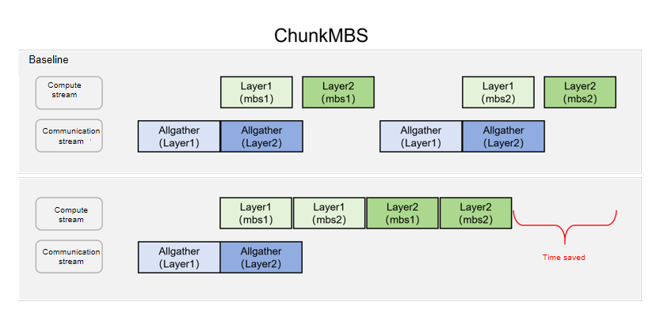

# ChunkMBS

## Background and Challenges

### Current Challenges

When large models are trained with FSDP2, the complete parameter unsharding process (including asynchronous copy-in, asynchronous communication, and synchronous copy-out) must be completed before each block computation. With extremely large parameter scales, communication overhead becomes excessive — computation cannot fully overlap with communication latency, and the synchronous copy-out overhead accounts for a disproportionately large share, directly dragging down training throughput. At the same time, contention between communication and computation for bus bandwidth further reduces parallel computation efficiency.

### Limitations of Existing Approaches

Traditional optimization methods mainly increase the computation density after a single unsharding operation by increasing the sequence length or the Micro-Batch Size (MBS). However, this significantly increases device memory pressure. For large-parameter models, the static device memory is already substantial, leaving very limited room to increase the sequence length and MBS, which makes it difficult to effectively improve overall throughput through this path.

## Solution

### Basic Memory Optimization Dependencies

This solution builds on two fundamental features: recomputation and async activation offload. During the forward computation phase, the system retains only the activations at the layer entry points and dynamically offloads them to host-side memory through an asynchronous mechanism. Under this mechanism, the device-side memory usage consists primarily of two parts:

- **Static memory**: the base memory occupied by model parameters, gradients, and optimizer states after sharding.
- **Dynamic memory**: the full activation memory required by a single block for a single micro-batch during the backward recomputation phase.

### Core Optimization Approach: Fine-Grained Activation Chunking and Asynchronous Pipelining

To break through the memory bottleneck, this approach introduces a fine-grained chunking mechanism along the batch dimension after a single parameter unsharding operation is completed. The implementation flow is as follows:

- **Chunking and computation**: The input of the current layer is split along the batch dimension into multiple micro-chunks, which are processed sequentially through forward and backward computation.
- **Asynchronous pipelining**: During computation gaps, the system asynchronously offloads activation values. During the backward computation phase, activations for the corresponding micro-chunks are migrated back from host to device (D2H) on demand. Once the forward and backward computation for a micro-chunk is complete, the loading and computation of the next micro-chunk is immediately triggered.
- **Memory and throughput benefits**: With this strategy, the peak device memory footprint of activations is strictly compressed to the scale of a single micro-chunk. This effectively decouples the strong binding between memory footprint and computation scale, allowing larger computation scales to be accommodated under limited device memory resources by flexibly increasing the number of chunks, thereby maximizing overall training throughput.

A schematic diagram of this approach is shown below.



## How to Use

This solution must be used in combination with [async activation offload](async_activation_offload.md) and the recomputation feature. Ensure that all modules with ChunkMBS enabled also have async activation offload and recomputation enabled. For models trained with native FSDP2, the enabling method is as follows:

```yaml
# Recomputation configuration
recompute: true
recompute_plan:
    apply_modules:
     - model.visual.blocks.{*}
     - model.language_model.layers.{*}
     
# Activation offload configuration
enable_activation_offload: true
activation_offload_plan:
    apply_modules:
     - model.visual.blocks.{*}
     - model.language_model.layers.{*}
     
# ChunkMBS configuration
enable_chunk_mbs: true
chunkmbs_plan:
    apply_modules:
     - model.language_model.layers.{*}
    chunk_mbs: 2 # This indicates the micro batch size after chunking.
    batch_dim: 0
    chunk_arg_indexs: [0]
    chunk_kwarg_names: ["position_embeddings", "position_ids", "rope_deltas", "attention_mask"]
```

The hyperparameters related to the ChunkMBS configuration are described as follows:

- `enable_chunk_mbs`: Whether to enable the ChunkMBS feature. `true` means enabled, and `False` means disabled.
- `apply_modules`: The modules for which this feature is enabled, matched using regular expressions. Ensure that these modules are also included in the `apply_modules` of both the `recompute` feature and the `activation_offload` feature.
- `chunk_mbs`: The MBS after chunking. For example, if the original `micro_batch_size` is 8 and it is split into 4 parts, each part has a size of 2, then this field is configured as 2.
- `batch_dim`: The dimension along which the batch size resides. For example, if the input layout of this layer is `[b, s, h]`, then `batch_dim` is set to 0; if the input layout of this layer is `[s, b, h]`, then `batch_dim` is set to 1.
- `chunk_arg_indexs`, `chunk_kwarg_names`: Used to indicate which input arguments need to be chunked. Take the following input as an example.

  ```python
  hidden_states = decoder_layer(
      hidden_states,
      position_embeddings=position_embeddings,
      attention_mask=layer_mask,
      position_ids=text_position_ids,
      past_key_values=past_key_values,
      use_cache=use_cache,
      cache_position=cache_position,
      **kwargs,
  )
  ```

  Among them, `hidden_states`, `position_embeddings`, `attention_mask`, `position_ids`, and `rope_deltas` need to be chunked along the `batch_size` dimension, while the remaining input arguments do not need to be chunked. `hidden_states` is passed in the form of `args`, while `position_embeddings`, `attention_mask`, `position_ids`, and `rope_deltas` are passed in the form of `kwargs`. The configuration should follow the above settings.

## Performance Impact

Under the same GBS, setting `micro_batch_size` to `MBS` and gradient accumulation (`GRAD_ACC`) to `GBS/MBS` requires unsharding each block's parameters in every gradient accumulation step. However, with this feature enabled, you can set `micro_batch_size` to `GBS`, set `GRAD_ACC` to `1`, and set `chunkmbs_plan.chunk_mbs` to `GBS/MBS`. This way, each model parameter update only requires one parameter unsharding per block, significantly reducing communication time. On the Qwen3.5 35B model, the measured end-to-end performance gain is approximately 5%.
