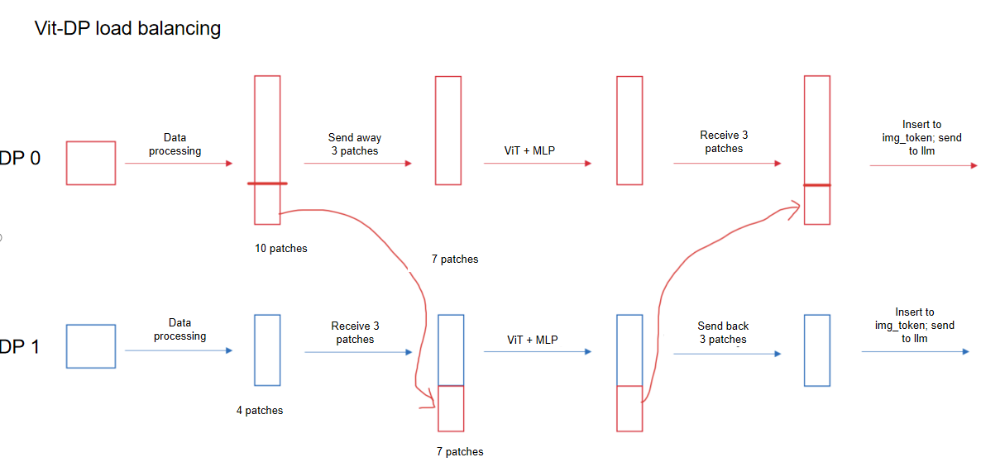

# Encoder Data Load Balancing (beta)

## Problem Analysis

In multimodal model training, taking InternVL as an example, when DP is greater than 1, the number of image patches processed by different DP ranks varies, leading to significant differences in ViT and MLP computation loads. Consequently, during the gradient all-reduce phase, faster cards end up waiting for slower ones, significantly reducing overall training efficiency.

## Solution

With all-to-all communication used, DPs with more patches transfer data to DPs with fewer patches, achieving encoder load balancing.



## How to Use

1. Add `--encoder-dp-balance` in the model launch shell script (currently only InternVL supported).

   ```shell
   GPT_ARGS="
       ...
       --encoder-dp-balance \
   "
   ```
