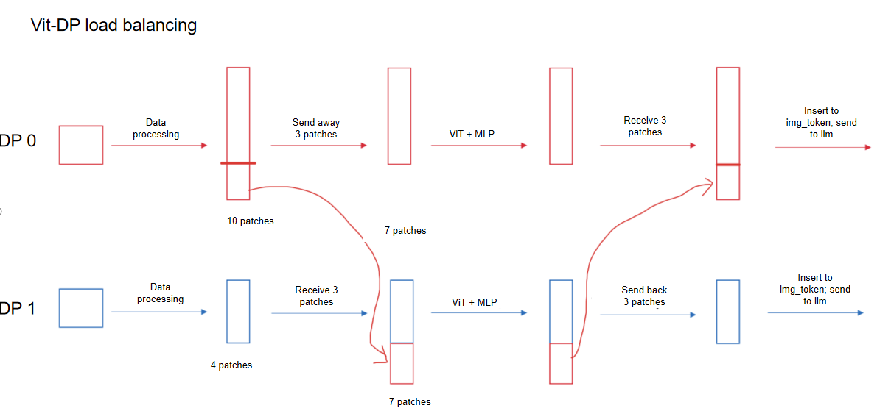

# Encoder Data Load Balancing (beta)

## Problem Analysis

In multimodal model training, taking InternVL as an example, when DP is greater than 1, different DP ranks process different numbers of image patches. Since the computational workload of the visual encoder (ViT) and MLP is directly proportional to the number of image patches, variations in patch counts lead to imbalanced computational loads across DP ranks. This results in "fast cards waiting for slow ranks" during the gradient allreduce phase, severely dragging down overall training efficiency.

**Typical Scenarios**

- Multimodal understanding models (such as InternVL, Qwen2-VL, etc.) with significant variations in image resolutions across samples
- The impact of load imbalance becomes more pronounced with greater DP
- Particularly noticeable when training data contains images of inconsistent sizes

## Solution

Load balancing of the encoder is achieved through alltoall communication: partial computation tasks from DP ranks with more patches are offloaded to ranks with fewer patches, balancing the computational workload across all ranks.



**Core Mechanism**

1. Before forward propagation, the encoder computation workload (number of patches) is gathered on each DP rank.
2. Through alltoall communication, excess encoder computation tasks are redistributed.
3. After the computation is complete, results are sent back to the original DP ranks via alltoall.
4. During gradient allreduce, the computation load on each rank is essentially balanced, eliminating waiting time.

## How to Use

### Enabling Parameters

Add the `--encoder-dp-balance` parameter to the model startup shell (currently only supports InternVL):

```shell
GPT_ARGS="
    ...
    --encoder-dp-balance \
"
```

### Applicable Conditions

| Condition | Description |
|------|------|
| Supported models | InternVL (more models will be extended in the future) |
| Parallel strategy | Takes effect when DP > 1 |
| Data characteristics | More effective when image resolutions vary significantly |

### Performance Expectations

- Can significantly reduce fast-rank wait time in scenarios with large image resolution differences.
- The alltoall communication itself introduces a small amount of additional overhead; the benefit may be less noticeable in well-balanced scenarios.
- Recommended to enable when training throughput is constrained by fast/slow card imbalance.

## Notes

1. This feature is currently in beta and supports only the InternVL model.
2. Enabling it introduces a small amount of communication overhead. It is recommended to use it only when load imbalance has been confirmed.
3. More models will be supported in future versions. Stay tuned to the [feature list](feature_list.md).
   