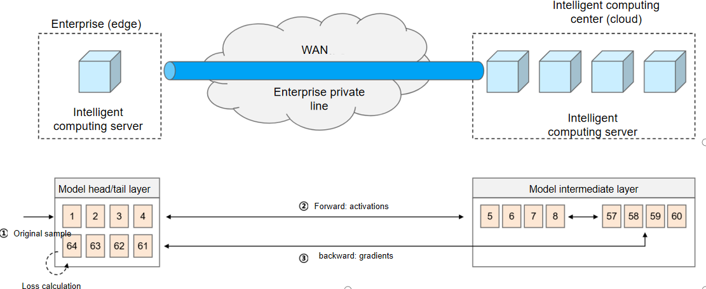
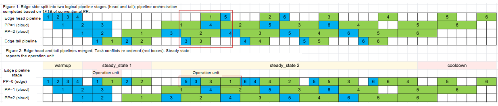
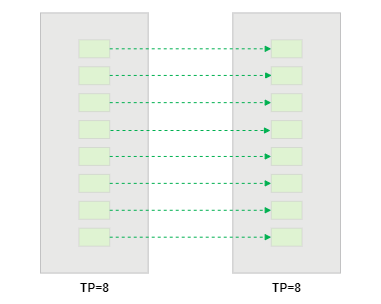
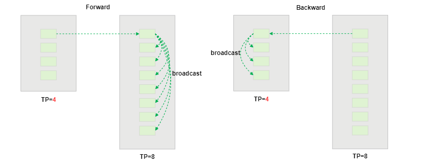
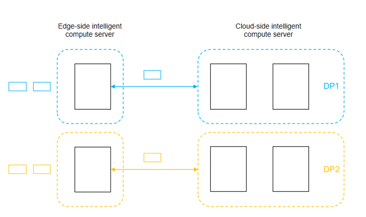
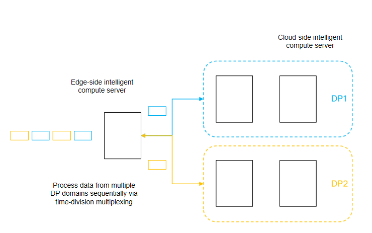
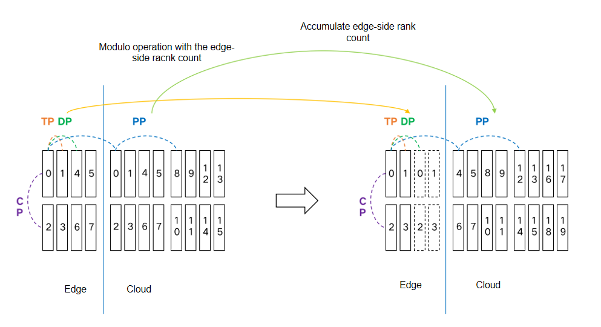

# Edge-Cloud Collaborative Distributed Training

## Use Cases

### Feature Introduction

Edge-cloud collaborative distributed training is a feature designed for "operators to provide data-secure computing power rental services".

Currently, there are two mainstream solutions for enterprise customers (such as finance, healthcare, etc.) who need large model fine-tuning:

- Self-built infrastructure: High capital investment (requires purchasing training servers, building data centers, etc.), making it difficult to promote among SMEs
- Leased cloud computing: Requires uploading training samples to the operator's cloud servers, which may not meet data privacy and compliance requirements.

Edge-cloud collaborative distributed training is a training solution that simultaneously satisfies "local lightweight computing" and "data not leaving the premises". Based on conventional PP solution, this approach uses a new model partitioning scheme: a small portion of the model that directly processes raw samples is deployed locally on the edge side, while the majority of the model that handles intermediate results is deployed on the operator's cloud side. Under this deployment, the edge side only needs minimal compute for the first and last layers, and raw samples never leave the premises.



The edge-cloud collaborative distributed training feature supports the following functions:

- Raw samples are not uploaded to the cloud: PP supports U-shaped model partitioning, where the first and last layers are colocated on the edge side, and the cloud side never accesses raw samples.
- Cross-domain collaborative training performance optimization: Achieves efficient training across edge-cloud connections through pipeline scheduling optimization and computation-communication overlap.
- Mismatched edge-cloud device counts: Supports asymmetric TP with P2P communication, enabling training when the edge and cloud sides have different numbers of devices.

### Principle

PP supports U-shaped model partitioning, meaning the first and last layers are deployed together in the first pipeline stage. In practice, the edge side can be designated as the first pipeline stage, so both the first and last layers are deployed on the edge side.

During training, the training process for a single sample is as follows:

- Forward propagation (edge): The edge side reads the raw sample, processes it through the first layer, converts it into activations, and transmits them to the cloud side.
- Forward propagation (cloud): After receiving the activations from the edge side, the cloud side processes the intermediate hidden layers and sends the results back to the edge.
- Forward propagation (edge side): The edge side completes processing through the last layer, computes the loss, and the forward pass is complete.

The backward propagation process is similar:

Result: Throughout the entire training process, the edge side only sends activations (during forward propagation) and gradients (during backward propagation) to the cloud side, and raw samples do not need to be uploaded to the cloud.

Note: Under U-shaped partitioning, each sample requires four processing steps on the edge side: ForwardStart (FS) on the first layer, ForwardEnd (FE) on the last layer, BackwardStart (BS) on the last layer, and BackwardEnd (BE) on the first layer.

### Cross-Domain Collaborative Training Performance Optimization

Function description: Optimizes pipeline scheduling for U-shaped model partitioning and achieves high computational efficiency across edge-cloud domains through computation-communication overlap.

Pipeline orchestration scheme: Under U-shaped model partitioning, compared to conventional PP (where the first pipeline stage handles FS and BE), the first stage must additionally handle FE and BS. The scheduling approach is designed as follows:

- Step 1: Split the first pipeline stage into two logical pipeline stages (one for the first layer and the other for the last layer) and perform pipeline scheduling using the conventional PP 1F1B schedule.
- Step 2: Merge the two logical pipeline stages. If the task queues of the two stages conflict, optimize the task execution order.

Example: `PP=3`, `mbn=4`


The upper part shows the two-level logical pipeline generated in step 1, and the lower part shows the final merged pipeline scheme in step 2. When merging the two logical stages on the edge side, task conflicts may occur. In the optimization phase, they are reordered as FS-FE-BS-BE. The rationale is that this execution order increases the tolerable edge-cloud communication latency: for example, the communication time for the forward pass of sample 3 can be overlapped with the forward computation time of sample 5, increasing tolerable latency and reducing computational efficiency loss in long-distance scenarios.

The edge-side pipeline orchestration rules are as follows (the cloud side follows the conventional PP scheduling for intermediate layers):

| Phase | Operation | Count | Example result |
| --- | --- | --- | --- |
| Warmup | FS | PP+1 | 4 |
| Steady state 1 | FEBS | floor((PP-1)*2/3 - 1/2 + 2) | 2 |
| Steady state 2 | FS-FE-BS-BE | mbn - floor((PP-1)*2/3 - 1/2 + 2) | 2 |
| Cooldown | BE | floor((PP-1)*2/3 - 1/2 + 2) | 2 |

Effect: This pipeline orchestration scheme ensures that no additional bubbles are introduced during the steady state phase. When the edge-cloud communication latency is less than `tf` (the forward computation time of a single micro-batch on the edge side), no additional bubbles occur during the steady state phase (though a small number may appear during warmup/cooldown).

### Asymmetric TP

Function description: Supports edge-side TP smaller than cloud-side TP when edge-side compute resources are insufficient.

Asymmetric TP implementation logic: Under symmetric TP, P2P communication occurs between adjacent ranks in the same PP group. For example, with `PP=2` and `TP=8`, the forward communication mapping is 0→8, 1→9, 2→10, etc. Unlike symmetric TP, asymmetric TP's P2P communication works as follows:

- Step 1: Within the current TP group, the rank with the smallest ID sends data to the rank with the smallest ID in the next TP group.
- Step 2: After receiving the data, the smallest-ID rank in the next TP group shares it with all ranks in its TP group via broadcast.

Example: `PP=2`, `TP=8`, symmetric TP



Example: `PP=2`, `TP=4`/`TP=8`, asymmetric TP



Effect: Since Megatron's existing logic performs AllReduce communication within the TP group before P2P communication, only a single rank needs to communicate to pass the complete data to the next PP stage. This P2P approach guarantees correctness for cross-pipeline communication under asymmetric TP.

### Asymmetric DP

Function description: Supports edge-side DP smaller than cloud-side DP when edge-side nodes are insufficient.
Asymmetric DP implementation logic: Under symmetric DP, nodes or ranks in different DP domains process their respective data through card multiplexing. Under asymmetric DP, the edge side processes data from multiple DP domains via time-division multiplexing and communicates with the cloud side separately.

Example: `PP=3`, `TP=8`, `DP=2`, symmetric DP



Example: `PP=3`, `TP=8`, `DP=1`/`DP=2`, asymmetric DP



For communication group initialization, the existing Megatron rank group generation logic is reused. First, rank groups are generated for the edge and cloud sides separately under the symmetric DP assumption. Then, the edge-side rank groups are recomputed and merged, while the cloud-side rank groups are offset by the number of edge-side devices.



For edge-side gradient handling, Megatron's existing logic accumulates gradients when processing data from multiple DP domains via time-division multiplexing. This effectively means the edge side already performs an AllReduce-like operation on the gradients, requiring only a final average of the accumulated gradient sum.

Effect: The edge side processes data from multiple DP domains via time-division multiplexing and communicates separately with the cloud side. Data processing and communication order follow the PP group ranks (different PP groups handle different DP domains), ensuring correctness for multi-DP-domain data processing and communication.

## How to Use

This document uses the Qwen2.5VL-32B-Instruct model as an example (VIT: 32 hidden layers, LLM: 64 hidden layers) to introduce the method for enabling the edge-cloud feature. The specific steps are as follows:

1. Complete the environment installation by referring to [MindSpeed MM Installation Guide](../pytorch/install_guide.md).

2. Download the corresponding [Qwen2.5-VL-32B-Instruct](https://huggingface.co/Qwen/Qwen2.5-VL-32B-Instruct) weights from Hugging Face and place them in the `./ckpt/hf_path` directory.

   > [!NOTE]
   >
   > If you cannot access the HuggingFace community to download resources, it is recommended to download them from ModelScope. Pay attention to the correctness and security of the files to be downloaded.

3. Perform weight conversion to convert Hugging Face weights into the Megatron-Mcore format.

    After the edge-cloud feature is enabled, the number of edge-side devices is allowed to be smaller than the cloud-side TP size, where the edge-side TP size equals the number of edge-side devices. During weight conversion, the edge side and the cloud side use their respective TP sizes for conversion.

    Taking 2 edge-side devices and 32 cloud-side devices as an example, the specific steps for weight conversion with PP=5, edge-side TP=2/DP=1, cloud-side TP=4/DP=2 are as follows.

    Step 1: Perform weight conversion on the edge side with TP=2 and PP=5.

    ```json
    mm-convert Qwen2_5_VLConverter hf_to_mm_ldt \
    --cfg.mm_dir "ckpt/mm_path/Qwen2.5-VL-32B-Instruct-edge" \
    --cfg.hf_config.hf_dir "ckpt/hf_path/Qwen2.5-VL-32B-Instruct" \
    --cfg.parallel_config.llm_pp_layers [[0,0,0,0,0],[0,16,16,16,16],[0,0,0,0,0]] \
    --cfg.parallel_config.vit_pp_layers [[3,7,7,7,7],[1,0,0,0,0],[0,0,0,0,0]] \
    --cfg.parallel_config.tp_size 2
    ```

    Step 2: Perform weight conversion on the cloud side with TP=4 and PP=5.

    ```json
    mm-convert Qwen2_5_VLConverter hf_to_mm_ldt \
    --cfg.mm_dir "ckpt/mm_path/Qwen2.5-VL-32B-Instruct-cloud" \
    --cfg.hf_config.hf_dir "ckpt/hf_path/Qwen2.5-VL-32B-Instruct" \
    --cfg.parallel_config.llm_pp_layers [[0,0,0,0,0],[0,16,16,16,16],[0,0,0,0,0]] \
    --cfg.parallel_config.vit_pp_layers [[3,7,7,7,7],[1,0,0,0,0],[0,0,0,0,0]] \
    --cfg.parallel_config.tp_size 4
    ```

    The parameters are described as follows:

    | Parameter              | Description                                       | Required |
    | ----------------- | ------------------------------------------ | ---- |
    | `--cfg.mm_dir`      | Megatron weight save path           | Yes   |
    | `--cfg.hf_config.hf_dir` | Original Hugging Face model weight path                         | Yes   |
    | `--cfg.parallel_config.llm_pp_layers`| Number of PP layers partitioned per device in the LLM module (required, type: list[Annotated[int, Ge(ge=0)]])            | Yes   |
    | `--cfg.parallel_config.vit_pp_layers`  | Number of PP layers partitioned per device in the VIT module (required, type: list[Annotated[int, Ge(ge=0)]])          | Yes   |
    | `--cfg.parallel_config.tp_size` | TP size    | Yes   |

    The number of hidden layers at each pipeline stage is specified via `--cfg.parallel_config.llm_pp_layers`. The first element of the two sublists indicates the number of LLM hidden layers deployed on the pipeline head and tail, which are actually deployed on the same device.

4. Download the dataset (using the COCO2017 dataset as an example).

    Download the [COCO2017](https://cocodataset.org/#download) dataset and extract it into the `./data/COCO2017` folder under the project directory.

    Obtain the description file of the image dataset ([LLaVA-Instruct-150K](https://huggingface.co/datasets/liuhaotian/LLaVA-Instruct-150K/tree/main)) and download it to the `./data/` directory.

    Run the data conversion script `python mindspeed_mm/fsdp/tools/data_tool/llava_instruct_2_mllm_demo_format.py`. The converted reference data directory structure is as follows:

    ```bash
    $playground
    ├── data
        ├── COCO2017
            ├── train2017

        ├── llava_instruct_150k.json
        ├── mllm_format_llava_instruct_data.json
        ...
    ```

5. Start fine-tuning.

    Add the following parameters to the model configuration file `examples/qwen2.5vl/model_32b.json` to enable edge-cloud collaborative distributed training:

    ```json
    {
        ...
        "patch": {
            "layerwise_disaggregated_training": true
        }
    }
    ```

    At the same time, modify the following parameters in `examples/qwen2.5vl/model_32b.json` to configure non-uniform PP partitioning. Configure the `pipeline_num_layers` parameters of `vision_encoder` and `text_decoder` as follows: VPP0 deploys the VIT model with layer counts `3,7,7,7,7`; starting from VPP1, the first pipeline stage deploys the VIT tail layer + `text_decoder` embedding layer + `text_decoder` unembedding layer, and the remaining stages deploy the intermediate hidden layers of the `text_decoder` with layer counts `16,16,16,16`.

    ```json
    {
        "image_encoder": {
            "vision_encoder": {
                "pipeline_num_layers": [[3,7,7,7,7],[1,0,0,0,0],[0,0,0,0,0]],
                ...
            },
        },
        "text_decoder": {
            "pipeline_num_layers": [[0,0,0,0,0],[0,16,16,16,16],[0,0,0,0,0]],
            ...
        },
        ...
    }
    ```

    Configure the model fine-tuning script. For detailed configuration, refer to [Qwen2.5VL-32B fine-tuning script](../../../examples/qwen2.5vl/finetune_qwen2_5_vl_32b.sh). To enable the edge-cloud collaboration feature, add the following parameters to the training script:

    ```shell
    --virtual-pipeline-model-parallel-size 3         # Number of virtual pipeline stages. Must be set to 3.
    ```

    After the relevant parameters are configured, run the fine-tuning script:

    ```shell
    bash examples/qwen2.5vl/finetune_qwen2_5_vl_32b.sh
    ```

## Usage Constraints

### Model Scope

- The Qwen2.5VL 32B model is supported.
- MoE models are not supported yet.

### Other Constraints

- PP=1 is not supported.
- LoRA is not supported.
- Conventional VPP is not supported yet: the `--virtual-pipeline-model-parallel-size` parameter must be set to `3` to enable co-deployment of the first and last layers.
- In asymmetric TP scenarios, only DP=1 is supported.
- In asymmetric DP scenarios, only edge-side DP=1 is supported.
- In scenarios where asymmetric TP and asymmetric DP are enabled simultaneously, only supports even TP values, and edge-side TP must be divisible by cloud-side TP.

## Notes

- The parallel configuration of training parameters (such as TP/PP) must be consistent with the configuration used during weight conversion.
- Edge-cloud collaborative distributed training adopts the U-shaped partitioning scheme, where the first and last model layers are colocated on the edge side, so raw samples do not need to be uploaded to the cloud.
- Cross-domain collaborative training achieves efficient edge-cloud training through pipeline scheduling optimization and computation-communication overlap.
  