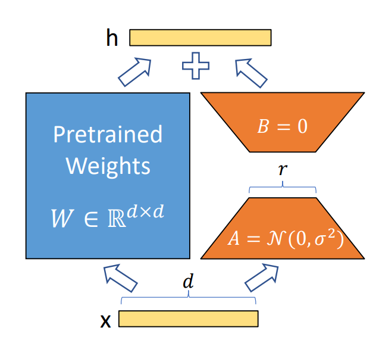

# LoRA Fine-Tuning

LoRA (Low-Rank Adaptation) is an efficient model fine-tuning method widely used in pre-trained deep learning models. By adding low-rank matrices to the weights, LoRA makes the fine-tuning process more lightweight, saving computational resources and storage space.

## Principles of LoRA

The core idea of LoRA is to decompose model parameter updates into a low-rank form. The specific steps are as follows:

- **Decomposing Weight Updates**: In traditional fine-tuning methods, model weights are updated directly. LoRA instead introduces two low-rank matrices $A$ and $B$ into each layer's weight matrix as a substitute:
$
W' = W + A \cdot B
$



   $W'$ is the updated weight, $W$ is the original weight, and $A$ and $B$ are the low-rank matrices to be learned.

- **Reducing Parameter Count**: Since the rank of $A$ and $B$ is low, the number of required parameters is significantly reduced, saving storage and computational costs.

### LoRA Fine-Tuning

How to enable LoRA fine-tuning in MindSpeed MM:

Add LoRA fine-tuning parameters to the model shell script.
For example, you can add the `--lora-target-modules` parameter to the fine-tuning task script of `Qwen2-VL` to enable LoRA.

```shell
--lora-target-modules linear_qkv linear_proj linear_fc1 linear_fc2
```

### LoRA Weight Merging

How to merge LoRA weights with the original weights:
For example, you can set parameters in the merge script `merge_lora` of `Qwen2-VL` to perform the merge, where `base_save_dir`, `lora_save_dir`, and `merge_save_dir` are set to the original weight directory, the LoRA weight directory, and the merged weight save directory, respectively. `use_npu` sets whether to enable NPU acceleration.

#### Parameter Description

- **`--load`**:
  If this parameter is not specified to load weights, the model initializes weights randomly.

- **`--load-base-model`**:
  Used in conjunction with the `--load` parameter during continued training. `--load` loads the LoRA weights from the `CKPT_SAVE_DIR` path, and `--load-base-model` loads the original base model weights from the `CKPT_LOAD_DIR` path.

- **`--lora-r`**:
LoRA rank, representing the dimension of the low-rank matrix. A lower rank value means the model uses fewer parameters for updates during training, thereby reducing computation and memory consumption. However, an excessively low rank may limit the model's expressive power.

- **`--lora-alpha`**:
Controls the scaling factor of the LoRA weights' influence on the original weights. A higher value indicates a greater influence. It is generally recommended to keep `α/r` at 2.

- **`--lora-dropout`**:
Dropout ratio applied within the LoRA module, defaulting to `0`.

- **`--lora-target-modules`**:
  Select the modules to which LoRA will be added.
  Optional modules for Mcore models include `linear_qkv`, `linear_proj`, `linear_fc1`, and `linear_fc2`. For the legacy model, optional modules include: `query_key_value`, `dense`, `dense_h_to_4h`, `dense_4h_to_h`. In multimodal scenarios, the appropriate fine-tuning modules should be selected based on the model architecture.

- **`--save`**:
  Path for saving model weights. When LoRA fine-tuning is enabled, only the weights of the fine-tuned modules are saved.

### Notes

- **Frozen Modules**: In multimodal models, some module parameters may be frozen, and frozen modules will not participate in LoRA fine-tuning.

## Reference

- [LoRA: Low-Rank Adaptation of Large Language Models](https://arxiv.org/abs/2106.09685)
