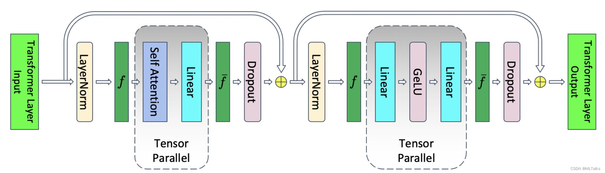

# Qwen2VL/InternVL Support for Non-Uniform SP Partitioning

## Problem Analysis

Sequence Parallelism (SP) is a parallelization technique designed for long-sequence data processing, offering significant advantages when handling long sequences. Multimodal models present numerous scenarios with non-uniform sequence lengths, requiring corresponding adaptations.

## Solution

SP primarily operates on the Dropout and LayerNorm modules within the TransformerLayer, performing non-uniform partitioning of data along the sequence dimension.



## How to Use

(Currently, Qwen2VL and InternVL series models are supported.)

Enable `TP` in `examples/qwen2vl/finetune_qwen2vl_72b.sh` and add the following parameters to `GPT_ARGS`:

```shell
    --sequence-parallel
    # add only if unaligned SP is required
    --unaligned-linear
```
