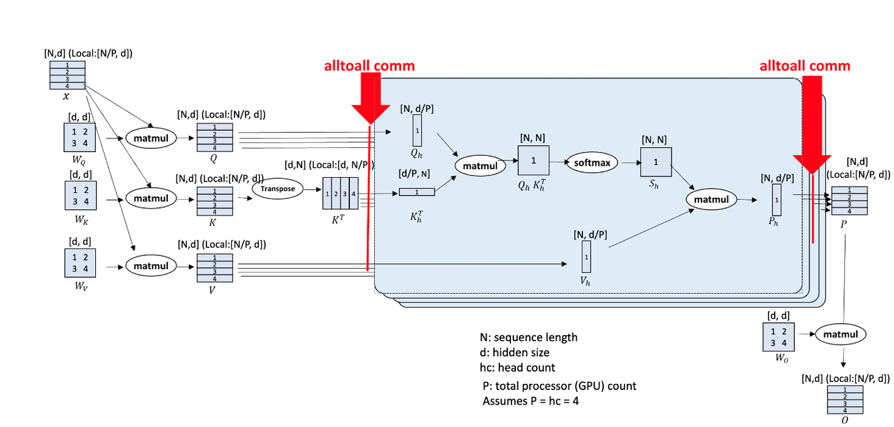

# QwenVL Series Support For Non-uniform Ulysses CP Partitioning

## Problem Analysis

Context Parallelism (CP) is a parallelization technique designed for long-sequence data processing, offering significant advantages when handling long sequences. Multimodal models present numerous scenarios with non-uniform sequence lengths, requiring corresponding adaptations.

## Solution

The Ulysses CP algorithm is based on the All-to-All operator. It performs non-uniform partitioning of the All-to-All operator's input list and output list according to the sequence length, thereby enabling the Ulysses algorithm.



## How to Use

(Currently, Qwen2VL and Qwen2.5VL are supported.)

### Configuration Example (qwen2vl72b)

1. Set the CP size in `examples/qwen2vl/finetune_qwen2vl_72b.sh`. The default value in the script is `1`.

    ```shell
    CP=1
    ```

2. Add the following to `GPT_ARGS` in `examples/qwen2vl/finetune_qwen2vl_72b.sh`.

    ```shell
        --context-parallel-algo ulysses_cp_algo
    ```
