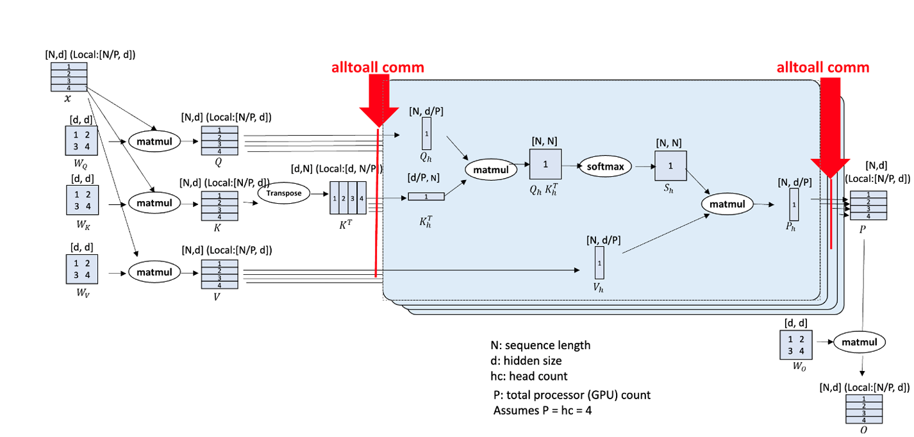

# Non-uniform Ulysses CP Partitioning

## Problem Analysis

Context Parallelism (CP) is a parallelization technique designed for long-sequence data processing, offering significant advantages when handling long sequences. Multimodal models present numerous scenarios with non-uniform sequence lengths, requiring corresponding adaptations.

## Solution

The Ulysses CP algorithm is based on the All-to-All operator. It performs non-uniform partitioning of the All-to-All operator's input list and output list according to the sequence length, thereby enabling the Ulysses algorithm.


## How to Use

Ulysses CP is supported on both the FSDP2 and MCORE backends, and can handle uneven sequence lengths across cards without requiring additional configuration.

### Native FSDP2 (Recommended)

Set the Ulysses parallel size in the `parallel` section of the model YAML configuration file, and set the attention implementation to `flash_attention_2`:

```yaml
parallel:
  ulysses_parallel_size: 2   # Default is 1; values greater than 1 enable Ulysses CP

model:
  attn_implementation: flash_attention_2
```

- `ulysses_parallel_size`:  Ulysses sequence parallel size. Default is `1`; values greater than 1 enable Ulysses CP.
- When Ulysses CP is enabled,`model.attn_implementation` must be `flash_attention_2`.

For reference, see `examples/qwen3vl/qwen3vl_30B_config_v1.yaml`.

### MCORE（Megatron）

Using qwen2.5vl72b as an example:

1. Set the CP size in `examples/qwen2.5vl/finetune_qwen2_5_vl_72b.sh` (default is `1`):

    ```shell
    CP=1
    ```

2. Add the following to `GPT_ARGS` in `examples/qwen2.5vl/finetune_qwen2_5_vl_72b.sh`:

    ```shell
        --context-parallel-algo ulysses_cp_algo
    ```
