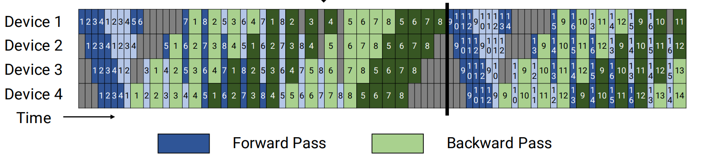

# Virtual Pipeline Parallelism (VPP)

## Problem Analysis

The Pipedream pipeline parallelism has an excessively large partitioning granularity, resulting in many bubbles during execution. There is still room for improvement in computational resource utilization.

## Solution

Further refine the computation to reduce bubbles.

### Technical Approach

With the number of devices unchanged, create more pipeline stages, trading increased communication overhead for a reduced bubble ratio.



For more details, see [the paper](https://people.eecs.berkeley.edu/~matei/papers/2021/sc_megatron_lm.pdf).

For easy understanding, here is an example: The Qwen2vl-7B model has 32 vision module layers and 28 language module layers. Set tensor parallelism size to 1, pipeline parallelism size to 4, and virtual pipeline parallelism size to 3. The model will be divided into `4 * 3 = 12` stages. The number of layers in each stage can be customized, supporting non-uniform partitioning.

- Vision module partitioning: `[[10, 10, 10, 2],[0, 0, 0, 0],[0, 0, 0, 0]]`,

- Language module partitioning: `[[0, 0, 0, 1],[4, 4, 4, 4],[4, 3, 2, 2]]`

The following shows the model layer distribution for each device and each VPP stage, where `D` represents device and `V` represents VPP.

    D0V0: 10 ViT layers + 0 LLM layers
    D0V1: 0 ViT layers + 4 LLM layers
    D0V2: 0 ViT layers + 4 LLM layers
    D1V0: 10 ViT layers + 0 LLM layers
    D1V1: 0 ViT layers + 4 LLM layers
    D1V2: 0 ViT layers + 3 LLM layers
    D2V0: 10 ViT layers + 0 LLM layers
    D2V1: 0 ViT layers + 4 LLM layers
    D2V2: 0 ViT layers + 2 LLM layers
    D3V0: 2 ViT layers + 1 LLM layer
    D3V1: 0 ViT layers + 4 LLM layers
    D3V2: 0 ViT layers + 2 LLM layers

The forward order is: D0V0 -> D1V0 -> D2V0 -> D3V0 -> D0V1 -> D1V1 -> D2V1 -> D3V1 -> D0V2 -> D1V2 -> D2V2 -> D3V2

## Use Case

To further reduce the bubble ratio and improve performance

## How to Use

Taking Qwen2vl-7B as an example:

1. Configure the VPP partitioning rules and run the weight conversion tool.

    ```shell
    mm-convert  Qwen2VLConverter hf_to_mm \
    --cfg.mm_dir "ckpt/mm_path/Qwen2-VL-7B-Instruct-vpp" \
    --cfg.hf_config.hf_dir "ckpt/hf_path/Qwen2-VL-7B-Instruct" \
    --cfg.parallel_config.llm_pp_layers [[0,0,0,1],[4,4,4,4],[4,3,2,2]] \
    --cfg.parallel_config.vit_pp_layers [[10,10,10,2],[0,0,0,0],[0,0,0,0]] \
    --cfg.parallel_config.tp_size 1
    ```

2. Modify `pipeline_num_layers` in `model.json`, which must be consistent with the layers used during weight conversion.

    ```shell
    # text_decoder
    "pipeline_num_layers": [[0, 0, 0, 1],[4, 4, 4, 4],[4, 3, 2, 2]]

    # vision_encoder
    "pipeline_num_layers": [[10, 10, 10, 2],[0, 0, 0, 0],[0, 0, 0, 0]]
    ```

3. Add VPP parameters in the shell. Because Megatron natively only supports uniform VPP partitioning, to support non-uniform VPP partitioning, you need to import the `VP_SIZE` variable in the shell script. `VP_SIZE` should equal the length of `pipeline_num_layers`. The `--virtual-pipeline-model-parallel-size` parameter is also used to enable the VPP feature, and its value should be the same as `VP_SIZE`.

    ```shell
    export VP_SIZE=3
    GPT_ARGS="
        --virtual-pipeline-model-parallel-size 3
        ..."
    ```

## Effectiveness

The bubble ratio is further reduced.

## Notes

1. MindSpeed MM has optimized VPP to support non-uniform partitioning. Users can modify the weight conversion script, `model.json`, and shell to customize the VPP partitioning method.

2. Megatron's VPP affects the weight partitioning method. When saving or loading weights, ensure that the VPP configuration is consistent for successful loading.
