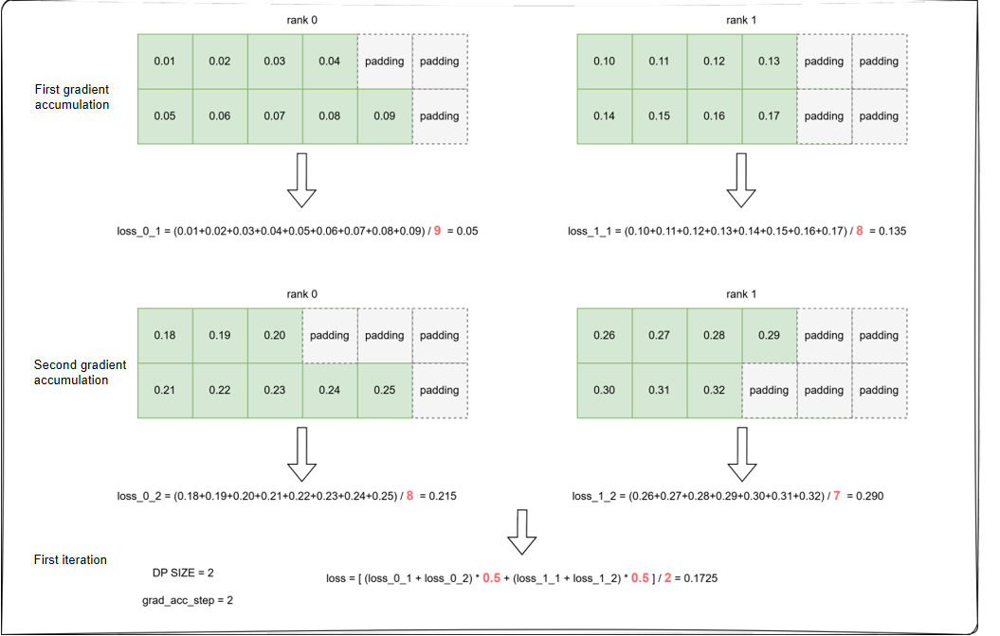
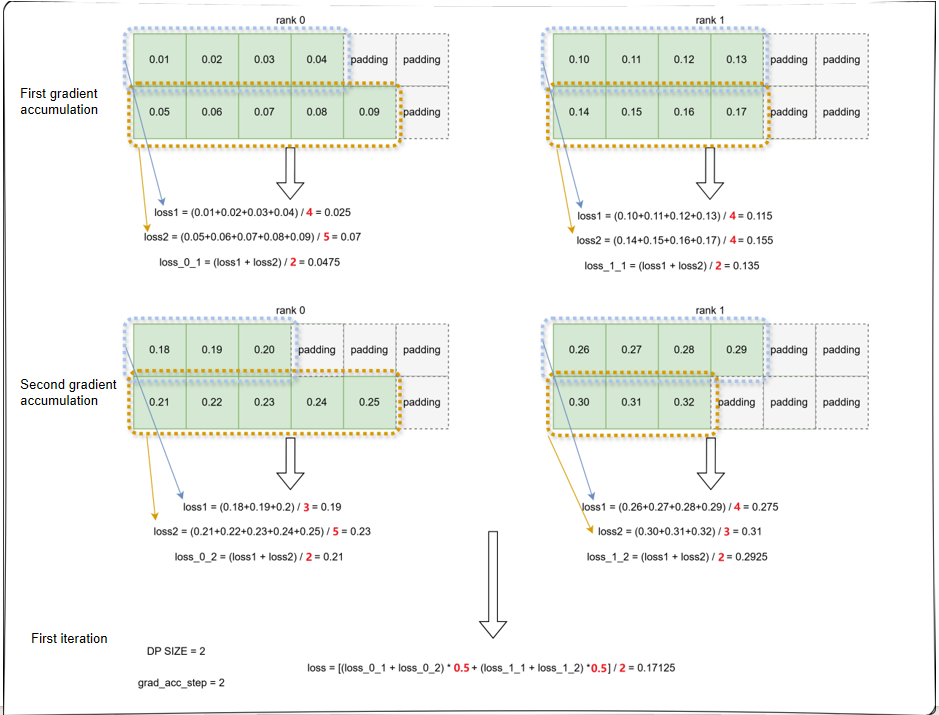
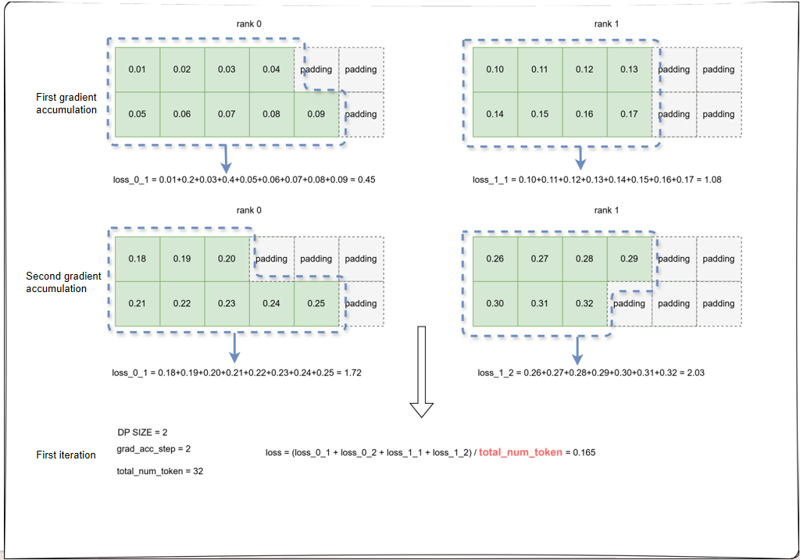

# VLM Loss Calculation Types

## Problem Analysis

Vision-Language Models (VLMs) typically use cross-entropy loss as their training objective. However, an issue exists in the implementation of current mainstream model repositories (such as Hugging Face Transformers): when the global batch size is fixed, using different combinations of `micro_batch_size` and gradient accumulation steps (e.g., `micro_batch_size=32`, `grad_acc_steps=2` vs. `micro_batch_size=16`, `grad_acc_steps=4`) leads to significant differences in the loss curve and final values during model convergence, even with identical hyperparameters and training data.. For related discussion, refer to [gradient](https://unsloth.ai/blog/gradient).

> Note: Transformers has fixed this issue in some models. However, in models like Qwen2.5-VL and Qwen3-VL, the problem persists due to incorrect parameter passing in related code or explicitly not computing `num_token_in_batch`.

## Solution

For VLMs, MindSpeed MM provides three Loss calculation methods. Assuming a training configuration of `micro_batch_size=2`, `grad_acc_steps=2`, using two cards for training (i.e., `DP=2`), the steps for each of the three loss computation methods are as follows:

### 1. Default Method

Consistent with the Transformers implementation. The calculation process is as follows:

- **Step 1**: Average the cross-entropy loss over valid tokens within a micro-batch.
- **Step 2**: Average over the gradient accumulation dimension.
- **Step 3**: Average over the data parallelism (DP) domain.



### 2. Calculate Per Sample Loss

The calculation process is as follows:

- **Step 1**: Average the cross-entropy loss over valid tokens within a single sample.
- **Step 2**: Average over the micro-batch dimension.
- **Step 3**: Average over the gradient accumulation dimension.
- **Step 4**: Average over the DP domain.



### 3. Calculate Per Token Loss

The calculation process is as follows:

- Directly accumulate the cross-entropy loss over all valid tokens in the global batch.
- Divide the final result by the total number of valid tokens in the global batch.



## How to Use

### Megatron Backend

For models using `pretrain_vlm.py` as the entry point, enable loss calculation as follows:

### 1. Default Calculation Method

In the model training script, **do not enable** any of the following parameters:

- `--calculate-per-sample-loss` (for per-sample loss)
- `--calculate-per-token-loss` (for per-token loss)

### 2. Calculate Per Sample Loss

Enable the following parameter in the model training script:

```shell
GPT_ARGS="
    ...
    --calculate-per-sample-loss \
"
```

### 3. Calculate Per Token Loss

Enable the following parameter in the model training script:

```shell
GPT_ARGS="
    ...
    --calculate-per-token-loss \
"
```

### FSDP2 Backend

For models using `pretrain_transformers.py` as the training entry point, enable loss calculation by adding the following field in `model.json`:

```json
"loss_cfg": {
    "loss_type": "default/per_sample_loss/per_token_loss"
}
```

`loss_type` can be set to the following values:

- `default`: Default calculation method
- `per_sample_loss`: Calculate per sample loss
- `per_token_loss`: Calculate per token loss

### Notes

1. If using the Megatron backend, the `--calculate-per-sample-loss` and `--calculate-per-token-loss` parameters cannot be used simultaneously.
2. Choosing an inappropriate loss computation method can significantly impact downstream task evaluation. Users need to select the appropriate computation method based on the sample distribution of their actual dataset. If the training dataset samples are unevenly distributed, with some samples having very long responses and others having very short responses (or even a single token), calculating loss per token will give more weight to samples with a larger number of target tokens, thereby introducing imbalance between different samples. This means longer outputs will be trained more thoroughly.
