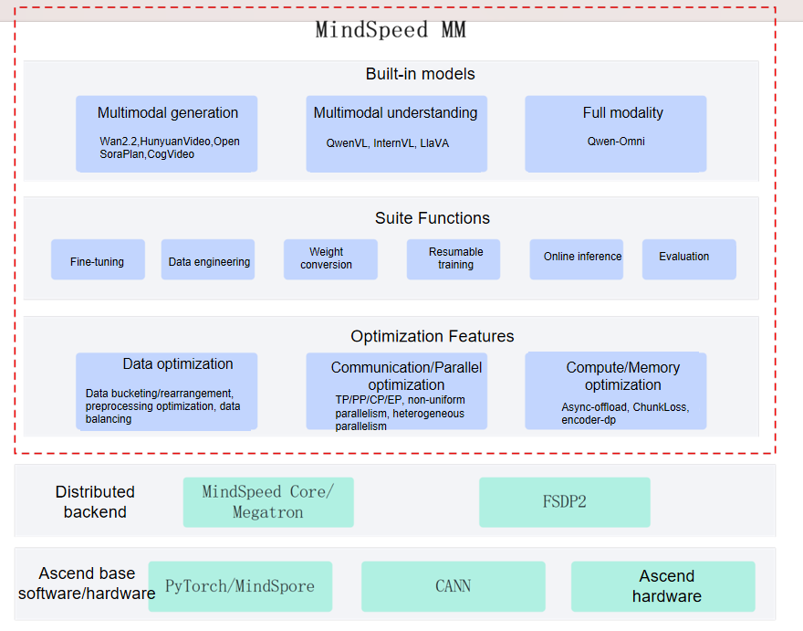

# Introduction

## Overview

MindSpeed MM is a multimodal model suite for Ascend, designed for large-scale distributed training, supporting both multimodal generation and understanding. It aims to provide an end-to-end multimodal training solution for Huawei Ascend chips, featuring pre-integrated mainstream models, data engineering, distributed training and acceleration, as well as capabilities for pre-training, fine-tuning, and online inference tasks.

## MindSpeed MM Architecture

The overall architecture of the Ascend MindSpeed MM-based training solution is illustrated in the figure below, which is divided into three layers:

- **Ascend basic hardware and software**. This includes hardware such as Ascend AI Processors and Ascend servers, providing powerful parallel computing capabilities for massive multimodal data computation and model training; CANN (Compute Architecture for Neural Networks), which serves as the software engine for Ascend AI Processors, offering highly optimized basic operators and communication libraries (HCCL); and PyTorch + torch_npu, which supports the industry-standard PyTorch deep learning framework and seamlessly connects PyTorch operations to Ascend hardware through the torch_npu plugin, enabling developers to leverage Ascend's computational advantages using familiar programming paradigms and APIs.

- **Distributed backend**. This includes dual-backend support from the distributed training frameworks MindSpeed Core/Megatron and FSDP2, as well as various parallel strategies such as data parallelism, model parallelism, and hybrid parallelism, to provide efficient distributed training capabilities and support the training and optimization of large-scale models.

- **MindSpeed MM**. This provides full-process capabilities including multimodal data processing, model building, and distributed training, fully leveraging the advantages of Ascend hardware to support the efficient training and deployment of large-scale multimodal models.
The architectural relationship of MindSpeed MM is shown in the figure.

Figure 1 MindSpeed MM architecture

## Features

MindSpeed MM consists of three parts: pre-built models, functional suites, and multimodal optimization features.

 **Mainstream open-source multimodal models ready to use**: Over 20 models, including generative models such as Wan and HunyuanVideo, understanding models such as QwenVL and InternVL, and full-modal models such as Qwen-Omni are supported. It provides launch scripts for pretraining, fine-tuning, evaluation, and online inference for multimodal generation, comprehension, and full-modality tasks, allowing you to start training tasks with a single click.

 **Rich functional components**: Divided into high-level abstract classes (`assembly` classes), atomic model classes, and common components. `SoRAModel`, `VLModel`, and `TransformersModel` are high-level wrappers for multimodal generation, comprehension, and Transformer models, respectively. In addition, there are basic atomic classes such as `text_decoder`, `audio`, and `dit`, and common components, including norm, rope, embedding, and spec. It provides a complete toolchain covering the model lifecycle, including data preprocessing and engineering, large-scale pre-training, instruction fine-tuning and domain adaptation, model weight conversion, high-performance online inference, and comprehensive automated evaluation.

**Multimodal acceleration features**: Includes multi-dimensional efficient parallel algorithms (DP/PP/TP/CP/EP/FSDP2), communication-computation overlap, multimodal load balancing, dynamic memory management (recomputation, hierarchical storage), long-sequence optimization, and more to ensure maximum training efficiency.
