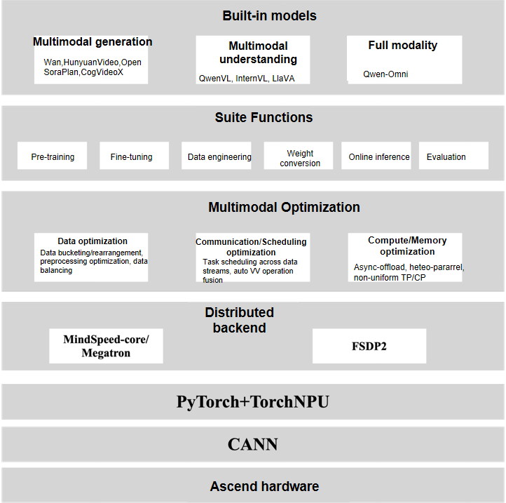
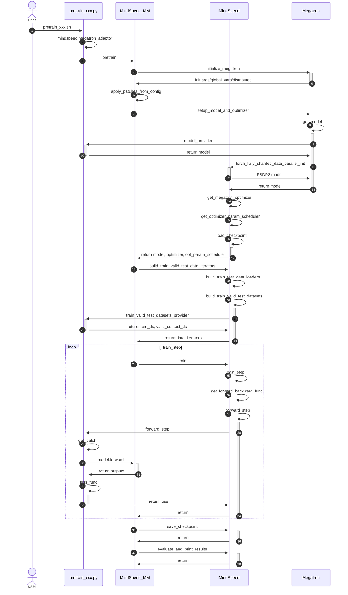

# Introduction to the MindSpeed MM Training Framework

<!-- md-trans-meta sourceCommit=unknown translatedAt=2026-05-26T07:09:19.398Z pushedAt=2026-05-26T07:32:09.371Z -->
## Overall Architecture of MindSpeed MM

The overall architecture of the Ascend MindSpeed MM training solution is illustrated in the figure below, which is divided into three layers:

- Ascend hardware infrastructure layer: This is the physical foundation of the entire solution, providing powerful parallel computing capabilities for massive multimodal data computation and model training.
- Software foundation capability layer: Serving as a critical bridge connecting the upper-layer AI suite with the underlying hardware, it is responsible for unleashing hardware computing power.

  - CANN (Compute Architecture for Neural Networks): Serving as the software engine for Ascend AI processors, it provides highly optimized foundational operators and communication libraries. It not only efficiently maps various operations in models to hardware instructions but also enables high-speed communication between devices through the Huawei Collective Communication Library (HCCL), which is the core for achieving near-linear speedup ratios.
  - PyTorch + torch_npu: It supports the industry-standard PyTorch framework and seamlessly bridges PyTorch operations to Ascend hardware via the torch_npu plugin, allowing developers to leverage Ascend's computing power with familiar programming paradigms and APIs.

- Multimodal core suite layer: Integrates the self-developed high-performance training suite, MindSpeed MM.

The components of MindSpeed MM include pre-built models, model components, multimodal optimization features, and dual distributed backends.

- Mainstream open-source multimodal models ready to use: Over 20 models, including generative models such as Wan and HunyuanVideo, understanding models such as QwenVL and InternVL, and full-modal models such as Qwen-Omni are supported. It provides launch scripts for pre-training, fine-tuning, evaluation, and online inference for multimodal generation, comprehension, and full-modality tasks, allowing you to start training tasks with a single click.
- Rich functional components: Divided into high-level abstract classes (`assembly` classes), atomic model classes, and common components. `SoRAModel`, `VLModel`, and `TransformersModel` are high-level wrappers for multimodal generation, comprehension, and Transformer models, respectively. In addition, there are basic atomic classes such as `text_decoder`, `audio`, and `dit`, and common components, including norm, rope, embedding, and spec.
- Toolchain covering the model lifecycle: Includes data preprocessing and engineering, large-scale pre-training, instruction tuning and domain adaptation, model weight conversion, high-performance online inference, and comprehensive automated evaluation.
- Multimodal acceleration features: Include heterogeneous data pipeline optimization, efficient parallel algorithms, computation-communication overlap, multimodal load balancing, dynamic memory management (recomputation, hierarchical storage), and long-sequence optimization, ensuring maximum training efficiency.

## MindSpeed MM Dual-Backend

MindSpeed MM is designed to support dual training backends: the PTD (Pipeline, Tensor, Data) parallelism based on MindSpeed Core (i.e., the Megatron-LM kernel), and the fully sharded data parallelism strategy based on FSDP2 (Fully Sharded Data Parallel 2). From its inception, the framework has been driven by the core goal of building a multimodal model suite with state-of-art training and inference performance. Therefore, in its early stages, it integrated and deeply optimized the PTD hybrid parallelism capabilities provided by Megatron to fully leverage its efficient scalability and system stability for ultra-large-scale model training.

With the rapid iteration of computing hardware and the widespread adoption of high-speed interconnect network technologies in recent years, the communication bottleneck in training tasks has gradually eased. At the same time, multimodal model architectures have become increasingly diverse and complex, imposing higher demands on the flexibility and adaptation efficiency of training frameworks. Against this backdrop, FSDP2, as a next-generation distributed training strategy, has emerged as an ideal choice for rapidly adapting to various emerging architectures due to its advantages such as high decoupling between parallel strategy and model structure, simple implementation, and ease of extension. To better support the growing number of emerging multimodal models and reduce user adoption and migration costs, MindSpeed MM has further enhanced its compatibility with and optimization for FSDP2 on top of its existing Megatron backend. Currently, FSDP2 as a parallel backend has been successfully applied to training tasks for multiple open-source multimodal models, including Wan2.2 and Qwen3VL, effectively balancing training efficiency and code maintainability.

In terms of usage, the current training process for the FSDP2 backend is still embedded within Megatron training. Therefore, training scripts need to include parameters such as `GPT_ARGS`, `MM_ARGS`, and `OUTPUT_ARGS` to pass Megatron's parameter validation. When training with FSDP2, `--use-torch-fsdp2` must be passed to indicate the use of the FSDP2 backend. For specific FSDP2 configurations, refer to the [FSDP2 Feature Guide](../features/fsdp2.md).

## MindSpeed MM Training Process

The general training workflow of MindSpeed MM is illustrated in the figure and consists of the following components: the training bash script, the training entry point, the MindSpeed MM interface, the MindSpeed-Core interface, and the Megatron interface.

- Training bash script: Located at `examples/xxx_model/pretrain_xxx.sh`. Users need to configure `DISTRIBUTED_ARGS`, `model.json`, and `data.json` according to the README before executing the script.
- Training entry: `mindspeed_mm/pretrain_xxx.py`, such as `pretrain_vlm.py`, `pretrain_sora.py`, and `pretrain_transformers.py`, which are the training entry points for multimodal understanding models, generative models, and Transformers models, respectively. These entry points primarily implement the `model_provider`, `data_provider`, and `forward_step` methods to provide capabilities such as model initialization, data handling, and forward pass.
- Unified MindSpeed MM training entry: `mindspeed_mm/training.py`. This provides the most fundamental and generic methods for `pretrain`, `train`, and `train_step`.
- Megatron interface: Primarily relies on the Megatron-adapter and patching capabilities provided by MindSpeed-Core, as well as Megatron's communication group construction, optimizer, PTD parallelism, logging, and weight loading/saving capabilities.

