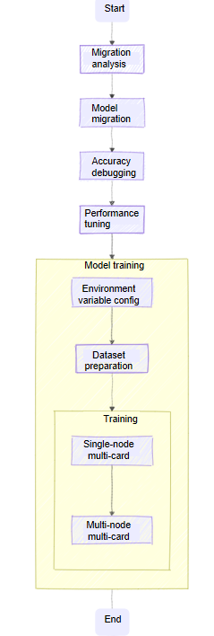
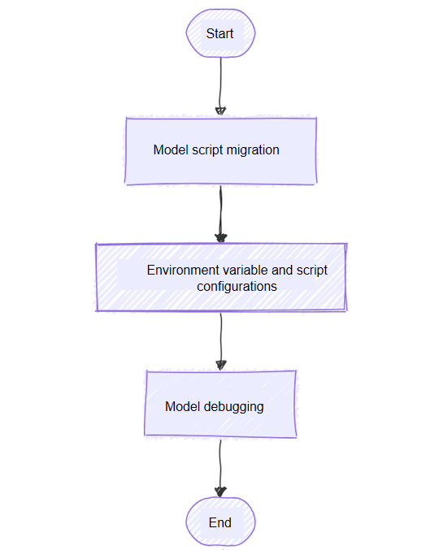

# MindSpeed MM Migration and Tuning Guide

<!-- md-trans-meta sourceCommit=unknown translatedAt=2026-05-26T07:10:51.991Z pushedAt=2026-05-26T07:32:09.383Z -->
## Overview

MindSpeed MM is an Ascend multimodal model suite for large-scale distributed training, supporting both multimodal generation and understanding models. It aims to provide an end-to-end training solution, featuring preset mainstream models, data engineering, distributed training and acceleration, pre-training, fine-tuning, and online inference tasks.

MindSpeed MM is developed based on Huawei Ascend chips (NPU) and optimizes NPUs to maximize their performance.

This manual is primarily intended for researchers, engineers, and developers with a certain foundation in deep learning and programming experience:

- Understand the basic concepts and technologies of deep learning, and be able to use the Python programming language and the Megatron-LM framework for deep learning model development and debugging;

- Have a certain understanding of deep learning model training and optimization, including training task execution and evaluation, distributed training, performance data collection and analysis, etc.;

- Have a basic understanding of common system performance optimization methods, such as parallelization and compilation optimization.

**What is Model Migration**

Model migration refers to migrating a deep learning model originally running on a GPU or other hardware platform to an NPU, while ensuring the model runs with high performance within a reasonable accuracy error range.

**Why Perform Model Migration**

When a model is migrated from other hardware platforms to an NPU, a series of adaptation operations from the low level to the upper level are required due to differences in hardware architecture and libraries. Taking GPU as an example, the reasons why model migration to an NPU requires adaptation can be divided into three aspects:

- Differences in hardware characteristics and performance features: Since NPUs and GPUs have different hardware characteristics and performance features, models may require further performance debugging and optimization on NPUs to fully leverage its potential.

- Differences in computing architecture: NVIDIA GPUs utilize the parallel computing architecture CUDA (Compute Unified Device Architecture), while Huawei NPUs employ the heterogeneous computing architecture. CANN (Compute Architecture for Neural Networks).

- Deep learning framework differences: To support NPUs, the `Megatron-LM` framework needs to be adapted through `MindSpeed`, including adapting functions such as tensor operations and automatic differentiation for efficient execution on NPUs.

## Overall Workflow of Model Migration

The general model migration and adaptation method can be divided into four phases: migration analysis, model migration, accuracy debugging, and performance tuning. The overall workflow is shown in the following figure.


## Migration Analysis

When you select a model for migration, it is recommended to choose from authoritative PyTorch model repositories, including but not limited to PyTorch (imagenet/vision, etc.), Meta Research (Detectron/detectron2, etc.), and open-mmlab (MMDetection/mmpose, etc.).

For large models, the most widely used resource repositories are Hugging Face, Megatron-LM, Llama-Factory, and others, from which you can select the target model.

**Constraints**: Before performing model migration, you need to assess the feasibility of model migration, and complete the environment preparation prior to migration:

Before migration, ensure that the selected model can run on a third-party platform (such as GPU) and output accuracy and performance baselines.
Also, refer to the *Ascend Extension for PyTorch Software Installation Guide* to complete the installation of the Ascend PyTorch training environment, so as to facilitate migration support analysis and subsequent model training, including the installation of NPU drivers and firmware, CANN software (Toolkit, Kernels, and NNAL), as well as the PyTorch framework and the torch_npu plugin.

Currently known unsupported scenarios:

Model migration using DP (Data Parallelism) mode is not supported. If your training script contains the `torch.nn.parallel.DataParallel` interface, which is not supported on the NPU platform, manually modify it to the `torch.nn.parallel.DistributedDataParallel` interface to perform multi-device training. Notice that the original script must run successfully in a GPU environment based on Python 3.10 or later.

The FusedAdam optimizer in the APEX library currently cannot be migrated using automatic migration or the PyTorch GPU2Ascend tool. You need to perform a manual migration by referring to [apex.optimizers](https://gitcode.com/Ascend/apex#apexoptimizers).

The migration of the bmtrain framework is not supported. bitsandbytes is now supported for installation on Ascend. For details, click [Supported Backends](https://github.com/bitsandbytes-foundation/bitsandbytes/blob/main/docs/source/installation.mdx#supported-backendsmulti-backend-supported-backends) for reference.

Only NF4 quantization/dequantization migration is supported for LLM QLoRA fine-tuning; other features are not yet supported.

Interfaces related to the HybridAdam optimizer in the third-party library ColossalAI cannot be migrated.

xFormers training is not natively supported at this time. If you require the migration of the FlashAttentionScore fusion operator from xFormers, refer to the related content in the Ascend community.

The grouped_gemm library cannot be installed on NPUs, while composer can. However, composer has not been adapted for NPUs, so it cannot be used.

## Model Migration

The overall model migration workflow can be divided into three parts: model script migration, environment variable and script configuration, and key feature adaptation.

- **Model Script Migration**: Script migration consists of two parts. First, the PyTorch model code from the third-party platform needs to be mapped to the Ascend device. Automatic migration is recommended, using one-click code migration by importing `transfer_to_npu` to map the code from the third-party platform to Ascend device code. Second, as a distributed framework, MindSpeed MM's code implementation differs from frameworks like DeepSpeed and FSDP in the original repository, requiring familiarity with the algorithm implementation principles for targeted migration.
- **Environment Variable and Script Configuration**: Introduces the necessary adaptation operations for running PyTorch model code on Ascend devices, including pre-training environment variable configuration and model script and launch script configuration.
- **Model Debugging**: During migration and variable adaptation, debugging should be performed step by step, proceeding sequentially from single modules to the full workflow.

The overall workflow is as follows:



## Accuracy Debugging

Training a large model often involves high costs and complex technical challenges. For example, Meta AI publicly released the training logs of its OPT-175B large model, documenting various issues encountered and their solutions over 75 days of training from October 20, 2021, to January 6, 2022. These issues are highly representative: numerous hardware failures requiring the removal of faulty nodes, troubleshooting of software stack errors, and subsequent training restarts; as well as challenging problems such as loss spikes and abnormal gradient norms, which required adjusting learning rates, batch sizes, or skipping problematic training corpora to resolve or mitigate. As can be seen from the above examples, even on the most advanced and mainstream AI accelerators, training large models still demands overcoming significant obstacles.

Beyond OPT-175B, AI2 has released technical reports, data, weights, hyperparameters, and even the code for data processing, model evaluation, and training logs for the OLMo series of models. Even though OLMo is only a 7B-parameter language model, the involved details remain highly complex, including mixed-precision configuration, data processing, and extensive monitoring of internal training states.

In summary, training itself is a form of research and development. Influenced by datasets, model architectures, parallel strategies, and hyperparameters, issues such as NaN, overflow, and loss divergence may occur during model training, necessitating precision debugging of the model. When training models on Ascend processors, the loss generally exhibits a decreasing convergence trend. Even when occasional spikes occur, they can be mitigated by skipping dataset segments or resuming training from checkpoints. Ultimately, once the trained weights are used to evaluate the model on standard datasets and the scores align with community-expected benchmarks, the precision debugging process can be considered complete.

## Performance Tuning

MindSpeed MM provides multiple performance tuning methods, including computation, communication, and dispatch optimizations.

### Dispatch Optimization

**First-level Pipeline Optimization**

By primarily migrating some operator adaptation tasks to the second-level pipeline, it balances the load between the two pipeline levels and reduces the dequeue wake-up time.

**How to Enable**

This feature can be configured through environment variables and is generally used in network scenarios that are severely host-bound.

Example:

```shell
export TASK_QUEUE_ENABLE=2
```

**Core Binding Optimization**

In PyTorch training or inference scenarios, you can control the processor affinity of CPU-side operator tasks by setting the environment variable `CPU_AFFINITY_CONF`, that is, setting task core binding. This configuration can optimize task execution efficiency, avoid memory access across NUMA (Non-Uniform Memory Access) nodes, and reduce task scheduling overhead.

The core binding schemes are as follows:

- Coarse-grained core binding: Binds all tasks to the CPU cores of the NUMA node corresponding to the NPU, avoiding memory access across NUMA nodes.Custom core binding on top of coarse-grained binding is supported.
- Fine-grained core binding: Further optimizes core binding by anchoring the main tasks to a fixed CPU core of the NUMA node, reducing the overhead of inter-core switching.

```shell
export CPU_AFFINITY_CONF=<mode>,npu<value1>:<value2>-<value3>
```

Parameter settings:

- `<mode>`: Required parameter, indicating the core binding mode.
  - 0 or default value: Core binding is disabled.
  - 1: Enable coarse-grained core binding.
  - 2: Enable fine-grained core binding.

- `npu<value1>:<value2>-<value3>`: Optional parameter, indicating a custom NPU core binding range.
  - The custom NPU core binding range takes effect only when the core binding feature is enabled, that is, when `mode` is configured as 1 or 2.
  - `npu<value1>:<value2>-<value3>` indicates that the "value1"-th NPU is bound to the CPU cores in the closed interval from "value2" to "value3". For example, "npu0:0-2" means the core binding range for the service threads of NPU 0 is [0,2].

  - It supports modifying the service core binding range for some NPUs. For example, when setting the environment variable `CPU_AFFINITY_CONF=1,npu0:0-0`, the service core binding range for NPU 0 is modified to [0,0], while NPU 1 retains its original service core binding range.

- `npu_affine:<value4>`: Optional parameter, indicating whether to enable NPU affinity core binding.
  - 0 or the default value: Indicates that the affinity core binding function is not enabled.
  - 1: Indicates that the affinity-based core binding function is enabled.

### Computation Optimization

**Fusion Operators**

The following operators are currently supported:

- [rms_norm](https://gitcode.com/Ascend/MindSpeed/blob/26.0.0_core_r0.12.1/docs/en/features/rms_norm.md)
- [swiglu](https://gitcode.com/Ascend/MindSpeed/blob/26.0.0_core_r0.12.1/docs/en/features/swiglu.md)
- [Rotary Position Embedding](https://gitcode.com/Ascend/MindSpeed/blob/26.0.0_core_r0.12.1/docs/en/features/rotary-embedding.md)
- [Flash Attention](https://gitcode.com/Ascend/MindSpeed/blob/26.0.0_core_r0.12.1/docs/en/features/flash-attention.md)

**Memory Optimization**

Through efficient device memory utilization, methods such as selective recomputation can be better leveraged:

- [Activation Function Recompute](https://gitcode.com/Ascend/MindSpeed/blob/26.0.0_core_r0.12.1/docs/en/features/activation-function-recompute.md)
- [Swap-attention](https://gitcode.com/Ascend/MindSpeed/blob/26.0.0_core_r0.12.1/docs/en/features/swap_attention.md)
- [Norm Recomputation](https://gitcode.com/Ascend/MindSpeed/blob/26.0.0_core_r0.12.1/docs/en/features/norm-recompute.md)

### Communication Optimization

Currently, overlapping between computation and communication parallelism in the DP domain is supported. For details, see [Communication Hiding during Megatron Weight Update](https://gitcode.com/Ascend/MindSpeed/blob/26.0.0_core_r0.12.1/docs/en/features/async-ddp-param-gather.md).

## Model Training

Here, the Qwen2VL 7B model is used as an example to introduce the MindSpeed MM training workflow.

1. Repository Cloning

    ```shell
    git clone https://gitcode.com/Ascend/MindSpeed-MM.git
    git clone https://github.com/NVIDIA/Megatron-LM.git
    cd Megatron-LM
    git checkout core_v0.12.1
    cp -r megatron ../MindSpeed-MM/
    cd ..
    cd MindSpeed-MM
    mkdir logs
    mkdir data
    mkdir ckpt
    ```

2. Environment Setup

    The MindSpeed MM suite is built upon MindSpeed Core and adopts a Megatron-like framework. The installation method is as follows:

    ```bash
    # python3.10
    conda create -n test python=3.10
    conda activate test

    # Install torch and torch_npu. Ensure you select the torch, torch_npu, and apex packages corresponding to your Python version and architecture (x86 or ARM).
    # For download paths, refer to https://www.hiascend.com/document/detail/en/Pytorch/730/configandinstg/instg/insg_0001.html
    pip install torch-2.7.1-cp310-cp310-manylinux_2_28_aarch64.whl
    pip install torch_npu-2.7.1*-cp310-cp310-manylinux_2_28_aarch64.whl

    # For apex for Ascend, refer to https://gitcode.com/Ascend/apex
    # It is recommended to compile and install from the original repository.

    # Install the acceleration library
    git clone https://gitcode.com/Ascend/MindSpeed.git
    cd MindSpeed
    # checkout commit from MindSpeed core_v0.12.1
    git checkout 5176c6f5f133111e55a404d82bd2dc14a809a6ab
    # Install mindspeed and dependencies
    pip install -e .
    cd ..
    # Install mindspeed mm and dependencies
    pip install -e .
    ```

### Weight Download and Conversion

1. Weight Download

    Download the corresponding model weights from the Hugging Face library:

    Model address: [Qwen2-VL-7B](https://huggingface.co/Qwen/Qwen2-VL-7B-Instruct/tree/main).

    Save the downloaded model weights to the local `ckpt/hf_path/Qwen2-VL-*B-Instruct` directory. (`*` indicates the corresponding size.)

2. Weight Conversion (hf2mm)

    MindSpeed MM has modified the structure names of some original networks. Use the `mm-convert` tool to convert the original pre-trained weights. This tool enables bidirectional conversion between Hugging Face weights and MindSpeed MM weights, as well as re-sharding of PP weights. Refer to [Weight Conversion Tool Usage](../features/mm_convert.md).

    ```bash
    # 7b
    mm-convert  Qwen2VLConverter hf_to_mm \
      --cfg.mm_dir "ckpt/mm_path/Qwen2-VL-7B-Instruct" \
      --cfg.hf_config.hf_dir "ckpt/hf_path/Qwen2-VL-7B-Instruct" \
      --cfg.parallel_config.llm_pp_layers [[1,10,10,7]] \
      --cfg.parallel_config.vit_pp_layers [[32,0,0,0]] \
      --cfg.parallel_config.tp_size 1
    ```

    If you need to train with the converted model, synchronously modify the `LOAD_PATH` parameter in `examples/qwen2vl/finetune_qwen2vl_7b.sh`. This path points to the converted or sharded weights. Ensure it is distinguished from the original weight path at `ckpt/hf_path/Qwen2-VL-7B-Instruct`.

    ```shell
    LOAD_PATH="ckpt/mm_path/Qwen2-VL-7B-Instruct"
    ```

3. Converting Weights Back to Hugging Face Format

    ```bash
    mm-convert  Qwen2VLConverter mm_to_hf \
      --cfg.save_hf_dir "ckpt/mm_to_hf/Qwen2-VL-7B-Instruct" \
      --cfg.mm_dir "ckpt/mm_path/Qwen2-VL-7B-Instruct" \
      --cfg.hf_config.hf_dir "ckpt/hf_path/Qwen2-VL-7B-Instruct" \
      --cfg.parallel_config.llm_pp_layers [1,10,10,7] \
      --cfg.parallel_config.vit_pp_layers [32,0,0,0] \
      --cfg.parallel_config.tp_size 1
    # Where:
    # save_hf_dir: Directory for saving weights converted back to Hugging Face format after MindSpeed MM fine-tuning
    # mm_dir: Weight directory after fine-tuning
    # hf_dir: Hugging Face weight directory
    # llm_pp_layers: Number of LLM layers partitioned across each card. Note that this must be consistent with pipeline_num_layers configured in model.json during fine-tuning
    # vit_pp_layers: Number of ViT layers partitioned across each card. Note that this must be consistent with pipeline_num_layers configured in model.json during fine-tuning
    # tp_size: TP size. Note that this must be consistent with the configuration in the fine-tuning launch script
    ```

### Dataset Preparation

**Taking the COCO2017 dataset as an example**

1. Download the [COCO2017](https://cocodataset.org/#download) dataset and extract it into the `./data/COCO2017` folder within the project directory.

2. Obtain the image dataset description file ([LLaVA-Instruct-150K](https://huggingface.co/datasets/liuhaotian/LLaVA-Instruct-150K/tree/main)) and download it to the `./data/` path.

3. Run the data conversion script `python examples/qwen2vl/llava_instruct_2_mllm_demo_format.py`. The reference data directory structure after conversion is as follows:

   ```shell
   $playground
   ├── data
       ├── COCO2017
           ├── train2017

       ├── llava_instruct_150k.json
       ├── mllm_format_llava_instruct_data.json
       ...
   ```

>[!NOTE]
>Currently, it supports reading multiple datasets separated by `,` (do not add spaces) by modifying `dataset_param->basic_parameters->dataset` in `data.json`: Change `"./data/mllm_format_llava_instruct_data.json"` to `"./data/mllm_format_llava_instruct_data.json,./data/mllm_format_llava_instruct_data2.json"`.
>Also, note the configuration of `dataset_param->basic_parameters->max_samples` in `data.json`. This limits the data read to only `max_samples` entries, allowing for quick functional verification. For formal model training, you can remove this parameter to read all the data.

### Executing Training

Take Qwen2VL-7B as an example to start the fine-tuning training task.

**Parameter Configuration**

Modify the path configurations in `examples/qwen2vl/data_7b.json` and `examples/qwen2vl/finetune_qwen2vl_7b.sh` according to your actual situation, including the tokenizer loading path `from_pretrained` and the image processor path `image_processor_path`.

Please note the following two points during actual operation:

- The path configured for `tokenizer/from_pretrained` is the original Qwen2-VL-7B-Instruct path downloaded from Hugging Face.

- The path configured for `LOAD_PATH` in the shell file is the model path after weight conversion (supporting PP partitioning).

**Single-Node Execution**

In a single-node scenario, directly enable the default script from the repository:

```shell
bash examples/qwen2vl/finetune_qwen2vl_7b.sh
```

Enter the script, and at the very beginning of the shell script, you can control the actual number of NPUs used via `NPUS_PER_NODE`.

```shell
NPUS_PER_NODE=8
MASTER_ADDR=localhost
MASTER_PORT=6000
NNODES=1
NODE_RANK=0
```

**Multi-Node Execution**

In a multi-node scenario, you can also use the script from the repository:

```shell
bash examples/qwen2vl/finetune_qwen2vl_7b.sh
```

However, it is important to note that the following parameters need to be adjusted accordingly.

```shell
NPUS_PER_NODE=8
MASTER_ADDR=localhost
MASTER_PORT=6000
NNODES=2
NODE_RANK=0
```

The adjustment methods are as follows:

- `NPUS_PER_NODE`: Represents the number of NPUs used on each node.Typically, the value ranges from 1 to 8; and for some node types, it can range from 1 to 16. Set it as needed.
- `MASTER_ADDR`: In a multi-node scenario, you need to specify the IP of the master node for communication between nodes. For example, you can set `MASTER_ADDR` to `12.34.56.78`, and set all other nodes to the same IP.
- `NNODES`: Represents the number of nodes. If using 2 nodes, set it to 2.
- `NODE_RANK`: Represent the node rank. The rank of the master node is 0, and ranks of other nodes increase sequentially. For 2 nodes, the master node is 0 and the slave node is 1.
