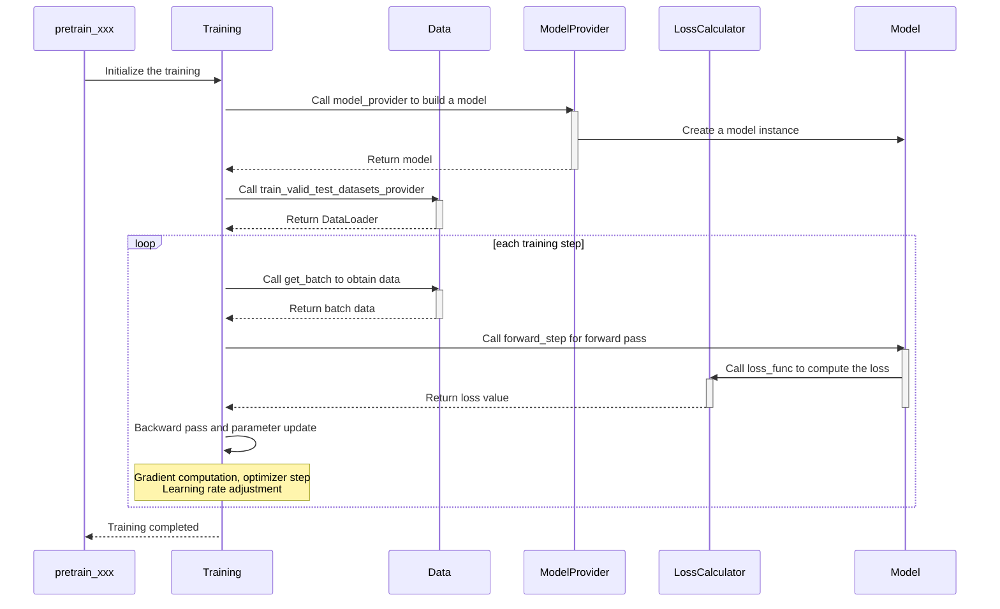

# MindSpeed MM Model Migration Guide

## Core Interface Adaptation

The MindSpeed MM training logic generally follows the Megatron style. All models are launched using a unified `pretrain_xxx.py` file, and the training process is regulated through a configuration file. Training scripts for launching various models are provided in the `examples` directory.

The `pretrain_xxx.py` file provides the main (callback) functions involved in the model training process. You need to implement the corresponding business logic in these functions based on specific task requirements. These functions will be automatically called during the training process.

| **Function**                            | **Description**                          |
| ---------------------------------------- | ---------------------------------------- |
| `model_provider`                        | Builds a model.                        |
| `get_batch`                             | Builds the forward input data for a model. |
| `loss_func`                             | Computes the forward loss of a model.  |
| `forward_step`                          | Performs the model forward pass and computes the loss. |
| `train_valid_test_datasets_provider` | Constructs the data loader.              |

## Core Interface Call Flow



## Model Migration

The key points of the overall migration revolve around the core interfaces mentioned above.

### Environment Setup

It is recommended to use the matching environment version during model development.

Please refer to the [Installation Guide](install_guide.md) to install the Ascend software.

> Python 3.10 is recommended, and torch and torch_npu 2.7.1 are recommended.

```shell
git clone https://github.com/NVIDIA/Megatron-LM.git
cd Megatron-LM
git checkout core_v0.12.1
cp -r megatron ../MindSpeed-MM/
cd ..
cd MindSpeed-MM
mkdir logs data ckpt

# Install the acceleration library
git clone https://gitcode.com/Ascend/MindSpeed.git
cd MindSpeed
# checkout commit from MindSpeed core_r0.12.1
git checkout xxxxxxx

# Install MindSpeed and dependencies
pip install -e .
cd ..
# Install MindSpeed MM and dependencies
pip install -e .
```

### Data Module Migration

#### Basic Migration Principles

The MindSpeed MM framework offers high compatibility for data modules, allowing your existing `DataSet` and `DataLoader` implementations to be migrated seamlessly.
**The quick migration steps are as follows:**

1. **Keep existing implementations**: Your custom data modules such as `DataSet` and `DataLoader` require no modification.
2. **Register the data provider function**: Return the `DataLoader` object through the `train_valid_test_datasets_provider` function in the entry script.
3. **Get training batch**: Process the current training batch data in the `get_batch` function.

**Migration example:**

```python
def train_valid_test_datasets_provider():
    """Build train, valid, and test datasets."""
    # Return your existing dataset instance
    train_dataloader= build_dataloader(CustomDataset(...))
    valid_dataloader= build_dataloader(CustomDataset(...))
    test_dataloader= build_dataloader(CustomDataset(...))

    return train_dataloader, valid_dataloader, test_dataloader

def get_batch(data_iterator, args):
    """Generate a batch."""
    if data_iterator is not None:
        batch = next(data_iterator)
    else:
        raise ValueError("Data iterator is None. Unable to retrieve batch.")
    move_to_device(batch, get_args().params_dtype)

    return batch
```

#### Using Native Data Modules

MindSpeed MM also provides a set of optimized multimodal dataset processing modules, including `build_mm_dataset`, `build_mm_dataloader`, etc. You can flexibly define data sources, preprocessing pipelines, and loading strategies through the `data.json` configuration file.

### Model Structure Migration

In the MindSpeed MM framework, all training models are built and executed through standardized entry functions: `model_provider` constructs a model, `forward_step` executes the forward pass, and `loss_func` computes the training loss.

```python
def model_provider(*args, **kwargs):
    model = CustomModel(config)

    return model

def loss_func(output_tensor):
   # Compute loss based on model output
   loss = compute_loss(output_tensor)
   return loss

def forward_step(data_iterator, model):
    """Forward step."""
    batch_data = get_batch(data_iterator)
    output_tensor = model(**batch_data)
    return output_tensor, loss_func
```

#### FSDP2 Training Prerequisites

##### User-defined Models

For user-developed models, using FSDP2 for distributed training only requires simply inheriting the specified `Mixin` class. **The model implementation itself does not need any modification.**

```python
from mindspeed_mm.models.common.module import MultiModalModule
from mindspeed_mm.models.transformers.base_model import FSDP2Mixin, WeightInitMixin

class CustomModel(MultiModalModule, FSDP2Mixin, WeightInitMixin):
 """Your custom model class"""
    ...
```

##### Third-party Model Adaptation

For models imported from third-party libraries (such as Transformers), MindSpeed MM provides a unified adaptation approach:

1. **Create an adaptation class**: Inherit the third-party model from the FSDP2 `Mixin` class.
2. **Register to the model hub**: Add the adapted class to `ModelHub`.
3. **Use through the standard interface**: Load the adapted model using `TransformersModel`.

The following uses Internvl-3.5 as an example.

**Step 1: Create an adaptation class*

```python
# mindspeed_mm/models/transformers/internvl3.5.py
from internvl.modeling_internvl_chat import InternVLChatModel
from mindspeed_mm.models.transformers.base_model import FSDP2Mixin, WeightInitMixin

class InternVLChatModelGeneration(InternVLChatModel, FSDP2Mixin, WeightInitMixin):
 """FSDP2-adapted version of the InternVL model"""
    def __init__(self, config, vision_model=None, language_model=None, use_flash_attn=True):
        super().__init__(config)
```

**Step 2: Register to the model hub**

```python
# mindspeed_mm/models/common/modelzoo.py

from mindspeed_mm.models.transformers.internvl3_5 import InternVLChatModelGeneration

class ModelHub:
    MODEL_MAPPINGS = {
        'internvl': InternVLChatModelGeneration,
    }
```

**Step 3: Use through the standard interface**

```python
# pretrain_transformers.py
from mindspeed_mm.models.transformers_model import TransformersModel

def model_provider(*args, **kwargs):
 """Builds the model."""
 args = get_args()
 vlm_config = deepcopy(args.mm.model)
 model = TransformersModel(vlm_config)

 return model
```

#### (Recommended) FSDP2 Training via a Configuration File

MindSpeed MM supports flexible management of FSDP2 training strategies through a YAML configuration file, achieving complete decoupling of training configuration from model code.

**Parameters in the Configuration File**

<table>
  <thead>
    <tr style="background-color: #f5f5f5;">
      <th style="text-align: left;">Category</th>
      <th style="text-align: left;">Parameter</th>
      <th style="text-align: left;">Description</th>
      <th style="text-align: left;">Value</th>
      <th style="text-align: left;">Default Value</th>
      <th style="text-align: left;">Notes</th>
    </tr>
  </thead>
  <tbody>
    <tr>
      <td rowspan="5" style="vertical-align: middle; font-weight: bold;">Basic configuration</td>
      <td><code>sharding_size</code></td>
      <td>Model parallelism sharding size</td>
      <td><code>auto</code> or an integer value</td>
      <td>1</td>
      <td><code>auto</code> indicates the value of <code>world_size</code>.</td>
    </tr>
    <tr>
      <td><code>param_dtype</code></td>
      <td>Parameter storage and computation data type</td>
      <td><code>bf16</code>, <code>fp16</code>, <code>fp32</code></td>
      <td>Model dtype</td>
      <td>Training precision setting</td>
    </tr>
    <tr>
      <td><code>reduce_dtype</code></td>
      <td>Data type for gradient communication</td>
      <td>-</td>
      <td>-</td>
      <td>Communication precision setting</td>
    </tr>
    <tr>
      <td><code>output_dtype</code></td>
      <td>Forward output data type</td>
      <td>-</td>
      <td>-</td>
      <td>Output precision control</td>
    </tr>
    <tr>
      <td><code>cast_forward_inputs</code></td>
      <td>Automatic type conversion for forward inputs</td>
      <td><code>true</code>/<code>false</code></td>
      <td>-</td>
      <td>Ensure input type matching.</td>
    </tr>
    <tr>
      <td rowspan="2" style="vertical-align: middle; font-weight: bold;">Module wrapping</td>
      <td><code>sub_modules_to_wrap</code></td>
      <td>Path to the FSDP sharding sub-module</td>
      <td>List of module path strings</td>
      <td>-</td>
      <td>        <strong>Pattern syntax</strong>:<br>
        • <code>model.layers.{*}</code>: matches all submodules<br>
        • <code>model.layers.{0-23}</code>: matches a range of layers<br>
        • <code>model.layers.{1,3,5}</code>: matches specific layers
      </td>
    </tr>
    <tr>
      <td><code>ignored_modules</code></td>
      <td>Modules excluded from FSDP management</td>
      <td>List of module path strings</td>
      <td>-</td>
      <td>Same format as <code>sub_modules_to_wrap.</code></td>
    </tr>
    <tr>
      <td rowspan="5" style="vertical-align: middle; font-weight: bold;">Memory optimization</td>
      <td><code>recompute_modules</code></td>
      <td>Activation recomputation modules</td>
      <td>List of module path strings</td>
      <td>-</td>
      <td>Same format as <code>sub_modules_to_wrap.</code><br><strong>To avoid conflicts,</strong> Megatron recomputation must be disabled.</td>
    </tr>
    <tr>
      <td><code>use_reentrant</code></td>
      <td>Checkpoint implementation type</td>
      <td><code>true</code>/<code>false</code></td>
      <td><code>true</code></td>
      <td>Whether to use reentrant.</td>
    </tr>
    <tr>
      <td><code>reshard_after_forward</code></td>
      <td>Parameter re-aggregation timing</td>
      <td><code>true</code>/<code>false</code></td>
      <td>-</td>
      <td>        <code>true</code>: ZeRO3 (memory-saving)<br>
        <code>false</code>: ZeRO2 (high performance)
      </td>
    </tr>
    <tr>
      <td><code>offload_to_cpu</code></td>
      <td>Offload parameters to CPU</td>
      <td><code>true</code>/<code>false</code></td>
      <td><code>false</code></td>
      <td>When enabled, set <code>--distributed-backend<br>npu:hccl,cpu:gloo.</code></td>
    </tr>
    <tr>
      <td><code>pin_memory</code></td>
      <td>Lock CPU memory</td>
      <td><code>true</code>/<code>false</code></td>
      <td><code>false</code></td>
      <td>Only takes effect when <code>offload_to_cpu=true.</code></td>
    </tr>
    <tr>
      <td rowspan="2" style="vertical-align: middle; font-weight: bold;">Performance tuning</td>
      <td><code>num_to_forward_prefetch</code></td>
      <td>Number of layers for forward prefetch</td>
      <td>Integer value</td>
      <td>-</td>
      <td>Communication and computation overlap optimization</td>
    </tr>
    <tr>
      <td><code>num_to_backward_prefetch</code></td>
      <td>Number of layers for backward prefetch</td>
      <td>Integer value</td>
      <td>1</td>
      <td>Communication and computation overlap optimization</td>
    </tr>
  </tbody>
</table>

A configuration example of `fsdp2_config.yaml` is shown below:

```yaml
sharding_size: auto
sub_modules_to_wrap:
  - "text_decoder.output_layer"
  - "text_decoder.embedding"
  - "text_decoder.rotary_pos_emb"
  - "text_decoder.decoder.layers.{*}"
param_dtype: "bf16"
reduce_dtype: "fp32"
cast_forward_inputs: True
ignored_modules:
  - "image_encoder"
recompute_modules:
  - "text_decoder.decoder.layers.{*}"
num_to_forward_prefetch: 2
num_to_backward_prefetch: 2
offload_to_cpu: False
```

#### (Optional) Custom Sharding Strategy

For scenarios where the model structure is complex or cannot be satisfied through YAML configurations, you can implement a custom sharding strategy through the interfaces provided by `FSDP2Mixin`. In this case, only basic configuration needs to be provided in the YAML configuration file.

**Example of the custom fully_shard implementation:**

```python
from mindspeed_mm.models.common.module import MultiModalModule
from mindspeed_mm.models.transformers.base_model import FSDP2Mixin, WeightInitMixin

class YourModel(MultiModalModule, FSDP2Mixin, WeightInitMixin):
    def _fully_shard(self, fsdp2_kwargs=None, fsdp2_config=None):
        """
        Custom fully_shard implementation
        """
        # (optional) Custom recomputation module
        set_recompute_modules_to_wrap()

        # Custom fully_shard wrapping module
        set_fullyshard_modules_to_wrap()

        # (optional) Custom prefetch strategy
        num_to_forward_prefetch = getattr(self.fsdp2_config, "num_to_forward_prefetch", 0)
        num_to_backward_prefetch = getattr(self.fsdp2_config, "num_to_backward_prefetch", 0)
        set_modules_to_prefetch(num_to_forward_prefetch, num_to_backward_prefetch)
```

For deeper customization, refer to the complete implementation of the `FSDP2Mixin` class to understand the detailed usage and extension points of each method.

### Launch Command Configuration

When launching FSDP2 training, **you need to add the following parameters on top of the standard Megatron training command**

```shell
export CUDA_DEVICE_MAX_CONNECTIONS=2

--use-torch-fsdp2 \
--fsdp2-config-path ./fsdp2_config.yaml \
--ckpt-format torch_dcp \
--untie-embeddings-and-output-weights \
```

Key parameter descriptions:

- `--use-torch-fsdp2`: Enable FSDP2 training mode.
- `--fsdp2-config-path`: Specify the path to the FSDP2 configuration file.
