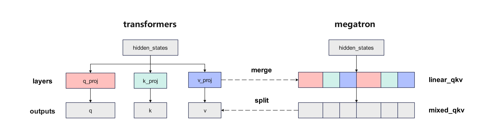
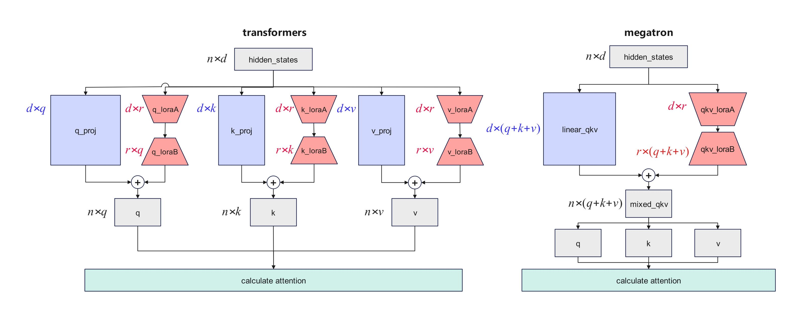

# 标准等价模型

## 问题分析

Megatron 框架下 Qwen-VL 系列模型的实现逻辑，与 Hugging Face Transformers 主流标准实现存在显著差异。该差异不仅会在 LoRA 微调等场景下产生较大计算偏差，还会造成不同框架间的模型迁移适配困难。 

## Megatron实现差异
Megatron 对模型核心模块做了融合及交织重排操作，以Qwen2.5-VL计算q、k、v矩阵为例，与 Transformers 标准实现的关键差异如下：
### Attention 层 QKV 计算逻辑  
* Transformers 标准实现：将 `hidden_states` 分别输入独立的 `q_proj`、`k_proj`、`v_proj` 层，直接得到 q、k、v 三个矩阵；  
* Megatron 实现：将原模型的 `q_proj`、`k_proj`、`v_proj` 三层矩阵拆分后重新排列，融合为 `linear_qkv` 单层，`hidden_states` 输入该层后先得到融合的 qkv 输出张量，再经拆分与重排后得到 q、k、v 三个矩阵。
  
### MLP 层 FC1 计算逻辑 
Megatron 同时将 MLP 层中的 `gate_proj` 和 `up_proj` 两层融合为 `linear_fc1` 单层，与 Transformers 标准分层实现逻辑不一致。

### Lora微调场景差异
Megatron 对上述模块的融合操作，会导致 LoRA 微调场景下的参数规模与 Transformers 标准实现不匹配：例如 qkv 层的 LoRA-A 矩阵参数量仅为标准实现的 1/3，造成算法逻辑层面的不等价。最终导致两种框架下训练得到的 LoRA 权重无法跨框架兼容转换和加载。


## 解决方案

针对 Megatron 框架中经过融合交织优化的模块，MindSpeed MM 提供了与 Transformers 标准实现等价的适配方案，消除不同框架间的模型结构差异引起的计算差异，解决跨框架间的切换不兼容问题。  
当前支持的模型有：`Qwen2.5-VL`、`VideoAlign`

## 使用方法
以 Qwen2.5-VL 为例，在`model_xxb.json`中添加`canonical_model`并使能：
```json
{
  "model_id": "qwen2_5vl",
  "img_context_token_id": 151655,
  "vision_start_token_id": 151652,
  "image_encoder": {
    "vision_encoder": {
      "model_id": "qwen2vit",
      "canonical_model": true,  // 启用视觉编码器的标准等价实现
      ...
    },
    ...
    "text_decoder": {
      "model_id": "qwen2lm",
      "canonical_model": true,  // 启用文本解码器的标准等价实现
      ...
    }        
  }
}
```