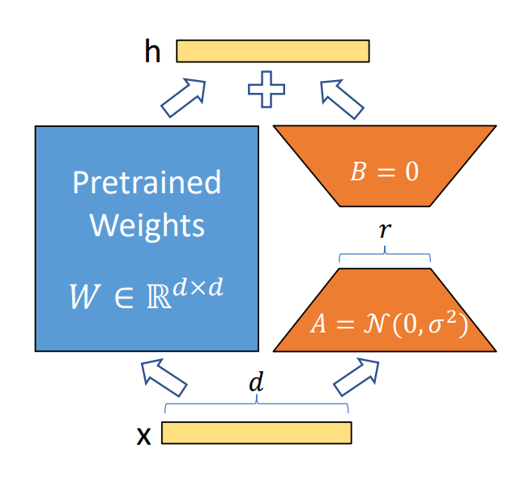

# LoRA 微调简介

LoRA（Low-Rank Adaptation）是一种高效的模型微调方法，广泛应用于预训练的深度学习模型。通过在权重上添加低秩矩阵，LoRA 使得微调过程更为轻量，节省计算资源和存储空间。

## LoRA 的原理

LoRA 的核心思想是将模型的参数更新分解为低秩的形式。具体步骤如下：

- **分解权重更新**：在传统的微调方法中，直接对模型的权重进行更新。而 LoRA 通过在每一层的权重矩阵中引入两个低秩矩阵 $A$ 和 $B$ 进行替代。即：
$
W' = W + A \cdot B
$



   其中，$W'$ 是更新后的权重，$W$ 是原始权重，$A$ 和 $B$ 是需要学习的低秩矩阵。

- **降低参数量**：由于 $A$ 和 $B$ 的秩较低，所需的参数量显著减少，节省了存储和计算成本。

### LoRA 微调

MindSpeed-MM LoRA微调使能方法：

在模型shell脚本中增加 LORA 微调参数。
例如，可在`Qwen2-VL`的微调任务脚本中增加`--lora-target-modules`参数，使能 LoRA 。
```
--lora-target-modules linear_qkv linear_proj linear_fc1 linear_fc2
```

### LoRA 权重合并

LoRA权重和原始权重合并方法：
例如，可在`Qwen2-VL`的合并脚本`merge_lora`中设置参数执行合并，其中`base_save_dir`,`lora_save_dir`,`merge_save_dir`分别设置为原始权重目录，LoRA权重目录，合并权重保存目录，`use_npu`设置是否启用npu加速。

#### 参数说明
- **`--load`**
  若不指定该参数加载权重，模型会随机初始化权重。

- **`--lora-load`**
  加载 LoRA 权重断点继续训练或用于推理。在推理时需与 `--load` 参数配合使用，加载 `CKPT_SAVE_DIR` 路径下的 LoRA 权重。

- **`--lora-r`**
  LoRA rank，表示低秩矩阵的维度。较低的 rank 值模型在训练时会使用更少的参数更新，从而减少计算量和内存消耗。然而，过低的 rank 可能限制模型的表达能力。

- **`--lora-alpha`**
  控制 LoRA 权重对原始权重的影响比例, 数值越高则影响越大。一般保持 `α/r` 为 2。

- **`--lora-dropout`**
  在 LoRA 模块中`dropout`的比例，默认为`0`。

- **`--lora-target-modules`**
  选择需要添加 LoRA 的模块。
  *mcore 模型可选模块：* `linear_qkv`, `linear_proj`, `linear_fc1`, `linear_fc2`；
  *legacy 模型可选模块：* `query_key_value`, `dense`, `dense_h_to_4h`, `dense_4h_to_h`。
  多模态场景下需根据模型结构选择合适的微调模块。

- **`--save`**
  模型权重保存路径，开启 LoRA 微调的情况下，只保存微调模块的权重。


### 注意事项

- **冻结模块**：多模态模型中可能存在部分模块参数冻结的情况，冻结的模块不会参与 LoRA 微调。

## 参考文献

- [LoRA: Low-Rank Adaptation of Large Language Models](https://arxiv.org/abs/2106.09685)