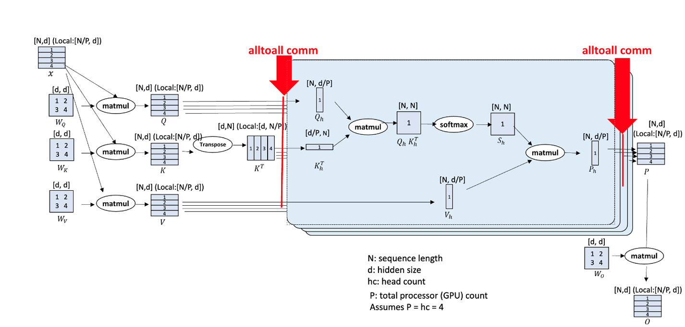

# QwenVL系列支持非均匀Ulysses CP切分 

## 问题分析

CP（Context Parallel）并行算法是一种针对长序列数据处理的并行化技术，在处理长序列时具有显著优势。多模态模型存在大量序列长度非均匀场景，需要进行相应的适配。

## 解决方案

Ulysses CP算法基于All2All算子，对All2All算子的Input List与Output List根据序列长度进行非均匀切分，使能Ulysses算法。



## 使用方法
(当前仅支持qwen2vl、qwen2.5vl和RL GRPO qwen2.5vl)
### qwen2vl、qwen2.5vl使用方法，以qwen2vl72b为例
1. examples/qwen2vl/finetune_qwen2vl_72b.sh中设置CP大小，默认脚本中为1
```shell
CP=1
```

2. examples/qwen2vl/finetune_qwen2vl_72b.sh中的GPT_ARGS添加  
```shell
    --context-parallel-algo ulysses_cp_algo
```

### RL GRPO qwen2.5vl使用方法,以3b模型为例
1. examples/rl/configs/grpo_trainer_qwen25vl_3b.yaml中，在actor_config下添加
```yaml
context_parallel_size: 1
context_parallel_algo: ulysses_cp_algo
```
2. examples/rl/model/qwen2.5vl_3b.json中，在image_encoder和text_decoder下添加
```json
context_parallel_size: 1 #注意,需要与grpo_trainer_qwen25vl_3b.yaml中配置一致
```