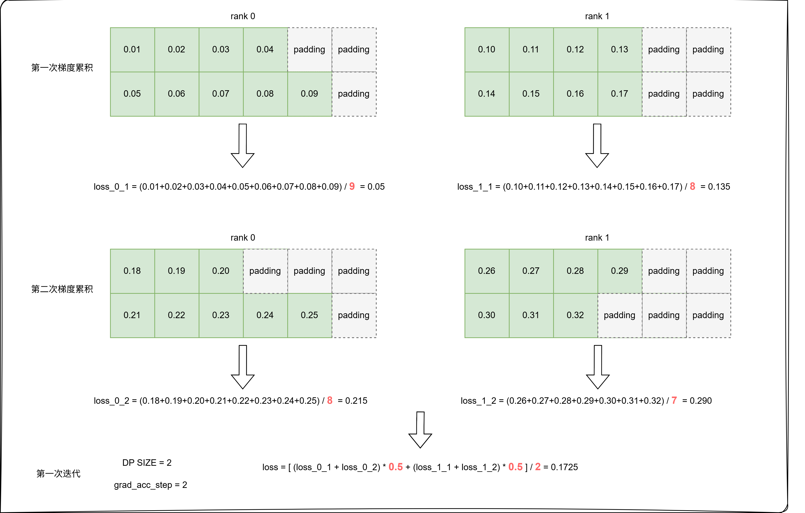
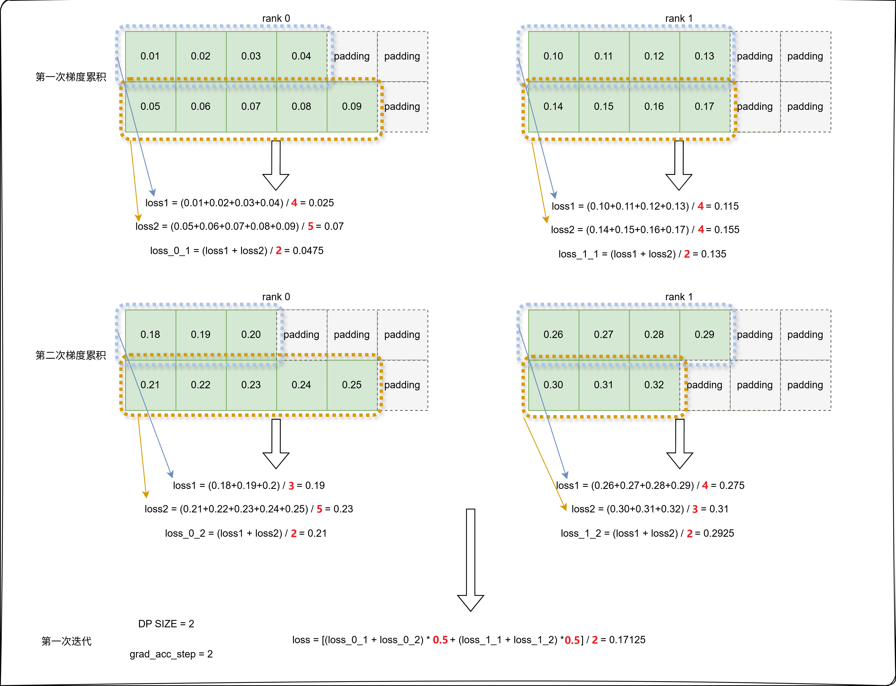
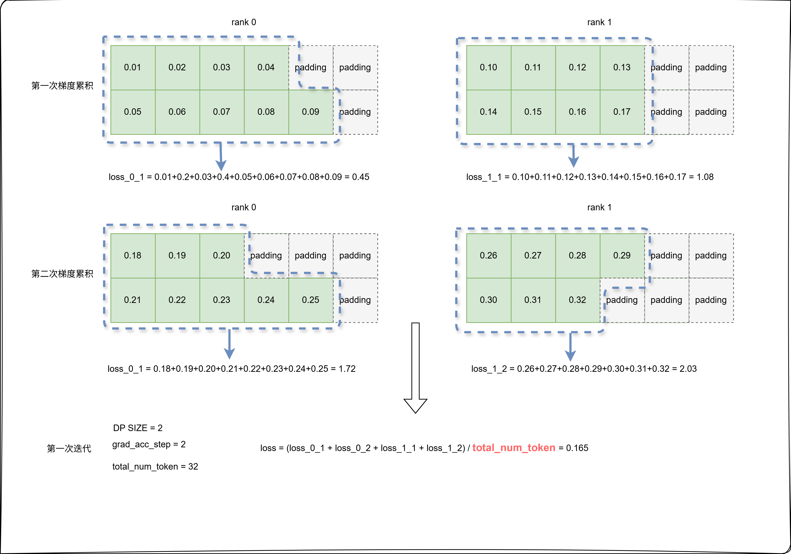

# VLM 模型 Loss 计算类型

## 问题分析

视觉语言模型（Vision-Language Model, VLM）通常采用交叉熵损失（Cross-Entropy Loss）作为训练目标。然而，**当前主流模型仓库（如 Hugging Face Transformers）的实现中存在一个问题：当全局批次大小（global batch size）固定时，通过调整微批次大小（micro_batch_size）和梯度累积步数（grad_acc_steps）的不同组合（例如 `micro_batch_size=32, grad_acc_steps=2` vs `micro_batch_size=16, grad_acc_steps=4`），在相同超参数和训练数据下，模型收敛过程中的损失曲线和最终数值会出现较大差异**。相关讨论可参考：[gradient](https://unsloth.ai/blog/gradient)

> 注：Transformers 已在部分模型中修复该问题，但在 Qwen2.5-VL、Qwen3-VL 等模型中因为相关代码传参错误，或显式地不计算num_token_in_batch，导致问题依然存在。

## 解决方案

针对 VLM 模型，MindSpeed MM 提供三种 Loss 计算方式。假设训练配置为 `micro_batch_size=2`、`grad_acc_steps=2`，使用双卡训练（即 DP=2），三种Loss 计算方式的步骤如下：

### 1. 默认方式

与 Transformers 实现一致，计算流程如下：  

- **步骤 1**：在微批次维度上对有效 token 的交叉熵损失求均值  
- **步骤 2**：在梯度累积维度上求均值  
- **步骤 3**：在数据并行（DP）域上求均值  



### 2. 按样本粒度计算 Loss（Calculate Per Sample Loss）

计算流程如下：  

- **步骤 1**：在样本内部对有效 token 的交叉熵损失求均值  
- **步骤 2**：在微批次维度上求均值  
- **步骤 3**：在梯度累积维度上求均值  
- **步骤 4**：在数据并行（DP）域上求均值  



### 3. 按 Token 粒度计算 Loss（Calculate Per Token Loss）

计算流程如下：  

- 直接累加全局批次中所有有效 token 的交叉熵损失  
- 最终结果除以全局批次中的有效 token 总数  



## 使用方法

### 1. 默认计算方式

在模型训练脚本中**不启用**以下任一参数：

- `--calculate-per-sample-loss` 按样本粒度计算 loss
- `--calculate-per-token-loss` 按 token 粒度计算 loss

### 2. 按样本粒度计算 Loss

在模型训练脚本中启用参数：

```shell
GPT_ARGS="
    ...
    --calculate-per-sample-loss \
"
```

### 3. 按 Token 粒度计算 Loss

在模型训练脚本中启用参数：

```shell
GPT_ARGS="
    ...
    --calculate-per-token-loss \
"
```

## 注意事项

1. `--calculate-per-sample-loss` 与 `--calculate-per-token-loss` 参数不可同时使用。
2. 如果loss计算方式选择不当，会对下游任务评测产生较大影响。用户需要根据实际数据集样本分布情况选择合适的计算方式。如果训练数据集样本分布不均，有的样本response很长，有的样本response很短，甚至是一个token。按 token 粒度计算 loss，则会使target token数量多的样本更受重视，从而引入不同样本间的不平衡，使得长输出会被训练的更充分。
