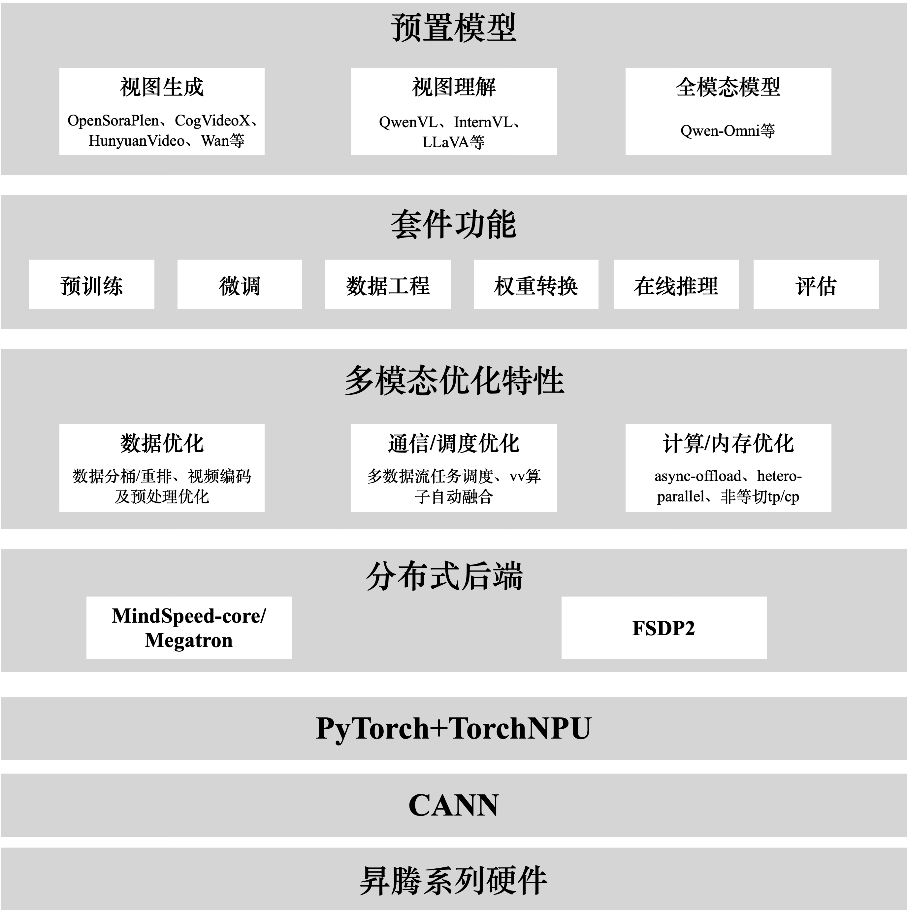
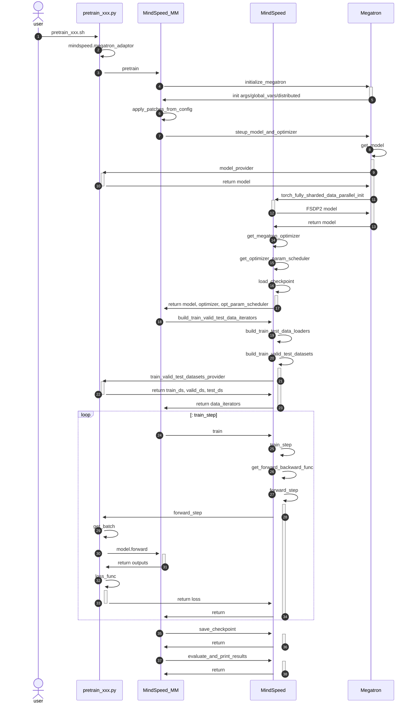

# MindSpeed-MM 训练框架介绍

## MindSpeed-MM整体结构

MindSpeed MM 昇腾多模态训练解决方案整体架构如下图，整体分为三个层次：

- **第一层：昇腾硬件基础设施层**：这是整个解决方案的物理基石，为海量多模态数据计算与模型训练提供强大的并行算力。
- **第二层：软件基础能力层**：连接上层AI套件与底层硬件的关键桥梁，负责释放硬件算力。
  
  - CANN（Compute Architecture for Neural Networks）：作为昇腾AI处理器的软件引擎，提供了高度优化的基础算子和通信库。它不仅将模型中的各类操作高效映射到硬件指令，更通过集合通信库（HCCL）实现了设备间的高速通信，是达成近线性加速比的核心。
  - PyTorch + TorchNPU：支持业界主流的PyTorch深度学习框架，并通过TorchNPU插件将PyTorch的运算无缝对接到昇腾硬件，使得开发者能够以熟悉的编程范式与API，利用昇腾的算力优势。
- **第三层：多模态核心套件层**：集成了自研的高性能训练套件 MindSpeed-MM。

MindSpeed-MM 组件组成有预置模型、模型组件、多模态优化特性、和双分布式后端。
- 主流开源多模态模型开箱即用：支持 20+ Wan、HunyuanVideo等生成模型、QwenVL、InternVL等理解模型、Qwen-Omni等全模态模型。提供了多模态生成、理解、全模态的预训练/微调/评估/在线推理启动脚本，用户可以一键拉起训练任务。
- 丰富的模型组件：分为高阶的抽象类（组装类）、原子模型类和公共组件，SoRAModel、VLModel、TransformersModel分别为多模态生成、理解、Transformers模型的高阶封装类，除此之外，还有text_decoder、audio、dit等基础的原子类，公共组件common包括了norm、rope、embeeding、spec等通用组件；
- 提供覆盖模型生命周期的完整工具链，包括：数据预处理与工程、大规模预训练、指令微调与领域适配、模型权重转换、高性能在线推理以及全面的自动化评估。
- 多模态加速特性：包括：异构数据管道优化、高效并行算法、通算掩盖、多模态负载均衡、动态显存管理（重计算、分级存储） 、长序列优化等，确保训练效率最大化。

## MindSpeed-MM 双后端支持

MindSpeed-MM 设计上支持双训练后端，分别为基于 MindSpeed Core（即 Megatron-LM 内核）的 PTD 并行方案，以及基于 FSDP2（Fully Sharded Data Parallel 2）的全分片数据并行策略。该框架在构建之初，即以打造一个具备极致训练与推理性能的多模态模型套件为核心目标，因此在早期阶段便集成并深度优化了 Megatron 提供的 PTD（Pipeline, Tensor, Data）混合并行能力，以充分发挥其在超大规模模型训练中的高效扩展性与系统稳定性。

随着近年来计算硬件的快速迭代与高速互联网络技术的普及，训练任务的通信瓶颈逐步缓解，同时多模态模型结构日趋多样化和复杂化，对训练框架的灵活性与适配效率提出了更高要求。在这一背景下，FSDP2 作为新一代分布式训练策略，因其具备并行策略与模型结构高度解耦、实现简洁且易于扩展等优势，逐渐成为快速适配各类新兴架构的理想选择。为更好地支持不断涌现的多模态模型并降低用户的使用与迁移成本，MindSpeed-MM 在已有 Megatron 后端的基础上，进一步增强了对 FSDP2 的兼容与优化。目前，采用 FSDP2 作为并行后端已成功应用于包括 Wan2.2、Qwen3VL 在内的多个开源多模态模型训练任务中，有效兼顾了训练效率与代码可维护性。

使用方式上，当前FSDP2后端的训练流程仍然嵌入在Megatron training里，因此训练脚本文件需要编写 GPT_ARGS、 MM_ARGS、OUTPUT_ARGS 等参数以通过Megatron的参数校验。当使用 FSDP2 训练时，需要传入`--use-torch-fsdp2`来标识使用FSDP2训练，FSDP2配置具体可参考[FSDP2使用文档](https://gitcode.com/Ascend/MindSpeed/blob/master/docs/features/fsdp2.md)。

## MindSpeed-MM 训练流程

MindSpeed-MM 执行训练的大致流程如图所示，分为训练的bash脚本、训练入口、MindSpeed-MM接口、MindSpeed-core接口、Megatron接口。

- 训练bash脚本：代码位置examples/xxx_model/pretrain_xxx.sh，用户执行脚本需要按照README配DISTRIBUTED_ARGS、model.json和data.json。
- 训练入口：mindspeed_mm/pretrain_xxx.py，例如pretrain_vlm.py、pretrain_sora.py、pretrain_transformers.py等分别是多模态理解模型、生成模型、transformers模型的训练入口，在训练入口中主要实现了model_provider、data_provider、forward_step方法来提供模型初始化、数据、模型前向等能力。
- MM训练统一入口：mindspeed_mm/training.py。主要提供了pretrain、train、train_step最通用基础的方法；
- Megatron接口：主要依赖MindSpeed-Core的Megatron-adapter、patch能力，Megatron的通信组构建、优化器、PTD并行、日志，权重加载保存能力

