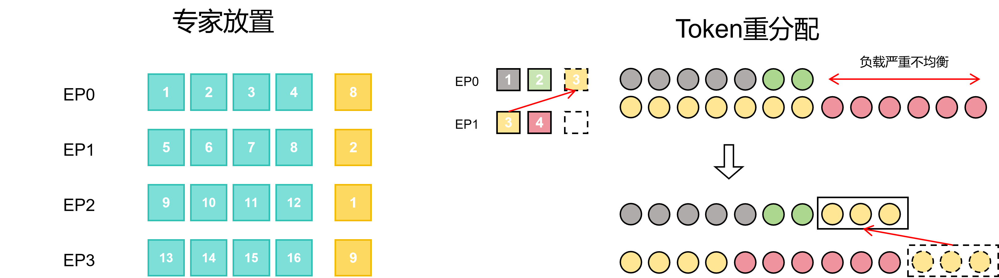

# EP Balance Strategy

## 背景与挑战

混合专家模型（MoE）通过稀疏激活机制，在保持大参数量的同时大幅降低了实际计算开销，已经成为大模型训练的主流架构。为了支撑MoE的规模化训练，专家并行（EP）将不同专家分配到不同设备，通过All-to-All或Allgather通信完成token路由与聚合。而路由网络根据输入数据，实时、不均匀地将Token分发给专家，而EP在训练开始前就已经将专家固定绑定到设备。当热门专家接收过多Token时，对应设备过载，冷门专家所在设备则空闲等待，造成算力浪费。

业界已有的负载均衡方案各有不足：

- Auxiliary Loss（辅助损失）：添加平衡损失引导路由均匀化，但是会干扰主任务优化目标，可能会导致模型的质量下降 。
- Token Dropping / Capacity Factor：强制丢弃超出容量因子的Token，虽然能硬性保证负载上限，但是直接造成信息丢失，损害模型训练效果。
- 专家重排：在特定step重新分配专家，无法应对训练过程中的瞬时负载尖峰，其重排本身带来额外的通信与状态迁移开销。

## 解决方案

本特性提出了一种基于冗余专家与动态贪心规划的高效负载均衡机制。该机制通过实时感知训练负载，从调度算法与执行优化两个维度协同解决MoE模型训练中的负载不均衡问题，核心技术要点如下：

- **调度决策层面** ：如下图所示，在每个专家并行（EP）Rank上预留少量冗余专家槽位作为弹性缓冲池。系统基于全局实时负载状态，采用贪心策略精准识别高负载Rank上的“热点专家”，并将其动态复制到低负载Rank的冗余槽位中。这一设计突破了传统静态专家映射的束缚，使原本积压在高负载Rank上的Token能够被迁移至低负载Rank处理，仅以极低的冗余开销即可快速实现全局负载均衡。
- **执行优化层面** ：为消除冗余专家引入的额外开销，在执行层面进行了针对性优化。一方面，利用`permute`和`unpermute`的反向计算过程，分别掩盖冗余专家参数同步与梯度聚合产生的通信延迟；另一方面，在CPU侧采用`Numba`即时编译技术加速负载重规划的求解过程，确保调度决策本身不会成为训练性能瓶颈。



## 使用方法

当前仅个别模型适配了该负载均衡方案，适配了该方案的模型会在模型的`.yaml`配置文件中找到以下字段

```yaml
# ep balance
enable_ep_balance: false
ep_balance_plan:
    max_dup_experts_num: 2
```

其中各字段的说明如下：

- `enable_ep_balance`：是否开启该负载均衡策略，默认不开启，如果开启的话需要修改为`true`
- `max_dup_experts_num`：每个EP Rank可以分配的冗余专家数量上限，建议根据EP size和总专家数调整。

## 使用场景

本特性适用以下场景：

1. **开启EP后，有严重的负载不均衡问题**：
   - 当负载显著不均衡时，优化的收益区间明显更大，如果原本的负载分配本来就比较均衡，则开启该特性后不会有特别明显的收益。但是该方案在专家重排和token重分配的求解过程中有早停的策略，所以性能一般不会有明显的劣化。
2. **`mbs*seqlen`较大的场景**：
   - 本方案主要的开销在于专家重排和token重分配的求解，而该求解过程的复杂度只和专家数量有关，所以如果`mbs*seqlen`较小，负载均衡得到的收益难以覆盖求解的开销，有导致性能劣化的风险。

不推荐使用场景：

- 需要严格确定性训练的场景：本特性反向涉及冗余专家梯度累加问题，不保证二进制对齐。

## 使用效果

在满足推荐使用场景并正确配置专家并行训练环境中，启用本特性后可以实现以下优化效果：

- 各节点计算负载趋于平衡，缓解负载不均衡导致的快慢卡问题
- 减少极度负载不均衡导致的OOM风险。
