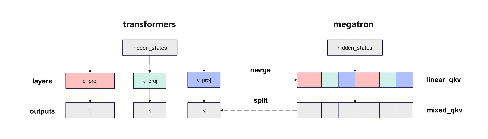
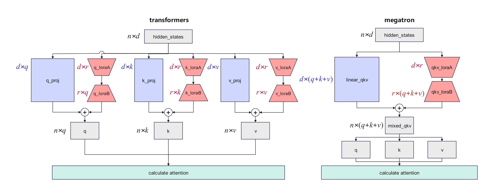

# 标准等价模型

## 定义与设计目标

**标准等价模型（Canonical Model）** 是 MindSpeed MM 提供的一种模型实现模式，其核心设计目标是：在 Megatron 分布式训练框架下，使模型的计算逻辑、参数结构和权重排列与 HuggingFace Transformers 的标准实现完全等价。

**设计目标：**

- **计算等价**：同一输入下，标准等价模型的输出与 HuggingFace Transformers 原生模型在数学上完全一致（允许浮点精度误差）
- **权重兼容**：标准等价模型的权重可以直接与 HuggingFace Transformers 原生模型权重相互转换，无需额外的拆分/合并/重排操作
- **LoRA 兼容**：LoRA 微调产生的适配器权重在两个框架间可直接通用，参数规模和排列完全一致

### 与原生 HuggingFace 模型的区别

| 维度 | 原生 HuggingFace 模型 | 标准等价模型（Canonical Model） | Megatron 融合模型（非标准等价） |
|------|----------------------|-------------------------------|-------------------------------|
| 运行框架 | Transformers（单卡/DDP） | Megatron（TP/PP/CP/DP 分布式） | Megatron（TP/PP/CP/DP 分布式） |
| 参数结构 | 分层独立（如 `q_proj`/`k_proj`/`v_proj`） | 分层独立，与 HuggingFace 完全一致 | 融合层（如 `linear_qkv`），参数经过重排 |
| 权重格式 | HuggingFace 标准格式 | HuggingFace 标准格式 | Megatron 融合格式，需转换 |
| LoRA 兼容 | 原生支持 | 与 HuggingFace LoRA 权重完全兼容 | LoRA 参数规模不一致，无法跨框架使用 |
| 训练性能 | 单卡性能有限 | 分布式训练，性能接近融合模型 | 分布式训练，融合算子性能略优 |
| 跨框架迁移 | — | 直接加载 HuggingFace 权重 | 需通过 mm-convert 转换 |

简言之，标准等价模型是在 Megatron 框架内"还原"HuggingFace 原生模型的计算逻辑，使用户既能享受 Megatron 的分布式训练加速能力，又能保持与 HuggingFace 生态的完全兼容。

## 问题分析

Megatron 框架下 Qwen-VL 系列模型的实现逻辑，与 Hugging Face Transformers 主流标准实现存在显著差异。该差异不仅会在 LoRA 微调等场景下产生较大计算偏差，还会造成不同框架间的模型迁移适配困难。

**核心问题：**

- Megatron 对模型核心模块做了融合及交织重排操作，与 Transformers 标准实现不一致
- 跨框架训练得到的权重无法直接兼容转换和加载
- LoRA 微调场景下参数规模与标准实现不匹配，导致算法层面不等价

## Megatron实现差异

Megatron 对模型核心模块做了融合及交织重排操作，以Qwen2.5-VL计算q、k、v矩阵为例，与 Transformers 标准实现的关键差异如下：

### Attention 层 QKV 计算逻辑

- **Transformers 标准实现**：将 `hidden_states` 分别输入独立的 `q_proj`、`k_proj`、`v_proj` 层，直接得到 q、k、v 三个矩阵；
- **Megatron 实现**：将原模型的 `q_proj`、`k_proj`、`v_proj` 三层矩阵拆分后重新排列，融合为 `linear_qkv` 单层，`hidden_states` 输入该层后先得到融合的 qkv 输出张量，再经拆分与重排后得到 q、k、v 三个矩阵。



**影响分析：**

- 融合后的 `linear_qkv` 层参数排列方式与标准实现不同
- 前向计算结果在数值上可能存在微小差异
- 权重转换时需要额外的拆分/合并操作

### MLP 层 FC1 计算逻辑

Megatron 同时将 MLP 层中的 `gate_proj` 和 `up_proj` 两层融合为 `linear_fc1` 单层，与 Transformers 标准分层实现逻辑不一致。

**影响分析：**

- 融合层的参数排列与标准实现不同
- 影响权重的跨框架转换

### LoRA微调场景差异

Megatron 对上述模块的融合操作，会导致 LoRA 微调场景下的参数规模与 Transformers 标准实现不匹配：例如 qkv 层的 LoRA-A 矩阵参数量仅为标准实现的 1/3，造成算法逻辑层面的不等价。最终导致两种框架下训练得到的 LoRA 权重无法跨框架兼容转换和加载。



**具体影响：**

- LoRA-A 矩阵参数量不一致，影响微调精度
- 跨框架 LoRA 权重无法直接使用
- 不同框架训练的 LoRA 权重效果可能存在差异

## 解决方案

针对 Megatron 框架中经过融合交织优化的模块，MindSpeed MM 提供了与 Transformers 标准实现等价的适配方案，消除不同框架间的模型结构差异引起的计算差异，解决跨框架间的切换不兼容问题。

**方案特点：**

- 保持与 Transformers 标准实现完全等价的计算逻辑
- 支持 LoRA 微调场景下的跨框架权重兼容
- 无需修改模型权重，仅需在配置中启用

**当前支持的模型：** `Qwen2.5-VL`、`VideoAlign`

## 使用方法

以 Qwen2.5-VL 为例，在 `model_xxb.json` 中添加 `canonical_model` 并使能：

```json
{
  "model_id": "qwen2_5vl",
  "img_context_token_id": 151655,
  "vision_start_token_id": 151652,
  "image_encoder": {
    "vision_encoder": {
      "model_id": "qwen2vit",
      "canonical_model": true,  // 启用视觉编码器的标准等价实现
      ...
    },
    ...
    "text_decoder": {
      "model_id": "qwen2lm",
      "canonical_model": true,  // 启用文本解码器的标准等价实现
      ...
    }
  }
}
```

### 配置说明

| 配置项 | 位置 | 说明 |
|--------|------|------|
| `canonical_model` | `vision_encoder` | 启用视觉编码器的标准等价实现 |
| `canonical_model` | `text_decoder` | 启用文本解码器的标准等价实现 |

### 最佳实践

1. **LoRA 微调场景**：强烈建议启用 `canonical_model`，确保 LoRA 权重与 Transformers 标准实现兼容
2. **跨框架迁移**：如需在 Megatron 和 Transformers 之间切换训练，必须启用此特性
3. **预训练场景**：如无跨框架需求，可不启用（Megatron 融合实现在性能上可能更优）
4. **精度验证**：启用后建议对比验证训练 loss 和模型输出是否与标准实现一致

### 注意事项

- 启用 `canonical_model` 后，模型结构将与 Transformers 标准实现一致，但可能略微影响训练性能
- 已有的非标准等价模型权重需要重新转换后才能与标准等价模式配合使用
- 更多模型的标准等价支持正在开发中，请关注 [特性列表](feature_list.md)
