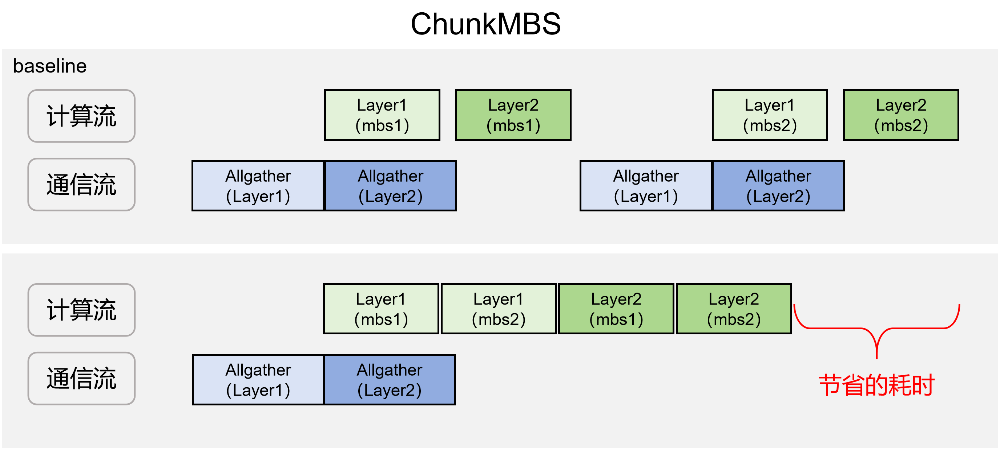

# ChunkMBS

## 适用后端

FSDP2

## 背景与挑战

在使用FSDP2进行大模型训练时，每个Block计算前必须完成整块参数的Unshard流程（包含异步Copy-in、异步通信及同步Copy-out）。在超大参数规模下，通信耗时过长，计算无法完全掩盖通信延迟，且同步Copy-out的开销占比过高，直接拖累了训练吞吐。同时，通信与计算对总线带宽的抢占，也导致了并行计算效率的下降。

传统的优化手段主要通过增加序列长度或提高Micro-Batch Size (MBS) 来增加单次Unshard后的计算密度。但这会显著增加显存压力。对于大参数模型而言，静态显存本就占用巨大，导致序列长度和MBS的提升空间十分有限，难以通过此路径有效提升整体吞吐。

## 解决方案

本方案建立在重计算（Recomputation）与异步激活卸载（Async Activation Offload）两大基础特性之上。在前向计算阶段，系统仅保留Layer入口处的激活值，并通过异步机制将其动态卸载至Host侧内存。在此机制下，Device侧的显存占用主要由两部分构成：

- **静态显存**：模型参数、梯度及优化器经过分片（Sharding）后占用的基础显存。
- **动态显存**：反向重计算阶段，单个Block对应单个Micro-batch所需的全部激活显存。

**核心优化方案**：为突破显存瓶颈，本方案在单次参数Unshard完成后，引入了Batch维度的细粒度切分机制，具体实现流程如下：

- **切分与计算**：将当前Layer的输入在Batch维度上切分为多个微块（Micro-chunks），依次完成各微块的前向计算；反向阶段按计算图逆序逐块进行，配合重计算时在反向中逐块重算前向。
- **异步流水线**：在前向计算间隙，系统异步执行激活值的offload（D2H）操作；在反向计算阶段，按需将对应微块的激活值从Host迁回（H2D）至Device，完成该微块的反向计算后，再处理下一微块。
- **显存与吞吐收益**：通过该策略，整体激活显存的峰值占用被严格压缩至单个微块的量级。这有效解耦了显存占用与计算规模的强绑定关系，使得在有限的Device显存资源下，可以通过灵活增加切块数量来适配更大的计算规模，从而最大化整体训练吞吐。

该方案具体的示意图如下



在GBS相同的情况下，设置`micro_batch_size`为MBS，设置梯度累积步数（`gradient_accumulation_steps`）为`GBS/(DP*MBS)`，在每个梯度累积步都要进行每个block参数的unshard；但是开启该特性后，一种典型用法是设置`micro_batch_size`为`GBS/DP`（DP=1时即GBS），设置梯度累积为1，设置`chunkmbs_plan.chunk_mbs`为原来的MBS（即合并前每个micro_batch的大小），这样每次更新模型参数都只要对每个block进行一次参数unshard，大大节省了通信时间。在Qwen3.5 35B模型上实测整网收益5%左右。

## 使用方法

该方案需要与[异步激活卸载（Async Activation Offload）](./async_activation_offload.md)和重计算特性结合使用：开启了ChunkMBS的modules必须同时开启activation offload和recompute（约束见「注意事项」）。开启方式如下：

```yaml
features:
  # 重计算配置
  recompute: true
  recompute_plan:
    apply_modules:
      - model.visual.blocks.{*}
      - model.language_model.layers.{*}

  # activation offload 配置
  enable_activation_offload: true
  activation_offload_plan:
    apply_modules:
      - model.visual.blocks.{*}
      - model.language_model.layers.{*}

  # chunkmbs配置
  enable_chunk_mbs: true
  chunkmbs_plan:
    apply_modules:
      - model.language_model.layers.{*}
    chunk_mbs: 2 # 这个表示的是chunk之后的micro batchsize
    batch_dim: 0
    chunk_arg_indexs: [0]
    chunk_kwarg_names: ["position_embeddings", "position_ids", "rope_deltas", "attention_mask"]
```

### 参数说明

| 配置项 | 类型 | 默认值 | 含义 |
| --- | --- | --- | --- |
| `enable_chunk_mbs` | bool | `false` | 是否开启ChunkMBS特性 |
| `apply_modules` | list | `None` | 需要开启该特性的module，使用正则表达式匹配，注意需要被包含在 `recompute` 特性和 `activation_offload` 特性的 `apply_modules` 中 |
| `chunk_mbs` | int | `1` | chunk之后的mbs，例如原来的 `micro_batch_size` 为8，切成4份，每份的大小为2，则该字段配置为2 |
| `batch_dim` | int | `0` | batchsize所在的维度，例如该layer输入的layout是 [b, s, h]，则 `batch_dim` 配置为0，如果该layer输入的layout是 [s, b, h]，则 `batch_dim` 配置为1 |
| `chunk_arg_indexs` | list | `[0]` | 以位置参数（args）形式传入、需要在batch维度切分的入参索引 |
| `chunk_kwarg_names` | list | `[]` | 以关键字参数（kwargs）形式传入、需要在batch维度切分的入参名称 |

`chunk_arg_indexs` 与 `chunk_kwarg_names` 用于表示哪些入参需要切分，以下面的输入为例：

```python
hidden_states = decoder_layer(
    hidden_states,
    position_embeddings=position_embeddings,
    attention_mask=layer_mask,
    position_ids=text_position_ids,
    past_key_values=past_key_values,
    use_cache=use_cache,
    cache_position=cache_position,
    **kwargs,
)
```

其中 `hidden_states`、`position_embeddings`、`attention_mask`、`position_ids`、`rope_deltas` 需要在 `batch_size` 维度进行切分，其余入参不需要切分；`hidden_states` 以 `args` 的形式传入，`position_embeddings`、`attention_mask`、`position_ids`、`rope_deltas` 以 `kwargs` 的形式传入，所以按照上述的配置进行设置。

### 示例脚本

**示例脚本**：`examples/qwen3_5/finetune_qwen3_5_27B.sh`（配置字段见 `examples/qwen3_5/qwen3_5_27B_config.yaml` 的 `features` 段；仓库示例中 `enable_chunk_mbs` 默认 `false`，需置为 `true` 并配合recompute与activation offload使用）。

## 注意事项

### 已知约束

- 框架不校验ChunkMBS与recompute / activation offload的开启关系；若未同开，各微块激活会在反向前全部驻留显存，显存收益将消失。
