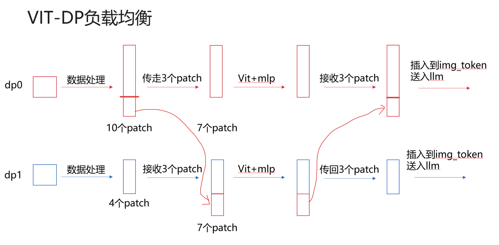

# Encoder数据负载均衡 (beta)

## 问题分析

在多模态模型训练中，以 InternVL 为例，当 DP（数据并行）大于 1 时，不同 DP rank 之间处理的图片 patch 数量不同。由于视觉编码器（ViT）和 MLP 的计算量与图片 patch 数直接相关，patch 数差异会导致各 DP rank 之间的计算负载不均衡，最终在梯度 allreduce 阶段出现"快卡等慢卡"的现象，严重拖慢整体训练效率。

**典型场景：**

- 多模态理解模型（如 InternVL、Qwen2-VL 等）中，不同样本的图片分辨率差异较大
- DP 并行度较高时，负载不均衡的影响更加显著
- 训练数据中图片尺寸不统一时尤为明显

## 解决方案

通过 Alltoall 通信实现 encoder 的负载均衡：将多 patch 的 DP rank 上的部分计算任务传递给少 patch 的 DP rank，使各卡的计算量趋于均衡。



**核心机制：**

1. 在前向传播前，统计各 DP rank 的 encoder 计算量（patch 数）
2. 通过 Alltoall 通信，将多余的 encoder 计算任务重新分配
3. 计算完成后，再通过 Alltoall 将结果返回给原始 DP rank
4. 梯度 allreduce 时各卡计算量基本一致，消除等待时间

## 使用方法

### 启用参数

在模型启动 shell 中添加 `--encoder-dp-balance` 参数（当前仅支持 InternVL）：

```shell
GPT_ARGS="
    ...
    --encoder-dp-balance \
"
```

### 适用条件

| 条件 | 说明 |
|------|------|
| 支持模型 | InternVL（后续将扩展更多模型） |
| 并行策略 | DP > 1 时生效 |
| 数据特征 | 图片分辨率差异较大时效果更明显 |

### 性能预期

- 在图片分辨率差异大的场景下，可显著减少快卡等待时间
- Alltoall 通信本身会引入少量额外开销，在负载均衡良好的场景下收益可能不明显
- 建议在训练吞吐量受快慢卡制约时启用

## 注意事项

1. 该特性当前为 beta 版本，仅支持 InternVL 模型
2. 启用后会增加少量通信开销，建议在确认存在负载不均衡问题时使用
3. 后续版本将支持更多模型，敬请关注 [特性列表](feature_list.md)
