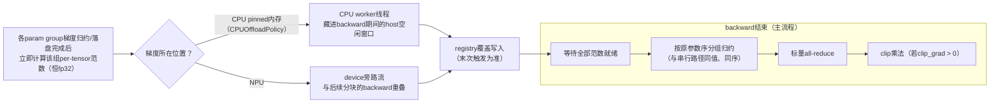
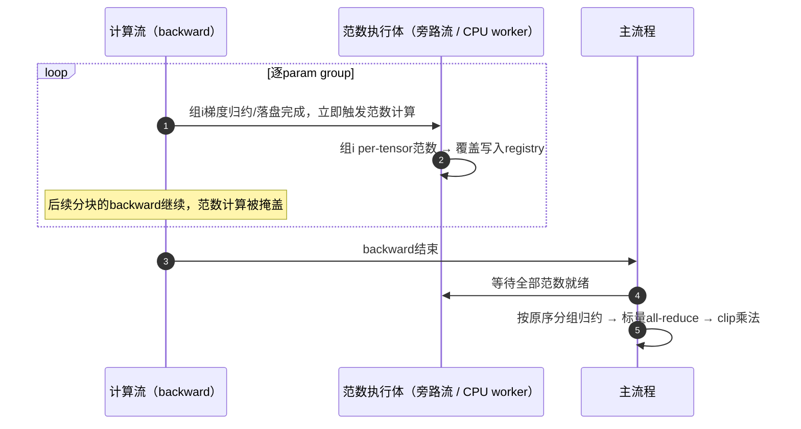

# Grad Norm Overlap（梯度范数掩盖）

## 适用后端

FSDP2

## 背景与挑战

FSDP2训练中，梯度裁剪前的本地范数求和在backward结束后串行执行：一次性读取全部梯度计算per-tensor范数并求和。在`CPUOffloadPolicy`（梯度offload到CPU）场景下，范数计算被迫走CPU内存带宽（与NPU HBM差约40倍），这段串行host开销尤为显著；此外，`reduce_dtype: bf16`配置下旧的求和实现会先把全部梯度物化为fp32，产生约2倍梯度大小的瞬时显存尖峰。

## 解决方案

按FSDP2 param group分块、随backward流水执行范数计算，把范数计算掩盖进backward窗口。开启后，每个param group在其梯度归约/落盘完成后立即计算该组的per-tensor梯度范数，与后续分块的backward重叠；backward结束时只剩一次按原序的分组归约、一次标量all-reduce与clip乘法。

### 方案原理

按梯度所在位置自动选择执行路径，两条路径共用同一张范数登记表（registry，按参数覆盖写入、末次触发为准）：



时序上，范数计算被掩盖进backward窗口，backward结束时只剩轻量的收尾段：



读图要点：

- **只算per-tensor范数，不在组内求和**：求和留给主流程按原参数顺序做，与串行路径同值、同序、同kernel，构造上保证均匀dtype配置逐位一致；
- **覆盖语义（末次触发为准）**：梯度累积、模块复用（如MTP共享`embed_tokens`/`lm_head`）导致同组多次触发时，只消费最后一次的结果；
- **掩盖率取决于backward窗口**：尾部组（如`embed_tokens`/root组）在backward结束后才兜底触发，其范数无法掩盖；backward窗口越长的模型掩盖越充分。

顺路优化（开关关闭时同样生效）：本地范数求和实现批量化重写，非fp32梯度直接以fp32精度计算，消除bf16物化尖峰（与物化路径逐位一致）；同一device上梯度dtype混合时仍全量物化为fp32，与既有行为逐位一致。

精度与正确性保障：

- 均匀dtype配置下，总范数与现路径**逐位一致**（同数据、同kernel、同求和顺序），loss全序列逐位一致（多组off/on对拍验证）；
- 覆盖语义（末次触发覆盖）保证梯度累积与模块复用（如MTP共享`embed_tokens`/`lm_head`）场景的正确性；
- 不满足前置条件的场景**安全回退现路径**并打印warning（一次；已知约束中标注「静默回退」的场景除外），不静默分歧；
- 不引入新的显存尖峰；非offload场景存在约 +2MB的静态显存足迹（旁路流范数标量驻留）。

## 使用场景

- **推荐开启**：FSDP2 + `CPUOffloadPolicy`（梯度offload到CPU），尤其backward窗口较长的大模型，范数串行段掩盖最充分；
- **可选开启**：`clip_grad: 0.0`（仅记录范数不裁剪）场景，无clip乘法pass，可掩盖比例最大；
- **收益有限**：非offload场景串行段本身占step时间比例小（实测约0.3%），step级收益通常不可测量；
- **不必开启**：`fully_shard_parallel_size == 1`（DDP路径）无FSDP分组，本特性无作用对象。

## 使用方法

在模型YAML配置文件的`features`段开启：

```yaml
features:
  enable_grad_norm_overlap: true
```

无需其他配置；开启后按梯度位置自动选择执行路径，不满足前置条件时自动回退现路径并打印warning（静默回退场景见已知约束）。

### 参数说明

| 参数 | 类型 | 默认值 | 说明 |
| --- | --- | --- | --- |
| `enable_grad_norm_overlap` | bool | `false` | 是否开启Grad Norm Overlap；`clip_grad: 0.0`时同样生效（仅掩盖范数计算）；offload与否自动选择执行路径 |

### 示例脚本

**示例脚本**：`examples/qwen3_5/finetune_qwen3_5_4B.sh`（在其YAML配置的`features`段加上`enable_grad_norm_overlap: true`即可开启）

## 使用效果

| 模型 | 硬件 | 集群规模 | 开启前 | 开启后 | 收益 |
| --- | --- | --- | --- | --- | --- |
| Qwen3.5-4B + CPUOffloadPolicy | Ascend 910 | 1x4 | 串行段209ms | 63ms | -70% |
| Qwen3.5-35B-A3B + CPUOffloadPolicy | Ascend 910 | 1x4 | 串行段1024ms | 3.3ms | -99.7%（step级 +1.06s/step ≈ +5.9%） |
| Qwen3.5-35B-A3B + EP=2 | Ascend 910 | 1x4 | 串行段747ms | 1.0ms | -99.9% |
| Qwen3.5-4B非offload | Ascend 910 | 1x4 | 串行段13.1ms | 3.9ms | -70%（仅占step约0.3%，step级不可测量） |

> 实测环境：Ascend 910（4卡）/ CANN 9.0.0 / torch 2.7.1 + torch_npu 2.7.1，10 iterations分段插桩计时，数据截至2026-08。35B step级收益经同窗配对A/B坐实（OFF/ON交替3对连跑）。

精度验证（截至2026-08）：7组off/on对拍（4B offload clip=0 / clip=1.0 / 梯度累积GA=2，4B非offload clip=0 / clip=1.0，35B offload，35B EP=2）的loss与总范数全序列逐位一致；max reserved无新增（35B逐字节相同；非offload +2MB静态足迹如上所述）。插桩剥离后的最终代码形态经4B offload off/on smoke对拍复核：torch 2.7.1与torch 2.10.0（torch_npu 2.10.0.post4）下loss与总范数全序列均逐位一致。

## 注意事项

### 已知约束

**回退矩阵**（开关开启时按场景选择行为）：

| 场景 | 行为 |
| --- | --- |
| `CPUOffloadPolicy`（梯度offload到CPU） | CPU worker路径 |
| 梯度在NPU + patched post_backward在场（当前torch 2.7.1 / 2.9.0 / 2.10.0） | device旁路流路径 |
| 同一device上梯度dtype混合 | 回退现路径 + warning（一次） |
| `norm_type != 2` | 禁用本特性 + warning（一次）（仓内训练链路恒为2-norm，无此配置键） |
| torch版本无patched post_backward（上述三版本之外） | 启动期保持关闭 + warning |
| torch.compile | 未专门验证：默认仅编译forward时backward仍为eager，机制照常生效；compiled autograd未适配、未验证 |
| `fully_shard_parallel_size == 1`（DDP路径） | 无FSDP组触发，静默回退现路径（无warning） |

其他约束：

- 已验证范围：Qwen3.5-4B / Qwen3.5-35B-A3B，offload与非offload、梯度累积GA=2、EP=2（数据截至2026-08），超出验证范围的场景不承诺；
- `embed_tokens`（输入无梯度）与root组的归约由root callback在backward结束后兜底触发，其范数落在尾部；backward窗口较长的大模型实测影响可忽略，窗口短的模型掩盖率按自身情况评估；
- offload场景的掩盖率受pinned内存读带宽与backward期间host占用影响，建议以实际配置做A/B验证。

### 可叠加特性

- 梯度累积（gradient accumulation）：覆盖语义保证正确，GA=2已验证；
- 专家并行（EP）：non_ep / ep两个归约组各自取范数，EP=2已验证；
- `clip_grad: 0.0`（仅记录范数）：同样生效，可掩盖比例最大。
