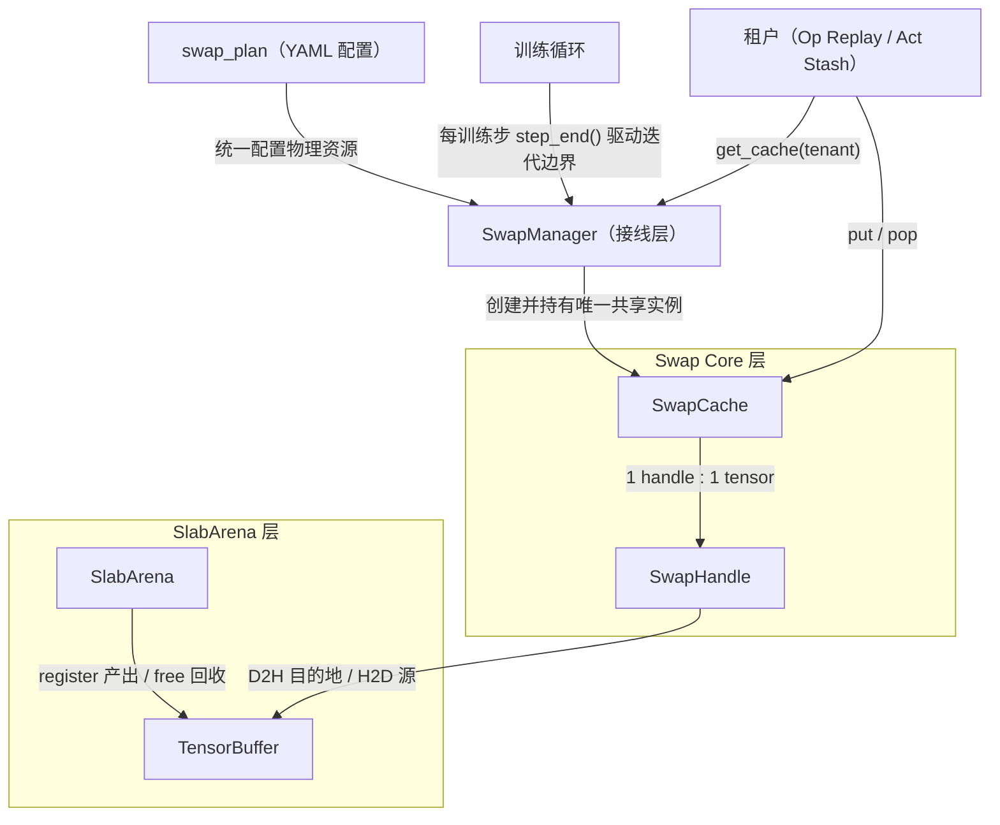
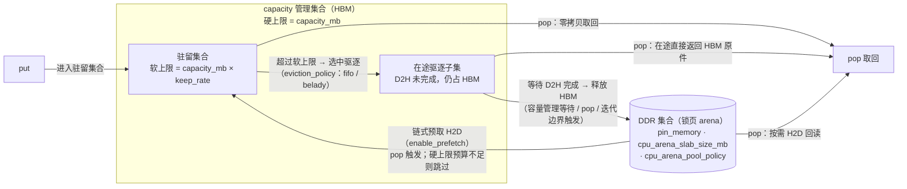

# Swap Core（张量交换底座）

## 适用后端

FSDP2

## 背景与挑战

大模型长序列训练中，激活值显存是主要瓶颈之一。重计算、激活卸载等显存优化手段都涉及HBM↔DDR的数据搬移，但已有实现（逐算子跳过重计算、逐层激活卸载等）是自管理的私有机制——每个特性各自维护私有换出逻辑与释放协议，HBM与锁页内存资源互相不可见、难以统一编排。

## 解决方案

Swap Core是一套HBM↔DDR异步换入换出（swap）通用底座，分两层：

- **SlabArena**：CPU侧锁页内存slab分配器，支持池化复用（slab池）与精确按需（on-demand）两种形态；
- **SwapCache / SwapHandle**：单张量换入换出与集合管理，提供容量双阈值（硬上限 + 软上限）、fifo / belady驱逐与转移图链式预取。

物理资源（swap流、CPU锁页arena、容量预算）由 `swap_plan` 统一配置、`SwapManager` 单点持有；各显存优化特性作为**租户**经 `get_cache(tenant)` 注入，共享同一个 `SwapCache` 实例，不各自构造缓存、不各自界定迭代边界。租户清单见[租户清单与选型指引](#租户清单与选型指引)。

### 方案原理

模块关系如下（依赖方向单向：上层调用下层，下层不感知上层）：

底座对外（租户与使用者）提供的能力：

- **put / pop换入换出**：put存入张量并返回令牌（handle），pop凭令牌取回；全部拷贝异步执行、与计算重叠，无host阻塞。
- **统一容量管理**：全部租户共享一份HBM预算，投影占用超过软上限的张量自动换出DDR，取回时自动回读。
- **链式预取**：记录首个iteration的取回（pop）顺序形成转移图，之后沿转移图在张量被消费前提前取回。
- **布局保真**：取回的张量与原张量布局完全一致；如需归一化布局（如 `.contiguous()`），在取回后自行组合。

### 使用约定

租户与Swap Core边界上需要特别约定的事项：

- **迭代边界由调用方的循环界定**：链式预取依赖可重复的循环结构——转移图在首个迭代学习取回顺序、后续迭代沿图预取，因此缓存按「迭代」收尾：每迭代结束时清理本迭代换出内容（释放句柄与占用计数）、推进转移图学习。迭代与训练step无必然对应，由接入方按自身循环粒度驱动；仓库FSDP2 trainer已按训练步自动接入。
- **换出的张量禁止原地改写（无运行时兜底）**：进入缓存的张量在被取回前禁止in-place改写；违反时不报错、静默产生错误数值（训练场景下即错误梯度），缓存层不做版本检测。确需改写请先 `clone()`。
- **put在分配流上下文调用**：张量的全部写入须有序于put；此前在旁流上的写入由租户先用事件接力进put所在流（跨流定序纪律属多流编程自身要求，底座不兜底）。
- **pop/consume在消费流上下文调用**：取回落点固定在put流池分配，底座在取回完成时把排序同时落到消费流与put流（settle双落）；租户随后释放引用前，须保证分配流已有序于自己的全部旁流读（wait-before-drop）。

## 使用场景

- **该开**：长序列/大模型训练中激活显存成为瓶颈，希望用少量HBM预算 + DDR带宽换取"关键算子不重算 + 激活值不驻留HBM"时，经Op Replay / Act Stash租户接入；**不必开**：短序列、激活显存无压力的场景，换入换出只引入额外的D2H/H2D拷贝开销；只配置 `swap_plan` 而不开租户不产生任何效果。
- **不可用**：CPU-only主机（开启任一租户时缓存构造直接失败）。

## 使用方法

`swap_plan` 描述全部租户共享的换入换出物理资源（HBM容量预算、CPU锁页arena、驱逐与预取策略），在训练YAML的 `features` 段配置（FSDP2后端）。

### 参数说明

| 配置项 | 类型 | 默认值 | 含义与取值约束 |
| --- | --- | --- | --- |
| `swap_plan.capacity_mb` | float | 1024.0 | 全部租户共享的HBM容量预算（MB），同时是缓存池物理占用的封顶线——**显存收益由它决定：池物理峰值 ≈ min(`capacity_mb`, 换出总量)，与 `keep_rate` 无关**。取值三档：`<0` 不管理（pass-through，任何内容都不驱逐）；`=0` 确定性驱逐（每次put即驱逐，且计算（put）流等待swap流，无异步重叠）；`>0` 异步容量管理（默认模式）。机制细节见[配置机制图解](#配置机制图解)。 |
| `swap_plan.keep_rate` | float | 0.0 | HBM驻留比例，取值 `[0,1]`。软上限 = `capacity_mb × keep_rate`（投影口径）：投影占用超过软上限即发起异步D2H。**它不改变物理峰值（由硬上限封顶），只调节拷贝时机与取回命中率**：`0` = put即发起（拷贝与计算重叠最大，但全部换出量都付拷贝开销）；`1` = 尽量驻留、仅物理占用达到硬上限时才发起（拷贝最少，驻留部分取回零拷贝）。取值越界（`<0` 或 `>1`）启动校验报错。 |
| `swap_plan.enable_prefetch` | bool | true | 是否启用链式预取。第一个iteration用于学习张量的pop顺序（至少2次取回才形成第一条转移边），第二个iteration起在pop后沿转移图预取后续张量。 |
| `swap_plan.cpu_arena_slab_size_mb` | float / null | 2048.0 | CPU slab arena的slab大小（MB）。设为 `null`（YAML写法）时使用on-demand arena：逐张量精确分配，释放后立即归还锁页内存（无池化复用）。 |
| `swap_plan.cpu_arena_pool_policy` | str | "standard" | CPU arena池策略：`"all"` 保留所有空slab的物理内存；`"standard"` 保留标准slab、超大slab空后立即释放；`"none"` 任何slab空后立即释放。仅在配置了 `cpu_arena_slab_size_mb` 时生效。 |
| `swap_plan.pin_memory` | bool | true | arena slab是否使用锁页（page-locked）内存。`false` 是宿主机锁页内存耗尽时的逃生口：非锁页拷贝将退化为同步执行（torch行为）。 |
| `swap_plan.eviction_policy` | str | "fifo" | 驱逐策略：`"fifo"`（最早放入者先驱逐）或 `"belady"`（驱逐最远未来才使用的张量）。`keep_rate=0`（默认）的管理模式下每次put即驱逐，"驱逐谁"无选择、两策略等价；`keep_rate>0` 时belady生效。 |

### 配置机制图解

以下图解从配置作用的角度解释容量管理、驱逐与预取，并标注各用户配置项的作用点。

读图要点：

- **集合关系**：驻留集合 ∪ 在途驱逐子集 = capacity管理集合（两者都占HBM）；DDR集合独立，不受 `capacity_mb` 约束。
- **释放时机**：D2H拷贝完成本身不释放HBM——释放是独立的宿主侧动作，只在三类时机发生（容量管理等待在途D2H完成、pop、迭代边界），之后张量才落入DDR集合、HBM占用才真正下降。
- **容量定标规则**：异步重叠要成立，容量必须容得下"在飞"的拷贝——稳态下在飞D2H的份数 ≈ 单份传输耗时 ÷ 换出间隔（Little's law）。经验规则：`capacity_mb ≥ (⌈单份传输耗时/换出间隔⌉ + 1) × 单份换出大小`；低于此下界，硬上限反压停顿开始暴露到前向关键路径（表现为step time变长而HBM占用看似更低）。

要点（fifo与belady）：

- **判据方向相反**：fifo用put插入序取队头；belady用转移图记录的「下次使用步」，驱逐最晚才用的张量——这是缓存理论的最优策略（OPT），前提是未来访问顺序已知且稳定。
- **belady的两个生效前提**：转移图已学习（第二个iteration起）且 `keep_rate > 0`（默认 `keep_rate = 0` 时每次put即驱逐，两策略等价）。
- **belady与可变负载**：查不到未来pop位置的张量按「永不使用」优先驱逐；pop顺序每步可变的负载转移图学到的「未来」不可靠，建议 `enable_prefetch: false` + `eviction_policy: fifo`。

## 租户清单与选型指引

仅配置 `swap_plan` 不会生效：底座本身不产生显存收益，收益来自其上的租户——需至少开启一个（租户配置见各自文档）：

- **Op Replay（算子重放）**：建立在重计算（checkpoint）机制之上的策略。在前向时把作用域内白名单算子的输出异步换出到DDR，重计算时按路由直接从DDR取回、跳过该算子的重算，从而只缓存少量昂贵算子的输出，用可控的HBM预算 + DDR带宽换取大部分重算开销的消除。详见 [Op Replay](../optimization/op_replay.md)。
- **Act Stash（激活暂存）**：激活offload的 `saved_tensors_hooks` 实现。在前向时把模块内autograd保存的激活张量打包（pack）换出到共享缓存，反向时按需取回（unpack），是仓库已有逐层激活offload（legacy实现）的另一种形态。详见 [Act Stash](act_stash.md)。

选型要点：

- **两者可叠加**：Op Replay与Act Stash可同时开启，共享同一个SwapCache与 `swap_plan` 预算；覆盖范围天然互补（checkpoint内外各管一段）。叠加时按两者的总换出量设置 `capacity_mb`。
- **选型建议**：重计算已开但算力有富余时，用Op Replay省去关键算子（matmul / attention）的重算；需要把checkpoint边界输入等autograd保存的激活换出DDR时，用Act Stash；两者组合实现checkpoint边界内外全覆盖。

## 注意事项

### 已知约束

- **已验证范围**：qwen3_5 4B（FSDP2后端，Op Replay与Act Stash租户）e2e训练，截至2026-08。
- **精度验证建议**：新配置（新租户、新scope、新白名单）上线前，用确定性模式做逐位对照——`training.use_deter_comp: true` + 固定种子 + 关数据shuffle，同配置开/关特性各跑若干步，逐iter loss与grad norm逐位一致才放行（见 [确定性计算](../other/deterministic_computing.md)）。先确认基线本身逐位可复现：个别算子kernel非确定时，逐位差异并非本特性引入；`examples/qwen3_5/finetune_qwen3_5_4B.sh` 已验证逐位可复现。
- **多流场景**：① 跨流生产的张量须先汇流（事件同步到计算流）再被put——这是多流编程自身的纪律，与底座无关；② D2H拷出的排序锚定在 **put时刻**调用流上录制的事件：驱逐即使后来被无关上下文间接触发，拷出也只与put前的写入保序，驱逐侧无需额外关注；③ pop侧落点在 **put时刻捕获的流**（put流）上下文分配、H2D与put流保序，取回完成的排序同时落消费流与put流（settle双落）；释放定序锚put流（释放块回分配流池，与释放时ambient无关），旁流读者的安全性经租户wait-before-drop向put流传递。两点多流限定预期：跨租户驱逐时释放定序会把一道设备侧wait插进**被驱逐租户**的流（有界反压边，单流接线无感）；预取H2D等待put流全量队尾，put流≠消费流时预取起跑可能偏晚。反向多流调度场景（pop/consume与put不在同一流）不在当前已验证范围内。此类问题表现为偶发错值、不报错；排查时用 `capacity_mb: 0` 确定性驱逐档做二分定位——错值消失即指向异步序问题。
- **传输带宽与NUMA布局强平台相关**：容量定标规则中的"单份传输耗时"必须按目标机器实测，不可跨平台沿用历史数据。上线前建议用 `tests/ut_fsdp/features/memory/` 下的带宽/双工/并发探针实测：单链路solo带宽、D2H与H2D并发时两方向的相互影响、目标并发规模下的聚合带宽与per-rank有效带宽；定标容量与传输耗时一律取**并发期实测值**而非solo值。
- **CPU绑核收益平台相关，映射正确性须先按机器验证**：绑核映射（`CPU_AFFINITY_CONF`）与实际卡-NUMA拓扑不符时（错节点绑定）反而有害；`MM_PRIME_CPU_AFFINITY`的priming只把绑核生效时刻提前到首个backward之前（让早期锁页分配如swap arena落在绑定节点），不修正映射本身。是否启用绑核与priming，建议先在目标机器上做绑核A/B的并发带宽对照实测再决定。
