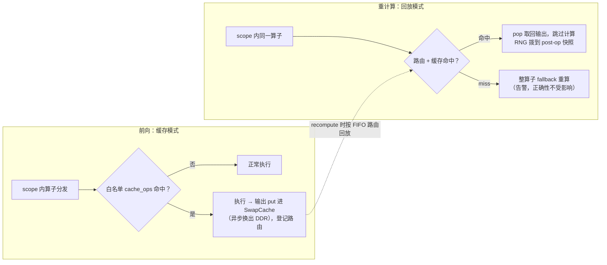

# Op Replay（算子重放）

> Op Replay是 [Swap Core](swap_core.md) 底座之上的租户，与底座的交互只有 `put` / `pop` 两个接口；换入换出的物理行为由共享的 `swap_plan` 配置决定。底座的行为与约定见 [Swap Core](swap_core.md)，本文只描述Op Replay自身的配置与语义。

## 适用后端

FSDP2

## 背景与挑战

全量重计算（checkpoint）丢弃前向激活、反向时重算，以大量冗余计算换取显存；其中matmul、attention等昂贵算子的重算开销尤为显著。已有的逐算子跳过机制（skip FA / skip GDN）能省去关键算子的重算，但需要逐算子侵入式接入，新增算子就要再写一套，演进成本高。

## 解决方案

Op Replay在checkpoint内部引入作用范围（scope）：用户仅凭配置圈定模块范围与算子白名单，即可让scope内白名单算子的输出在前向时换出、重计算时直接取回并跳过重算——只缓存少量昂贵算子的输出，用可控的HBM预算 + DDR带宽换取大部分重算开销的消除。为此需要从前向存活到重计算的算子输出，由Swap Core底座统一管理。

### 方案原理



读图要点：

- **RNG逐位对齐**：不变量 = 「recompute的RNG流位置 ≡ forward同位置」。checkpoint级 `fork_rng` 负责入口对齐，Op Replay只补一个缺口——被回放（跳过）的算子消耗0 RNG，故回放时把RNG流拨到该算子forward的post-op快照；其后需重算的算子（含miss fallback）从该位置继续消耗，与forward一致。

## 使用场景

- **该开**：已开启重计算、且matmul / attention等昂贵算子的重算开销在step time中占比可观时，用可控的HBM预算 + DDR带宽换取这部分重算的消除。
- **不必开**：未开重计算时不存在挂载点（Op Replay只在checkpoint内部激活）；scope落在 `recompute_plan.apply_modules` 覆盖范围外时永不回放（不报错，只是不生效）；scope内都是廉价算子时，换出/取回的带宽开销大于省下的重算，无收益。

## 使用方法

同时满足才生效：`features.recompute: true`；`use_reentrant: false`（reentrant下checkpoint不使用 `context_fn`，Op Replay永不激活，启动时warning并跳过）；`op_replay_scopes` 非空（非空即启用）。

最小配置示例：

```yaml
features:
  recompute: true
  recompute_plan:
    apply_modules:
      - model.language_model.layers.{*}
    use_reentrant: false
    op_replay_scopes:
      - name: layer_attn
        apply_modules:
          - model.language_model.layers.{*}.self_attn
        # cache_ops 缺省回落内置白名单（matmul 族 + SDPA flash attention）
  swap_plan:
    capacity_mb: 1024   # 多租户共享预算，与 Act Stash 同开时按总量规划
```

### 参数说明

**recompute相关字段**

| 配置项 | 类型 | 默认值 | 含义与取值约束 |
| --- | --- | --- | --- |
| `features.recompute` | bool | false | 重计算（梯度检查点）总开关。未配置时按false处理。注意该字段为透传配置项、不做类型校验，按真值判定——YAML中请写不带引号的布尔值（`recompute: true`，不要写成 `recompute: "true"`）。 |
| `recompute_plan.apply_modules` | List[str] | [] | 应用重计算的模块（模块名匹配pattern，支持 `{*}` 通配，如 `model.language_model.layers.{*}`）。 |
| `recompute_plan.use_reentrant` | bool | false | 是否使用reentrant checkpoint。**Op Replay仅 `false` 生效**：reentrant下checkpoint不使用 `context_fn`，Op Replay永远不会激活（启动时warning并跳过）。 |
| `recompute_plan.op_replay_scopes` | List[scope] | [] | Op Replay作用域列表；**非空即启用** Op Replay。每个scope是"区域 × 白名单 × RNG策略"的独立配置。 |

**scope字段**

| 配置项 | 类型 | 默认值 | 含义与取值约束 |
| --- | --- | --- | --- |
| `op_replay_scopes[i].name` | str / null | None | 作用域标签，仅用于日志。 |
| `op_replay_scopes[i].apply_modules` | List[str] | [] | 标定scope区域的模块。**必须落在 `recompute_plan.apply_modules` 覆盖范围内**——dispatch模式只在checkpoint内部激活，scope落在覆盖外时永不回放（不报错，只是不生效）。 |
| `op_replay_scopes[i].save_rng` | bool | true | 是否记录/回放该scope内缓存算子执行后的RNG快照。作用域内含随机算子（如dropout、randn_like等）时保持重计算RNG流与forward逐算子对齐，保证梯度一致；scope内无随机算子时可关闭。 |
| `op_replay_scopes[i].cache_ops` | List[str] / null | None | 缓存算子白名单，元素为 `torch.ops` 全限定名（如 `aten.mm.default`、`npu.npu_fusion_attention.default`）。`None` 回落到内置默认白名单：matmul族（`aten.mm.default` / `aten.addmm.default` / `aten.bmm.default` / `aten.linear.default`）与 `aten._scaled_dot_product_flash_attention.default`；**显式空列表 = 不缓存任何算子**。缓存始终白名单门控，不存在"全缓存"模式。 |

### 自定义算子纳管

缓存判定按 `torch.ops` 全限定名门控，自定义算子必须注册为 `torch.ops` 可寻址的op才能进入白名单；裸Python函数与 `autograd.Function` 无法被命中。注册方式：

```python
from torch.library import custom_op

@custom_op("mylib::my_op", mutates_args=())
def my_op(x: torch.Tensor, ...) -> torch.Tensor:
    ...
```

白名单中写三段式全限定名 `mylib.my_op.default`，即「命名空间.算子名.overload」。纳管要求：

- **`mutates_args=()` 必须为空**：声明了参数修改（mutable schema）的算子会被入口判定拒绝缓存并打印一次性告警。声明为空但实现内部确有原地写行为的算子无法被识别，须自行保证输出在取回前不被原地复用，见「已知约束」。
- **返回值不得别名输入**：view语义（schema声明alias）的返回同样被拒绝缓存；返回tuple时每个张量独立缓存与取回。
- **内部使用随机数无需特殊处理**：回放时跳过执行，RNG流由 `save_rng` 的post-op快照对齐。
- **注册须先于接线**：接线在模型构建完成后进行，模型构建期import算子模块即完成注册。白名单严格解析，op名无法解析时启动即报错——拼写错误，或模型实际实现分支并未使用该算子，都会在此暴露。

## 注意事项

### 已知约束

- **入口判定拦截的算子不进入缓存**：in-place（mutable schema）与view（返回输入别名）语义的算子按schema判定拒绝（应从 `cache_ops` 移除）；storage变更、元数据类与调用序不一致的算子（`detach` / `set_` / `resize_` / `prim.device` 等）由内置黑名单 `_OP_REPLAY_IGNORED_OPS` 按op名排除——调用序不一致的自定义算子会使FIFO路由对错op、静默错值，需自行确认两次执行的调用序一致。
- **换出的算子输出禁止原地改写**：缓存输出从put到取回之间不得被任何原地写触碰（契约无运行时兜底，违反时静默产生错误梯度），契约详见 [Swap Core](swap_core.md) 使用约定。常见安全形态：残差的in-place落在非缓存张量上（`hidden.add_(attn_out)`）；危险形态：直接改写缓存输出（`out = mm(a, b); out.add_(bias)`）、共享workspace跨层复用（自定义算子schema未声明alias时入口判定拦不住）。补救：改函数式写法（`out = mm(a, b) + bias`）、把该算子移出 `cache_ops`、或缩小scope绕开此类模块。
- **与嵌套重计算互斥**：启用Op Replay时，`recompute_plan.apply_modules` 若同时匹配某模块及其子孙模块（嵌套checkpoint），接线期直接报错；请移除重叠的匹配pattern。不启用Op Replay的普通嵌套重计算不受影响。
- **scope优先级**：多个scope匹配同一模块时列表在前者生效（列表序 = 优先级）；嵌套scope（一个scope的区域落在另一个之内）内层优先。
- **kwargs无关项**：缓存判定发生在算子分发层、按 `torch.ops` 名门控，与算子的具体传参形态（args/kwargs）无关。
