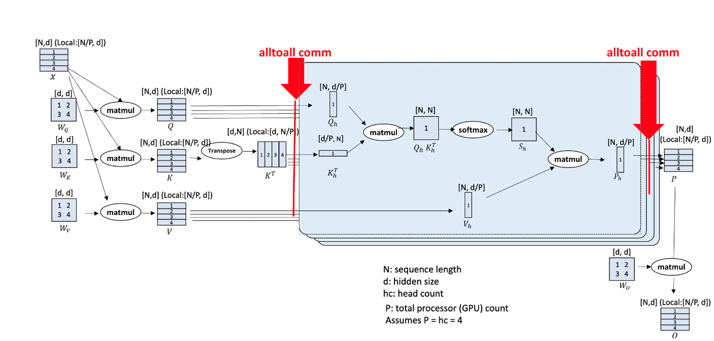

# 非均匀 Ulysses CP 切分

## 问题分析

CP（Context Parallel）并行算法是一种针对长序列数据处理的并行化技术，在处理长序列时具有显著优势。多模态模型存在大量序列长度非均匀场景，需要进行相应的适配。

## 解决方案

Ulysses CP算法基于All2All算子，对All2All算子的Input List与Output List根据序列长度进行非均匀切分，使能Ulysses算法。


## 使用方法

Ulysses CP 在 FSDP2 与 MCORE 两个后端均支持，各卡序列长度不一致（非均匀）时也能正常切分，无需额外配置。

### 原生 FSDP2（native FSDP2，推荐）

在模型 YAML 配置文件的 `parallel` 段设置 Ulysses 并行大小，并将注意力实现设为 `flash_attention_2`：

```yaml
parallel:
  ulysses_parallel_size: 2   # 默认 1，大于 1 时启用 Ulysses CP

model:
  attn_implementation: flash_attention_2
```

- `ulysses_parallel_size`：Ulysses 序列并行大小，默认 `1`，大于 1 时启用。
- 开启 Ulysses CP 时，`model.attn_implementation` 须为 `flash_attention_2`。

可参考 `examples/qwen3vl/qwen3vl_30B_config_v1.yaml`。

### MCORE（Megatron）

以 qwen2.5vl72b 为例：

1. examples/qwen2.5vl/finetune_qwen2_5_vl_72b.sh中设置CP大小，默认脚本中为1

    ```shell
    CP=1
    ```

2. examples/qwen2.5vl/finetune_qwen2_5_vl_72b.sh中的GPT_ARGS添加

    ```shell
        --context-parallel-algo ulysses_cp_algo
    ```
