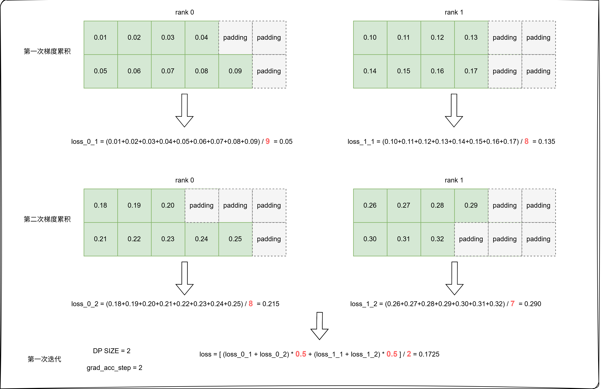
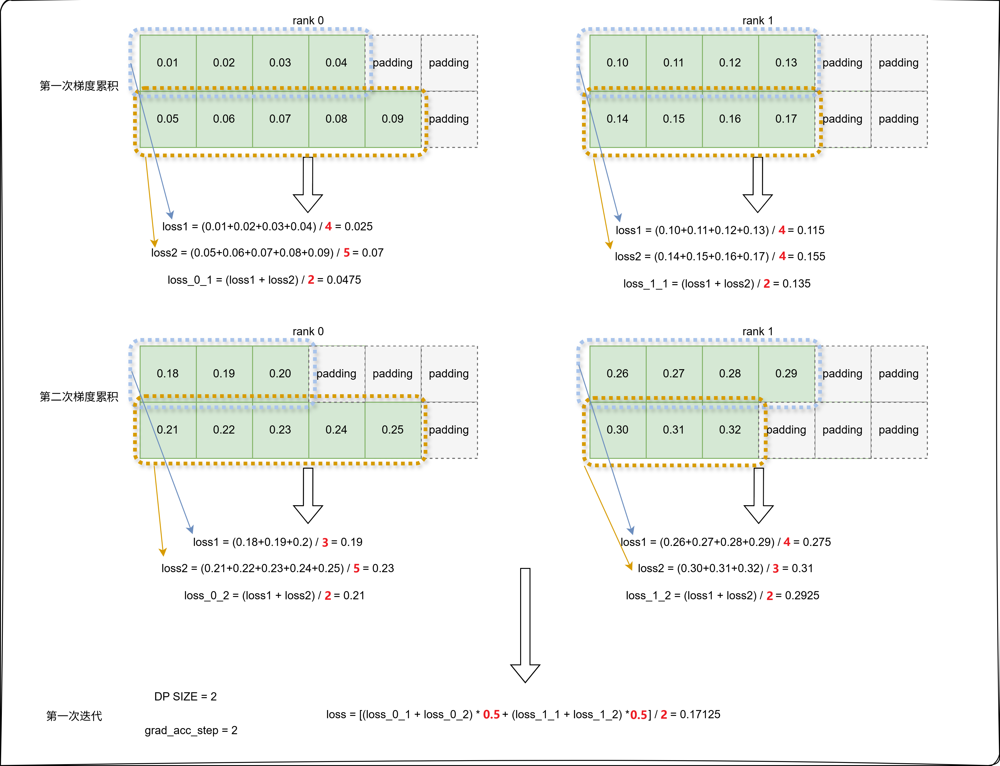
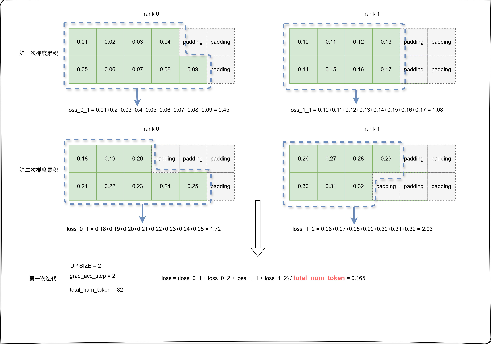

# VLM模型Loss计算类型

## 适用后端

FSDP2 + MCORE

## 问题分析

视觉语言模型（Vision-Language Model, VLM）通常采用交叉熵损失（Cross-Entropy Loss）作为训练目标。然而，**当前主流模型仓库（如Hugging Face Transformers）的实现中存在一个问题：当全局批次大小（global batch size）固定时，通过调整微批次大小（micro_batch_size）和梯度累积步数（grad_acc_steps）的不同组合（例如 `micro_batch_size=32, grad_acc_steps=2` vs `micro_batch_size=16, grad_acc_steps=4`），在相同超参数和训练数据下，模型收敛过程中的损失曲线和最终数值会出现较大差异**。相关讨论可参考：[gradient](https://unsloth.ai/blog/gradient)

> 注：Transformers已在部分模型中修复该问题，但在Qwen2.5-VL、Qwen3-VL等模型中因为相关代码传参错误，或显式地不计算 `num_token_in_batch`，导致问题依然存在。

## 解决方案

针对VLM模型，MindSpeed MM提供三种Loss计算方式。假设训练配置为 `micro_batch_size=2`、`grad_acc_steps=2`，使用双卡训练（即DP=2），三种Loss计算方式的步骤如下：

### 默认方式

与Transformers实现一致，计算流程如下：  

- **步骤1**：在微批次维度上对有效token的交叉熵损失求均值  
- **步骤2**：在梯度累积维度上求均值  
- **步骤3**：在数据并行（DP）域上求均值  



### 按样本粒度计算Loss（Calculate Per Sample Loss）

计算流程如下：  

- **步骤1**：在样本内部对有效token的交叉熵损失求均值  
- **步骤2**：在微批次维度上求均值  
- **步骤3**：在梯度累积维度上求均值  
- **步骤4**：在数据并行（DP）域上求均值  



### 按Token粒度计算Loss（Calculate Per Token Loss）

计算流程如下：  

- 直接累加全局批次中所有有效token的交叉熵损失  
- 最终结果除以全局批次中的有效token总数  



## 使用方法

### megatron后端

针对入口为`pretrain_vlm.py`的模型，使能方式如下：

#### 默认计算方式

在模型训练脚本中**不启用**以下任一参数：

- `--calculate-per-sample-loss` 按样本粒度计算loss
- `--calculate-per-token-loss` 按token粒度计算loss

#### 按样本粒度计算Loss

在模型训练脚本中启用参数：

```shell
GPT_ARGS="
    ...
    --calculate-per-sample-loss \
"
```

#### 按Token粒度计算Loss

在模型训练脚本中启用参数：

```shell
GPT_ARGS="
    ...
    --calculate-per-token-loss \
"
```

### FSDP2后端

FSDP2后端通过 `loss_cfg` 的 `loss_type` 字段设置，两种配置方式的取值范围不同，分别见下。

#### 原生FSDP2（native FSDP2，推荐）

在模型YAML配置文件的 `features.loss_cfg` 段设置：

```yaml
features:
  loss_cfg:
    loss_type: default   # 可选 raw（默认）/ default / per_sample_loss / per_token_loss
```

| 取值 | 说明 |
| --- | --- |
| `raw`（默认） | 直接使用模型原始输出的 `.loss`，不做额外的loss聚合处理 |
| `default` | 默认计算方式 |
| `per_sample_loss` | 按样本粒度计算loss |
| `per_token_loss` | 按token粒度计算loss |

#### 基于Megatron的FSDP2（megatron-FSDP2，过渡态，将退出）

对于训练入口为`pretrain_transformers.py`的模型，在model.json中添加如下字段：

```json
"loss_cfg": {
    "loss_type": "default"
}
```

| 取值 | 说明 |
| --- | --- |
| `default`（默认） | 默认计算方式 |
| `per_sample_loss` | 按样本粒度计算loss |
| `per_token_loss` | 按token粒度计算loss |
| `token_loss` | 按token粒度计算loss（按全局平均token数归一） |
| `square_loss` | 按样本有效token数的平方根倒数加权 |

不支持 `raw`。

### 示例脚本

**示例脚本**：`examples/qwen3_5/finetune_qwen3_5_4B.sh`（配置见 `examples/qwen3_5/qwen3_5_4B_config.yaml` 的 `features.loss_cfg` 段，`loss_type` 可按需改为 `per_sample_loss` / `per_token_loss`）。

## 注意事项

### 已知约束

1. 如果使用megatron后端，`--calculate-per-sample-loss` 与 `--calculate-per-token-loss` 参数不可同时使用（框架有冲突校验，同时开启会报错）。
2. 如果loss计算方式选择不当，会对下游任务评测产生较大影响。用户需要根据实际数据集样本分布情况选择合适的计算方式。如果训练数据集样本分布不均，有的样本response很长，有的样本response很短，甚至是一个token。按token粒度计算loss，则会使target token数量多的样本更受重视，从而引入不同样本间的不平衡，使得长输出会被训练的更充分。
3. FSDP2两条路径（原生 / megatron-FSDP2）的 `per_token_loss` 均要求使用 `PrefetchGradAccDataLoader`，否则运行期抛 `KeyError`（已核实 `mindspeed_mm/fsdp/loss/loss_func.py` 与 `mindspeed_mm/models/transformers_model.py` 中的显式raise）。
