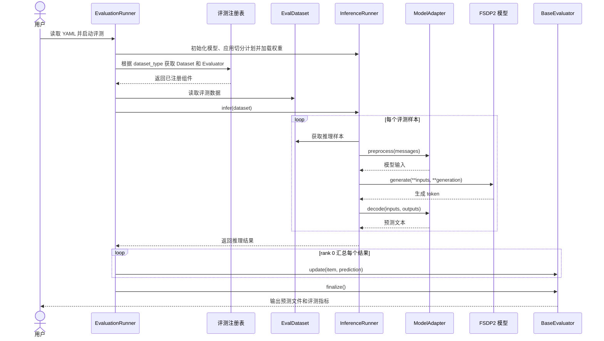

# MindSpeed-MM 评测框架使用指南

本文介绍 MindSpeed-MM 基于 PyTorch FSDP2 后端的评测框架，主要展示具体的评测使用示例，包括评测数据集准备、脚本配置和适配范围说明，并给出新评测任务接入评测框架的适配流程。

## 使用示例

运行评测任务前需准备评测数据，并创建启动脚本和相应配置文件。以下使用 Qwen3.5 MoE 模型在 VQA v2.0 验证集上进行评测示例展示，运行前需按照模型 README 完成环境配置。

### 数据集准备

从 VQA 数据集网站 [VQA v2.0](https://visualqa.org/download.html) 下载 VQA v2.0 验证集的问题、标注和 COCO 2014 验证集图片，并整理成以下目录：

```text
data/vqa2_val/
├── v2_OpenEnded_mscoco_val2014_questions.json
├── v2_mscoco_val2014_annotations.json
└── val2014/
    ├── COCO_val2014_000000000042.jpg
    ├── COCO_val2014_000000000073.jpg
    └── ...
```

内置 `VQA2ValDataset` 会读取问题和标注文件，根据 `image_id` 在 `val2014` 中构造图片路径，并在问题后追加以下回答约束：

```text
Answer the question using a single word or phrase.
```

### 启动脚本

创建 `examples/qwen3_5/qwen3_5_moe_evaluation.sh`，脚本中的配置文件路径 `config_path` 应与实际创建的配置文件路径保持一致：

```bash
# 根据实际情况修改 ascend-toolkit 路径
source /usr/local/Ascend/cann/set_env.sh
export NON_MEGATRON=true
export MULTI_STREAM_MEMORY_REUSE=2
export TASK_QUEUE_ENABLE=2
export ASCEND_LAUNCH_BLOCKING=0
export ACLNN_CACHE_LIMIT=100000
export CPU_AFFINITY_CONF=1
export PYTORCH_NPU_ALLOC_CONF=expandable_segments:True

NPUS_PER_NODE=8
MASTER_ADDR=localhost
MASTER_PORT=6000
NNODES=1
NODE_RANK=0
WORLD_SIZE=$(($NPUS_PER_NODE*$NNODES))

DISTRIBUTED_ARGS="
    --nproc_per_node $NPUS_PER_NODE \
    --nnodes $NNODES \
    --node_rank $NODE_RANK \
    --master_addr $MASTER_ADDR \
    --master_port $MASTER_PORT
"

logfile=$(date +%Y%m%d)_$(date +%H%M%S)
config_path=examples/qwen3_5/qwen3_5_moe_evaluation.yaml
mkdir -p logs
torchrun $DISTRIBUTED_ARGS mindspeed_mm/fsdp/evaluation/evaluation_runner.py \
    ${config_path} \
    2>&1 | tee logs/eval_${logfile}.log
```

### 配置文件

创建 `examples/qwen3_5/qwen3_5_moe_evaluation.yaml`，并将模型路径和数据集路径替换为实际路径：

```yaml
parallel:
  fully_shard_parallel_size: auto
  fsdp_plan:
    apply_modules:
      - model.visual
      - model.visual.blocks.{*}
      - model.language_model.embed_tokens
      - model.language_model
      - model.language_model.layers.{*}
      - model.language_model.layers.{*}.linear_attn
      - model.language_model.layers.{*}.mlp.experts
      - lm_head
      - mtp
    hook_modules:
      - model.language_model.layers.{*}
    param_dtype: bf16
    reduce_dtype: fp32
    reshard_after_forward: true
    num_to_forward_prefetch: 1
    num_to_backward_prefetch: 0
    cpu_offload: false
  ulysses_parallel_size: 1
  expert_parallel_size: 1
  ep_plan:
    apply_modules:
      - model.language_model.layers.{*}.mlp.experts
    dispatcher: alltoall

model:
  model_id: qwen3_5_moe
  model_name_or_path: &HF_MODEL_LOAD_PATH /path/to/Qwen3.5-MoE
  trust_remote_code: true
  attn_implementation: flash_attention_2
  gdn_implementation: eager
  causal_conv1d_implementation: eager
  use_grouped_expert_matmul: true

inference:
  load: /path/to/Qwen3.5-MoE
  load_format: auto
  init_model_with_meta_device: true
  seed: 42
  use_deter_comp: false
  adapter: qwen3_5_moe
  processor_path: *HF_MODEL_LOAD_PATH
  enable_thinking: false
  generation:
    max_new_tokens: 32
    do_sample: false
    repetition_penalty: 1.0
    use_cache: true
  plugin:
    - mindspeed_mm/fsdp/models/qwen3_5_moe

evaluation:
  dataset_type: vqa2_val
  dataset_path: ./data/vqa2_val
  max_samples: null
  result_output_path: ./evaluation_outputs
```

### 参数说明

以下说明 `evaluation` 配置段相关参数的含义：

| 参数 | 类型 | 默认值 | 说明 |
| :--- | :--- | :--- | :--- |
| `dataset_type` | str | `vqa2_val` | 评测任务注册名，用于选择评测数据集和评测器。须同时与 `eval_dataset_dict` 和 `eval_impl_dict` 中注册的 key 一致。 |
| `dataset_path` | str | — | 评测数据集的根目录或数据文件路径。 |
| `max_samples` | int \| null | `null` | 最多参与评测的样本数。`null` 表示使用完整评测数据集，可在功能调试时设置较小值。 |
| `result_output_path` | str | `./evaluation_outputs` | 预测结果和评测指标的保存目录。 |

### 启动评测

在仓库根目录执行：

```bash
bash examples/qwen3_5/qwen3_5_moe_evaluation.sh
```

### 输出

评测完成后，在 `evaluation.result_output_path` 路径中会生成评测结果：

```text
evaluation_outputs/
├── qwen3_5_moe_vqa2_val_predictions.json
└── qwen3_5_moe_vqa2_val_metrics.json
```

预测文件保存问题序号 `question_id` 和模型答案，指标文件包含以下内容：

- `overall`：全部问题的准确率；
- `answer_type`：按答案类型统计的准确率；
- `question_type`：按问题类型统计的准确率。

预测结果文件内容示例如下：

```json
[
  {
    "question_id": 262148000,
    "answer": "down"
  },
  {
    "question_id": 262148001,
    "answer": "watching"
  },
  {
    "question_id": 262148002,
    "answer": "picnic table"
  },
  {
    "question_id": 393225000,
    "answer": "[http://foodiebaker.com](http://foodiebaker.com)"
  }
]
```

评测指标文件内容示例如下：

```json
{
  "overall": 87.1,
  "answer_type": {
    "number": 90.0,
    "other": 77.21,
    "yes/no": 96.5
  },
  "question_type": {
    "are the": 100.0,
    "are there": 86.67,
    "are there any": 100.0,
    "are these": 30.0,
    "can you": 100.0,
    "could": 100.0,
    "does the": 100.0,
    "does this": 100.0,
    "has": 100.0,
    "how many": 89.38,
    "how many people are": 100.0,
    "is it": 100.0,
    "is that a": 100.0,
    "is the": 96.67,
    "is there a": 100.0,
    "is this": 100.0,
    "is this a": 100.0,
    "is this an": 100.0,
    "is this person": 100.0,
    "none of the above": 72.5,
    "what": 15.0,
    "what are the": 100.0,
    "what color are the": 100.0,
    "what color is the": 86.67,
    "what does the": 76.67,
    "what is": 84.0,
    "what is on the": 100.0,
    "what is the": 66.67,
    "what is the color of the": 100.0,
    "what is the man": 95.0,
    "what is this": 100.0,
    "what kind of": 76.67,
    "what type of": 100.0,
    "where is the": 30.0,
    "which": 100.0,
    "who is": 90.0,
    "why": 30.0,
    "why is the": 60.0
  }
}
```

控制台同时会打印结果文件路径和最终评测指标。

## 适配范围

当前评测框架已适配和验证的评测数据集及评测指标如下：

| 评测数据集 | 注册名称 | 评测指标 | 说明 |
| :--- | :--- | :--- | :--- |
| VQA v2.0 验证集 | `vqa2_val` | `overall`、`answer_type`、`question_type` | 按 VQA v2.0 官方计分规则统计整体准确率，并分别按答案类型和问题类型汇总。 |

如需新增评测数据集和评测指标方式，可按照下文适配流程进行添加。

## 评测任务适配

### 评测框架

评测框架复用推理框架完成模型构建、FSDP2 分片、权重加载和文本生成，并将原始评测数据集转换为推理样本，调用评测器 `BaseEvaluator` 完成评测任务：



其中，评测数据集负责提供推理输入和样本标注，评测器 `BaseEvaluator` 负责接收模型预测、累计评测状态、计算指标并保存结果。新增评测任务时，需要同时适配评测数据集和评测器。

### 评测数据集适配

在 `mindspeed_mm/fsdp/evaluation/eval_datasets/<dataset_name>.py` 中新增评测数据集：

```python
class NewEvalDataset:
    def __init__(
        self,
        dataset_path: str,
        max_samples: Optional[int] = None,
    ) -> None:
        # 加载数据，并根据 max_samples 截取样本
        ...

    def __len__(self) -> int:
        ...

    def __getitem__(self, index: int) -> dict[str, Any]:
        return {
            # 推理框架使用的字段
            "text": ...,
            "image": ...,

            # 评测器使用的样本标识和标注字段
            "sample_id": ...,
            "answers": ...,
        }
```

评测数据集需要接收 `dataset_path` 和 `max_samples` 参数，并为每个样本返回推理输入、样本标识及计算指标所需的标注字段。

### 评测器适配

在 `mindspeed_mm/fsdp/evaluation/eval_impl/<dataset_name>.py` 中新增评测器，并继承 `BaseEvaluator`：

```python
class NewEvaluator(BaseEvaluator):
    def __init__(
        self,
        result_output_path: str,
        model_name: str,
        dataset_name: str,
    ) -> None:
        ...

    def update(self, item: dict[str, Any], prediction: str) -> None:
        # 使用样本标注和模型输出更新评测状态
        ...

    def finalize(self) -> dict[str, Any]:
        # 计算并保存评测结果，返回指标字典
        ...
```

评测器需要实现以下方法：

- `update`：每完成一个样本的推理后调用，负责收集预测结果并更新评测状态；
- `finalize`：所有样本推理完成后调用，负责计算最终指标、保存结果文件并返回指标字典。

### 注册评测任务

完成评测数据集和评测器适配后，分别在对应的 `__init__.py` 中完成注册，并使用相同的 key：

```python
# mindspeed_mm/fsdp/evaluation/eval_datasets/__init__.py
from .new_dataset import NewEvalDataset


eval_dataset_dict = {
    ...,
    "new_eval": NewEvalDataset,
}
```

```python
# mindspeed_mm/fsdp/evaluation/eval_impl/__init__.py
from .new_evaluator import NewEvaluator


eval_impl_dict = {
    ...,
    "new_eval": NewEvaluator,
}
```

具体评测流程中，可通过调整配置文件中的 `evaluation.dataset_type` 字段选择相应的评测任务，该字段值须与 `eval_dataset_dict` 和 `eval_impl_dict` 中注册的 key 一致。

## 注意事项

1. 本评测流程仅适用于模型训练阶段的效果验证与结果比对，未针对线上部署场景做性能优化。若业务场景存在性能加速需求，建议替换并使用专业的推理加速库及对应优化组件开展部署工作。
