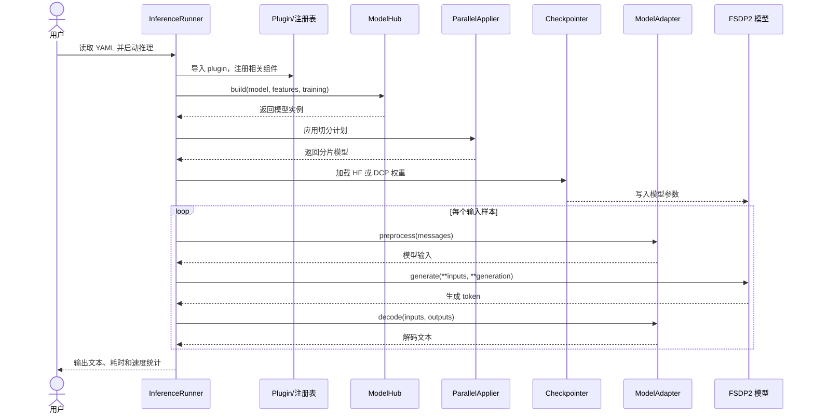

# MindSpeed-MM 推理框架使用指南

本文介绍 MindSpeed-MM 基于 PyTorch FSDP2 后端的推理框架，主要展示具体的推理使用示例，包括推理所需数据、脚本配置和适配范围说明，并给出新模型接入推理框架的适配流程。

## 使用示例

运行推理任务前需准备输入数据，并创建启动脚本和相应配置文件。以下使用 Qwen3.5 MoE 模型进行示例展示，运行前需按照模型 README 完成环境配置。

### 输入数据

创建 `data/qwen3_5_moe_infer.json`，如需使用多模态数据，请将相应图像/视频路径调整为实际路径：

```json
[
  {
    "text": "请用一句话介绍你自己。"
  },
  {
    "image": "./data/demo.jpg",
    "text": "请描述这张图片。"
  },
  {
    "videos": "./data/demo.mp4",
    "text": "概括视频中的主要事件。"
  }
]
```

### 启动脚本

创建 `examples/qwen3_5/qwen3_5_moe_inference.sh`，脚本中的配置文件路径 `config_path` 应与实际创建的配置文件路径保持一致：

```bash
# 根据实际情况修改 ascend-toolkit 路径
source /usr/local/Ascend/cann/set_env.sh
export NON_MEGATRON=true
export MULTI_STREAM_MEMORY_REUSE=2
export TASK_QUEUE_ENABLE=2
export ASCEND_LAUNCH_BLOCKING=0
export ACLNN_CACHE_LIMIT=100000
export CPU_AFFINITY_CONF=1
export PYTORCH_NPU_ALLOC_CONF=expandable_segments:True

NPUS_PER_NODE=8
MASTER_ADDR=localhost
MASTER_PORT=6000
NNODES=1
NODE_RANK=0
WORLD_SIZE=$(($NPUS_PER_NODE*$NNODES))

DISTRIBUTED_ARGS="
    --nproc_per_node $NPUS_PER_NODE \
    --nnodes $NNODES \
    --node_rank $NODE_RANK \
    --master_addr $MASTER_ADDR \
    --master_port $MASTER_PORT
"

logfile=$(date +%Y%m%d)_$(date +%H%M%S)
config_path=examples/qwen3_5/qwen3_5_moe_inference.yaml
mkdir -p logs
torchrun $DISTRIBUTED_ARGS mindspeed_mm/fsdp/inference/inference_runner.py \
    ${config_path} \
    2>&1 | tee logs/infer_${logfile}.log
```

### 配置文件

创建 `examples/qwen3_5/qwen3_5_moe_inference.yaml`，并将模型路径和输入数据路径替换为实际路径：

```yaml
parallel:
  fully_shard_parallel_size: auto
  fsdp_plan:
    apply_modules:
      - model.visual
      - model.visual.blocks.{*}
      - model.language_model.embed_tokens
      - model.language_model
      - model.language_model.layers.{*}
      - model.language_model.layers.{*}.linear_attn
      - model.language_model.layers.{*}.mlp.experts
      - lm_head
      - mtp
    hook_modules:
      - model.language_model.layers.{*}
    param_dtype: bf16
    reduce_dtype: fp32
    reshard_after_forward: true
    num_to_forward_prefetch: 1
    num_to_backward_prefetch: 0
    cpu_offload: false
  ulysses_parallel_size: 1
  expert_parallel_size: 1
  ep_plan:
    apply_modules:
      - model.language_model.layers.{*}.mlp.experts
    dispatcher: alltoall

model:
  model_id: qwen3_5_moe
  model_name_or_path: &HF_MODEL_LOAD_PATH /path/to/Qwen3.5-MoE
  trust_remote_code: true
  attn_implementation: flash_attention_2
  gdn_implementation: eager
  causal_conv1d_implementation: eager
  use_grouped_expert_matmul: true

inference:
  load: /path/to/Qwen3.5-MoE
  load_format: auto
  init_model_with_meta_device: true
  seed: 42
  use_deter_comp: false
  adapter: qwen3_5_moe
  processor_path: *HF_MODEL_LOAD_PATH
  enable_thinking: false
  data_path: ./data/qwen3_5_moe_infer.json
  generation:
    max_new_tokens: 256
    do_sample: false
    repetition_penalty: 1.0
    use_cache: true
  plugin:
    - mindspeed_mm/fsdp/models/qwen3_5_moe
```

### 参数说明

以下说明 `inference` 配置段相关参数的含义：

| 参数 | 类型 | 默认值 | 说明 |
| :--- | :--- | :--- | :--- |
| `load` | str | `null` | HF 或 DCP 权重路径。 |
| `load_format` | str | `hf` | 指定权重格式，可选 `hf`、`dcp` 或 `auto`。`auto` 会根据 `load` 目录特征自动判断加载权重格式。 |
| `seed` | int | `42` | 随机种子，主要影响采样生成及其他随机处理。 |
| `use_deter_comp` | bool | `false` | 是否启用确定性计算。有利于复现结果，但可能影响部分算子性能。 |
| `init_model_with_meta_device` | bool | `false` | 是否先在 meta device 构建空模型，再由 checkpointer 加载权重。 |
| `plugin` | List[str] | `[]` | 模型插件路径列表。构建模型前会递归导入插件目录，触发模型注册。 |
| `adapter` | str | `qwen3_5` | 负责输入预处理、生成和解码的模型 adapter。须与 `MODEL_ADAPTERS` 中注册的 key 一致。 |
| `processor_path` | str | — | tokenizer/processor 文件路径。 |
| `enable_thinking` | bool | `false` | 是否启用 processor chat template 的 thinking 模式。 |
| `data_path` | str | `null` | 输入 JSON 文件路径。 |
| `generation` | dict | — | 文本生成配置，控制最大生成长度、采样策略、重复惩罚和 KV cache 等生成行为。 |

### 启动推理

在仓库根目录执行：

```bash
bash examples/qwen3_5/qwen3_5_moe_inference.sh
```

### 输出

rank 0 会打印每个样本的输入/输出 token 数、生成耗时、token/s 和解码文本，任务结束后会统计样本总数、总生成耗时和平均生成速率。推理成功的输出示例如下：

```text
Inference:   0%|          | 0/3 [00:00<?, ?sample/s]
Prompt: 请用一句话介绍你自己。
Input token count: 17
Output token count: 48
Inference duration: 33.6503 seconds
Inference speed: 1.43 tokens/second
Inference result: 我是 Qwen3.5，阿里巴巴最新推出的通义千问大语言模型，具备强大的语言理解、逻辑推理及多模态分析能力，致力于为您提供精准、高效且富有创意的智能助手服务。

Inference:  33%|███▎      | 1/3 [00:33<01:07, 33.72s/sample]
Image path: ./data/demo.jpg
Prompt: 请描述这张图片。
Input token count: 2389
Output token count: 256
Inference duration: 125.0047 seconds
Inference speed: 2.05 tokens/second
Inference result: 这张图片是一张技术流程图，用于分析和解释在分布式多进程（multi-process）环境下加载模型时出现的一个特定错误。

Inference:  67%|██████▋   | 2/3 [02:38<01:27, 87.52s/sample]
Video path: ./data/demo.mp4
Prompt: 概括视频中的主要事件。
Input token count: 12181
Output token count: 138
Inference duration: 74.7064 seconds
Inference speed: 1.85 tokens/second
Inference result: 视频展示了一个充满活力的海洋生态系统，其中包含了多种生物之间的互动。

Inference: 100%|██████████| 3/3 [04:07<00:00, 82.45s/sample]
===== Inference Summary =====
Total processed samples: 3
Total inference duration: 233.3613 seconds
Average inference speed: 1.77 tokens/second
```

## 适配范围

当前推理框架支持 FSDP2 后端的多模态理解模型，已适配和验证的模型列表如下：

| 后端 | 模型 | 输入数据类型 | 权重格式 |
| :--- | :--- | :--- | :--- |
| FSDP2 | Qwen3.5 Dense | 文本、图像、视频 | HF、DCP |
| FSDP2 | Qwen3.5 MoE | 文本、图像、视频 | HF、DCP |

如需新增适配模型，可按照下文适配流程进行添加。

## 模型适配

### 推理框架

推理框架负责模型构建、FSDP2 分片、权重加载、调用模型适配器 `ModelAdapter` 完成推理任务：



其中，模型适配器 `ModelAdapter` 是具体模型和通用推理流程之间的适配层，负责完成输入预处理、生成调度和输出解码任务，新增模型时可通过定制适配器接入统一的推理框架。

### 新增适配器

在 `mindspeed_mm/fsdp/inference/adapters/<adapter_name>.py` 中新增模型 adapter，并继承 `ModelAdapter`：

```python
class NewModelAdapter(ModelAdapter):
    def __init__(self):
        ...

    def preprocess(self, messages: List[dict]) -> Dict[str, Any]:
        # 将数据预处理成模型输入
        ...

    def generate(self, inputs: Dict[str, Any], generation_config):
        # 调用模型的 generate 方法，并处理多 rank 同步生成参数
        ...

    def decode(self, inputs: Dict[str, Any], outputs: Any) -> str:
        # 去除 prompt token，只返回新增文本
        ...
```

adapter 需要实现以下方法：

- `preprocess`：使用 tokenizer/processor 将标准化消息转换为模型输入，返回值须包含 `input_ids`；
- `generate`：调用模型生成接口，多 rank 推理时需要保证所有 rank 参与相同的生成步骤；
- `decode`：从生成结果中移除输入 prompt 对应的 token，返回解码文本。

### 注册适配器

在 `mindspeed_mm/fsdp/inference/adapters/__init__.py` 中导入新增 adapter，并将配置使用的名称注册到 `MODEL_ADAPTERS`：

```python
from .adapter_name import NewModelAdapter


MODEL_ADAPTERS = {
    ...,
    "new_model": NewModelAdapter,
}
```

具体推理流程中，可通过调整配置文件中的 `inference.adapter` 字段选择相应的适配器，该字段值须与 `MODEL_ADAPTERS` 中注册的 key 一致。

## 注意事项

1. 本推理流程仅适用于模型训练阶段的效果验证与结果比对，未针对线上部署场景做性能优化。若业务场景存在性能加速需求，建议替换并使用专业的推理加速库及对应优化组件开展部署工作。
