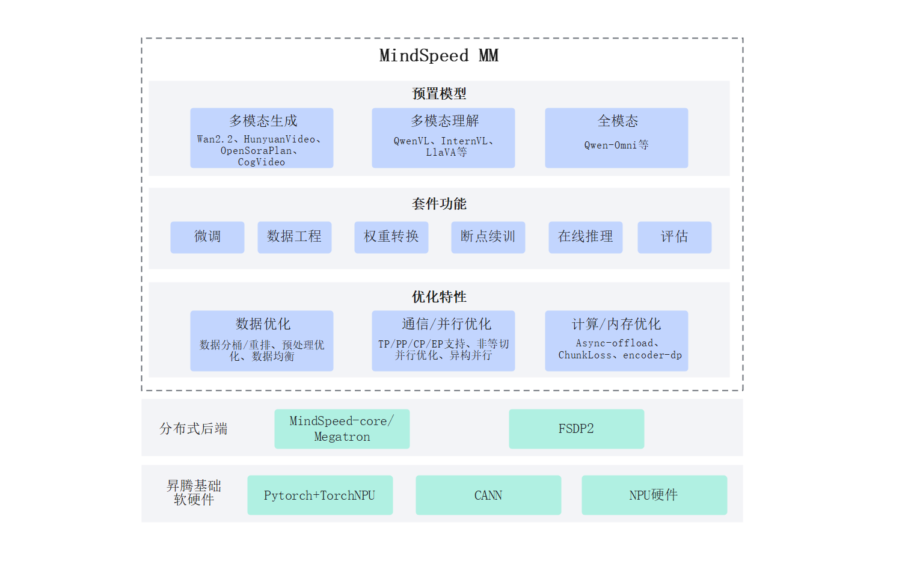

# 简介

## 概述

MindSpeed MM是面向大规模分布式训练的昇腾多模态大模型套件，同时支持多模态生成及多模态理解，旨在为华为 昇腾芯片 提供端到端的多模态训练解决方案, 包含预置业界主流模型，数据工程，分布式训练及加速，预训练、微调、在线推理任务等特性。

## MindSpeed MM架构

MindSpeed MM 昇腾多模态训练解决方案整体架构如下图，整体分为三个层次：

- 昇腾基础软硬件。包括昇腾AI处理器、昇腾服务器等硬件，为海量多模态数据计算与模型训练提供强大的并行算力；CANN（Compute Architecture for Neural Networks），作为昇腾AI处理器的软件引擎，提供了高度优化的基础算子和通信库（HCCL）；PyTorch + touch_npu 支持业界主流的PyTorch深度学习框架，并通过touch_npu插件将PyTorch的运算无缝对接到昇腾硬件，使得开发者能够使用熟悉的编程范式与API，发挥昇腾的算力优势

- 分布式后端。包括分布式训练框架MindSpeed Core/Megatron和FSDP2双后端支持，提供了高效的分布式训练能力，包括数据并行、模型并行、混合并行等多种并行策略，支持大规模模型的训练与优化。

- MindSpeed MM。提供了多模态数据处理、模型构建、分布式训练等全流程能力，充分发挥昇腾硬件的优势，支持大规模多模态模型的高效训练与部署。
MindSpeed MM架构关系如图所示

图1 MindSpeed MM架构图

## 功能特性

MindSpeed MM 组件组成有预置模型、套件功能、多模态优化特性

 主流开源多模态模型开箱即用：支持 20+， 如 Wan、HunyuanVideo等生成模型、QwenVL、InternVL等理解模型、Qwen-Omni等全模态模型。提供了多模态生成、理解、全模态的预训练/微调/评估/在线推理启动脚本，用户可以一键拉起训练任务

 丰富的功能组件：分为高阶的抽象类（组装类）、原子模型类和公共组件，SoRAModel、VLModel、TransformersModel分别为多模态生成、理解、Transformers模型的高阶封装类，除此之外，还有text_decoder、audio、dit等基础的原子类；公共组件common包括了norm、rope、embedding、spec等通用组件；提供覆盖模型生命周期的完整工具链，包括：数据预处理与工程、大规模预训练、指令微调与领域适配、模型权重转换、高性能在线推理以及全面的自动化评估。

 多模态加速特性：包括多维高效并行算法（DP/PP/TP/CP/EP/FSDP2）、通算掩盖、多模态负载均衡、动态显存管理（重计算、分级存储） 、长序列优化等，确保训练效率最大化。
 