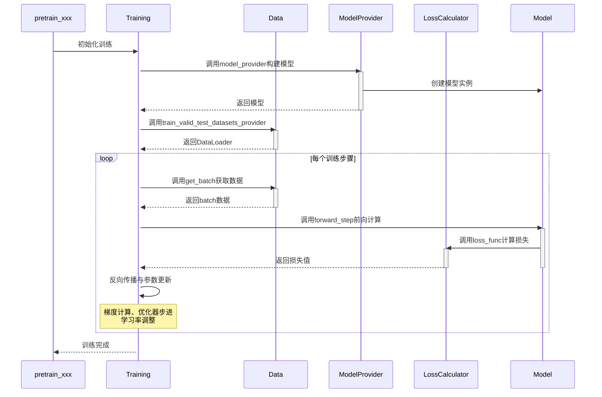

# MindSpeed MM模型迁移指南

## 核心接口适配

MindSpeed MM训练逻辑整体沿用Megatron风格，各类模型使用统一的`pretrain_xxx.py`文件启动，通过配置文件对训练过程进行调控。examples目录下提供各类模型启动的训练脚本。

`pretrain_xxx.py`中提供了模型训练过程中涉及的主要（回调）函数，用户需要根据具体任务需求，在这些函数中实现相应的业务逻辑。这些函数将在训练过程中被自动调用：

| ​​**函数**       | **描述**                              |
| ---------------------------------------- | ---------------------------------------- | 
| `model_provider`                        | 构建模型                               |
| `get_batch`                             | 构建模型的前向输入数据                 | 
| `loss_func`                             | 计算模型前向损失                       | 
| `forward_step`                          | 模型前向，并计算损失                   | 
| `train_valid_test_datasets_provider` | 构造数据加载器                             |

## 核心接口调用流程



## 模型迁移

整体迁移的要点围绕上述核心接口展开。

### 环境搭建

【模型开发时推荐使用配套的环境版本】

请参考[安装指南](https://gitcode.com/Ascend/MindSpeed-MM/blob/master/docs/zh/pytorch/installation.md)，完成昇腾软件安装。

> Python版本推荐3.10，torch和torch_npu版本推荐2.7.1版本

```shell
git clone https://github.com/NVIDIA/Megatron-LM.git
cd Megatron-LM
git checkout core_v0.12.1
cp -r megatron ../MindSpeed-MM/
cd ..
cd MindSpeed-MM
mkdir logs data ckpt

# 安装加速库
git clone https://gitcode.com/Ascend/MindSpeed.git
cd MindSpeed
# checkout commit from MindSpeed core_r0.12.1
git checkout xxxxxxx

# 安装mindspeed及依赖
pip install -e .
cd ..
# 安装mindspeed mm及依赖
pip install -e .
```

### 数据模块迁移

#### 迁移基本原则

MindSpeed MM 框架对数据模块提供了高度兼容性，用户现有的 `DataSet` 和 `DataLoader` 实现可以无缝迁移。
**快速迁移步骤：**

1. ​**保持现有实现**​：用户自定义的 `DataSet`、`DataLoader` 等数据模块无需修改
2. ​**注册数据提供函数**​：通过入口脚本的  `train_valid_test_datasets_provider` 函数返回`DataLoader`数据对象
3. ​**获取训练批次**​：在 `get_batch` 函数中处理当前训练批次数据

**迁移示例：**

```python
def train_valid_test_datasets_provider():
    """Build train, valid, and test datasets."""
    # 返回您现有的数据集实例
    train_dataloader= build_dataloader(CustomDataset(...))
    valid_dataloader= build_dataloader(CustomDataset(...))
    test_dataloader= build_dataloader(CustomDataset(...))
    
    return train_dataloader, valid_dataloader, test_dataloader

def get_batch(data_iterator, args):
    """Generate a batch."""
    if data_iterator is not None:
        batch = next(data_iterator)
    else:
        raise ValueError("Data iterator is None. Unable to retrieve batch.")
    move_to_device(batch, get_args().params_dtype)

    return batch
```

#### 原生数据组件使用

MindSpeed MM 同时提供了一套优化的多模态数据集处理模块，包括`build_mm_dataset`、`build_mm_dataloader`等，用户可通过 `data.json` 配置文件灵活定义数据源、预处理流程及加载策略。

### 模型结构迁移

在 MindSpeed MM 框架中，所有训练模型都通过标准化的入口函数进行构建和执行：`model_provider`构造模型，`forward_step`执行前向结果，`loss_func`计算训练损失。

```python
def model_provider(*args, **kwargs):
    model = CustomModel(config)

    return model

def loss_func(output_tensor):
   # 基于模型输出计算损失
   loss = compute_loss(output_tensor)
   return loss

def forward_step(data_iterator, model):
    """Forward step."""
    batch_data = get_batch(data_iterator)
    output_tensor = model(**batch_data)
    return output_tensor, loss_func
```

#### FSDP2 训练必备条件

##### 用户自定义模型

对于用户自行开发的模型，使用 FSDP2 进行分布式训练只需简单继承指定的 Mixin 类，​**模型本体的实现无需任何修改**​：

```python
from mindspeed_mm.models.common.module import MultiModalModule
from mindspeed_mm.models.transformers.base_model import FSDP2Mixin, WeightInitMixin

class CustomModel(MultiModalModule, FSDP2Mixin, WeightInitMixin)：
	"""您的自定义模型类"""
    ...
```

##### 三方库模型适配

对于从第三方库（如 Transformers）导入的模型，MindSpeed MM 提供了统一的适配方案：

1. ​**创建适配类**​：将第三方模型继承 FSDP2 Mixin 类
2. ​**注册到模型库**​：将适配后的类添加到 `ModelHub`
3. ​**通过标准接口使用**：使用 `TransformersModel` 加载适配后的模型

下面以Internvl-3.5为例

**步骤1：创建适配类**

```python
# mindspeed_mm/models/hf_src/internvl3_5.py
from internvl.modeling_internvl_chat import InternVLChatModel
from mindspeed_mm.models.transformers.base_model import FSDP2Mixin, WeightInitMixin

class InternVLChatModelGeneration(InternVLChatModel, FSDP2Mixin, WeightInitMixin):
	"""InternVL 模型的 FSDP2 适配版本"""
    def __init__(self, config, vision_model=None, language_model=None, use_flash_attn=True):
        super().__init__(config)
```

**步骤 2：注册到模型库**

```python
# mindspeed_mm/models/common/modelzoo.py

from mindspeed_mm.models.transformers.internvl3_5 import InternVLChatModelGeneration

class ModelHub:
	MODEL_MAPPINGS = {
		'internvl': InternVLChatModelGeneration,
	}
```

**步骤 3：通过标准接口使用**

```python
# pretrain_transformers.py
from mindspeed_mm.models.transformers_model import TransformersModel

def model_provider(*args, **kwargs):
	"""Builds the model."""
	args = get_args()
	vlm_config = deepcopy(args.mm.model)
	model = TransformersModel(vlm_config)

	return model
```

#### FSDP2配置文件驱动训练（推荐）

MindSpeed MM 支持通过 YAML 配置文件灵活管理 FSDP2 训练策略，实现训练配置与模型代码的完全解耦。

**配置文件参数说明**

<table>
  <thead>
    <tr style="background-color: #f5f5f5;">
      <th style="text-align: left;">参数分类</th>
      <th style="text-align: left;">参数名称</th>
      <th style="text-align: left;">描述</th>
      <th style="text-align: left;">取值</th>
      <th style="text-align: left;">默认值</th>
      <th style="text-align: left;">注意事项</th>
    </tr>
  </thead>
  <tbody>
    <tr>
      <td rowspan="5" style="vertical-align: middle; font-weight: bold;">基本配置</td>
      <td><code>sharding_size</code></td>
      <td>模型并行分片大小</td>
      <td><code>auto</code>或整数值</td>
      <td>1</td>
      <td><code>auto</code>表示<code>world_size</code>大小</td>
    </tr>
    <tr>
      <td><code>param_dtype</code></td>
      <td>参数存储和计算数据类型</td>
      <td><code>bf16</code>, <code>fp16</code>, <code>fp32</code></td>
      <td>模型dtype</td>
      <td>训练精度设置</td>
    </tr>
    <tr>
      <td><code>reduce_dtype</code></td>
      <td>梯度通信数据类型</td>
      <td>-</td>
      <td>-</td>
      <td>通信精度设置</td>
    </tr>
    <tr>
      <td><code>output_dtype</code></td>
      <td>前向输出数据类型</td>
      <td>-</td>
      <td>-</td>
      <td>输出精度控制</td>
    </tr>
    <tr>
      <td><code>cast_forward_inputs</code></td>
      <td>前向输入自动类型转换</td>
      <td><code>true</code>/<code>false</code></td>
      <td>-</td>
      <td>确保输入类型匹配</td>
    </tr>
    <tr>
      <td rowspan="2" style="vertical-align: middle; font-weight: bold;">模块包装</td>
      <td><code>sub_modules_to_wrap</code></td>
      <td>FSDP分片子模块路径</td>
      <td>模块路径字符串列表</td>
      <td>-</td>
      <td>
        <strong>模式语法</strong>:<br>
        • <code>model.layers.{*}</code>: 匹配所有子模块<br>
        • <code>model.layers.{0-23}</code>: 匹配层数范围<br>
        • <code>model.layers.{1,3,5}</code>: 匹配指定层数
      </td>
    </tr>
    <tr>
      <td><code>ignored_modules</code></td>
      <td>排除FSDP管理的模块</td>
      <td>模块路径字符串列表</td>
      <td>-</td>
      <td>格式同<code>sub_modules_to_wrap</code></td>
    </tr>
    <tr>
      <td rowspan="5" style="vertical-align: middle; font-weight: bold;">内存优化</td>
      <td><code>recompute_modules</code></td>
      <td>激活值重计算模块</td>
      <td>模块路径字符串列表</td>
      <td>-</td>
      <td>格式同<code>sub_modules_to_wrap</code><br><strong>冲突避免</strong>: 需关闭Megatron重计算功能</td>
    </tr>
    <tr>
      <td><code>use_reentrant</code></td>
      <td>检查点实现类型</td>
      <td><code>true</code>/<code>false</code></td>
      <td><code>true</code></td>
      <td>是否可重入</td>
    </tr>
    <tr>
      <td><code>reshard_after_forward</code></td>
      <td>参数重新聚合时机</td>
      <td><code>true</code>/<code>false</code></td>
      <td>-</td>
      <td>
        <code>true</code>: ZeRO3(省内存)<br>
        <code>false</code>: ZeRO2(高性能)
      </td>
    </tr>
    <tr>
      <td><code>offload_to_cpu</code></td>
      <td>参数卸载到CPU</td>
      <td><code>true</code>/<code>false</code></td>
      <td><code>false</code></td>
      <td>启用时需要设置<code>--distributed-backend<br>npu:hccl,cpu:gloo</code></td>
    </tr>
    <tr>
      <td><code>pin_memory</code></td>
      <td>锁定CPU内存</td>
      <td><code>true</code>/<code>false</code></td>
      <td><code>false</code></td>
      <td>仅<code>offload_to_cpu=true</code>时生效</td>
    </tr>
    <tr>
      <td rowspan="2" style="vertical-align: middle; font-weight: bold;">性能调优</td>
      <td><code>num_to_forward_prefetch</code></td>
      <td>前向预取层数</td>
      <td>整数值</td>
      <td>-</td>
      <td>通信与计算重叠优化</td>
    </tr>
    <tr>
      <td><code>num_to_backward_prefetch</code></td>
      <td>反向预取层数</td>
      <td>整数值</td>
      <td>1</td>
      <td>通信与计算重叠优化</td>
    </tr>
  </tbody>
</table>

配置示例如下，`fsdp2_config.yaml`

```yaml
sharding_size: auto	
sub_modules_to_wrap:	
  - "text_decoder.output_layer"	
  - "text_decoder.embedding"	
  - "text_decoder.rotary_pos_emb"	
  - "text_decoder.decoder.layers.{*}"	
param_dtype: "bf16"	
reduce_dtype: "fp32"	
cast_forward_inputs: True	
ignored_modules:	
  - "image_encoder"	
recompute_modules:	
  - "text_decoder.decoder.layers.{*}"	
num_to_forward_prefetch: 2	
num_to_backward_prefetch: 2
offload_to_cpu: False
```

#### 自定义切分策略（可选）

针对模型结构复杂或无法通过 YAML 配置满足需求的场景，用户可通过 `FSDP2Mixin` 提供的接口实现自定义切分策略。此时 YAML 配置文件中仅需提供基础配置即可。

**自定义fully_shard实现示例**

```python
from mindspeed_mm.models.common.module import MultiModalModule
from mindspeed_mm.models.transformers.base_model import FSDP2Mixin, WeightInitMixin

class YourModel(MultiModalModule, FSDP2Mixin, WeightInitMixin)：
    def _fully_shard(self, fsdp2_kwargs=None, fsdp2_config=None):
        """
        自定义fully_shard实现
        """
        # 自定义重计算模块（可选）
        set_recompute_modules_to_wrap()

        # 自定义fully_shard包装模块
        set_fullyshard_modules_to_wrap()

        # 自定义预取策略（可选）
        num_to_forward_prefetch = getattr(self.fsdp2_config, "num_to_forward_prefetch", 0)
        num_to_backward_prefetch = getattr(self.fsdp2_config, "num_to_backward_prefetch", 0)
        set_modules_to_prefetch(num_to_forward_prefetch, num_to_backward_prefetch)
```

如需更深入的定制，请参考 `FSDP2Mixin` 类的完整实现，了解各个方法的详细用法和扩展点。

### 启动命令配置

启动 FSDP2 训练时，**需要在标准 Megatron 训练命令的基础上**添加以下参数

```shell
export CUDA_DEVICE_MAX_CONNECTIONS=2

--use-torch-fsdp2 \
--fsdp2-config-path ./fsdp2_config.yaml \
--ckpt-format torch_dcp \
--untie-embeddings-and-output-weights \
```

关键参数说明：

- `--use-torch-fsdp2`：启用FSDP2训练模式
- `--fsdp2-config-path`：指定FSDP2配置文件路径