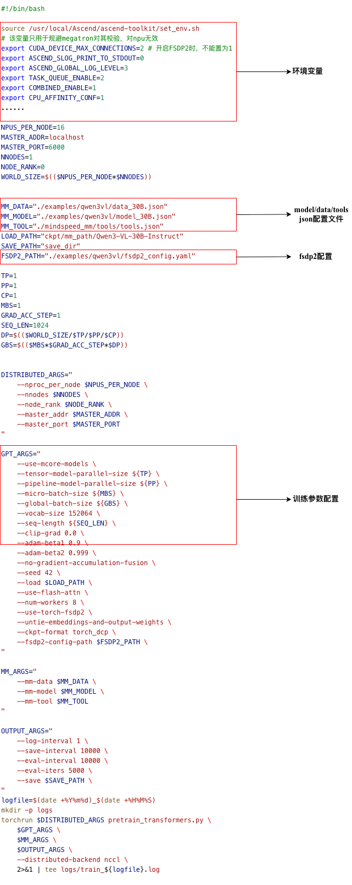
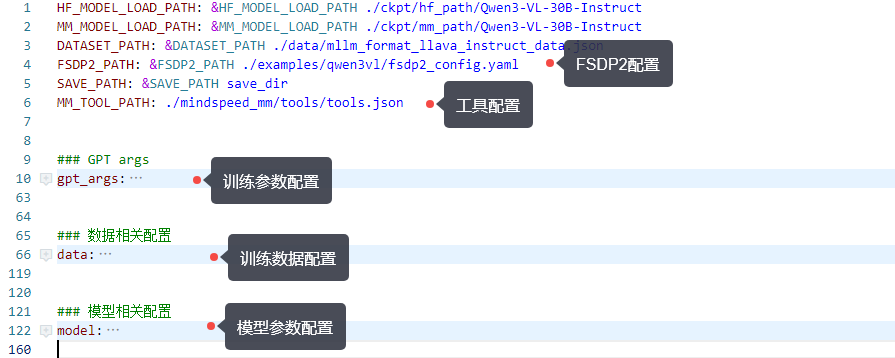

# 配置概览

## 适用后端

该文档适用于Mcore以及Mcore-FSDP2后端。

MindSpeed-MM的配置参数主要有`模型配置`、`数据配置`、 `fsdp2配置`、 `训练参数` 、`工具配置` 、 `环境变量`。

- [模型配置](https://mindspeed-mm.readthedocs.io/zh-cn/latest/config/模型配置.html)
- [数据配置](https://mindspeed-mm.readthedocs.io/zh-cn/latest/config/数据配置.html)
- [训练参数](https://mindspeed-mm.readthedocs.io/zh-cn/latest/config/训练参数.html)
- [fsdp2配置](https://mindspeed-mm.readthedocs.io/zh-cn/latest/config/fsdp2配置.html)
- [工具配置](https://mindspeed-mm.readthedocs.io/zh-cn/latest/config/工具配置.html)
- [环境变量](https://mindspeed-mm.readthedocs.io/zh-cn/latest/config/环境变量.html)

## 配置入口

所有的配置入口在训练/推理脚本的bash文件中，或者相关参数配置yaml文件里，以`examples/qwen3vl/finetune_qwen3vl_30B.sh` 为例：

bash脚本配置入口如下：



配置yaml文件如下：



## 配置解析

### 参数解析

`model, data, tools`参数的配置解析入口在`mindspeed_mm/configs/config.py` 。 主要的类和函数功能为：

- `ConfigReader :`典转换为易于访问的对象属性，将json配置或者yaml参数自动递归转换为ConfigReader对象，提供了`to_dict()` 接口用于将对象转回为 `dict`
- `MMConfig` : 统一加载和管理多个JSON配置文件
- `merge_mm_args` : 将model、data、tools的配置合并到Megatron的`global_args`

在代码中如何获取这些配置？可以使用Megatron的global args获取

```Python
from megatron.training import get_args args = get_args()
mm_model, mm_data = args.mm.model, args.mm.data
```

### fsdp2 配置解析

fsdp2 初始化的入口函数在 [torch_fully_sharded_data_parallel_init](https://gitcode.com/Ascend/MindSpeed/blob/master/mindspeed/core/distributed/torch_fully_sharded_data_parallel/torch_fully_sharded_data_parallel_adaptor.py#L209)

```python
def torch_fully_sharded_data_parallel_init(
    self,
    config: TransformerConfig,
    ddp_config: DistributedDataParallelConfig,
    module: torch.nn.Module,
    disable_bucketing: bool = False,
    sub_modules_to_wrap: Set[torch.nn.Module] = {
        TransformerLayer,
        LanguageModelEmbedding,
        RotaryEmbedding,
    },
    process_group: Optional[ProcessGroup] = None,
):
......
# If the module has its own 'fully_shard' method, use it directly
unwrapped_model = unwrap_model(self.module)
if hasattr(unwrapped_model, 'fully_shard') and callable(getattr(unwrapped_model, 'fully_shard')):
    execute_result = unwrapped_model.fully_shard(
        process_group=self.process_group,
        fsdp2_config_path=ddp_config.fsdp2_config_path,
    )
    if execute_result:
        return 
......
```

当模型已自行实现 `fully_shard` 接口, 该函数直接将fsdp2的初始化动作交给模型自己处理，强烈建议通过继承`FSDP2Mixin` 来实现对fsdp2的配置初始化。

`FSDP2Mixin` (mindspeed_mm/models/transformers/base_model.py)
是MM仓上fsdp2配置解析和策略实现的Mixin类，主要逻辑在 `fully_shared`接口，包含 `_pre_fully_shared` `_fully_shared` `_post_fully_shared`;

- \_pre_fully_shared: 读取fsdp2_config.yaml，并解析为FSDPConfig，conifg
- 创建device_mash
- \_fully_shared： 应用fsdp2相关的wrappers
- \_post_fully_shared：包括init_weight, meta_init等
